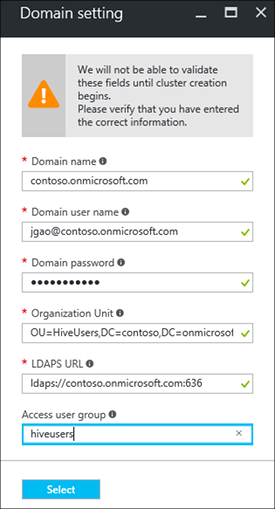

# Configure Domain-joined HDInsight clusters using Azure Active Directory Domain Services

Domain-joined clusters provide the multi-user enterprise security capabilities on HDInsight. Domain-joined HDInsight clusters are connected to active directory domains, so that domain users can use their domain credentials to authenticate with the clusters and run big data jobs. 

There are two ways to set up a domain controller so that a domain-joined HDInsight cluster can connect to:

- Azure Active Directory Domain Services (Azure AD DS)
- Active Directory Domain controller on Azure IaaS VMs

In this article, you learn how to configure a Domain-joined HDInsight cluster using Azure Active Directory Domain Services.

## Create Azure ADDS

You need to create an Azure AD DS before you can create an HDInsight cluster. To create an Azure ADDS, see [Enable Azure Active Directory Domain Services using the Azure portal](../../active-directory-domain-services/active-directory-ds-getting-started.md). 

> [!NOTE]
> Only the tenant administrators have the privileges to create domain services. If you use Azure Data Lake Storage (ADLS) as the default storage for HDInsight, then make sure the default Azure AD tenant for ADLS is same as the domain for the HDInsight cluster. For this set up to work with Azure Data Lake Store, multi-factor authentication needs to be disabled for users that will have access to the cluster.

After the domain service has been provisioned, you need to create a service account in the **Azure AD DC Administrators** group to create the HDInsight cluster. The service account must be a global administrator on the Azure AD.

You must enable Secure LDAP for Azure AD Domain Services Managed Domain. To enable Secure LDAP, see [Configure secure LDAP (LDAPS) for an Azure AD Domain Services managed domain](../../active-directory-domain-services/active-directory-ds-admin-guide-configure-secure-ldap.md).

## Create a Domain-joined HDInsight cluster

The next step is to create the HDInsight cluster using the AAD DS and the service account created in the previous section.

It is easier to place both the Azure AD domain service and the HDInsight cluster in the same Azure virtual network(VNet). In case they are in different VNets, you must peer both VNets. For more information, see [Virtual network peering](../../virtual-network/virtual-network-peering-overview.md).

When you create a domain-joined HDInsight cluster, you must supply the following parameters:

- **Domain name**: The domain-name that is associated with Azure AD DS. For example, contoso.onmicrosoft.com
- **Domain user name**: The service account in the Azure AD DC Administrators group that is created in the previous section. For example, hdiadmin@contoso.onmicrosoft.com. This domain user is the administrator of this domain-joined HDInsight cluster.
- **Domain password**: The password of the service account.
- **Organization Unit**: The distinguished name of the OU that you want to use with HDInsight cluster. For example: OU=HDInsightOU,DC=contoso,DC=onmicrosohift,DC=com. If this OU does not exist, HDInsight cluster attempts to create this OU. 
- **LDAPS URL**: For example, ldaps://contoso.onmicrosoft.com:636
- **Access user group**: The security groups whose users you want to sync to the cluster. For example, HiveUsers. If you want to specify multiple user groups, separate them by comma ‘,’.
 
The following screenshot shows the configurations in the Azure portal:

.

## Next steps
* For configuring Hive policies and run Hive queries, see [Configure Hive policies for Domain-joined HDInsight clusters](apache-domain-joined-run-hive.md).
* For using SSH to connect to Domain-joined HDInsight clusters, see [Use SSH with Linux-based Hadoop on HDInsight from Linux, Unix, or OS X](../hdinsight-hadoop-linux-use-ssh-unix.md#domainjoined).

