# Use Azure Toolkit for IntelliJ to create Spark applications for HDInsight cluster

Use the Azure Toolkit for IntelliJ plug-in to develop Spark applications written in Scala and submit them to an HDInsight Spark cluster, directly from the IntelliJ IDE. You can use the plug-in in a few different ways:

* To develop and submit a Scala Spark application on an HDInsight Spark cluster
* To access your Azure HDInsight Spark cluster resources
* To develop and run a Scala Spark application locally

You can follow a [video](https://channel9.msdn.com/Series/AzureDataLake/Create-Spark-Applications-with-the-Azure-Toolkit-for-IntelliJ) to create your project.

> [!IMPORTANT]
> This plug-in can be used to create and submit applications only for an HDInsight Spark cluster on Linux.
> 
> 

## Prerequisites

- An Apache Spark cluster on HDInsight Linux. For instructions, see [Create Apache Spark clusters in Azure HDInsight](hdinsight-apache-spark-jupyter-spark-sql.md).
- Oracle Java Development Kit. You can install it from the [Oracle website](http://www.oracle.com/technetwork/java/javase/downloads/jdk8-downloads-2133151.html).
- IntelliJ IDEA. This article uses version 2017.1. You can install it from the [JetBrains website](https://www.jetbrains.com/idea/download/).

## Install Azure Toolkit for IntelliJ
For installation instructions, see [Installing the Azure Toolkit for IntelliJ](../azure-toolkit-for-intellij-installation.md).

## Sign in to your Azure subscription
1. Start the IntelliJ IDE and open Azure Explorer. On the **View** menu, click **Tool Windows**, and then click **Azure Explorer**.

   
2. Right-click the **Azure** node, and then click **Sign In**.
3. [!INCLUDE [azure-intellij-login-guide](../../includes/azure-intellij-login-guide.md)]

5. On the **Azure Explorer** tab, expand **HDInsight** to see the HDInsight Spark clusters under your subscription.

    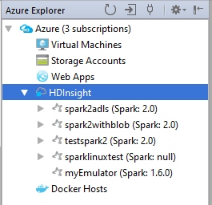
6. You can further expand a cluster name node to see the resources (for example, storage accounts) associated with the cluster.

    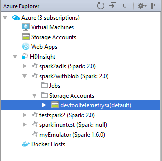

## Run a Spark Scala application on an HDInsight Spark cluster
1. Start IntelliJ IDEA and create a project. In the **New Project** dialog box, make the following choices, and then click **Next**. 
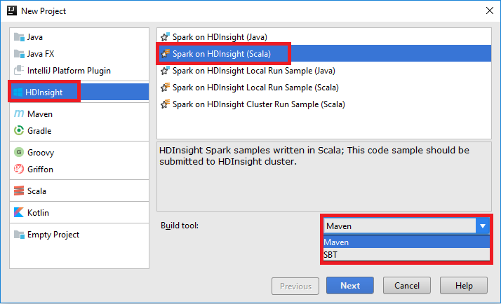
   - In the left pane, select **HDInsight**.
   - In the right pane, select **Spark on HDInsight (Scala)**.
   - Build tool: Scala project creation wizard support Maven or SBT managing the dependencies and building for scala project. You select one according to need.
2. The Scala project creation wizard auto detects whether you installed Scala plugin or not. Click the **Install** to continue.

     
3. Click **OK** to download the Scala plugin. Follow the instructions to restart IntelliJ. 

   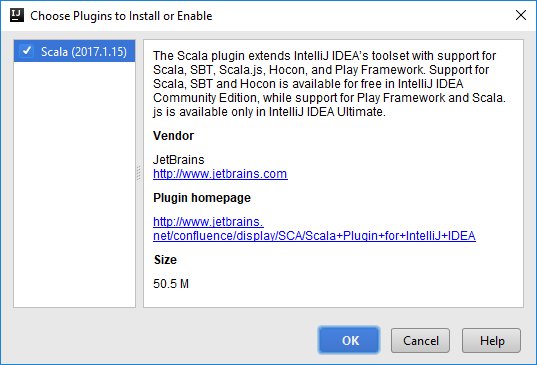

4. In the next window, provide the following project details, and then click **Finish**.  

   - Provide a project name and project location.
   - For **Project SDK**, Use Java 1.8 for spark 2.x cluster, Java 1.7 for spark 1.x cluster.
   - For **Spark Version**, Scala project creation wizard integrates proper version for Spark SDK and Scala SDK. If the spark cluster version is lower 2.0, choose spark 1.x. Otherwise, you should select spark2.x. This example uses Spark2.0.2(Scala 2.11.8).

5. The Spark project automatically creates an artifact for you. To see the artifact, follow these steps:

   1. On the **File** menu, click **Project Structure**.
   2. In the **Project Structure** dialog box, click **Artifacts** to see the default artifact that is created. You can also create your own artifact by clicking the **+** icon.
             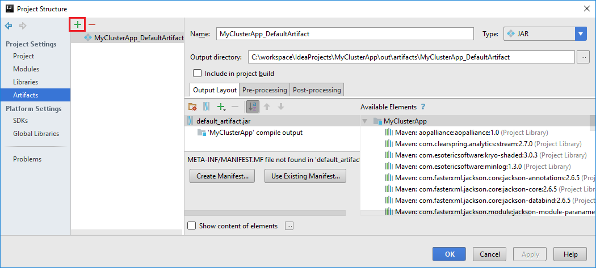

6. Add your application source code.
   1. In Project Explorer, right-click **src**, point to **New**, and then click **Scala Class**.

       
   2. In the **Create New Scala Class** dialog box, provide a name, select **Object** in the **Kind** box, and then click **OK**.

       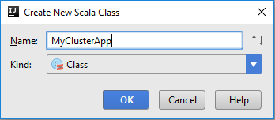
   3. In the **MyClusterApp.scala** file, paste the following code. This code reads the data from HVAC.csv (available on all HDInsight Spark clusters), retrieves the rows that have only one digit in the seventh column in the CSV file, and writes the output to **/HVACOut** under the default storage container for the cluster.

            import org.apache.spark.SparkConf
            import org.apache.spark.SparkContext

            object MyClusterApp{
              def main (arg: Array[String]): Unit = {
                val conf = new SparkConf().setAppName("MyClusterApp")
                val sc = new SparkContext(conf)

                val rdd = sc.textFile("wasbs:///HdiSamples/HdiSamples/SensorSampleData/hvac/HVAC.csv")

                //find the rows that have only one digit in the seventh column in the CSV file
                val rdd1 =  rdd.filter(s => s.split(",")(6).length() == 1)

                rdd1.saveAsTextFile("wasbs:///HVACOut")
              }

            }

7. Run the application on an HDInsight Spark cluster.
   1. In Project Explorer, right-click the project name, and then select **Submit Spark Application to HDInsight**.

       
   2. You are prompted to enter your Azure subscription credentials. In the **Spark Submission** dialog box, provide the following values, and then click **Submit**.

      - For **Spark clusters (Linux only)**, select the HDInsight Spark cluster on which you want to run your application.
      - Select an artifact from the IntelliJ project, or select one from the hard drive.
      - In the **Main class name** box, click the ellipsis (), select the main class in your application source code, and then click **OK**.
      
      * Because the application code in this example does not require any command-line arguments or reference JARs or files, you can leave the remaining boxes empty.
        After you provide all the inputs, the dialog box should resemble the following image.

          
   3. The **Spark Submission** tab at the bottom of the window should start displaying the progress. You can also stop the application by clicking the red button in the **Spark Submission** window.

       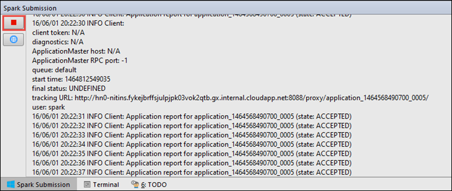

      In the "Access and manage HDInsight Spark clusters by using Azure Toolkit for IntelliJ" section later in this article, you'll learn how to access the job output.

## Run as or Debug as a Spark Scala application on an HDInsight Spark cluster
We also recommend another way of submitting Spark applicaltion to the cluster. They are by setting the parameters in **Run/Debug configrurations** IDE. For more information, see [Remotely debug Spark applications on an HDInsight cluster with Azure Toolkit for IntelliJ through SSH](/hdinsight/hdinsight-apache-spark-intellij-tool-debug-remotely-through-ssh)

## Access and manage HDInsight Spark clusters by using Azure Toolkit for IntelliJ
You can perform various operations by using Azure Toolkit for IntelliJ.

### Access the job view
1. In Azure Explorer, expand **HDInsight**, expand the Spark cluster name, and then click **Jobs**.  
       
2. In the right pane, the **Spark Job View** tab displays all the applications that were run on the cluster. Click the name of the application for which you want to see more details.
       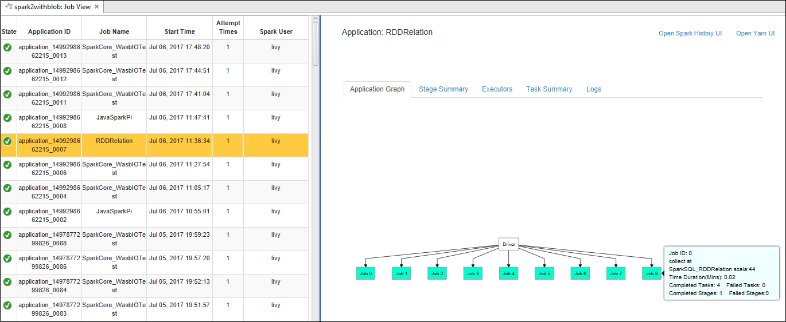
3. Hover on job graph, it displays basic running job info. Click on job graph, you can see the stages graph and info which every job generate.
       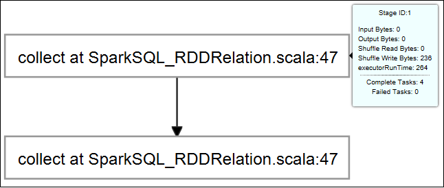

4. Frequently-used log including Driver Stderr, Driver Stdout, Directory Info are listed in **Log** tab.
       
5. You can also open the Spark history UI and the YARN UI (at the application level) by clicking the respective hyplink at the top of the window.

### Access the Spark history server
1. In Azure Explorer, expand **HDInsight**, right-click your Spark cluster name, and then select **Open Spark History UI**. When you're prompted, enter the admin credentials for the cluster. You must have specified these while provisioning the cluster.
2. In the Spark history server dashboard, you can use the application name to look for the application that you just finished running. In the preceding code, you set the application name by using `val conf = new SparkConf().setAppName("MyClusterApp")`. Hence, your Spark application name was **MyClusterApp**.

### Start the Ambari portal
1. In Azure Explorer, expand **HDInsight**, right-click your Spark cluster name, and then select **Open Cluster Management Portal (Ambari)**. 
2. When you're prompted, enter the admin credentials for the cluster. You specified these credentials during the cluster provisioning process.

### Manage Azure subscriptions
By default, Azure Toolkit for IntelliJ lists the Spark clusters from all your Azure subscriptions. If necessary, you can specify the subscriptions for which you want to access the cluster. 

1. In Azure Explorer, right-click the **Azure** root node, and then click **Manage Subscriptions**. 
2. In the dialog box, clear the check boxes for the subscription that you don't want to access, and then click **Close**. You can also click **Sign Out** if you want to sign out of your Azure subscription.

## Run a Spark Scala application locally
You can use Azure Toolkit for IntelliJ to run Spark Scala applications locally on your workstation. Typically, these applications don't need access to cluster resources such as a storage container, and you can run and test them locally.

### Prerequisite
While you're running the local Spark Scala application on a Windows computer, you might get an exception as explained in [SPARK-2356](https://issues.apache.org/jira/browse/SPARK-2356). This exception occurs because WinUtils.exe is missing on Windows. 

To resolve this error, you must [download the executable](http://public-repo-1.hortonworks.com/hdp-win-alpha/winutils.exe) to a location like **C:\WinUtils\bin**. Then, add the environment variable **HADOOP_HOME** and set the value of the variable to **C\WinUtils**.

### Run a local Spark Scala application
1. Start IntelliJ IDEA and create a project. In the **New Project** dialog box, make the following choices, and then click **Next**.

    - In the left pane, select **HDInsight**.
    - In the right pane, select **Spark on HDInsight Local Run Sample (Scala)**.
    - Build tool: Scala project creation wizard support Maven or SBT managing the dependencies and building for scala project. You select one according need.
    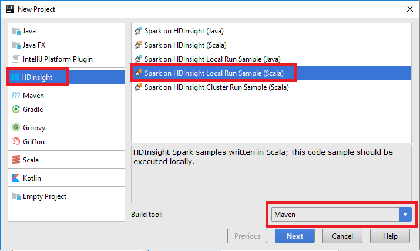
2. In the next window, provide the following project details, and then click **Finish**.

    - Provide a project name and project location.
    - For **Project SDK**, make sure that you provide a Java version later than 7.
    - For **Spark Version**,  select the version of Scala to use: Scala 2.11.x for Spark 2.0, and Scala 2.10.x for Spark 1.6.
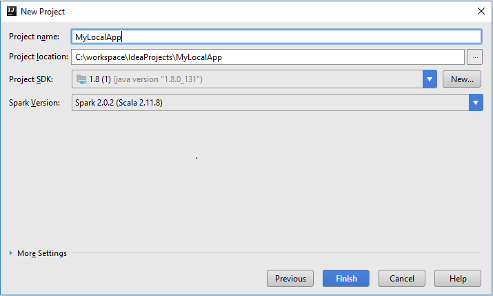
3. The template adds a sample code (**LogQuery**) under the **src** folder that you can run locally on your computer.

    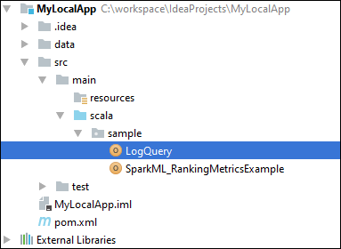
4. Right-click the **LogQuery** application, and then click **Run 'LogQuery'**. On the **Run** tab at the bottom, you see an output like the following.

   

## Convert existing IntelliJ IDEA applications to use Azure Toolkit for IntelliJ
You can convert your existing Spark Scala applications created in IntelliJ IDEA to be compatible with Azure Toolkit for IntelliJ. You can then use the plug-in to submit the applications to an HDInsight Spark cluster.

1. For an existing Spark Scala application created through IntelliJ IDEA, open the associated .iml file.
2. At the root level, you see a **module** element like this:

        <module org.jetbrains.idea.maven.project.MavenProjectsManager.isMavenModule="true" type="JAVA_MODULE" version="4">
   Edit the element to add `UniqueKey="HDInsightTool"` so that the **module** element looks like the following:

        <module org.jetbrains.idea.maven.project.MavenProjectsManager.isMavenModule="true" type="JAVA_MODULE" version="4" UniqueKey="HDInsightTool">
3. Save the changes. Your application should now be compatible with Azure Toolkit for IntelliJ. You can test it by right-clicking the project name in Project Explorer. The pop-up menu now has the option **Submit Spark Application to HDInsight**.

## Troubleshooting
### "Please use a larger heap size" error in local run
In Spark 1.6, if you're using a 32-bit Java SDK during local run, you might encounter the following errors:

    Exception in thread "main" java.lang.IllegalArgumentException: System memory 259522560 must be at least 4.718592E8. Please use a larger heap size.
        at org.apache.spark.memory.UnifiedMemoryManager$.getMaxMemory(UnifiedMemoryManager.scala:193)
        at org.apache.spark.memory.UnifiedMemoryManager$.apply(UnifiedMemoryManager.scala:175)
        at org.apache.spark.SparkEnv$.create(SparkEnv.scala:354)
        at org.apache.spark.SparkEnv$.createDriverEnv(SparkEnv.scala:193)
        at org.apache.spark.SparkContext.createSparkEnv(SparkContext.scala:288)
        at org.apache.spark.SparkContext.<init>(SparkContext.scala:457)
        at LogQuery$.main(LogQuery.scala:53)
        at LogQuery.main(LogQuery.scala)
        at sun.reflect.NativeMethodAccessorImpl.invoke0(Native Method)
        at sun.reflect.NativeMethodAccessorImpl.invoke(NativeMethodAccessorImpl.java:57)
        at sun.reflect.DelegatingMethodAccessorImpl.invoke(DelegatingMethodAccessorImpl.java:43)
        at java.lang.reflect.Method.invoke(Method.java:606)
        at com.intellij.rt.execution.application.AppMain.main(AppMain.java:144)

These errors happen because the heap size is not large enough for Spark to run. (Spark requires at least 471 MB. You can get more details from [SPARK-12081](https://issues.apache.org/jira/browse/SPARK-12081)). One simple solution is to use a 64-bit Java SDK. You can also change the JVM settings in IntelliJ by adding the following options:

    -Xms128m -Xmx512m -XX:MaxPermSize=300m -ea

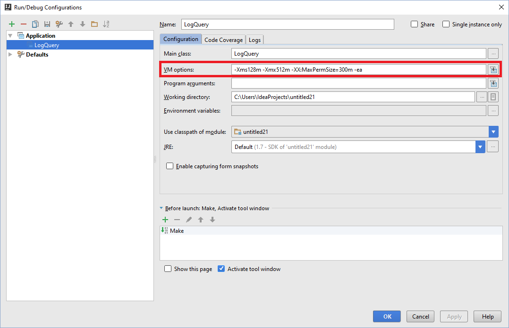

## Feedback and known issues
Currently, viewing Spark outputs directly is not supported.

If you have any suggestions or feedback, or if you encounter any problems when using this plug-in, send us an email at hdivstool@microsoft.com.

## See also
* [Overview: Apache Spark on Azure HDInsight](hdinsight-apache-spark-overview.md)

### Demo
* Create Scala Project (Video): [Create Spark Scala Applications](https://channel9.msdn.com/Series/AzureDataLake/Create-Spark-Applications-with-the-Azure-Toolkit-for-IntelliJ)
* Remote Debug (Video): [Use Azure Toolkit for IntelliJ to debug Spark applications remotely on HDInsight Cluster](https://channel9.msdn.com/Series/AzureDataLake/Debug-HDInsight-Spark-Applications-with-Azure-Toolkit-for-IntelliJ)

### Scenarios
* [Spark with BI: Perform interactive data analysis using Spark in HDInsight with BI tools](hdinsight-apache-spark-use-bi-tools.md)
* [Spark with Machine Learning: Use Spark in HDInsight for analyzing building temperature using HVAC data](hdinsight-apache-spark-ipython-notebook-machine-learning.md)
* [Spark with Machine Learning: Use Spark in HDInsight to predict food inspection results](hdinsight-apache-spark-machine-learning-mllib-ipython.md)
* [Spark Streaming: Use Spark in HDInsight for building real-time streaming applications](hdinsight-apache-spark-eventhub-streaming.md)
* [Website log analysis using Spark in HDInsight](hdinsight-apache-spark-custom-library-website-log-analysis.md)

### Creating and running applications
* [Create a standalone application using Scala](hdinsight-apache-spark-create-standalone-application.md)
* [Run jobs remotely on a Spark cluster using Livy](hdinsight-apache-spark-livy-rest-interface.md)

### Tools and extensions
* [Use Azure Toolkit for IntelliJ to debug Spark applications remotely through VPN](hdinsight-apache-spark-intellij-tool-plugin-debug-jobs-remotely.md)
* [Use Azure Toolkit for IntelliJ to debug Spark applications remotely through SSH](hdinsight-apache-spark-intellij-tool-debug-remotely-through-ssh.md)
* [Use HDInsight Tools for IntelliJ with Hortonworks Sandbox](hdinsight-tools-for-intellij-with-hortonworks-sandbox.md)
* [Use HDInsight Tools in Azure Toolkit for Eclipse to create Spark applications](hdinsight-apache-spark-eclipse-tool-plugin.md)
* [Use Zeppelin notebooks with a Spark cluster on HDInsight](hdinsight-apache-spark-zeppelin-notebook.md)
* [Kernels available for Jupyter notebook in Spark cluster for HDInsight](hdinsight-apache-spark-jupyter-notebook-kernels.md)
* [Use external packages with Jupyter notebooks](hdinsight-apache-spark-jupyter-notebook-use-external-packages.md)
* [Install Jupyter on your computer and connect to an HDInsight Spark cluster](hdinsight-apache-spark-jupyter-notebook-install-locally.md)

### Managing resources
* [Manage resources for the Apache Spark cluster in Azure HDInsight](hdinsight-apache-spark-resource-manager.md)
* [Track and debug jobs running on an Apache Spark cluster in HDInsight](hdinsight-apache-spark-job-debugging.md)