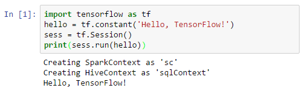

<properties
    pageTitle="Script action: Install Python packages with Jupyter notebooks on Azure HDInsight | Azure"
    description="Step-by-step instructions on how to configure Jupyter notebooks available with HDInsight Spark clusters to use external python packages."
    services="hdinsight"
    documentationcenter=""
    author="nitinme"
    manager="jhubbard"
    editor="cgronlun"
    tags="azure-portal" />
<tags
    ms.assetid="21978b71-eb53-480b-a3d1-c5d428a7eb5b"
    ms.service="hdinsight"
    ms.workload="big-data"
    ms.tgt_pltfrm="na"
    ms.devlang="na"
    ms.topic="article"
    ms.date="03/07/2017"
    wacn.date=""
    ms.author="nitinme" />

# Use Script Action to install external Python packages for Jupyter notebooks in Apache Spark clusters on HDInsight
> [AZURE.SELECTOR]
- [Using cell magic](/documentation/articles/hdinsight-apache-spark-jupyter-notebook-use-external-packages/)
- [Using Script Action](/documentation/articles/hdinsight-apache-spark-python-package-installation/)

Learn how to use Script Actions to configure an Apache Spark cluster on HDInsight (Linux) to use external, community-contributed **python** packages that are not included out-of-the-box in the cluster.

> [AZURE.NOTE]
> You can also configure a Jupyter notebook by using `%%configure` magic to use external packages. For instructions, see [Use external packages with Jupyter notebooks in Apache Spark clusters on HDInsight](/documentation/articles/hdinsight-apache-spark-jupyter-notebook-use-external-packages/).
> 
> 

You can search the [package index](https://pypi.python.org/pypi) for the complete list of packages that are available. You can also get a list of available packages from other sources. For example, you can install packages made available through [Anaconda](https://docs.continuum.io/anaconda/pkg-docs) or [conda-forge](https://conda-forge.github.io/feedstocks.html).

In this article, you will learn how to install the [TensorFlow](https://www.tensorflow.org/) package using Script Actoin on your cluster and use it via the Jupyter notebook.

## Prerequisites
You must have the following:

* An Azure subscription. See [Get Azure trial](/pricing/1rmb-trial/).
* An Apache Spark cluster on HDInsight. For instructions, see [Create Apache Spark clusters in Azure HDInsight](/documentation/articles/hdinsight-apache-spark-jupyter-spark-sql/).

    > [AZURE.NOTE]
    > If you do not already have a Spark cluster on HDInsight Linux, you can run script actions during cluster creation. Visit the documentation on [how to use custom script actions](/documentation/articles/hdinsight-hadoop-customize-cluster-linux/).
    > 
    > 

## Use external packages with Jupyter notebooks

1. From the [Azure Portal Preview](https://portal.azure.cn/), from the startboard, click the tile for your Spark cluster (if you pinned it to the startboard). You can also navigate to your cluster under **Browse All** > **HDInsight Clusters**.   

2. From the Spark cluster blade, click **Script Actions** under **Usage**. Run the custom action that installs TensorFlow in the head nodes and the worker nodes. The bash script can be referenced from: https://hdiconfigactions.blob.core.windows.net/linuxtensorflow/tensorflowinstall.sh
Visit the documentation on [how to use custom script actions](/documentation/articles/hdinsight-hadoop-customize-cluster-linux/).

    > [AZURE.NOTE]
    > There are two python installations in the cluster. Spark will use the Anaconda python installation located at `/usr/bin/anaconda/bin`. Reference that installation in your custom actions via `/usr/bin/anaconda/bin/pip` and `/usr/bin/anaconda/bin/conda`.
    > 
    > 

3. Open a PySpark Jupyter notebook

    

4. A new notebook is created and opened with the name Untitled.pynb. Click the notebook name at the top, and enter a friendly name.

    

5. You will now `import tensorflow` and run a hello world example. 

    Code to copy:

        import tensorflow as tf
        hello = tf.constant('Hello, TensorFlow!')
        sess = tf.Session()
        print(sess.run(hello))

    The result will look like this:
	
    

## See also
* [Overview: Apache Spark on Azure HDInsight](/documentation/articles/hdinsight-apache-spark-overview/)

### Scenarios
* [Spark with BI: Perform interactive data analysis using Spark in HDInsight with BI tools](/documentation/articles/hdinsight-apache-spark-use-bi-tools/)
* [Spark with Machine Learning: Use Spark in HDInsight for analyzing building temperature using HVAC data](/documentation/articles/hdinsight-apache-spark-ipython-notebook-machine-learning/)
* [Spark with Machine Learning: Use Spark in HDInsight to predict food inspection results](/documentation/articles/hdinsight-apache-spark-machine-learning-mllib-ipython/)
* [Spark Streaming: Use Spark in HDInsight for building real-time streaming applications](/documentation/articles/hdinsight-apache-spark-eventhub-streaming/)
* [Website log analysis using Spark in HDInsight](/documentation/articles/hdinsight-apache-spark-custom-library-website-log-analysis/)

### Create and run applications
* [Create a standalone application using Scala](/documentation/articles/hdinsight-apache-spark-create-standalone-application/)
* [Run jobs remotely on a Spark cluster using Livy](/documentation/articles/hdinsight-apache-spark-livy-rest-interface/)

### Tools and extensions
* [Use external packages with Jupyter notebooks in Apache Spark clusters on HDInsight](/documentation/articles/hdinsight-apache-spark-jupyter-notebook-use-external-packages/)
* [Use Zeppelin notebooks with a Spark cluster on HDInsight](/documentation/articles/hdinsight-apache-spark-use-zeppelin-notebook/)
* [Kernels available for Jupyter notebook in Spark cluster for HDInsight](/documentation/articles/hdinsight-apache-spark-jupyter-notebook-kernels/)
* [Install Jupyter on your computer and connect to an HDInsight Spark cluster](/documentation/articles/hdinsight-apache-spark-jupyter-notebook-install-locally/)

### Manage resources
* [Manage resources for the Apache Spark cluster in Azure HDInsight](/documentation/articles/hdinsight-apache-spark-resource-manager/)
* [Track and debug jobs running on an Apache Spark cluster in HDInsight](/documentation/articles/hdinsight-apache-spark-job-debugging/)