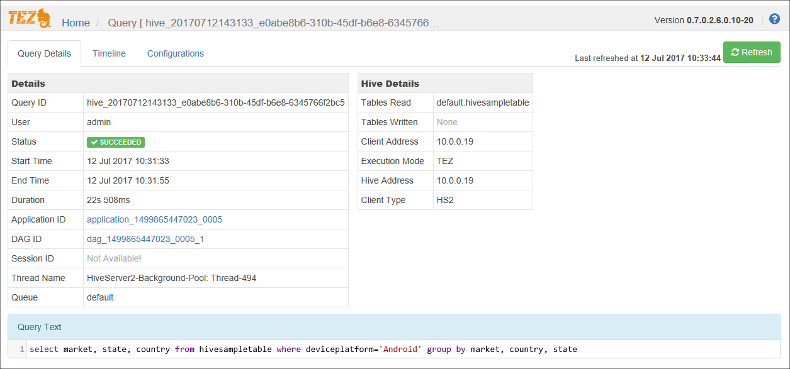

# Use Ambari Views to debug Tez Jobs on HDInsight

The Ambari Web UI for HDInsight contains a Tez view that can be used to understand and debug jobs that use Tez. The Tez view allows you to visualize the job as a graph of connected items, drill into each item, and retrieve statistics and logging information.

> [!IMPORTANT]
> The steps in this document require an HDInsight cluster that uses Linux. Linux is the only operating system used on HDInsight version 3.4 or greater. For more information, see [HDInsight component versioning](hdinsight-component-versioning.md#hdinsight-windows-retirement).

## Prerequisites

* A Linux-based HDInsight cluster. For steps on creating a cluster, see [Get started using Linux-based HDInsight](hdinsight-hadoop-linux-tutorial-get-started.md).
* A modern web browser that supports HTML5.

## Understanding Tez

Tez is an extensible framework for data processing in Hadoop that provides greater speeds than traditional MapReduce processing. For Linux-based HDInsight clusters, it is the default engine for Hive.

Tez creates a Directed Acyclic Graph (DAG) that describes the order of actions required by jobs. Individual actions are called vertices, and execute a piece of the overall job. The actual execution of the work described by a vertex is called a task, and may be distributed across multiple nodes in the cluster.

### Understanding the Tez view

The Tez view provides both historical information and information on processes that are running. This information shows how a job is distributed across clusters. It also displays counters used by tasks and vertices, and error information related to the job. It may offer useful information in the following scenarios:

* Monitoring long-running processes, viewing the progress of map and reduce tasks.
* Analyzing historical data for successful or failed processes to learn how processing could be improved or why it failed.

## Generate a DAG

The Tez view only contains data if a job that uses the Tez engine is currently running, or has been ran previously. Simple Hive queries can be resolved without using Tez. More complex queries that do filtering, grouping, ordering, joins, etc. use the Tez engine.

Use the following steps to run a Hive query that uses Tez:

1. In a web browser, navigate to https://CLUSTERNAME.azurehdinsight.cn, where **CLUSTERNAME** is the name of your HDInsight cluster.

2. From the menu at the top of the page, select the **Views** icon. This icon looks like a series of squares. In the dropdown that appears, select **Hive view**.

    

3. When the Hive view loads, paste the following query into the Query Editor, and then click **execute**.

        select market, state, country from hivesampletable where deviceplatform='Android' group by market, country, state;

    Once the job has completed, you should see the output displayed in the **Query Process Results** section. The results should be similar to the following text:

        market  state       country
        en-GB   Hessen      Germany
        en-GB   Kingston    Jamaica

4. Select the **Log** tab. You see information similar to the following text:

        INFO : Session is already open
        INFO :

        INFO : Status: Running (Executing on YARN cluster with App id application_1454546500517_0063)

    Save the **App id** value, as this value is used in the next section.

## Use the Tez View

1. From the menu at the top of the page, select the **Views** icon. In the dropdown that appears, select **Tez view**.

    

2. When the Tez view loads, you see a list of hive queries that are currently running, or have been ran on the cluster.

    

3. If you have only one entry, it is for the query that you ran in the previous section. If you have multiple entries, you can search by using the fields at the top of the page.

4. Select the **Query ID** for a Hive query. Information about the query is displayed.

    

5. The tabs on this page allow you to view the following information:

    * **Query Details**: Details about the Hive query.
    * **Timeline**: Information about how long each stage of processing took.
    * **Configurations**: The configuration used for this query.

    From __Query Details__ you can use the links to find information about the __Application__ or the __DAG__ for this query.

    * The __Application__ link displays information about the YARN application for this query. From here you can access the YARN application logs.
    * The __DAG__ link displays information about the directed acyclic graph for this query. From here you can view a graphical representation of the DAG. You can also find information on the vertices within the DAG.

## Next Steps

Now that you have learned how to use the Tez view, learn more about [Using Hive on HDInsight](hdinsight-use-hive.md).

For more detailed technical information on Tez, see the [Tez page at Hortonworks](http://hortonworks.com/hadoop/tez/).

For more information on using Ambari with HDInsight, see [Manage HDInsight clusters using the Ambari Web UI](hdinsight-hadoop-manage-ambari.md)

<!--Update_Description: wording update-->