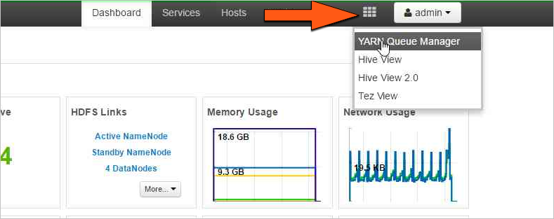
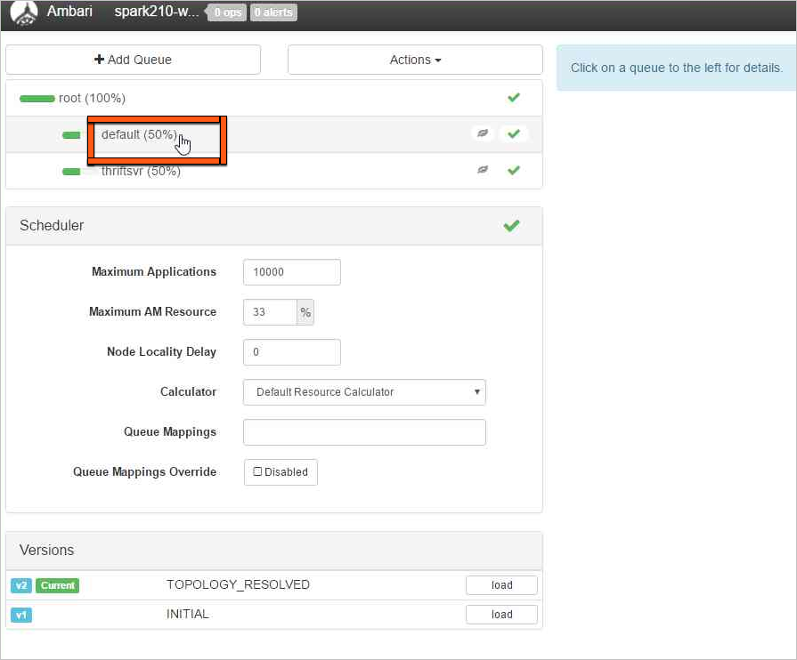
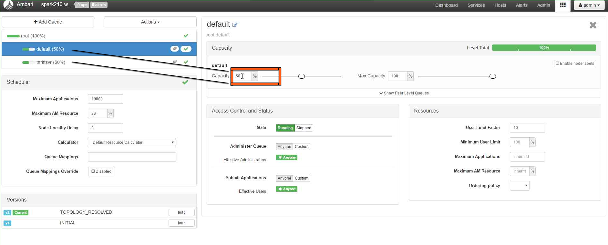
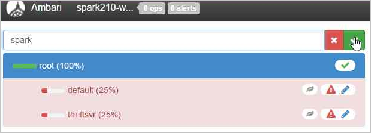
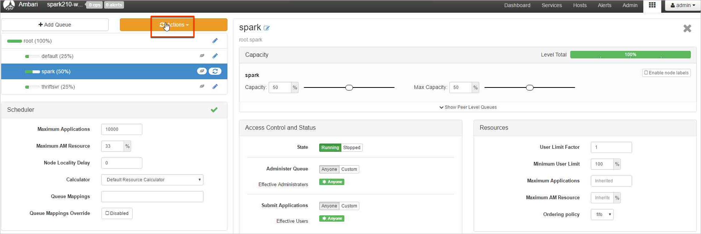

# Troubleshoot YARN by using Azure HDInsight

Learn about the top issues and their resolutions when working with Apache Hadoop YARN payloads in Apache Ambari.

## How do I create a new YARN queue on a cluster?


### Resolution steps 

Use the following steps in Ambari to create a new YARN queue, and then balance the capacity allocation among all the queues. 

In this example, two existing queues (**default** and **thriftsvr**) both are changed from 50% capacity to 25% capacity, which gives the new queue (spark) 50% capacity.
| Queue | Capacity | Maximum capacity |
| --- | --- | --- | --- |
| default | 25% | 50% |
| thrftsvr | 25% | 50% |
| spark | 50% | 50% |

1. Select the **Ambari Views** icon, and then select the grid pattern. Next, select **YARN Queue Manager**.

    
2. Select the **default** queue.

    
3. For the **default** queue, change the **capacity** from 50% to 25%. For the **thriftsvr** queue, change the **capacity** to 25%.

    
4. To create a new queue, select **Add Queue**.

    

5. Name the new queue.

      
6. Leave the **capacity** values at 50%, and then select the **Actions** button.

      
7. Select **Save and Refresh Queues**.

      

These changes are visible immediately on the YARN Scheduler UI.

### Additional reading

- [YARN CapacityScheduler](https://hadoop.apache.org/docs/r2.7.2/hadoop-yarn/hadoop-yarn-site/CapacityScheduler.html)


## How do I download YARN logs from a cluster?


### Resolution steps 

1. Connect to the HDInsight cluster by using a Secure Shell (SSH) client. For more information, see [Additional reading](#additional-reading-2).

2. To list all the application IDs of the YARN applications that are currently running, run the following command:

    ```apache
    yarn top
    ```
    The IDs are listed in the **APPLICATIONID** column. You can download logs from the **APPLICATIONID** column.

    ```apache
    YARN top - 18:00:07, up 19d, 0:14, 0 active users, queue(s): root
    NodeManager(s): 4 total, 4 active, 0 unhealthy, 0 decommissioned, 0 lost, 0 rebooted
    Queue(s) Applications: 2 running, 10 submitted, 0 pending, 8 completed, 0 killed, 0 failed
    Queue(s) Mem(GB): 97 available, 3 allocated, 0 pending, 0 reserved
    Queue(s) VCores: 58 available, 2 allocated, 0 pending, 0 reserved
    Queue(s) Containers: 2 allocated, 0 pending, 0 reserved

                      APPLICATIONID USER             TYPE      QUEUE   #CONT  #RCONT  VCORES RVCORES     MEM    RMEM  VCORESECS    MEMSECS %PROGR       TIME NAME
     application_1490377567345_0007 hive            spark  thriftsvr       1       0       1       0      1G      0G    1628407    2442611  10.00   18:20:20 Thrift JDBC/ODBC Server
     application_1490377567345_0006 hive            spark  thriftsvr       1       0       1       0      1G      0G    1628430    2442645  10.00   18:20:20 Thrift JDBC/ODBC Server
    ```

3. To download YARN container logs for all application masters, use the following command:
   
    ```apache
    yarn logs -applicationIdn logs -applicationId <application_id> -am ALL > amlogs.txt
    ```

    This command creates a log file named amlogs.txt. 

4. To download YARN container logs for only the latest application master, use the following command:

    ```apache
    yarn logs -applicationIdn logs -applicationId <application_id> -am -1 > latestamlogs.txt
    ```

    This command creates a log file named latestamlogs.txt. 

4. To download YARN container logs for the first two application masters, use the following command:

    ```apache
    yarn logs -applicationIdn logs -applicationId <application_id> -am 1,2 > first2amlogs.txt 
    ```

    This command creates a log file named first2amlogs.txt. 

5. To download all YARN container logs, use the following command:

    ```apache
    yarn logs -applicationIdn logs -applicationId <application_id> > logs.txt
    ```

    This command creates a log file named logs.txt. 

6. To download the YARN container log for a specific container, use the following command:

    ```apache
    yarn logs -applicationIdn logs -applicationId <application_id> -containerId <container_id> > containerlogs.txt 
    ```

    This command creates a log file named containerlogs.txt.

### <a name="additional-reading-2"></a>Additional reading

- [Connect to HDInsight (Hadoop) by using SSH](https://docs.microsoft.com/en-us/azure/hdinsight/hdinsight-hadoop-linux-use-ssh-unix)
- [Apache Hadoop YARN concepts and applications](https://hortonworks.com/blog/apache-hadoop-yarn-concepts-and-applications/)


### See Also
[Troubleshoot by Using Azure HDInsight](hdinsight-troubleshoot-guide.md)


