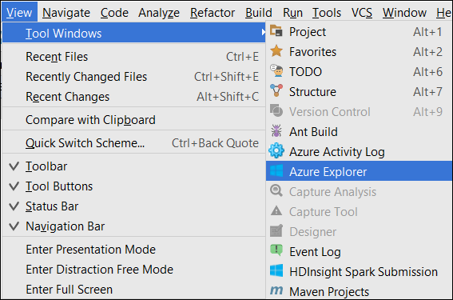
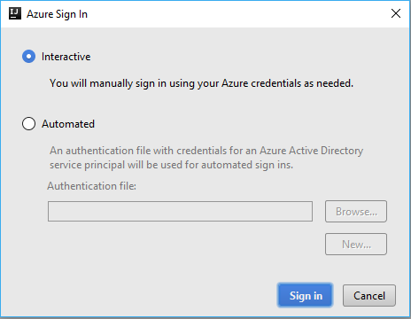
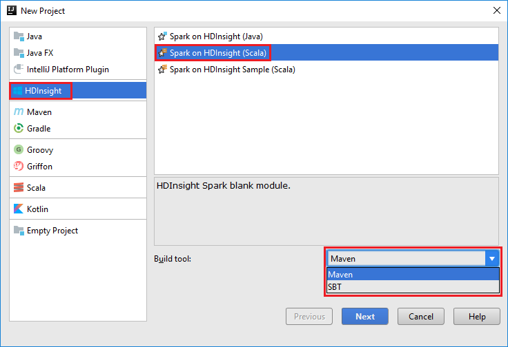
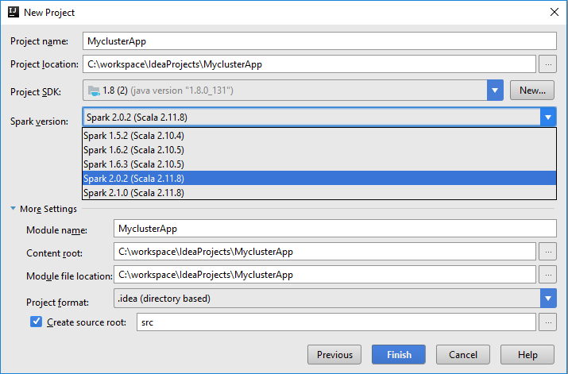
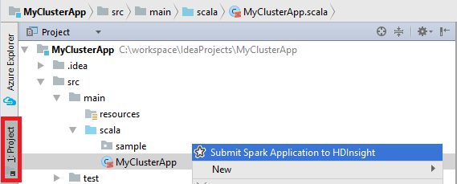
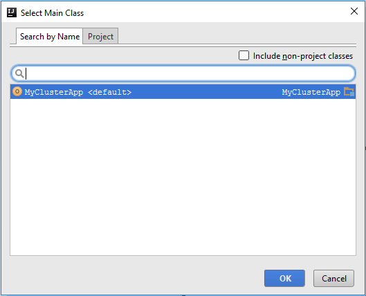

# Use Azure Toolkit for IntelliJ to create Spark applications for an HDInsight cluster

Use the Azure Toolkit for IntelliJ plug-in to develop Spark applications written in Scala, and then submit them to an HDInsight Spark cluster directly from the IntelliJ integrated development environment (IDE). You can use the plug-in in a few ways:

* Develop and submit a Scala Spark application on an HDInsight Spark cluster.
* Access your Azure HDInsight Spark cluster resources.
* Develop and run a Scala Spark application locally.

To create your project, view the [Create Spark Applications with the Azure Toolkit for IntelliJ](https://channel9.msdn.com/Series/AzureDataLake/Create-Spark-Applications-with-the-Azure-Toolkit-for-IntelliJ) video.

> [!IMPORTANT]
> You can use this plug-in to create and submit applications only for an HDInsight Spark cluster on Linux.
> 

## Prerequisites

- An Apache Spark cluster on HDInsight Linux. For instructions, see [Create Apache Spark clusters in Azure HDInsight](apache-spark-jupyter-spark-sql.md).
- Oracle Java Development Kit. You can install it from the [Oracle website](http://www.oracle.com/technetwork/java/javase/downloads/jdk8-downloads-2133151.html).
- IntelliJ IDEA. This article uses version 2017.1. You can install it from the [JetBrains website](https://www.jetbrains.com/idea/download/).

## Install Azure Toolkit for IntelliJ
For installation instructions, see [Install Azure Toolkit for IntelliJ](../../azure-toolkit-for-intellij-installation.md).

## Sign in to your Azure subscription

1. Start the IntelliJ IDE, and open Azure Explorer. On the **View** menu, select **Tool Windows**, and then select **Azure Explorer**.
       
   

2. Right-click the **Azure** node, and then select **Sign In**.

3. In the **Azure Sign In** dialog box, select **Sign in**, and then enter your Azure credentials.

    

4. After you're signed in, the **Select Subscriptions** dialog box lists all the Azure subscriptions that are associated with the credentials. Select the **Select** button.

    

5. On the **Azure Explorer** tab, expand **HDInsight** to view the HDInsight Spark clusters that are in your subscription.
   
    

6. To view the resources (for example, storage accounts) that are associated with the cluster, you can further expand a cluster-name node.
   
    

## Run a Spark Scala application on an HDInsight Spark cluster

1. Start IntelliJ IDEA, and then create a project. In the **New Project** dialog box, do the following: 

   a. Select **HDInsight** > **Spark on HDInsight (Scala)**.

   b. In the **Build tool** list, select either of the following, according to your need:

      * **Maven**, for Scala project-creation wizard support
      * **SBT**, for managing the dependencies and building for the Scala project

    

2. Select **Next**.

3. The Scala project-creation wizard automatically detects whether you've installed the Scala plug-in. Select **Install**.

    

4. To download the Scala plug-in, select **OK**. Follow the instructions to restart IntelliJ. 

   

5. In the **New Project** window, do the following:  

    

   a. Enter a project name and location.

   b. In the **Project SDK** drop-down list, select **Java 1.8** for the Spark 2.x cluster, or select **Java 1.7** for the Spark 1.x cluster.

   c. In the **Spark version** drop-down list, Scala project creation wizard integrates the proper version for Spark SDK and Scala SDK. If the Spark cluster version is earlier than 2.0, select **Spark 1.x**. Otherwise, select **Spark2.x**. This example uses **Spark 2.0.2 (Scala 2.11.8)**.

6. Select **Finish**.

7. The Spark project automatically creates an artifact for you. To view the artifact, do the following:

   a. On the **File** menu, select **Project Structure**.

   b. In the **Project Structure** dialog box, select **Artifacts** to view the default artifact that is created. You can also create your own artifact by selecting the plus sign (**+**).

      
      
8. Add your application source code by doing the following:

   a. In Project Explorer, right-click **src**, point to **New**, and then select **Scala Class**.
      
      

   b. In the **Create New Scala Class** dialog box, provide a name, select **Object** in the **Kind** box, and then select **OK**.
      
      

   c. In the **MyClusterApp.scala** file, paste the following code. The code reads the data from HVAC.csv (available on all HDInsight Spark clusters), retrieves the rows that have only one digit in the seventh column in the CSV file, and writes the output to **/HVACOut** under the default storage container for the cluster.

        import org.apache.spark.SparkConf
        import org.apache.spark.SparkContext

        object MyClusterApp{
            def main (arg: Array[String]): Unit = {
            val conf = new SparkConf().setAppName("MyClusterApp")
            val sc = new SparkContext(conf)

            val rdd = sc.textFile("wasb:///HdiSamples/HdiSamples/SensorSampleData/hvac/HVAC.csv")

            //find the rows that have only one digit in the seventh column in the CSV file
            val rdd1 =  rdd.filter(s => s.split(",")(6).length() == 1)

            rdd1.saveAsTextFile("wasb:///HVACOut")
            }

        }

9. Run the application on an HDInsight Spark cluster by doing the following:

   a. In Project Explorer, right-click the project name, and then select **Submit Spark Application to HDInsight**.
      
      

   b. You are prompted to enter your Azure subscription credentials. In the **Spark Submission** dialog box, provide the following values, and then select **Submit**.

      * For **Spark clusters (Linux only)**, select the HDInsight Spark cluster on which you want to run your application.

      * Select an artifact from the IntelliJ project, or select one from the hard drive.

      * In the **Main class name** box, select the ellipsis (**...**), select the main class in your application source code, and then select **OK**.

        

      * Because the application code in this example does not require command-line arguments or reference JARs or files, you can leave the remaining boxes empty. After you provide all the information, the dialog box should resemble the following image.
        
        

   c. The **Spark Submission** tab at the bottom of the window should start displaying the progress. You can also stop the application by selecting the red button in the **Spark Submission** window.
      
      
      
      To learn how to access the job output, see the "Access and manage HDInsight Spark clusters by using Azure Toolkit for IntelliJ" section later in this article.

## Debug Spark applications locally or remotely on an HDInsight cluster 
We also recommend another way of submitting the Spark application to the cluster. You can do also by setting the parameters in the **Run/Debug configurations** IDE. For more information, see [Debug Spark applications locally or remotely on an HDInsight cluster with Azure Toolkit for IntelliJ through SSH](https://docs.microsoft.com/en-us/azure/hdinsight/hdinsight-apache-spark-intellij-tool-debug-remotely-through-ssh).

## Access and manage HDInsight Spark clusters by using Azure Toolkit for IntelliJ
You can perform various operations by using Azure Toolkit for IntelliJ.

### Access the job view
1. In Azure Explorer, expand **HDInsight**, expand the Spark cluster name, and then select **Jobs**.  

    

2. In the right pane, the **Spark Job View** tab displays all the applications that were run on the cluster. Select the name of the application for which you want to see more details.

    

3. To display basic running job information, hover over the job graph. To view the stages graph and information that every job generates, select a node on the job graph.

    

4. To view frequently used logs, such as *Driver Stderr*, *Driver Stdout*, and *Directory Info*, select the **Log** tab.

    

5. You can also view the Spark history UI and the YARN UI (at the application level) by selecting a link at the top of the window.

### Access the Spark history server
1. In Azure Explorer, expand **HDInsight**, right-click your Spark cluster name, and then select **Open Spark History UI**. 

2. When you're prompted, enter the cluster's admin credentials, which you specified when you set up the cluster.

3. On the Spark history server dashboard, you can use the application name to look for the application that you just finished running. In the preceding code, you set the application name by using `val conf = new SparkConf().setAppName("MyClusterApp")`. Therefore, your Spark application name is **MyClusterApp**.

### Start the Ambari portal
1. In Azure Explorer, expand **HDInsight**, right-click your Spark cluster name, and then select **Open Cluster Management Portal (Ambari)**. 

2. When you're prompted, enter the admin credentials for the cluster. You specified these credentials during the cluster setup process.

### Manage Azure subscriptions
By default, Azure Toolkit for IntelliJ lists the Spark clusters from all your Azure subscriptions. If necessary, you can specify the subscriptions that you want to access. 

1. In Azure Explorer, right-click the **Azure** root node, and then select **Manage Subscriptions**. 

2. In the dialog box, clear the check boxes next to the subscriptions that you don't want to access, and then select **Close**. You can also select **Sign Out** if you want to sign out of your Azure subscription.

## Convert existing IntelliJ IDEA applications to use Azure Toolkit for IntelliJ
You can convert the existing Spark Scala applications that you created in IntelliJ IDEA to be compatible with Azure Toolkit for IntelliJ. You can then use the plug-in to submit the applications to an HDInsight Spark cluster.

1. For an existing Spark Scala application that was created through IntelliJ IDEA, open the associated .iml file.

2. At the root level is a **module** element like the following:

        <module org.jetbrains.idea.maven.project.MavenProjectsManager.isMavenModule="true" type="JAVA_MODULE" version="4">
   Edit the element to add `UniqueKey="HDInsightTool"` so that the **module** element looks like the following:

        <module org.jetbrains.idea.maven.project.MavenProjectsManager.isMavenModule="true" type="JAVA_MODULE" version="4" UniqueKey="HDInsightTool">
3. Save the changes. Your application should now be compatible with Azure Toolkit for IntelliJ. You can test it by right-clicking the project name in Project Explorer. The pop-up menu now has the option **Submit Spark Application to HDInsight**.

## Troubleshooting

### Error in local run: *Please use a larger heap size*
In Spark 1.6, if you're using a 32-bit Java SDK during local run, you might encounter the following errors:

    Exception in thread "main" java.lang.IllegalArgumentException: System memory 259522560 must be at least 4.718592E8. Please use a larger heap size.
        at org.apache.spark.memory.UnifiedMemoryManager$.getMaxMemory(UnifiedMemoryManager.scala:193)
        at org.apache.spark.memory.UnifiedMemoryManager$.apply(UnifiedMemoryManager.scala:175)
        at org.apache.spark.SparkEnv$.create(SparkEnv.scala:354)
        at org.apache.spark.SparkEnv$.createDriverEnv(SparkEnv.scala:193)
        at org.apache.spark.SparkContext.createSparkEnv(SparkContext.scala:288)
        at org.apache.spark.SparkContext.<init>(SparkContext.scala:457)
        at LogQuery$.main(LogQuery.scala:53)
        at LogQuery.main(LogQuery.scala)
        at sun.reflect.NativeMethodAccessorImpl.invoke0(Native Method)
        at sun.reflect.NativeMethodAccessorImpl.invoke(NativeMethodAccessorImpl.java:57)
        at sun.reflect.DelegatingMethodAccessorImpl.invoke(DelegatingMethodAccessorImpl.java:43)
        at java.lang.reflect.Method.invoke(Method.java:606)
        at com.intellij.rt.execution.application.AppMain.main(AppMain.java:144)

These errors happen because the heap size is not large enough for Spark to run. Spark requires at least 471 MB. (For more information, see [SPARK-12081](https://issues.apache.org/jira/browse/SPARK-12081).) One simple solution is to use a 64-bit Java SDK. You can also change the JVM settings in IntelliJ by adding the following options:

    -Xms128m -Xmx512m -XX:MaxPermSize=300m -ea

## Feedback and known issues
Currently, viewing Spark outputs directly is not supported.

If you have any suggestions or feedback, or if you encounter any problems when you use this plug-in, email us at hdivstool@microsoft.com.

## Next steps
* [Overview: Apache Spark on Azure HDInsight](apache-spark-overview.md)

### Scenarios
* [Spark with BI: Perform interactive data analysis by using Spark in HDInsight with BI tools](apache-spark-use-bi-tools.md)
* [Spark with Machine Learning: Use Spark in HDInsight to analyze building temperature using HVAC data](apache-spark-ipython-notebook-machine-learning.md)
* [Spark with Machine Learning: Use Spark in HDInsight to predict food inspection results](apache-spark-machine-learning-mllib-ipython.md)
* [Spark Streaming: Use Spark in HDInsight to build real-time streaming applications](apache-spark-eventhub-streaming.md)
* [Website log analysis using Spark in HDInsight](apache-spark-custom-library-website-log-analysis.md)

### Creating and running applications
* [Create a standalone application using Scala](apache-spark-create-standalone-application.md)
* [Run jobs remotely on a Spark cluster using Livy](apache-spark-livy-rest-interface.md)

### Tools and extensions
* [Use Azure Toolkit for IntelliJ to debug Spark applications remotely through VPN](apache-spark-intellij-tool-plugin-debug-jobs-remotely.md)
* [Use Azure Toolkit for IntelliJ to debug Spark applications remotely through SSH](apache-spark-intellij-tool-debug-remotely-through-ssh.md)
* [Use HDInsight Tools for IntelliJ with Hortonworks Sandbox](../hadoop/hdinsight-tools-for-intellij-with-hortonworks-sandbox.md)
* [Use HDInsight Tools in Azure Toolkit for Eclipse to create Spark applications](apache-spark-eclipse-tool-plugin.md)
* [Use Zeppelin notebooks with a Spark cluster on HDInsight](apache-spark-zeppelin-notebook.md)
* [Kernels available for Jupyter notebook in Spark cluster for HDInsight](apache-spark-jupyter-notebook-kernels.md)
* [Use external packages with Jupyter notebooks](apache-spark-jupyter-notebook-use-external-packages.md)
* [Install Jupyter on your computer and connect to an HDInsight Spark cluster](apache-spark-jupyter-notebook-install-locally.md)

### Managing resources
* [Manage resources for the Apache Spark cluster in Azure HDInsight](apache-spark-resource-manager.md)
* [Track and debug jobs running on an Apache Spark cluster in HDInsight](apache-spark-job-debugging.md)

<!--Update_Description: wording update-->