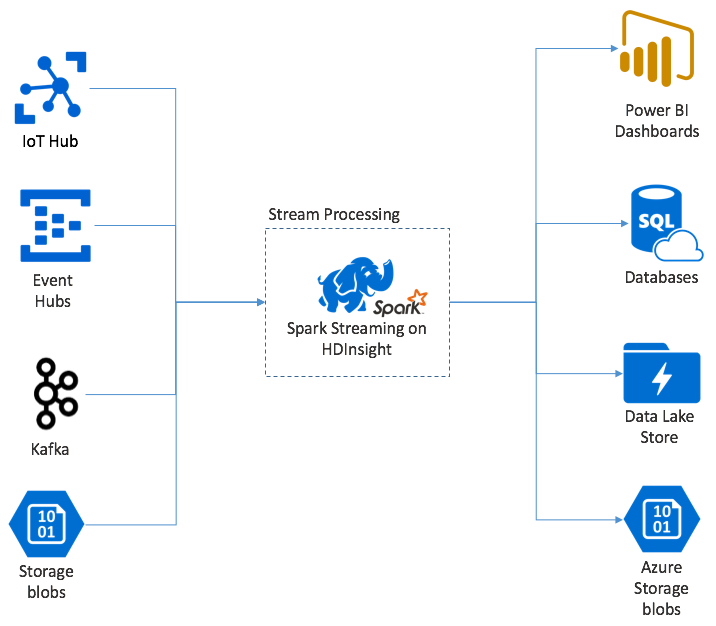
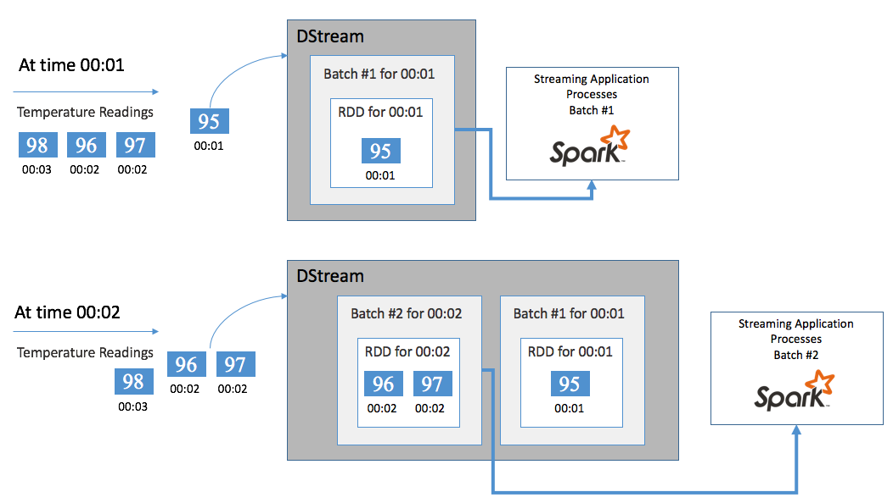
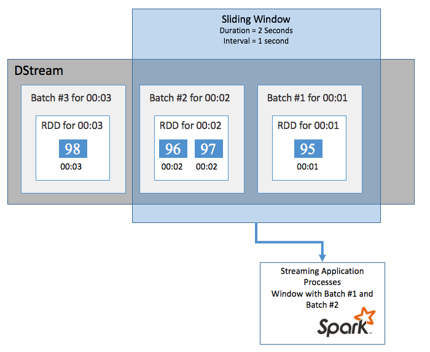
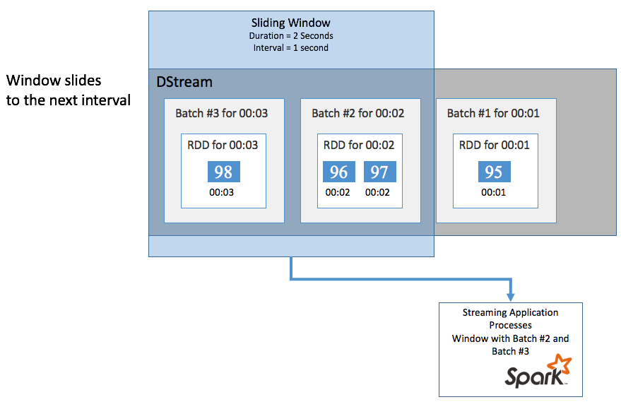

# Overview of Spark Streaming

Spark Streaming provides data stream processing on HDInsight Spark clusters, with a guarantee that any input event is processed exactly once, even if a node failure occurs. A Spark Stream is a long-running job that receives input data from a wide variety of sources, including Azure Event Hubs, an Azure IoT Hub, Kafka, Flume, Twitter, ZeroMQ, raw TCP sockets, or from monitoring HDFS filesystems. Unlike a solely event-driven process, a Spark Stream batches input data into time windows, such as a 2-second slice, and then transforms each batch of data using map, reduce, join, and extract operations. It then writes the transformed data out to filesystems, databases, dashboards, and the console.

Spark Streaming applications must wait a few fractions of a second to collect each *micro-batch* of events before sending that batch on for processing. In contrast, an event-driven application processes each event immediately. Spark Streaming latency is typically under a few seconds. The benefits of the micro-batch approach are more efficient data processing and simpler aggregate calculations.

## Introducing the DStream

Spark Streaming represents a continuous stream of incoming data using a *discretized stream* called a DStream. A DStream can be created from input sources like Event Hubs or Kafka, or by applying transformations to another DStream.

A DStream provides a layer of abstraction on top of the raw event data. 

Start with a single event, say a temperature reading from a connected thermostat. When this event arrives at your Spark Streaming application, the event is stored in a reliable way, that is, it's replicated on multiple nodes. This fault-tolerance ensures that the failure of any single node will not result in the loss of your event. The Spark core uses a data structure that distributes data across multiple nodes in the cluster, where each node generally maintains its own data in-memory for best performance. This data structure is called a *resilient distributed dataset* (RDD).

Each RDD represents events collected over a user-defined timeframe called the batch interval. As each batch interval elapses, a new RDD is produced that contains all the data from that interval. The continuous set of RDDs are collected into a DStream. For example, if the batch interval is one second long, your DStream emits a batch every second containing one RDD that contains all the data ingested during that second. When processing the DStream, the temperature event appears in one of these batches. A Spark Streaming application processes the batches that contain the events and ultimately acts on the data stored in each RDD.

## Structure of a Spark Streaming application
A Spark Streaming application is a long-running application that receives data from ingest sources, applies transformations to process the data, and then pushes the data out to one or more destinations. The structure of a Spark Streaming application has two main parts. First, you define where the data comes from, what processing to do on the data, and where the results should go. Second, you run the application indefinitely, waiting for a stop signal.

For example, here is a simple application that receives a line of text over a TCP socket and counts the number of times each word appears.

### Define the application

The application logic definition consists of four steps:

1. Create a StreamingContext.
2. Create a DStream from the StreamingContext.
3. Apply transformations to the DStream.
4. Output the results.

This definition is static, and no data is processed until you run the application.

#### Create a StreamingContext
Create a StreamingContext from the SparkContext that points to your cluster. When creating a StreamingContext, you specify the size of the batch in seconds, for example:

    val ssc = new StreamingContext(spark, Seconds(1))

#### Create a DStream
Using the StreamingContext instance you created, create an input DStream for your input source. In this case, we are watching for the appearance of new files in the default storage attached to the HDInsight cluster.

    val lines = ssc.textFileStream("/uploads/2017/01/")

#### Apply transformations
You implement the processing by applying transformations on the DStream. Our application receives one line of text at a time from the file, splits each line into words, and then uses a map-reduce pattern to count the number of times each word appears.

    val words = lines.flatMap(_.split(" "))
    val pairs = words.map(word => (word, 1))
    val wordCounts = pairs.reduceByKey(_ + _)

#### Output results
Push the transformation results out to the destination systems by applying output operations. In this case, we show the result of each run through the computation in the console output.

    wordCounts.print()

### Run the application
Start the streaming application and run until a termination signal is received.

    ssc.start()            
    ssc.awaitTermination()

For details on the Spark Stream API, along with the event sources, transformations, and output operations it supports see [Spark Streaming Programming Guide](https://people.apache.org/~pwendell/spark-releases/latest/streaming-programming-guide.html).

The following sample application is self-contained, so you can run it inside a [Jupyter Notebook](apache-spark-jupyter-notebook-kernels.md). In the example, we create a mock data source in the class DummySource that outputs the value of a counter and the current time in milliseconds every five seconds. We create a new StreamingContext object that has a batch interval of 30 seconds. Every time a batch is created, it examines the RDD produced, converts it to a Spark DataFrame and creates a temporary table over the DataFrame.

    class DummySource extends org.apache.spark.streaming.receiver.Receiver[(Int, Long)](org.apache.spark.storage.StorageLevel.MEMORY_AND_DISK_2) {

        /** Start the thread that simulates receiving data */
        def onStart() {
            new Thread("Dummy Source") { override def run() { receive() } }.start()
        }

        def onStop() {  }

        /** Periodically generate a random number from 0 to 9, and the timestamp */
        private def receive() {
            var counter = 0  
            while(!isStopped()) {
            store(Iterator((counter, System.currentTimeMillis)))
            counter += 1
            Thread.sleep(5000)
            }
        }
    }

    // A batch is created every 30 seconds
    val ssc = new org.apache.spark.streaming.StreamingContext(spark.sparkContext, org.apache.spark.streaming.Seconds(30))

    // Set the active SQLContext so that we can access it statically within the foreachRDD
    org.apache.spark.sql.SQLContext.setActive(spark.sqlContext)

    // Create the stream
    val stream = ssc.receiverStream(new DummySource())

    // Process RDDs in the batch
    stream.foreachRDD { rdd =>

        // Access the SQLContext and create a table called demo_numbers we can query
        val _sqlContext = org.apache.spark.sql.SQLContext.getOrCreate(rdd.sparkContext)
        _sqlContext.createDataFrame(rdd).toDF("value", "time")
            .registerTempTable("demo_numbers")
    } 

    // Start the stream processing
    ssc.start()

We can then query the DataFrame periodically to see the current set of values present in the batch. In this case, we use the following SQL query:

    %%sql
    SELECT * FROM demo_numbers

The resulting output looks like the following:

| value	| time |
| --- | --- |
|10 | 1497314465256 |
|11 | 1497314470272 |
|12	| 1497314475289 |
|13	| 1497314480310 |
|14	| 1497314485327 |
|15	| 1497314490346 |

We expect to see six values, since the DummySource creates a value every 5 seconds and we emit a batch every 30 seconds.

## Sliding windows
If you want to perform aggregate calculations on your DStream over some time period, for example to get an average temperature over the last 2 seconds, you can use the sliding window operations included with Spark Streaming. A sliding window is defined as having a duration (the window length) and the interval during which the window's content are evaluated (the slide interval).

These sliding windows can overlap, for example you can define a window with a length of 2 seconds, that slides every 1 second. This means every time you perform an aggregation calculation, the window will include data from the last 1 second of the previous window as well as any new data in the next 1 second.

In the following example, we update the code that uses the DummySource to collect the batches into a window with a one-minute duration and a one-minute slide.

    // A batch is created every 30 seconds
    val ssc = new org.apache.spark.streaming.StreamingContext(spark.sparkContext, org.apache.spark.streaming.Seconds(30))

    // Set the active SQLContext so that we can access it statically within the foreachRDD
    org.apache.spark.sql.SQLContext.setActive(spark.sqlContext)

    // Create the stream
    val stream = ssc.receiverStream(new DummySource())

    // Process batches in 1 minute windows
    stream.window(org.apache.spark.streaming.Minutes(1)).foreachRDD { rdd =>

        // Access the SQLContext and create a table called demo_numbers we can query
        val _sqlContext = org.apache.spark.sql.SQLContext.getOrCreate(rdd.sparkContext)
        _sqlContext.createDataFrame(rdd).toDF("value", "time")
        .registerTempTable("demo_numbers")
    } 

    // Start the stream processing
    ssc.start()

After the first minute, this will yield 12 entries - six entries from each of the two batches collected in the window.

| value	| time |
| --- | --- |
| 1 | 1497316294139 |
| 2 | 1497316299158
| 3	| 1497316304178
| 4	| 1497316309204
| 5	| 1497316314224
| 6	| 1497316319243
| 7	| 1497316324260
| 8	| 1497316329278
| 9	| 1497316334293
| 10 | 1497316339314
| 11 | 1497316344339
| 12 | 1497316349361

The sliding window functions available in the Spark Streaming API include window, countByWindow, reduceByWindow, and countByValueAndWindow. For details on these functions see [Transformations on DStreams](https://people.apache.org/~pwendell/spark-releases/latest/streaming-programming-guide.html#transformations-on-dstreams).

## Checkpointing
To deliver resiliency and fault tolerance, Spark Streaming relies on checkpointing to insure that stream processing can continue uninterrupted, even in the face of node failures. In HDInsight, Spark creates checkpoints to durable storage (Azure Storage). These checkpoints store the metadata about the streaming application such as the configuration, the operations defined by the application, and any batches that were queued but not yet processed. In some cases, the checkpoints will also include saving the data in the RDDs to shorten the time it takes to rebuild the state of the data from what is present in the RDDs managed by Spark.

## Deploying Spark Streaming applications
You typically build your Spark Streaming application locally and then deploy it to Spark on HDInsight by copying the JAR file that contains your application to the default storage attached to your HDInsight cluster. Then you can start your application by using the LIVY REST APIs available from your cluster. This is a POST operation where the body of the POST includes a JSON document that provides the path to your JAR, the name of the class whose main method defines and runs the streaming application, and optionally the resource requirements of the job (such as the number of executors, memory and cores), and any configuration settings your application code requires.

The status of all applications can also be checked with a GET request against a LIVY endpoint. Finally, you can terminate a running application by issuing a DELETE request against the LIVE endpoint. For details on the LIVY API, see [Remote jobs with LIVY](apache-spark-livy-rest-interface.md)

## Next steps

* [Create an Apache Spark Cluster in HDInsight](../hdinsight-hadoop-create-linux-clusters-portal.md)
* [Spark Streaming Programming Guide](https://people.apache.org/~pwendell/spark-releases/latest/streaming-programming-guide.html)
* [Launch Spark jobs remotely with LIVY](apache-spark-livy-rest-interface.md)