# Connect IoT DevKit AZ3166 to Azure IoT Hub in the cloud

[!INCLUDE [iot-hub-get-started-device-selector](../../includes/iot-hub-get-started-device-selector.md)]

The [MXChip IoT DevKit](https://microsoft.github.io/azure-iot-developer-kit/) can be used to develop and prototype Internet of Things (IoT) solutions leveraging Microsoft Azure services. It includes an Arduino compatible board with rich peripherals and sensors, an open-source board package and a growing [projects catalog](https://microsoft.github.io/azure-iot-developer-kit/docs/projects/).

## What you do
Connect [DevKit](https://microsoft.github.io/azure-iot-developer-kit/) to an Azure IoT hub that you create, collect the temperature and humidity data from sensors and send the data to IoT hub.

Don't have a DevKit yet? Get a new one [here](https://aka.ms/iot-devkit-purchase).

## What you learn

* How to connect IoT DevKit to Wireless access point and prepare your development environment.
* How to create an IoT hub and register a device for MXChip IoT DevKit.
* How to collect sensor data by running a sample application on MXChip IoT DevKit.
* How to send the sensor data to your IoT hub.

## What you need

* An MXChip IoT DevKit board with a micro USB cable. [Get it now](https://aka.ms/iot-devkit-purchase)
* A computer running Windows 10 or macOS 10.10+
* An active Azure subscription
  * Activate a [free a trial Microsoft Azure account](https://www.azure.cn/pricing/1rmb-trial/)

## Prepare your hardware

Hook up the hardware to your computer.

### Hardware you need

* DevKit board
* Micro USB cable


### Connect DevKit to your computer

1. Connect USB end to your PC
2. Connect Micro USB end to the DevKit
3. The green LED next to power confirms connection


## Configure WiFi

IoT projects rely on Internet connectivity. Use the following instructions to configure the DevKit to connect to WiFi.

### Enter AP Mode

Hold down button B, then push and release the reset button, then release button B. Your DevKit will enter AP Mode for configuring WiFi. The screen will display the Service Set Identifier(SSID) of the DevKit as well as the configuration portal IP address:


### Connect to DevKit AP

Now, use another WiFi enabled device (PC or mobile phone) to connect to the DevKit SSID (highlighted in the screenshot above), leave the password empty.

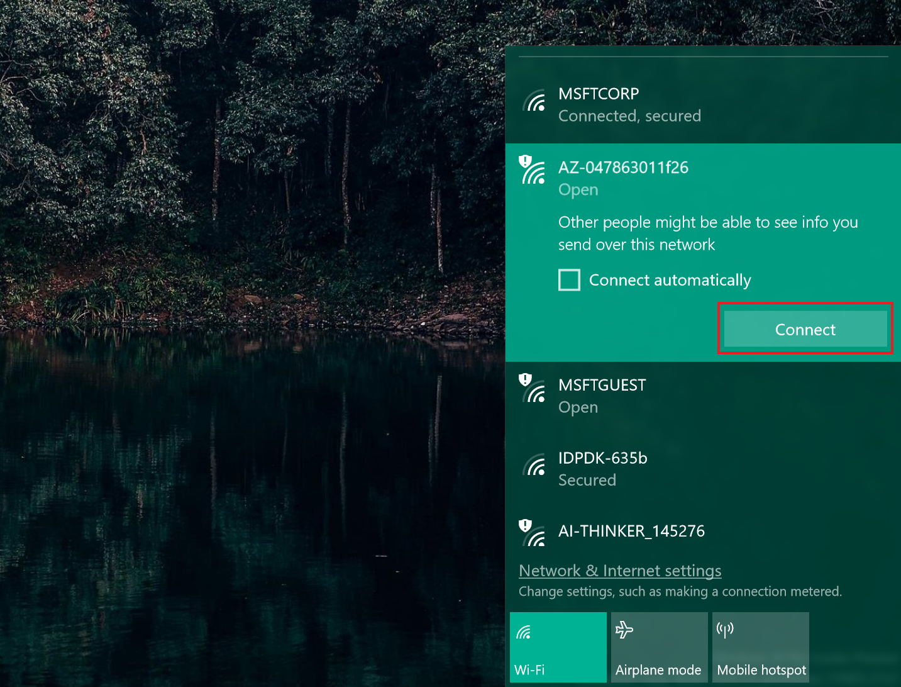

### Configure WiFi for DevKit

Open the IP address shown on the DevKit screen on your PC or mobile phone browser, select the WiFi network you want the DevKit to connect to, then type the password. Click **Connect** to complete:

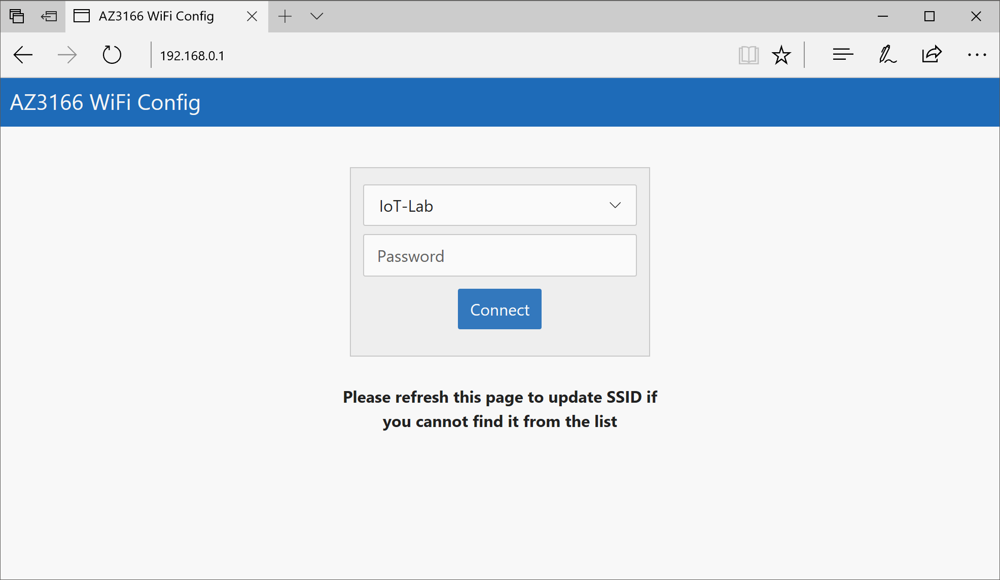

Once the connection succeeds, the DevKit will reboot in a few seconds. If succeeded, you will see the WiFi name and IP address on the screen:

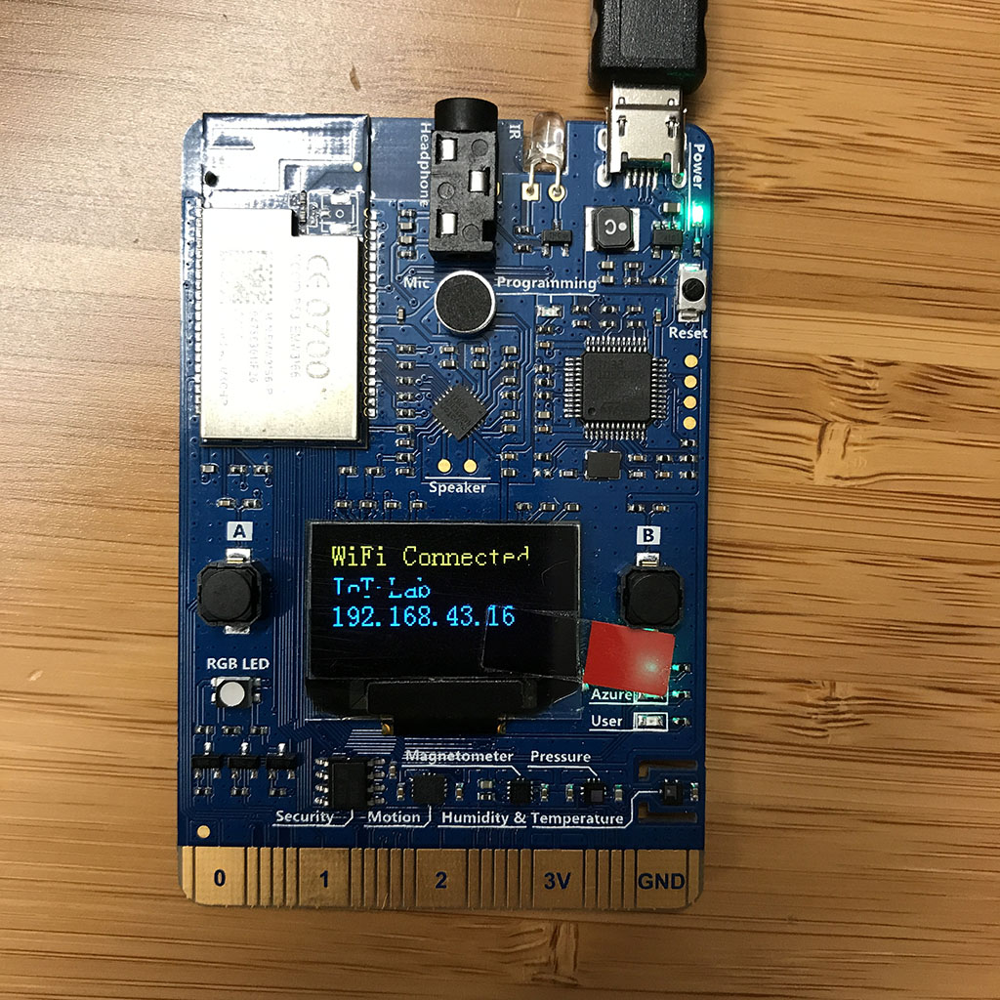

> [!NOTE] 
The IP address displayed in the photo may not match the actual IP assigned and displayed on the DevKit screen. This is normal as WiFi uses DHCP to dynamically assign IPs.

After WiFi is configured, your credentials will be persisted on the device for that connection, even if unplugged. For example, if you configured the DevKit for WiFi in your home and then took the DevKit to the office, you will need to reconfigure AP mode (starting at step **Enter AP Mode**) to connect the DevKit to your office WiFi. 

## Start using DevKit

The default app running on DevKit will check the latest version of the firmware and display some sensor diagnosis data for you.

### Upgrade to the latest firmware

You will be prompted on the screen both the current and latest firmware version if there is an upgrade needed. Follow [Upgrade firmware](https://microsoft.github.io/azure-iot-developer-kit/docs/upgrading/) guide to upgrade it.


> [!NOTE] 
This is a one-time effort, once you start developing on the DevKit and upload your app, you will have the latest firmware come with your app.

### Test various sensors

Press button B to test sensors, continue pressing and releasing the B button to cycle through each sensor.

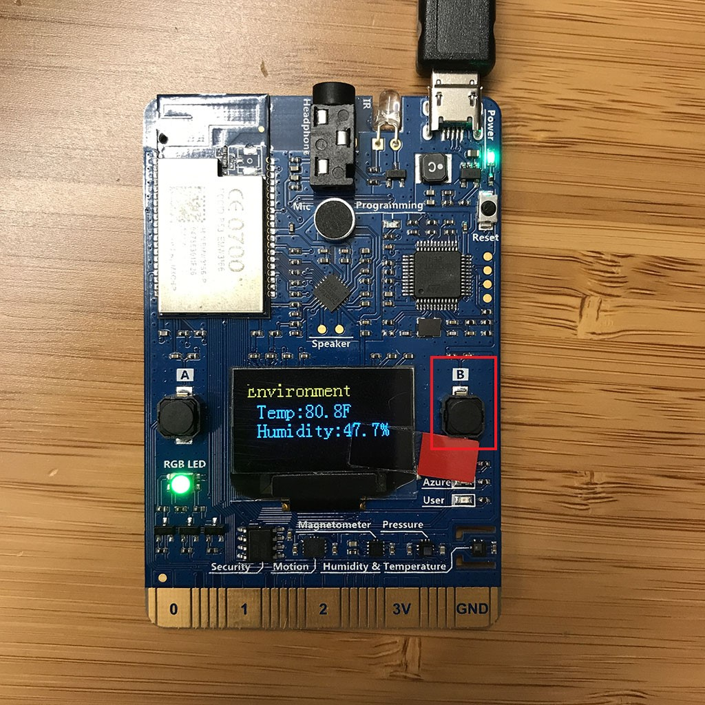

## Prepare development environment

Now it's time to set up the development environment: tools and packages for you to build stunning IoT applications. You can choose Windows or macOS version according to your operating system.


### Windows

We encourage you to use the installation package to prepare the development environment. If you encounter any issues, you can follow the [manual steps](https://microsoft.github.io/azure-iot-developer-kit/docs/installation/) to get it done.

#### Download latest package

The `.zip` file you download contains all necessary tools and packages required for DevKit development.

> [!div class="button"]
[Download](https://azureboard.azureedge.net/prod/installpackage/devkit_install_1.0.2.zip)


> [!NOTE] 
> The `.zip` file contains the following tools and packages. If you already have some components installed, the script will detect and skip them.
> * Node.js and Yarn: Runtime for the setup script and automated tasks
> * [Azure CLI 2.0 MSI](https://docs.microsoft.com//cli/azure/install-azure-cli#windows) - Cross-platform command-line experience for managing Azure resources, the MSI contains dependent Python and pip.
> * [Visual Studio Code](https://code.visualstudio.com/): Lightweight code editor for DevKit development
> * [Visual Studio Code extension for Arduino](https://marketplace.visualstudio.com/items?itemName=vsciot-vscode.vscode-arduino): Enables Arduino development in VS Code
> * [Arduino IDE](https://www.arduino.cc/en/Main/Software): The extension for Arduino relies on this tool
> * DevKit Board Package: Tool chains, libraries and projects for the DevKit
> * ST-Link Utility: Essential utilities and drivers

#### Run installation script

In Windows File Explorer, locate the `.zip` and extract it, find `install.cmd`, right-click and select **"Run as administrator"** to start.

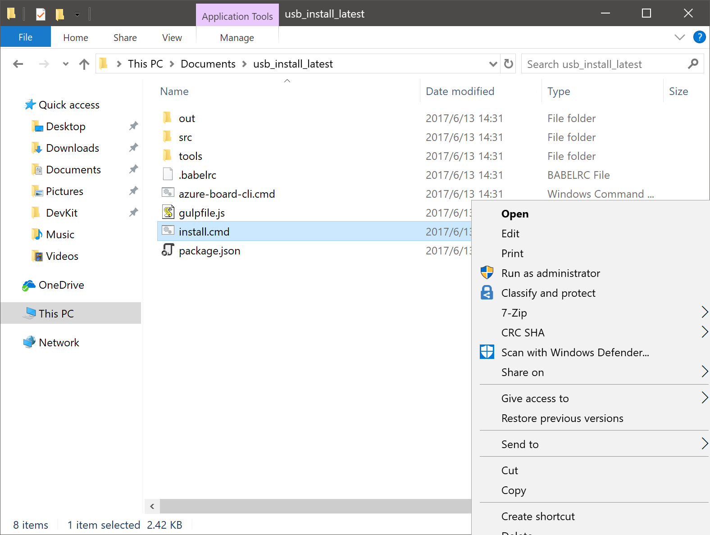

During installation, you will see the progress of each tool or package.

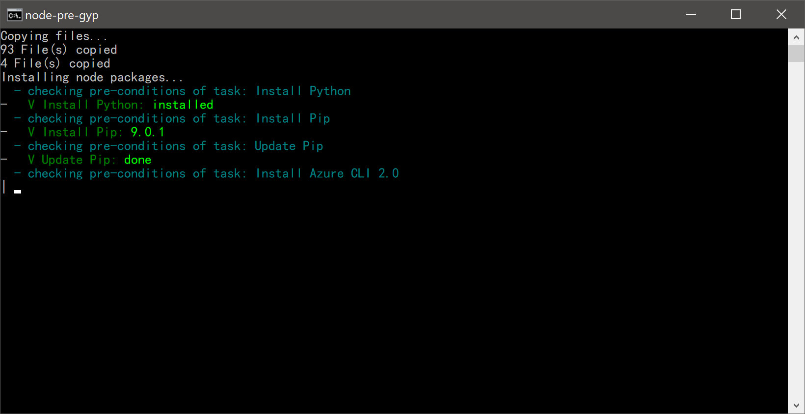

#### Confirm to install drivers

The VS Code for Arduino extension relies on the Arduino IDE. If this is the first time you are installing the Arduino IDE, you will be prompted to install relevant drivers:


It should take around 10 minutes to finish installation depending on your Internet speed. Once the installation is complete, you should see Visual Studio Code and Arduino IDE shortcuts on your desktop.

> [!NOTE] 
Occasionally, when you launch VS Code, you will be prompted with an error that cannot find Arduino IDE or related board package. To solve it, close VS Code, launch Arduino IDE once and VS Code should locate Arduino IDE path correctly.


### macOS (Preview)

Follow these steps to prepare development environment on macOS.

#### Install Azure CLI 2.0

Follow the [official guide](https://docs.microsoft.com//cli/azure/install-azure-cli) to install Azure CLI 2.0:

Install Azure CLI 2.0 with one `curl` command:

```bash
curl -L https://aka.ms/InstallAzureCli | bash
```

And restart your command shell for changes to take effect:

```bash
exec -l $SHELL
```

#### Install Arduino IDE

The Visual Studio Code Arduino extension relies on the Arduino IDE. Download and install the [Arduino IDE for macOS](https://www.arduino.cc/en/Main/Software).

#### Install Visual Studio Code

Download and install [Visual Studio Code for macOS](https://code.visualstudio.com/). This will be the primary development tool for building DevKit IoT applications.

####  Download latest package

1. Install Node.js. You can use popular macOS package manager [Homebrew](https://brew.sh/) or [pre-built installer](https://nodejs.org/en/download/) to install it.

2. Download `.zip` file containing task scripts required for DevKit development in VS Code.

   > [!div class="button"]
   [Download](https://azureboard.azureedge.net/installpackage/devkit_tasks_1.0.2.zip)

   Locate the `.zip` and extract it. Then launch **Terminal** app and run the following commands to configure:

   Move extracted folder to your macOS user folder:
   ```bash
   mv [.zip extracted folder]/azure-board-cli ~/. ; cd ~/azure-board-cli
   ```
  
   Install `npm` packages:
   ```
   npm install
   ```

#### Install VS Code extension for Arduino

Visual Studio Code allows you to install Marketplace extensions directly in the tool, simply click the extensions icon in the left menu pane and then search `Arduino` to install:

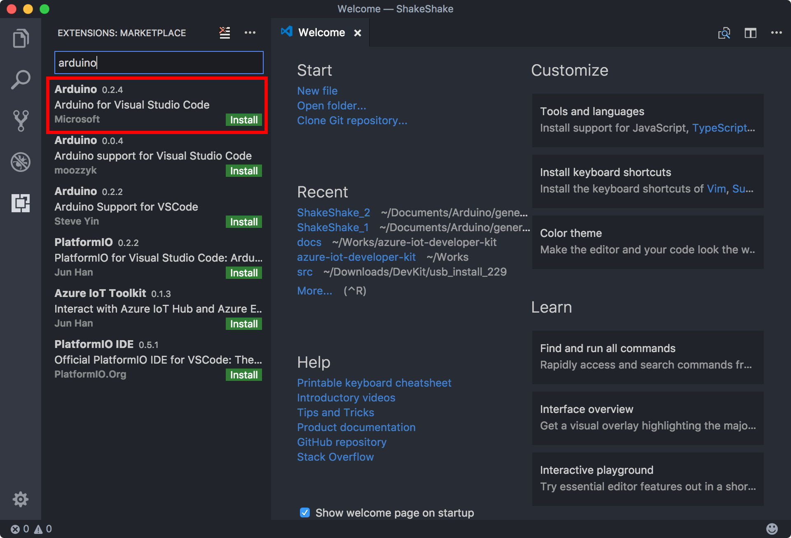

#### Install DevKit board package

You will need to add the DevKit board using the Board Manager in Visual Studio Code.

1. Use `Cmd+Shift+P` to invoke command palette and type **Arduino** then find and select **Arduino: Board Manager**.

2. Click **'Additional URLs'** at the bottom right.
   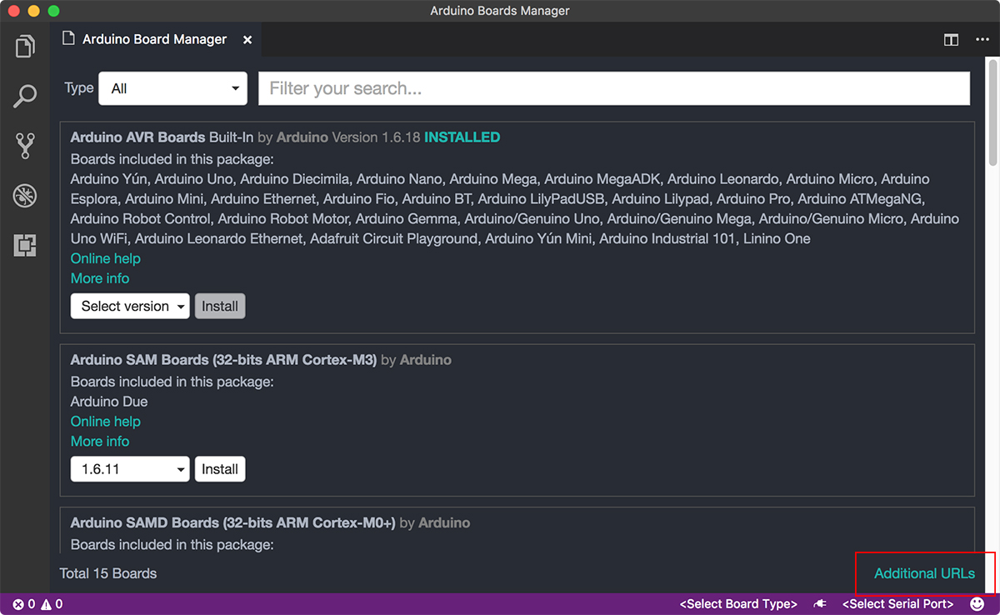

3. In the `settings.json` file, add a line at the bottom of `USER SETTINGS` pane and save.
   ```json
   "arduino.additionalUrls": "https://raw.githubusercontent.com/VSChina/azureiotdevkit_tools/master/package_azureboard_index.json"
   ```
   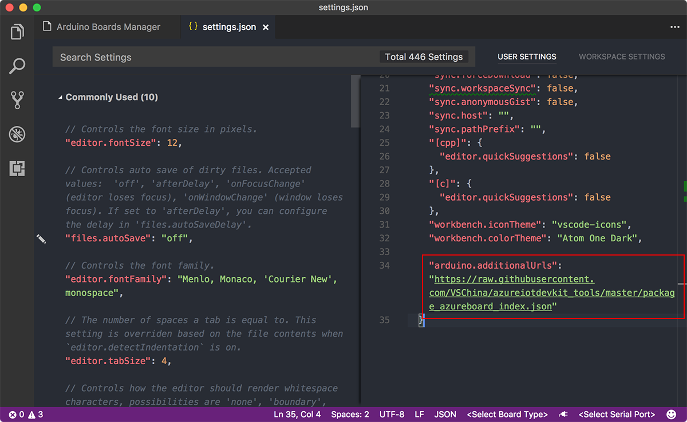

4. Now in the Board Manager search for 'az3166' and install the latest version.
   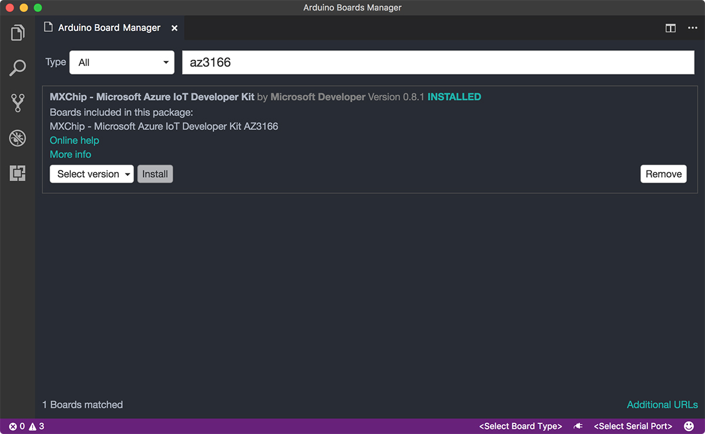

You now have all the necessary tools and packages installed for macOS.


## Open project folder

### Launch VS Code

Make sure your DevKit is not connected. Launch VS Code first and connect the DevKit to your computer. VS Code will automatically find it and pop up an introduction page:

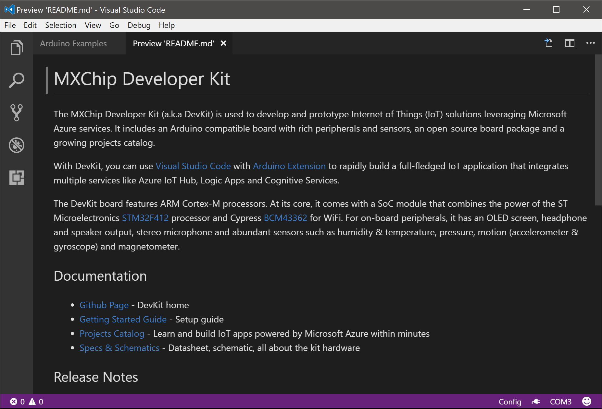

> [!NOTE] 
Occasionally, when you launch VS Code, you will be prompted with error that cannot find Arduino IDE or related board package. To solve it, close VS Code, launch Arduino IDE once again and VS Code should locate Arduino IDE path correctly.

### Open Arduino Examples folder

Switch to **'Arduino Examples'** tab, navigate to `Examples for MXCHIP AZ3166 > AzureIoT` and click on `GetStarted`.

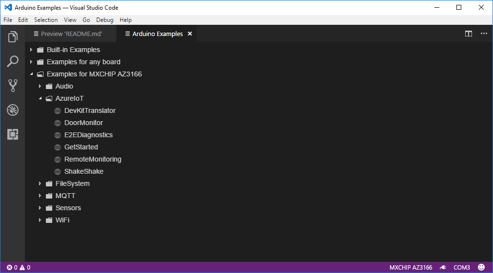

If you happen to close the pane, to reload it, use `Ctrl+Shift+P` (macOS: `Cmd+Shift+P`) to invoke command palette and type **Arduino** to find and select **Arduino: Examples**.

## Provision Azure services

In the solution window, run your task through `Ctrl+P` (macOS: `Cmd+P`) by typing 'task cloud-provision':

In the VS Code terminal, an interactive command line will guide you through provisioning the required Azure services:

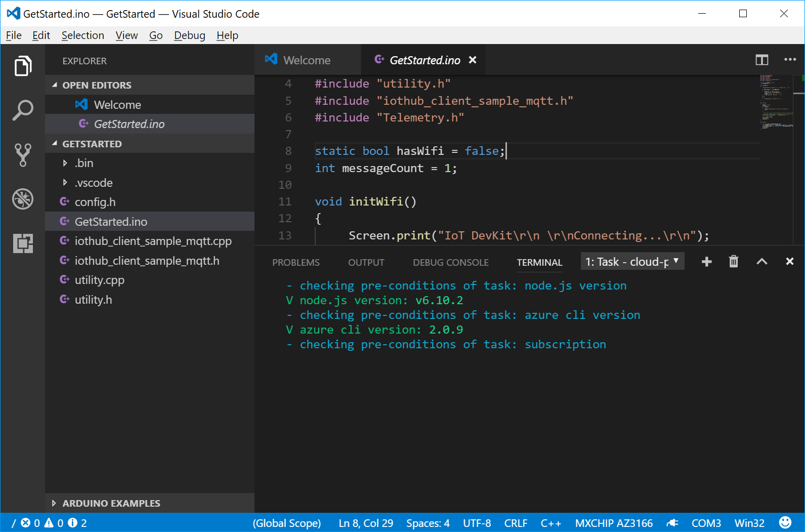

## Build and upload Arduino sketch

### Install required library

1. Press `F1` or `Ctrl+Shift+P` (macOS: `Cmd+Shift+P`) to invoke command palette and type **Arduino** then find and select **Arduino: Library Manager**.

2. Search for `ArduinoJson` library and click **Install**

### Build and upload the device code

Use `Ctrl+P` (macOS: `Cmd+P`) to run 'task device-upload'. The terminal will prompt you to enter configuration mode. To do so, hold down button A, then push and release the reset button. The screen will display 'Configuration'. This is to set the connection string that retrieves from 'task cloud-provision' step.

Then it will start verifying and uploading the Arduino sketch:

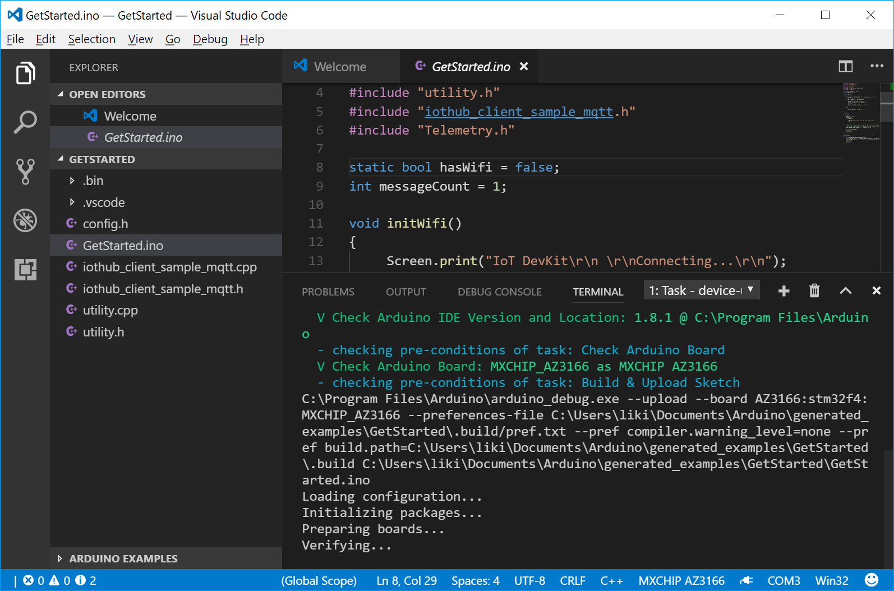

The DevKit will reboot and start running the code.

## Test the project

In VS Code, click the power plug icon on the status bar to open the Serial Monitor.

The sample application is running successfully when you see the following results:

* The Serial Monitor displays the same information as the content in the screenshot below.
* The LED on MXChip IoT DevKit is blinking.


## Problems and feedback

You can find [FAQs](https://microsoft.github.io/azure-iot-developer-kit/docs/faq/) if you encounter problems or reach out to us from the channels below.

## Next steps

You have successfully connected an MXChip IoT DevKit to your IoT Hub, and sent the captured sensor data to your IoT hub.

To continue getting started with IoT Hub and to explore other IoT scenarios, see:

- [Manage cloud device messaging with iothub-explorer](./iot-hub-explorer-cloud-device-messaging.md)
- [Use Azure Web Apps to visualize real-time sensor data from Azure IoT Hub](./iot-hub-live-data-visualization-in-web-apps.md)
- [Device management with iothub-explorer](./iot-hub-device-management-iothub-explorer.md)
