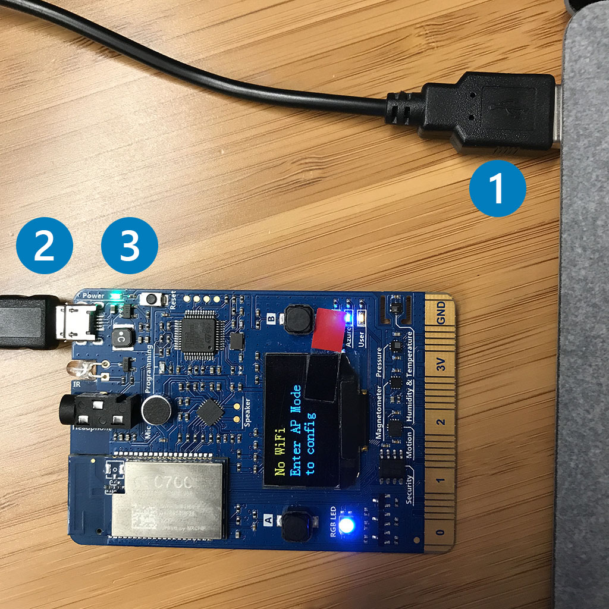
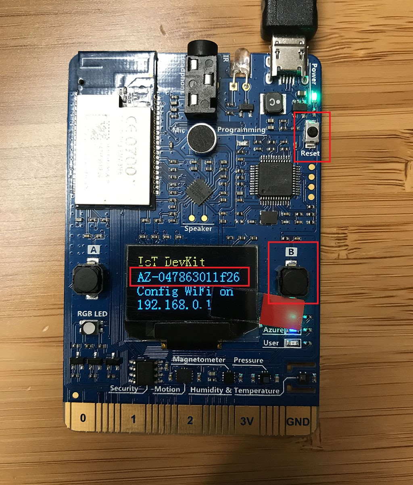
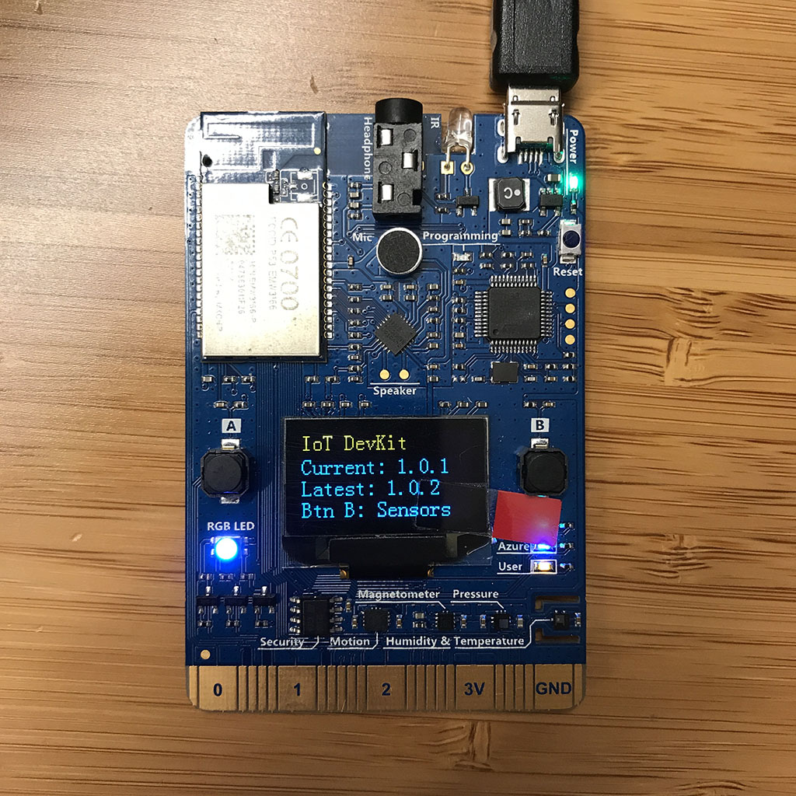
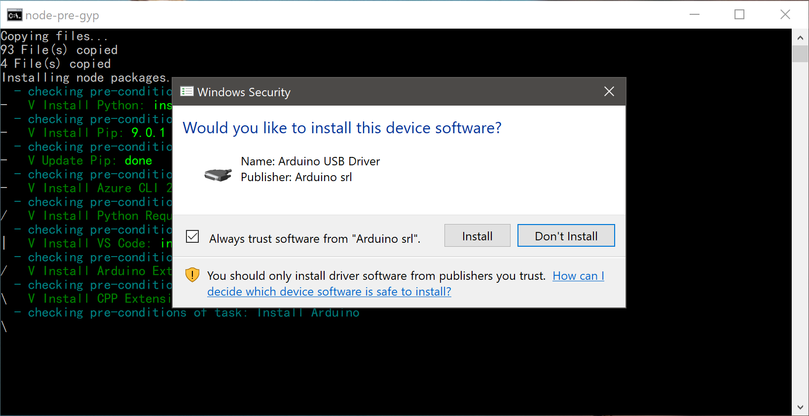
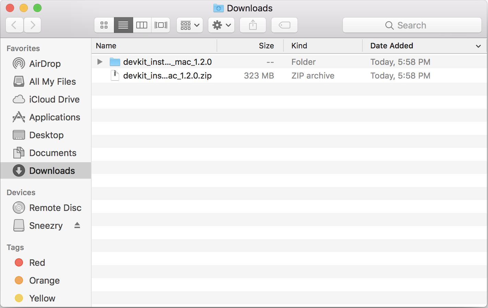
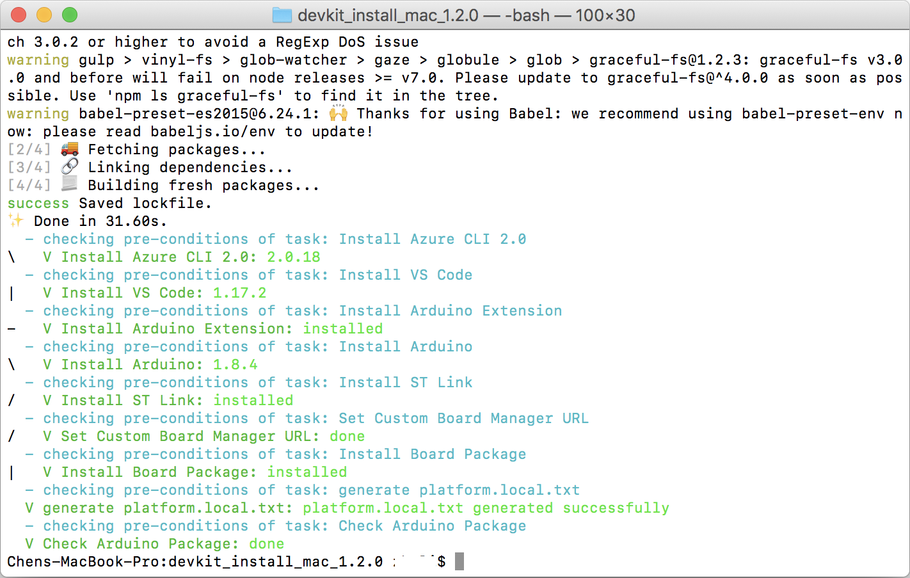
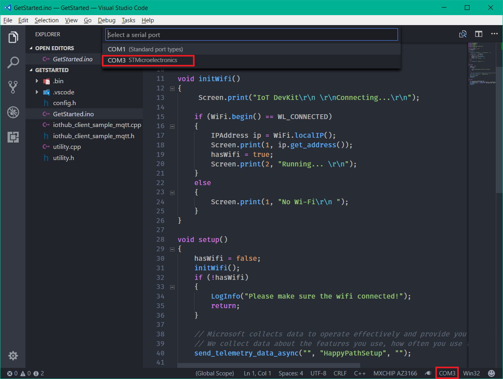
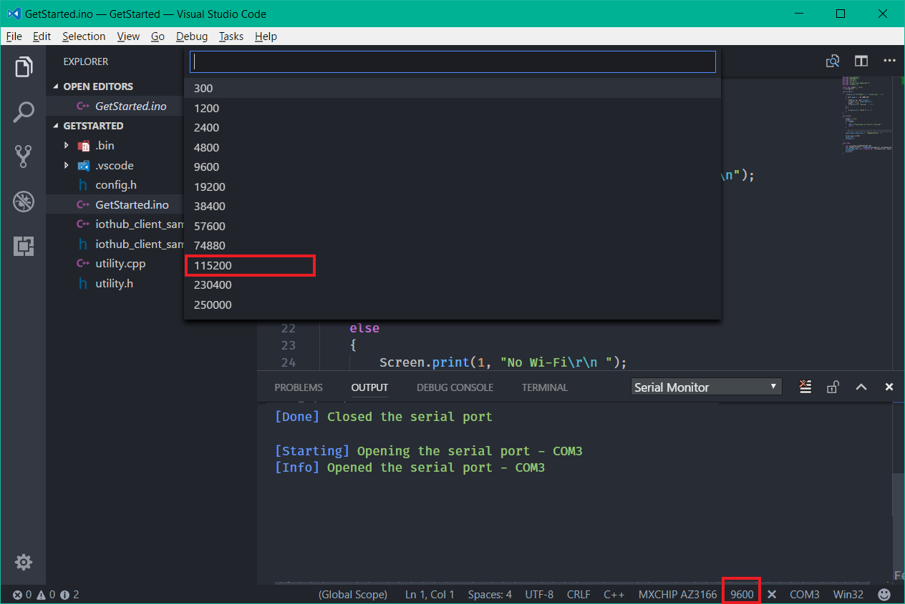

# Connect IoT DevKit AZ3166 to Azure IoT Hub in the cloud

[!INCLUDE [iot-hub-get-started-device-selector](../../includes/iot-hub-get-started-device-selector.md)]

You can use the [MXChip IoT DevKit](https://microsoft.github.io/azure-iot-developer-kit/) to develop and prototype Internet of Things (IoT) solutions that take advantage of Microsoft Azure services. It includes an Arduino-compatible board with rich peripherals and sensors, an open-source board package, and a growing [projects catalog](https://microsoft.github.io/azure-iot-developer-kit/docs/projects/).

## What you do
Connect the [DevKit](https://microsoft.github.io/azure-iot-developer-kit/) to an Azure IoT hub that you create, collect the temperature and humidity data from sensors, and send the data to the IoT hub.

Don't have a DevKit yet? Try [DevKit simulator](https://azure-samples.github.io/iot-devkit-web-simulator/) or [get one](https://aka.ms/iot-devkit-purchase).

## What you learn

* How to connect the IoT DevKit to a wireless access point and prepare your development environment.
* How to create an IoT hub and register a device for the MXChip IoT DevKit.
* How to collect sensor data by running a sample application on the MXChip IoT DevKit.
* How to send the sensor data to your IoT hub.

## What you need

* An MXChip IoT DevKit board with a micro USB cable. [Get it now](https://aka.ms/iot-devkit-purchase)
* A computer running Windows 10 or macOS 10.10+
* An active Azure subscription
  * Activate a [Activate a 30-day trial Microsoft Azure account](https://www.azure.cn/pricing/1rmb-trial/)

## Prepare your hardware

Hook up the hardware to your computer.

You need this hardware:

* DevKit board
* Micro-USB cable


To connect the DevKit to your computer:

1. Connect the USB end to your computer.
2. Connect the Micro-USB end to the DevKit.
3. The green LED for power confirms the connection.



## Configure Wi-Fi

IoT projects rely on internet connectivity. Use the following instructions to configure the DevKit to connect to Wi-Fi.

### Enter AP Mode

Hold down button B, push and release the reset button, and then release button B. Your DevKit enters AP mode for configuring Wi-Fi. The screen displays the service set identifier (SSID) of the DevKit and the configuration portal IP address.



### Connect to DevKit AP

Now, use another Wi-Fi enabled device (computer or mobile phone) to connect to the DevKit SSID (highlighted in the previous image). Leave the password empty.


### Configure Wi-Fi for the DevKit

Open the IP address shown on the DevKit screen on your computer or mobile phone browser, select the Wi-Fi network that you want the DevKit to connect to, and then type the password. Select **Connect**.


When the connection succeeds, the DevKit reboots in a few seconds. You then see the Wi-Fi name and IP address on the screen:


> [!NOTE] 
> The IP address displayed in the photo might not match the actual IP address assigned and displayed on the DevKit screen. This is normal, because Wi-Fi uses DHCP to dynamically assign IPs.

After Wi-Fi is configured, your credentials will persist on the device for that connection, even if the device is unplugged. For example, if you configure the DevKit for Wi-Fi in your home and then take the DevKit to the office, you will need to reconfigure AP mode (starting at the step in the "Enter AP mode" section) to connect the DevKit to your office Wi-Fi. 

## Start using the DevKit

The default app running on the DevKit checks the latest version of the firmware and displays some sensor diagnosis data for you.

### Upgrade to the latest firmware

> [!NOTE] 
> Since v1.1, DevKit enables ST-SAFE in bootloader. You need to upgrade firmware if you are running under v1.1 in order to make it work probably.
>
>

If you need a firmware upgrade, the screen will show the current and latest firmware versions. To upgrade, follow the [Upgrade firmware](https://microsoft.github.io/azure-iot-developer-kit/docs/firmware-upgrading/) guide.



> [!NOTE] 
> This is a one-time effort. After you start developing on the DevKit and upload your app, the latest firmware will come with your app.

### Test various sensors

Press button B to test sensors. Continue pressing and releasing the button B to cycle through each sensor.


## Prepare the development environment

Now it's time to set up the development environment: tools and packages for you to build stunning IoT applications. You can choose the Windows or macOS version according to your operating system.


### Windows

We encourage you to use the installation package to prepare the development environment. If you encounter any problems, you can follow the [manual steps](https://microsoft.github.io/azure-iot-developer-kit/docs/installation/) to get it done.

#### Download the latest package

The .zip file that you download contains all the necessary tools and packages for DevKit development.

> [!div class="button"]
[Download](https://aka.ms/devkit/prod/installpackage/latest)

The .zip file contains the following tools and packages. If you already have some components installed, the script will detect and skip them.

* Node.js and Yarn: Runtime for the setup script and automated tasks.
* [Azure CLI 2.0 MSI](https://docs.azure.cn/zh-cn/cli/install-az-cli2?view=azure-cli-lastest): Cross-platform command-line experience for managing Azure resources. The MSI contains dependent Python and pip.
* [Visual Studio Code](https://code.visualstudio.com/) (VS Code): Lightweight code editor for DevKit development.
* [Visual Studio Code extension for Arduino](https://marketplace.visualstudio.com/items?itemName=vsciot-vscode.vscode-arduino): Extension that enables Arduino development in Visual Studio Code.
* [Arduino IDE](https://www.arduino.cc/en/Main/Software): Tool that the extension for Arduino relies on.
* DevKit Board Package: Tool chains, libraries, and projects for the DevKit.
* ST-Link Utility: Essential tools and drivers.

#### Run the installation script

In Windows File Explorer, locate the .zip file and extract it. Find `install.cmd`, right-click it, and select **Run as administrator**.


During installation, you see the progress of each tool or package.


> [!NOTE] 
> Depending on your environment, sometimes you will get failure when installing Arduino IDE. In this case, you may try [install Arduino IDE individually](https://microsoft.github.io/azure-iot-developer-kit/docs/installation/#windows) and run install.cmd again. Otherwise, please follow the [manual steps](https://microsoft.github.io/azure-iot-developer-kit/docs/installation/#windows) to install all necessary tools and packages.

#### Install drivers

The VS Code for Arduino extension relies on the Arduino IDE. If this is the first time you are installing the Arduino IDE, you're prompted to install relevant drivers:



Installation should take around 10 minutes, depending on your internet speed. After the installation is complete, you should see Visual Studio Code and Arduino IDE shortcuts on your desktop.

> [!NOTE] 
> Occasionally, when you start VS Code, you're prompted with an error that it cannot find the Arduino IDE or related board package. To solve it, close VS Code and restart the Arduino IDE. VS Code should then locate the Arduino IDE path correctly.

### macOS

We encourage you to use one-click installation experience to prepare the development environment. If you encounter any problems, you can follow the [manual steps](https://microsoft.github.io/azure-iot-developer-kit/docs/installation/) to get it done.

#### Install Homebrew

> [!NOTE] 
> If you have installed Homebrew, you can skip this step.

Follow the [Homebrew installation instructions](https://docs.brew.sh/Installation.html) to install it.

#### Download the latest package
The .zip file that you download contains all the necessary tools and packages for DevKit development.

> [!div class="button"]
[Download](https://aka.ms/devkit/prod/installpackage/mac/latest)

The .zip file contains the following tools and packages. If you already have some components installed, the script will detect and skip them.

* Node.js and Yarn: Runtime for the setup script and automated tasks.
* [Azure CLI 2.0](https://docs.microsoft.com/en-us/cli/azure/install-azure-cli?view=azure-cli-latest#a-namemacosinstall-on-macos): Cross-platform command-line experience for managing Azure resources.
* [Visual Studio Code](https://code.visualstudio.com/) (VS Code): Lightweight code editor for DevKit development.
* [Visual Studio Code extension for Arduino](https://marketplace.visualstudio.com/items?itemName=vsciot-vscode.vscode-arduino): Extension that enables Arduino development in Visual Studio Code.
* [Arduino IDE](https://www.arduino.cc/en/Main/Software): Tool that the extension for Arduino relies on.
* DevKit Board Package: Tool chains, libraries, and projects for the DevKit.
* ST-Link Utility: Essential tools and drivers.

#### Run the installation script

In the Finder, locate the .zip and extract it:



Launch Terminal app, locate the folder you extract .zip file and run:

```bash
./install.sh
```



> [!NOTE] 
> If you meet Homebrew permission error, run `brew doctor` to get it fixed. Check [FAQ](https://microsoft.github.io/azure-iot-developer-kit/docs/faq/#homebrew-permission-error-on-macos) for more details.

You now have all the necessary tools and packages installed for macOS.


## Open the project folder

### Start VS Code

Make sure your DevKit is not connected. Start VS Code first and connect the DevKit to your computer. VS Code automatically finds the DevKit and opens an introduction page:


> [!NOTE] 
> Occasionally, when you start VS Code, you're prompted with an error that it cannot find the Arduino IDE or related board package. Close VS Code and restart the Arduino IDE. VS Code should then locate the Arduino IDE path correctly.


### Open the Arduino Examples folder

On the **Arduino Examples** tab, browse to **Examples for MXCHIP AZ3166** > **AzureIoT**, and select **GetStarted**.


If you happen to close the pane, you can reopen it. Use `Ctrl+Shift+P` (macOS: `Cmd+Shift+P`) to open the command palette, type **Arduino**, and then find and select **Arduino: Examples**.

## Provision Azure services

In the solution window, run your task through `Ctrl+P` (macOS: `Cmd+P`) by entering `task cloud-provision`.

In the VS Code terminal, an interactive command line guides you through provisioning the required Azure services:


## Build and upload the Arduino sketch

### Windows

1. Use `Ctrl+P` to run `task device-upload`.
2. The terminal prompts you to enter configuration mode. To do so, hold down button A, then push and release the reset button. The screen displays the DevKit id and 'Configuration'.

This is to set the connection string that retrieves from `task cloud-provision` step.

Then VS Code starts verifying and uploading the Arduino sketch:


The DevKit reboots and starts running the code.

> [!NOTE] 
> Occasionally, you get error "Error: AZ3166: Unknown package". This is due to the board package index is not refreshed. Check this [FAQ steps](https://microsoft.github.io/azure-iot-developer-kit/docs/faq/) to solve it.

### macOS

1. Put DevKit into configuration mode:
  Hold down button A, then push and release the reset button. The screen displays 'Configuration'.
2. Use `Cmd+P` to run `task device-upload`.

This is to set the connection string that retrieves from `task cloud-provision` step.

Then VS Code starts verifying and uploading the Arduino sketch:


The DevKit reboots and starts running the code.

> [!NOTE] 
> Occasionally, you get error "Error: AZ3166: Unknown package". This is due to the board package index is not refreshed. Check this [FAQ steps](https://microsoft.github.io/azure-iot-developer-kit/docs/faq/) to solve it.


## Test the project

In VS Code, following these steps to open and set up the Serial Monitor:

1. Click the `COM[X]` word on the status bar to set the right COM port with `STMicroelectronics`:
   

2. Click power plug icon on the status bar to open the Serial Monitor:
  

3. On the status bar, click the number that represents the Baud Rate and set to `115200`:
  

The sample application is running successfully when you see the following results:

* The Serial Monitor displays the same information as the content in the screenshot below.
* The LED on MXChip IoT DevKit is blinking.


## Problems and feedback

If you encounter problems, you can find [FAQs](https://microsoft.github.io/azure-iot-developer-kit/docs/faq/). You can also give us feedback by leaving a comment on this page.

## Next steps

You have successfully connected an MXChip IoT DevKit to your IoT hub, and you have sent the captured sensor data to your IoT hub.

To continue getting started with Azure IoT Hub and to explore other IoT scenarios, see:

- [Manage cloud device messaging with iothub-explorer](./iot-hub-explorer-cloud-device-messaging.md)
- [Save IoT Hub messages to Azure data storage](./iot-hub-store-data-in-azure-table-storage.md)
- [Use Web Apps to visualize real-time sensor data from Azure IoT Hub](./iot-hub-live-data-visualization-in-web-apps.md)
- [Device management with iothub-explorer](./iot-hub-device-management-iothub-explorer.md)
