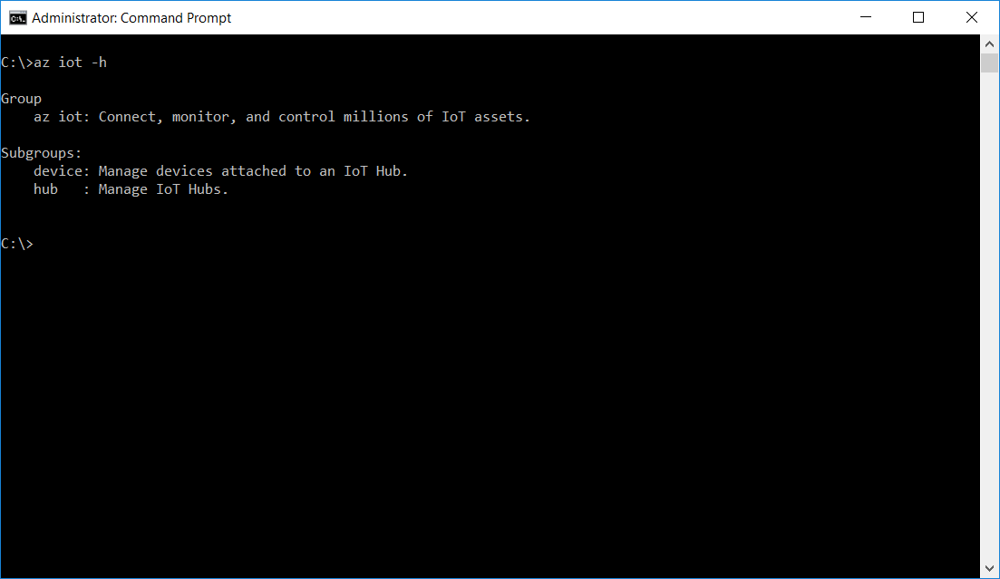

# Get the tools (Windows 7 and later)
>[!div class="op_single_selector"]
[Windows 7 or later](./iot-hub-gateway-kit-c-sim-lesson2-get-the-tools-win32.md)
[Ubuntu 16.04](./iot-hub-gateway-kit-c-sim-lesson2-get-the-tools-ubuntu.md)
[macOS 10.10](./iot-hub-gateway-kit-c-sim-lesson2-get-the-tools-mac.md)

## What you will do

- Install Git, Node.js, Gulp, Python.
- Install the Azure command-line interface (Azure CLI). 

If you have any problems, look for solutions on the [troubleshooting page](./iot-hub-gateway-kit-c-sim-troubleshooting.md).

## What you will learn

In this lesson, you will learn:

- How to install [Git](https://git-scm.com/) and [Node.js](https://nodejs.org/en/).
  - Git is an open source distributed version control system. The sample application for this lesson is stored on Git.
  - Node.js is a JavaScript runtime with a rich package ecosystem.
- How to use [NPM](https://www.npmjs.com/) to install Node.js development tools.
  - The minimum required version of Node.js is 4.5 LTS.
  - NPM is one of the package managers for Node.js.
- How to install Visual Studio Code.
  - Visual Studio Code is a cross platform, lightweight but powerful source code editor for Windows, Linux, and macOS. It has great support for debugging, embedded Git control, syntax highlighting, intelligent code completion, snippets, and code refactoring as well.
- How to install Python.
  - Python is a widely used high-level, general-purpose, interpreted and dynamic programming language.
- How to install the Azure CLI.
  - The Azure CLI provides a multiplatform command-line experience for Azure. You work directly from a command line to provision and manage resources.
- How to use the Azure CLI to create an IoT hub.

## What you need

- An Internet connection to download the tools and software.
- A Windows computer.

## Install Git and Node.js

Click the following links to download and install Git and Node.js LTS for Windows.

- [Get Git for Windows](https://git-scm.com/download/win/)
- [Get Node.js LTS for Windows](https://nodejs.org/en/)

## Install Node.js development tools

You use [gulp.js](http://gulpjs.com/) to automate deployment and execution of scripts.

Press `Windows + R`, type `cmd` and press `Enter` to open a Command Prompt window, and then run the following command:

```cmd
npm install -g gulp
```

If you experience issues with the installation, see the [troubleshooting guide](./iot-hub-gateway-kit-c-sim-troubleshooting.md) for solutions to common problems.

> [!Note]
> Node, NPM and Gulp are required to run automation scripts developed in Node.js.

## Install Python

You can choose from Python 2.7, 3.4 or 3.5. In this tutorial, we use Python 2.7. If you've already installed python, go to the next section.

[Get Python for Windows](https://www.python.org/downloads/)

You also need to add the path of the folders where Python.exe and pip.exe are installed to the system `PATH` environment variable. By default, python.exe is installed in `C:\Python27` and pip.exe is installed in `C:\Python27\Scripts`.

## Install the Azure CLI

To install the Azure CLI, follow these steps:

1. Open a Command Prompt window as an administrator.

2. Install the Azure CLI by running the following commands:

   ```cmd
   pip install --upgrade azure-cli
   pip install --upgrade azure-cli-iot
   ```

   The installation might take 5 minutes.

3. Verify the installation by running the following command:

   ```cmd
   az iot -h
   ```

   You should see the following output if the installation is successful.

   

## Install Visual Studio Code

You use Visual Studio Code later in the tutorial to edit configuration files.

[Download](https://code.visualstudio.com/docs/setup/windows) and install Visual Studio Code.

## Summary

You've installed all the required tools and software on your host computer. Your next task is to use the Azure CLI to create an IoT hub and register your device in your IoT hub.

## Next steps
[Create an IoT hub and register your device](./iot-hub-gateway-kit-c-sim-lesson2-register-device.md)