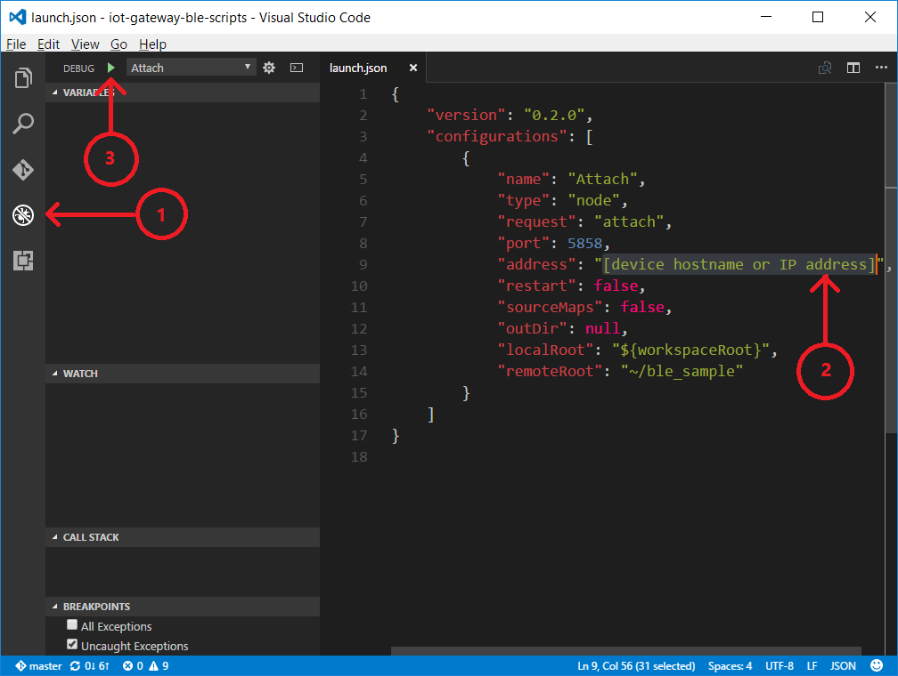
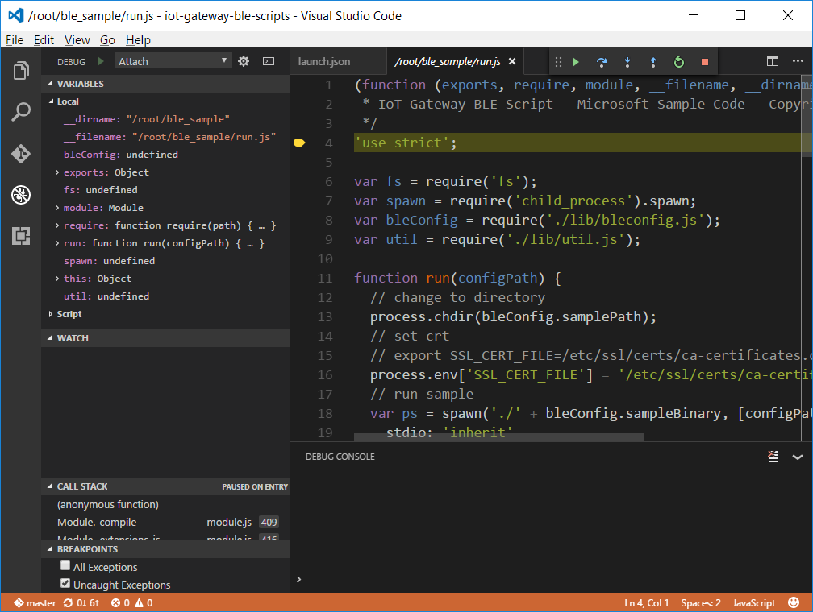

# Troubleshooting

## Hardware issues

### TI SensorTag cannot be connected

To troubleshoot SensorTag connectivity issues, use the [SensorTag app](http://processors.wiki.ti.com/index.php/SensorTag_User_Guide#SensorTag_App_user_guide).

### Have an issue with Intel NUC

To troubleshoot boot issues, refer to [troubleshooting No Boot Issues on Intel NUC](http://www.intel.com/content/www/us/en/support/boards-and-kits/000005845.html).

To troubleshoot operating system issues, refer to [troubleshooting Operating System Issues on Intel NUC](http://www.intel.com/content/www/us/en/support/boards-and-kits/000006018.html).

To troubleshoot other issues, refer to [Blink Codes and Beep Codes for Intel NUC](http://www.intel.com/content/www/us/en/support/boards-and-kits/intel-nuc-boards/000005854.html).

## Node.js package issues

### No response during gulp tasks

If you encounter problems in running gulp tasks, you can add the `--verbose` option for debugging. Try to terminate current gulp tasks by using `Ctrl + C`, and then run the following command in your console window to see debug messages. You might see detailed error messages in your console output.

```bash
gulp --verbose
```

### Device discovery issues

For help in troubleshooting common problems with the `discover-sensortag` command, check the [wiki page](https://wiki.archlinux.org/index.php/bluetooth#Bluetoothctl).

### npm issues

Try to update your npm package by running the following command:

```bash
npm install -g npm
```

If the problem still exists, leave your comments at the end of this article or create a GitHub issue in our [sample repository](https://github.com/azure-samples/iot-hub-c-intel-nuc-gateway-getting-started).

## Remote Debugging
> Below instructions are meant for debugging node.js scripts used in this tutorial.
### Run the sample application in debug mode

Run the sample application in debug mode by running the following command:

```bash
gulp run --debug
```

When the debug engine is ready, you should see `Debugger listening on port 5858` in the console output.

### Configure Visual Studio Code to connect to the remote device

1. Open the **Debug** panel on the left side.
2. Click the green **Start Debugging** (F5) button. Visual Studio Code opens a `launch.json` file.
3. Update the `launch.json` file with the following content. Replace `[device hostname or IP address]` with the actual device IP address or host name.

   ``` json
   {
     "version": "0.2.0",
     "configurations": [
        {
            "name": "Attach",
            "type": "node",
            "request": "attach",
            "port": 5858,
            "address": "[device hostname or IP address]",
            "restart": false,
            "sourceMaps": false,
            "outDir": null,
            "localRoot": "${workspaceRoot}",
            "remoteRoot": "~/ble_sample"
        }
     ]
   }
   ```



### Attach to the remote application

Click the green **Start Debugging** (F5) button to start debugging.

Read [JavaScript in VS Code](https://code.visualstudio.com/docs/languages/javascript#_debugging) to learn more about the debugger.



## Azure CLI issues

The Azure command-line interface (Azure CLI) is a preview build. To seek solutions, you can use the [Preview Install Guide](https://github.com/Azure/azure-cli/blob/master/doc/preview_install_guide.md).

If you encounter any bugs with the tool, file an [issue](https://github.com/Azure/azure-cli/issues) in the **Issues** section of the GitHub repo.

For help in troubleshooting common problems, check the [readme](https://github.com/Azure/azure-cli/blob/master/README.rst).

If you meet "Could not find a version that satisfies the requirement", please run the following command to upgrade pip to lastest version.

```bash
python -m pip install --upgrade pip
```

## Python installation issues

### Legacy installation issues (macOS)

When you're installing pip, a permission error is thrown when older packages are installed with **su** permissions. This situation occurs because a previous installation of Python using brew (macOS) is not uninstalled completely. Some pip packages from a previous installation were created by root, which causes the permission error. The solution is to remove those packages installed by root. Use the following steps to complete this task:

1. Go to `/usr/local/lib/python2.7/site-packages`
2. List packages created by root: `ls -l | grep root`
3. Uninstall packages from step 2: `sudo rm -rf {package name}`
4. Reinstall Python.

## Azure IoT Hub issues

If you've successfully provisioned your Azure IoT hub with the Azure CLI, and you need a tool to manage the devices that are connecting to your IoT hub, try the following tools.

### Device Explorer

[Device Explorer](https://github.com/Azure/azure-iot-sdk-csharp/blob/master/tools/DeviceExplorer) runs on your Windows local machine and connects to your IoT hub in Azure. It communicates with the following [IoT Hub endpoints](./iot-hub-devguide.md):

- Device identity management to provision and manage devices registered with your IoT hub.
- Receive device-to-cloud so you can monitor messages sent from your device to your IoT hub.
- Send cloud-to-device so you can send messages to your devices from your IoT hub.

Configure your IoT hub connection string within this tool to use all its capabilities.

### iothub-explorer

[iothub-explorer](https://github.com/Azure/iothub-explorer) is a sample multiplatform CLI tool to manage device clients. You can use the tool to manage the devices in the identity registry, monitor device-to-cloud messages, and send cloud-to-device commands.

To install the latest (prerelease) version of the iothub-explorer tool, run the following command:

```bash
npm install -g iothub-explorer@latest
```

To get additional help about all the iothub-explorer commands and their parameters, run the following command:

```bash
iothub-explorer help
```

### The Azure portal

A full CLI experience helps you create and manage all your Azure resources. You might also want to use the [Azure portal](../azure-portal-overview.md) to help provision, manage, and debug your Azure resources.

## Azure Storage issues

[Microsoft Azure Storage Explorer (preview)](http://storageexplorer.com/) is a standalone app from Microsoft that you can use to work with Azure Storage data on Windows, macOS, and Linux. By using this tool, you can connect to your table and see the data in it. You can use this tool to troubleshoot your Azure Storage issues.