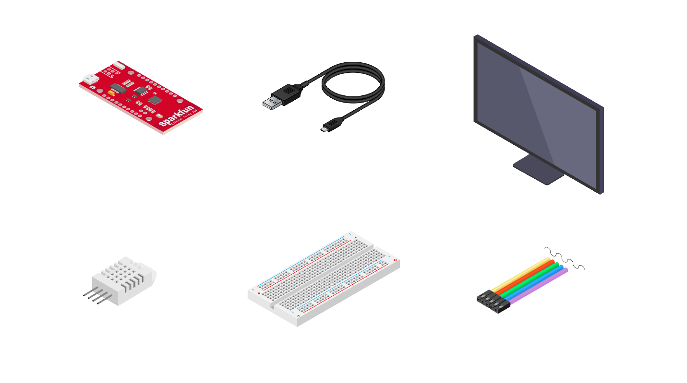
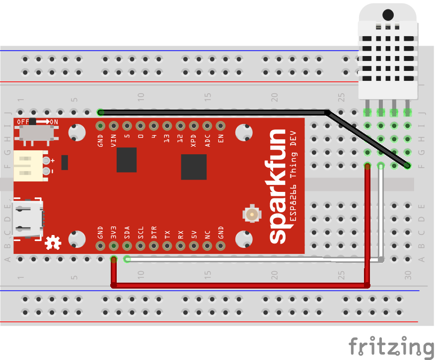
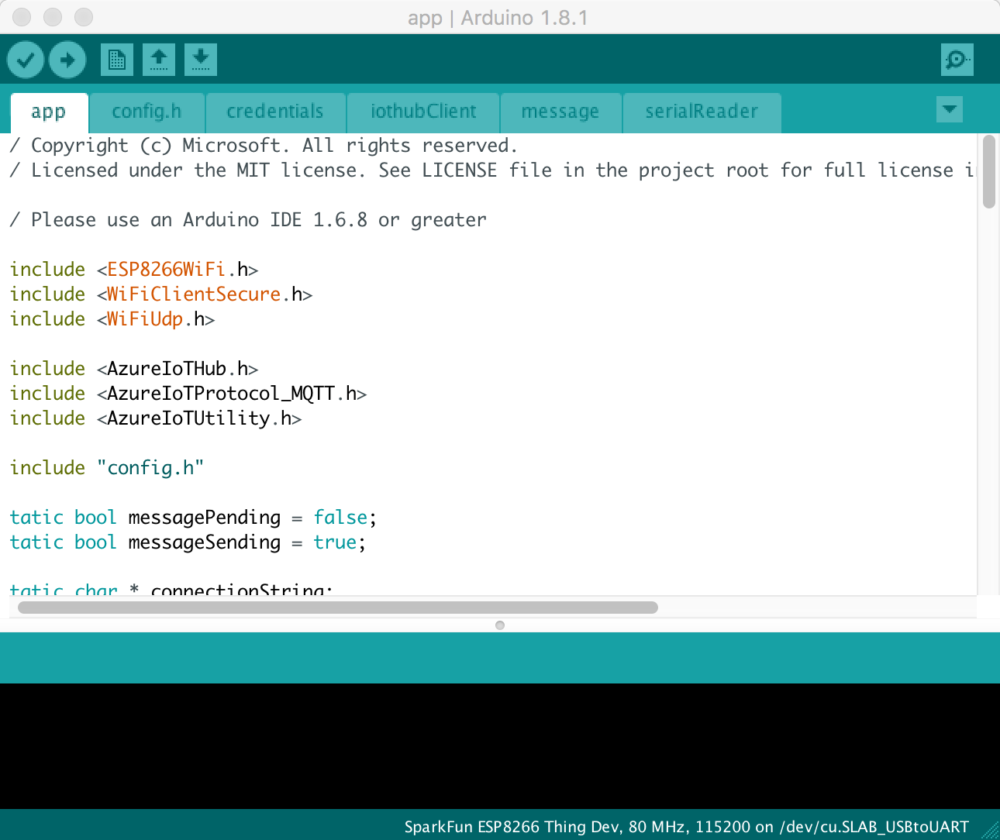
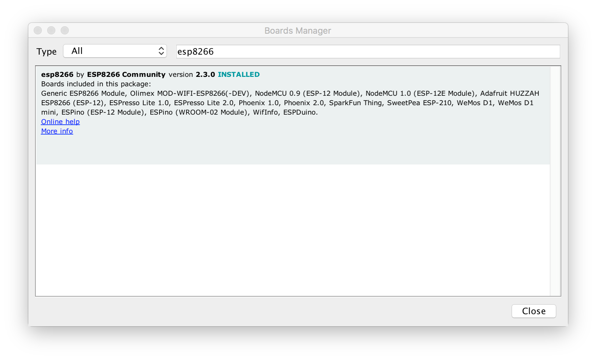
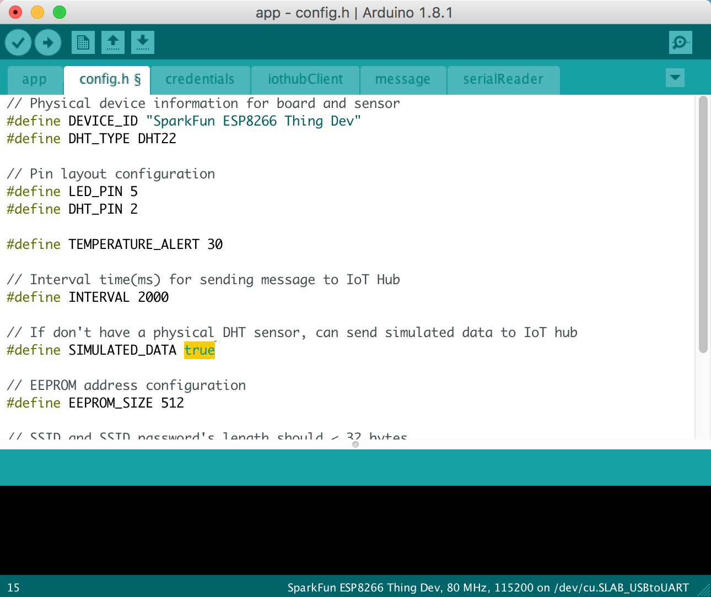

# Connect Sparkfun ESP8266 Thing Dev to Azure IoT Hub in the cloud

[!INCLUDE [iot-hub-get-started-device-selector](../../includes/iot-hub-get-started-device-selector.md)]


## What you will do

Connect Sparkfun ESP8266 Thing Dev to an IoT hub you will create. Then run a sample application on ESP8266 to collect temperature and humidity data from a DHT22 sensor. Finally, send the sensor data to your IoT hub.

> [!NOTE]
> If you are using other ESP8266 boards, you can still follow these steps to connect it to your IoT hub. Depending on the ESP8266 board you are using, you may need to reconfigure the `LED_PIN`. For example, if you are using ESP8266 from AI-Thinker, you may change it from `0` to `2`. 

## What you will learn

* How to create an IoT hub and register a device for Thing Dev.
* How to connect Thing Dev with the sensor and your computer.
* How to collect sensor data by running a sample application on Thing Dev.
* How to send the sensor data to your IoT hub.

## What you will need



To complete this operation, you need the following parts from your Thing Dev Starter Kit:

* The Sparkfun ESP8266 Thing Dev board.
* A Micro USB to Type A USB cable.

You also need the following for your development environment:

* Mac or PC that is running Windows or Ubuntu.
* Wireless network for Sparkfun ESP8266 Thing Dev to connect to.
* Internet connection to download the configuration tool.
* [Arduino IDE](https://www.arduino.cc/en/main/software) version 1.6.8 (or newer), earlier versions will not work with the AzureIoT library.

The following items are optional in case you don’t have a sensor. You also have the option of using simulated sensor data.

* An Adafruit DHT22 temperature and humidity sensor.
* A breadboard.
* M/M jumper wires.

[!INCLUDE [iot-hub-get-started-create-hub-and-device](../../includes/iot-hub-get-started-create-hub-and-device.md)]

## Connect ESP8266 Thing Dev with the sensor and your computer

### Connect a DHT22 temperature and humidity sensor to ESP8266 Thing Dev

Use the breadboard and jumper wires to make the connection as follows. If you don’t have a sensor, skip this section because you can use simulated sensor data instead.



For sensor pins, we will use the following wiring:

| Start (Sensor)           | End (Board)           | Cable Color   |
| -----------------------  | ---------------------- | ------------: |
| VDD (Pin 27F)            | 3V (Pin 8A)           | Red cable     |
| DATA (Pin 28F)           | GPIO 2 (Pin 9A)       | White cable    |
| GND (Pin 30F)            | GND (Pin 7J)          | Black cable   |


- For more information, see: [DHT22 sensor setup](http://cdn.sparkfun.com/datasheets/Sensors/Weather/RHT03.pdf) and [Sparkfun ESP8266 Thing Dev specification](https://www.sparkfun.com/products/13711)

Now your Sparkfun ESP8266 Thing Dev should be connected with a working sensor.


### Connect Sparkfun ESP8266 Thing Dev to your computer

Use the Micro USB to Type A USB cable to connect Sparkfun ESP8266 Thing Dev to your computer as follows.


### Add serial port permissions – Ubuntu only

If you use Ubuntu, make sure a normal user has the permissions to operate on the USB port of Sparkfun ESP8266 Thing Dev. To add serial port permissions for a normal user, follow these steps:

1. Run the following commands at a terminal:

   ```bash
   ls -l /dev/ttyUSB*
   ls -l /dev/ttyACM*
   ```

   You get one of the following outputs:

   * crw-rw---- 1 root uucp xxxxxxxx
   * crw-rw---- 1 root dialout xxxxxxxx

   In the output, notice `uucp` or `dialout` that is the group owner name of the USB port.

1. Add the user to the group by running the following command:

   ```bash
   sudo usermod -a -G <group-owner-name> <username>
   ```

   `<group-owner-name>` is the group owner name you obtained in the previous step. `<username>` is your Ubuntu user name.

1. Log out Ubuntu and log in it again for the change to take effect.

## Collect sensor data and send it to your IoT hub

In this section, you deploy and run a sample application on Sparkfun ESP8266 Thing Dev. The sample application blinks the LED on Sparkfun ESP8266 Thing Dev and sends the temperature and humidity data collected from the DHT22 sensor to your IoT hub.

### Get the sample application from GitHub

The sample application is hosted on GitHub. Clone the sample repository that contains the sample application from GitHub. To clone the sample repository, follow these steps:

1. Open a command prompt or a terminal window.
1. Go to a folder where you want the sample application to be stored.
1. Run the following command:

   ```bash
   git clone https://github.com/Azure-Samples/iot-hub-SparkFun-ThingDev-client-app.git
   ```

Install the package for Sparkfun ESP8266 Thing Dev in Arduino IDE:

1. Open the folder where the sample application is stored.
1. Open the app.ino file in the app folder in Arduino IDE.

   

1. In the Arduino IDE, click **File** > **Preferences**.
1. In the **Preferences** dialog box, click the icon next to the **Additional Boards Manager URLs** text box.
1. In the pop-up window, enter the following URL, and then click **OK**.

   `http://arduino.esp8266.com/stable/package_esp8266com_index.json`

   

1. In the **Preference** dialog box, click **OK**.
1. Click **Tools** > **Board** > **Boards Manager**, and then search for esp8266.
   ESP8266 with a version of 2.2.0 or later should be installed.

   

1. Click **Tools** > **Board** > **Adafruit HUZZAH ESP8266**.

### Install necessary libraries

1. In the Arduino IDE, click **Sketch** > **Include Library** > **Manage Libraries**.
1. Search for the following library names one by one. For each of the library you find, click **Install**.
   * `AzureIoTHub`
   * `AzureIoTUtility`
   * `AzureIoTProtocol_MQTT`
   * `ArduinoJson`
   * `DHT sensor library`
   * `Adafruit Unified Sensor`

### Don’t have a real DHT22 sensor?

The sample application can simulate temperature and humidity data in case you don’t have a real DHT22 sensor. To enable the sample application to use simulated data, follow these steps:

1. Open the `config.h` file in the `app` folder.
1. Locate the following line of code and change the value from `false` to `true`:
   ```c
   define SIMULATED_DATA true
   ```
   
   
1. Save with `Control-s`.

### Deploy the sample application to Sparkfun ESP8266 Thing Dev

1. In the Arduino IDE, click **Tool** > **Port**, and then click the serial port for Sparkfun ESP8266 Thing Dev.
1. Click **Sketch** > **Upload** to build and deploy the sample application to Sparkfun ESP8266 Thing Dev.

### Enter your credentials

After the upload completes successfully, follow the steps to enter your credentials:

1. In the Arduino IDE, click **Tools** > **Serial Monitor**.
1. In the serial monitor window, notice the two drop-down lists on the bottom right corner.
1. Select **No line ending** for the left drop-down list.
1. Select **115200 baud** for the right drop-down list.
1. In the input box located at the top of the serial monitor window, enter the following information if you are asked to provide them, and then click **Send**.
   * Wi-Fi SSID
   * Wi-Fi password
   * Device connection string

> [!Note]
> The credential information is stored in the EEPROM of Sparkfun ESP8266 Thing Dev. If you click the reset button on the Sparkfun ESP8266 Thing Dev board, the sample application asks you if you want to erase the information. Enter `Y` to have the information erased and you are asked to provide the information again.

### Verify the sample application is running successfully

If you see the following output from the serial monitor window and the blinking LED on Sparkfun ESP8266 Thing Dev, the sample application is running successfully.


## Next steps

You have successfully connected a Sparkfun ESP8266 Thing Dev to your IoT hub and sent the captured sensor data to your IoT hub. 

[!INCLUDE [iot-hub-get-started-next-steps](../../includes/iot-hub-get-started-next-steps.md)]
