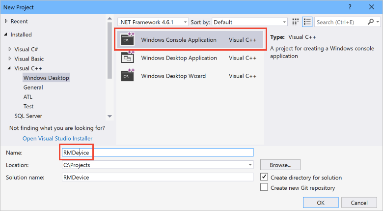
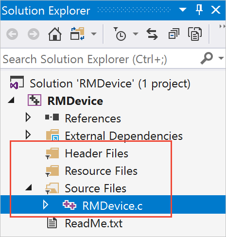
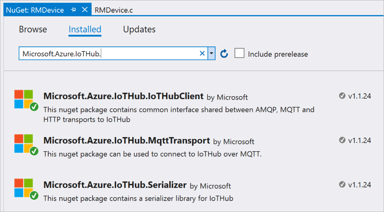
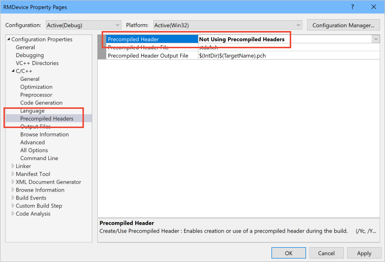
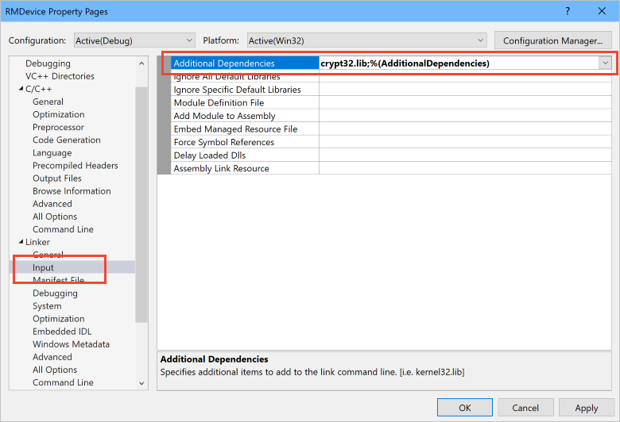
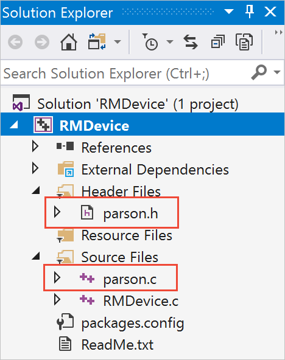

# Connect your device to the remote monitoring preconfigured solution (Windows)

[!INCLUDE [iot-suite-selector-connecting](../../includes/iot-suite-selector-connecting.md)]

This tutorial shows you how to connect a physical device to the remote monitoring preconfigured solution.

## Create a C client solution on Windows

As with most embedded applications that run on constrained devices, the client code for the device application is written in C. In this tutorial, you build the application on a machine running Windows.

### Create the starter project

Create a starter project in Visual Studio 2017 and add the IoT Hub device client NuGet packages:

1. In Visual Studio, create a C console application using the Visual C++ **Windows Console Application** template. Name the project **RMDevice**.

    

1. In **Solution Explorer**, delete the files `stdafx.h`, `targetver.h`, and `stdafx.cpp`.

1. In **Solution Explorer**, rename the file `RMDevice.cpp` to `RMDevice.c`.

    

1. In **Solution Explorer**, right-click the **RMDevice** project and then click **Manage NuGet packages**. Choose **Browse**, then search for and install the following NuGet packages:

    * Microsoft.Azure.IoTHub.Serializer
    * Microsoft.Azure.IoTHub.IoTHubClient
    * Microsoft.Azure.IoTHub.MqttTransport

    

1. In **Solution Explorer**, right-click on the **RMDevice** project and then choose **Properties** to open the project's **Property Pages** dialog box. For details, see [Setting Visual C++ Project Properties](https://docs.microsoft.com/cpp/ide/working-with-project-properties).

1. Choose the **C/C++** folder, then choose the **Precompiled Headers** property page.

1. Set **Precompiled Header** to **Not Using Precompiled Headers**. Then choose **Apply**.

    

1. Choose the **Linker** folder, then choose the **Input** property page.

1. Add `crypt32.lib` to the **Additional Dependencies** property. To save the project property values, choose **OK** and then **OK** again.

    

### Add the Parson JSON library

Add the Parson JSON library to the **RMDevice** project and add the required `#include` statements:

1. In a suitable folder on your computer, clone the Parson GitHub repository using the following command:

    ```cmd
    git clone https://github.com/kgabis/parson.git
    ```

1. Copy the `parson.h` and `parson.c` files from the local copy of the Parson repository to your **RMDevice** project folder.

1. In Visual Studio, right-click the **RMDevice** project, choose **Add**, and then choose **Existing Item**.

1. In the **Add Existing Item** dialog, select the `parson.h` and `parson.c` files in the **RMDevice** project folder. To add these two files to your project, choose **Add**.

    

1. In Visual Studio, open the `RMDevice.c` file. Replace the existing `#include` statements with the following code:

    ```c
    #include "iothubtransportmqtt.h"
    #include "schemalib.h"
    #include "iothub_client.h"
    #include "serializer_devicetwin.h"
    #include "schemaserializer.h"
    #include "azure_c_shared_utility/threadapi.h"
    #include "azure_c_shared_utility/platform.h"
    #include "parson.h"
    ```

    > [!NOTE]
    > Now you can verify that your project has the correct dependencies set up by building the solution.

[!INCLUDE [iot-suite-connecting-code](../../includes/iot-suite-connecting-code.md)]

## Build and run the sample

Add code to invoke the **remote\_monitoring\_run** function, then build and run the device application:

1. To invoke the **remote\_monitoring\_run** function, replace the **main** function with following code:

    ```c
    int main()
    {
      remote_monitoring_run();
      return 0;
    }
    ```

1. Choose **Build** and then **Build Solution** to build the device application. Ignore the warning about the **gmtime** function.

1. In **Solution Explorer**, right-click the **RMDevice** project, choose **Debug**, and then choose **Start new instance** to run the sample. The console displays messages as:

    * The application sends sample telemetry to the preconfigured solution.
    * Receives desired property values set in the solution dashboard.
    * Responds to methods invoked from the solution dashboard.

[!INCLUDE [iot-suite-visualize-connecting](../../includes/iot-suite-visualize-connecting.md)]
