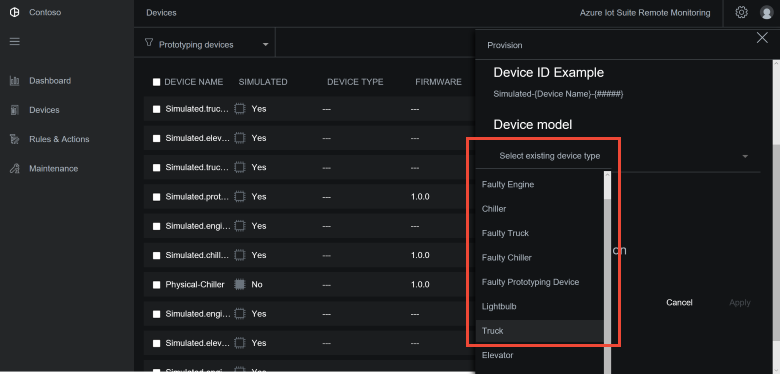
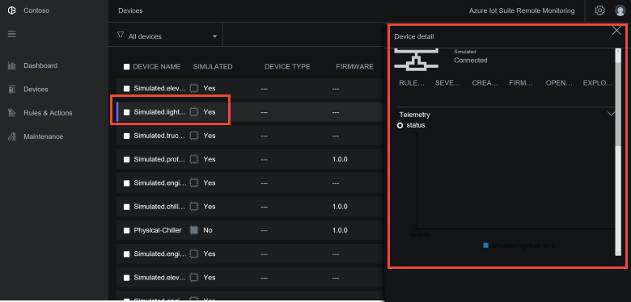
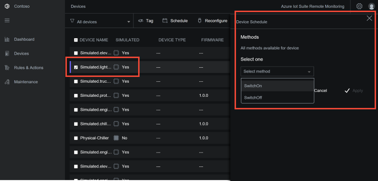
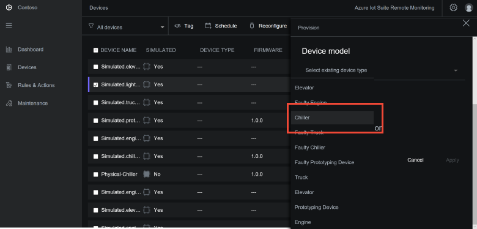

# Test your solution with simulated devices

This tutorial shows you how to customize the device simulator microservice in the remote monitoring preconfigured solution. To show the capabilities of the device simulator, this tutorial uses two scenarios in the Contoso IoT application.

In the first scenario, Contoso wants to test a new smart lightbulb device. To perform the tests, you create a new simulated device with the following characteristics:

*Properties*

| Name                     | Values                      |
| ------------------------ | --------------------------- |
| Color                    | White, Red, Blue            |
| Brightness               | 0 to 100                    |
| Estimated remaining life | Countdown from 10,000 hours |

*Telemetry*

The following table shows the data the lightbulb reports to the cloud as a data stream:

| Name   | Values      |
| ------ | ----------- |
| Status | "on", "off" |
| online | true, false |

> [!NOTE]
> The **online** telemetry value is mandatory for all simulated types.

*Methods*

The following table shows the actions the new device supports:

| Name        |
| ----------- |
| Switch on   |
| Switch off  |

*Initial state*

The following table shows the initial status of the device:

| Name                     | Values |
| ------------------------ | -------|
| Initial color            | White  |
| Initial brightness       | 75     |
| Initial remaining life   | 10,000 |
| Initial telemetry status | "on"   |

In the second scenario, you add a new telemetry type to Contoso's existing **Chiller** device.

This tutorial shows you how to use the device simulator with the remote monitoring preconfigured solution:

In this tutorial, you learn how to:

>[!div class="checklist"]
> * Create a new device type
> * Simulate custom device behavior
> * Add a new device type to the dashboard
> * Send custom telemetry from an existing device type

## Prerequisites

To follow this tutorial, you need a deployed instance of the remote monitoring solution in your Azure subscription.

If you haven't deployed the remote monitoring solution yet, you should complete the [Deploy the remote monitoring preconfigured solution](iot-suite-remote-monitoring-deploy.md) tutorial.

<!-- Dominic please this use as your reference https://github.com/Azure/device-simulation-dotnet/wiki/Device-Models -->

## The device simulation service

The device simulation service in the preconfigured solution enables you to make changes to the built-in simulated device types and create new simulated device types. You can use custom device types to test the behavior of the remote monitoring solution before you connect your physical devices to the solution.

## Create a simulated device type

The easiest way to create a new device type in the simulation microservice is to copy and modify an existing type. The following steps show you how to copy the built-in **Chiller** device to create a new **Lightbulb** device:

1. Use the following command to clone the **device-simulation** GitHub repository to your local machine:

    ```cmd/sh
    git clone https://github.com/Azure/device-simulation-dotnet.git
    ```

1. Each device type has a JSON model file and associated scripts in the `Services/data/devicemodels` folder. Copy the **Chiller** files to create the **Lightbulb** files as shown in the following table:

    | Source                      | Destination                   |
    | --------------------------- | ----------------------------- |
    | chiller-01.json             | lightbulb-01.json             |
    | scripts/chiller-01-state.js | scripts/lightbulb-01-state.js |
    | scripts/reboot-method.js    | scripts/SwitchOn-method.js    |

### Define the characteristics of the new device type

The `lightbulb-01.json` file defines the characteristics of the type, such as the telemetry it generates and the methods it supports. The following steps update the `lightbulb-01.json` file to define the **Lightbulb** device:

1. In the `lightbulb-01.json` file, update the device metadata as shown in the following snippet:

    ```json
    "SchemaVersion": "1.0.0",
    "Id": "lightbulb-01",
    "Version": "0.0.1",
    "Name": "Lightbulb",
    "Description": "Smart lightbulb device.",
    "Protocol": "MQTT",
    ```

1. In the `lightbulb-01.json` file, update the simulation definition as shown in the following snippet:

    ```json
    "Simulation": {
      "InitialState": {
        "online": true,
        "status": "on"
      },
      "Script": {
        "Type": "javascript",
        "Path": "lightbulb-01-state.js",
        "Interval": "00:00:20"
      }
    },
    ```

1. In the `lightbulb-01.json` file, update the device type properties as shown in the following snippet:

    ```json
    "Properties": {
      "Type": "Lightbulb",
      "Color": "White",
      "Brightness": 75,
      "EstimatedRemainingLife": 10000
    },
    ```

1. In the `lightbulb-01.json` file, update the device type telemetry definitions as shown in the following snippet:

    ```json
    "Telemetry": [
      {
        "Interval": "00:00:20",
        "MessageTemplate": "{\"status\":\"${status}\"}",
        "MessageSchema": {
          "Name": "lightbulb-status;v1",
          "Format": "JSON",
          "Fields": {
            "status": "text"
          }
        }
      }
    ],
    ```

1. In the `lightbulb-01.json` file, update the device type methods as shown in the following snippet:

    ```json
    "CloudToDeviceMethods": {
      "SwitchOn": {
        "Type": "javascript",
        "Path": "SwitchOn-method.js"
      },
      "SwitchOff": {
        "Type": "javascript",
        "Path": "SwitchOff-method.js"
      }
    }
    ```

1. Save the `lightbulb-01.json` file.

### Simulate custom device behavior

The `scripts/lightbulb-01-state.js` file defines the simulation behavior of the **Lightbulb** type. The following steps update the `scripts/lightbulb-01-state.js` file to define the behavior of the **Lightbulb** device:

1. Edit the state definition in the `scripts/lightbulb-01-state.js` file as shown in the following snippet:

    ```js
    // Default state
    var state = {
      online: true,
      status: "on"
    };
    ```

1. Replace the **vary** function with the following **flip** function:

    ```js
    /**
    * Simple formula that sometimes flips the status of the lightbulb
    */
    function flip(value) {
      if (Math.random() < 0.2) {
        return (value == "on") ? "off" : "on"
      }
      return value;
    }
    ```

1. Edit the **main** function to implement the behavior as shown in the following snippet:

    ```js
    function main(context, previousState) {

      // Restore the global state before generating the new telemetry, so that
      // the telemetry can apply changes using the previous function state.
      restoreState(previousState);

      // Make this flip every so often
      state.status = flip(state.status);

      return state;
    }
    ```

1. Save the `scripts/lightbulb-01-state.js` file.

The `scripts/SwitchOn-method.js` file implements the **Switch On** method in a **Lightbulb** device. The following steps update the `scripts/SwitchOn-method.js` file:

1. Edit the state definition in the `scripts/SwitchOn-method.js` file as shown in the following snippet:

    ```js
    var state = {
       status: "on"
    };
    ```

1. To switch the lightbulb on, edit the **main** function as follows:

    ```js
    function main(context, previousState) {
        log("Executing lightbulb Switch On method.");
        state.status = "on";
        updateState(state);
    }
    ```

1. Save the `scripts/SwitchOn-method.js` file.

1. Make a copy the `scripts/SwitchOn-method.js` file called `scripts/SwitchOff-method.js`.

1. To switch the lightbulb off, edit the **main** function in the `scripts/SwitchOff-method.js` file as follows:

    ```js
    function main(context, previousState) {
        log("Executing lightbulb Switch Off method.");
        state.status = "off";
        updateState(state);
    }
    ```

1. Save the `scripts/SwitchOff-method.js` file.

### Test the Lightbulb device type

To test the **Lightbulb** device type, you can first test your device type behaves as expected by running a local copy of the **device-simulation** service. When you have tested and debugged your new device type locally, you can rebuild the container and redeploy the **device-simulation** service to Azure.

To test and debug your changes locally, see [Device simulation overview](https://github.com/Azure/device-simulation-dotnet/blob/master/README.md).

Configure the project to copy the new **Lightbulb** device files to the output directory:

* If you are using Visual Studio, make sure you add the four new lightbulb files you created in the previous section to the **Services** project in the solution. Then use **Solution explorer** to mark them to be copied to the output directory.

* If you are using Visual Studio Code, open the **Services.csproj** file and add the four new lightbulb files you created in the previous section. See the existing device model file entries in the **Services.csproj** file as examples.

To test the new device in a deployed solution, see one of:

* [Deploying containers from custom docker-hub account](https://github.com/Azure/azure-iot-pcs-remote-monitoring-dotnet/wiki/Developer-Reference-Guide#deploying-containers-from-custom-docker-hub-account)
* [Update a deployed container via manual copy](https://github.com/Azure/azure-iot-pcs-remote-monitoring-dotnet/wiki/Developer-Reference-Guide#update-a-deployed-container-via-manual-copy)

On the **Devices** page, you can provision instances of your new type:



You can view the telemetry from the simulated device:



You can call the **SwitchOn** and **SwitchOff** methods on your device:



To build a Docker image with the new device type for deployment to Azure, see [Building a customized Docker image](https://github.com/Azure/device-simulation-dotnet/blob/master/README.md#building-a-customized-docker-image).

## Add a new telemetry type

This section describes how to modify an existing simulated device type to support a new telemetry type.

### Locate the Chiller device type files

The following steps show you how to find the files that define the built-in **Chiller** device:

1. If you have not already done so, use the following command to clone the **device-simulation** GitHub repository to your local machine:

    ```cmd/sh
    git clone https://github.com/Azure/azure-iot-pcs-remote-monitoring-dotnet.git
    ```

1. Each device type has a JSON model file and associated scripts in the `data/devicemodels` folder. The files that define the simulated **Chiller** device type are:
    * `data/devicemodels/chiller-01.json`
    * `data/devicemodels/scripts/chiller-01-state.js`

### Specify the new telemetry type

The following steps show you how to add a new **Internal Temperature** type to the **Chiller** device type:

1. Open the `chiller-01.json` file.

1. Update the **SchemaVersion** value as follows:

    ```json
    "SchemaVersion": "1.1.0",
    ```

1. In the **InitialState** section, add the follwing two definitions:

    ```json
    "internal_temperature": 65.0,
    "internal_temperature_unit": "F",
    ```

1. In the **Telemetry** array, add the following definition:

    ```json
    {
      "Interval": "00:00:05",
      "MessageTemplate": "{\"internal_temperature\":${internal_temperature},\"internal_temperature_unit\":\"${internal_temperature_unit}\"}",
      "MessageSchema": {
        "Name": "chiller-internal-temperature;v1",
        "Format": "JSON",
        "Fields": {
          "temperature": "double",
          "temperature_unit": "text"
        }
      }
    },
    ```

1. Save the `chiller-01.json` file.

1. Open the `scripts/chiller-01-state.js` file.

1. Add the following fields to the **state** variable:

    ```js
    internal_temperature: 65.0,
    internal_temperature_unit: "F",
    ```

1. Add the following line to the **main** function:

    ```js
    state.internal_temperature = vary(65, 2, 15, 125);
    ```

1. Save the `scripts/chiller-01-state.js` file.

### Test the Chiller device type

To test the updated **Chiller** device type, you can first test your device type behaves as expected by running a local copy of the **device-simulation** service. When you have tested and debugged your updated device type locally, you can rebuild the container and redeploy the **device-simulation** service to Azure.

When you run the **device-simulation** service locally, it sends telemetry to your remote monitoring solution. On the **Devices** page, you can provision instances of your updated type.

To test and debug your changes locally, see [Running the service with Visual Studio](https://github.com/Azure/device-simulation-dotnet/blob/master/README.md#running-the-service-with-visual-studio) or [Build and Run from the command line](https://github.com/Azure/device-simulation-dotnet/blob/master/README.md#build-and-run-from-the-command-line).

To test the new device in a deployed solution, see one of:

* [Deploying containers from custom docker-hub account](https://github.com/Azure/azure-iot-pcs-remote-monitoring-dotnet/wiki/Developer-Reference-Guide#deploying-containers-from-custom-docker-hub-account)
* [Update a deployed container via manual copy](https://github.com/Azure/azure-iot-pcs-remote-monitoring-dotnet/wiki/Developer-Reference-Guide#update-a-deployed-container-via-manual-copy)

On the **Devices** page, you can provision instances of your updated type:



You can view the new **Internal temperature** telemetry from the simulated device.

To build a Docker image with the new device type for deployment to Azure, see [Building a customized Docker image](https://github.com/Azure/device-simulation-dotnet/blob/master/README.md#building-a-customized-docker-image).

## Next steps

This tutorial, showed you how to:

<!-- Repeat task list from intro -->
>[!div class="checklist"]
> * Create a new device type
> * Simulate custom device behavior
> * Add a new device type to the dashboard
> * Send custom telemetry from an existing device type

Now you have learned how to use the device simulation service, the suggested next step is to learn how to [connect a physical device to your remote monitoring solution](iot-suite-connecting-devices-node.md).

For more developer information about the remote monitoring solution, see:

* [Developer Reference Guide](https://github.com/Azure/azure-iot-pcs-remote-monitoring-dotnet/wiki/Developer-Reference-Guide)
* [Developer Troubleshooting Guide](https://github.com/Azure/azure-iot-pcs-remote-monitoring-dotnet/wiki/Developer-Troubleshooting-Guide)

<!-- Next tutorials in the sequence -->