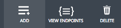
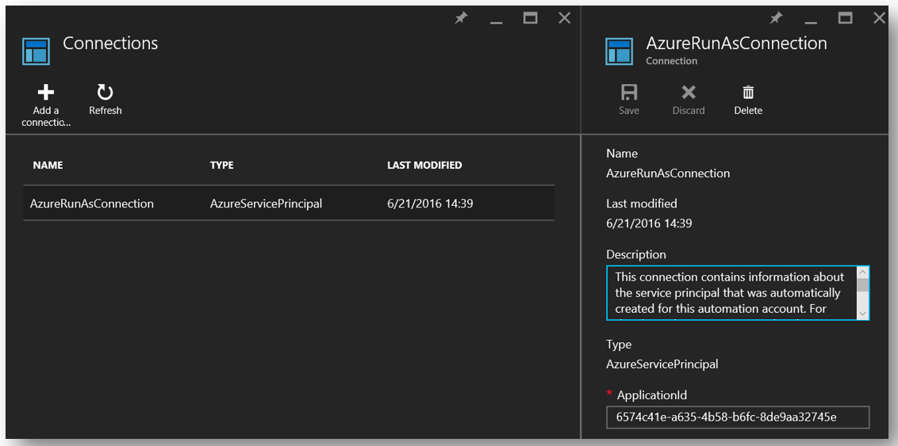

# Set up Azure Key Vault with end-to-end key rotation and auditing
## Introduction
After creating your key vault, you will be able to start using that vault to store your keys and secrets. Your applications no longer need to persist your keys or secrets, but rather will request them from the key vault as needed. This allows you to update keys and secrets without affecting the behavior of your application, which opens up a breadth of possibilities around your key and secret management.

This article walks through an example of using Azure Key Vault to store a secret, in this case an Azure Storage Account key that is accessed by an application. It also demonstrates implementation of a scheduled rotation of that storage account key. Finally, it walks through a demonstration of how to monitor the key vault audit logs and raise alerts when unexpected requests are made.

> [!NOTE]
> This tutorial is not intended to explain in detail the initial setup of your key vault. For this information, see [Get started with Azure Key Vault](key-vault-get-started.md). For Cross-Platform Command-Line Interface instructions, see [Manage Key Vault using CLI](key-vault-manage-with-cli.md).
>
>

## Set up Key Vault
To enable an application to retrieve a secret from Key Vault, you must first create the secret and upload it to your vault. This can be accomplished by starting an Azure PowerShell session and signing in to your Azure account with the following command:

```powershell
Login-AzureRmAccount -EnvironmentName AzureChinaCloud
```

In the pop-up browser window, enter your Azure account user name and password. PowerShell will get all the subscriptions that are associated with this account. PowerShell uses the first one by default.

If you have multiple subscriptions, you might have to specify the one that was used to create your key vault. Enter the following to see the subscriptions for your account:

```powershell
Get-AzureRmSubscription
```

To specify the subscription that's associated with the key vault you will be logging, enter:

```powershell
Set-AzureRmContext -SubscriptionId <subscriptionID>
```

Because this article demonstrates storing a storage account key as a secret, you must get that storage account key.

```powershell
Get-AzureRmStorageAccountKey -ResourceGroupName <resourceGroupName> -Name <storageAccountName>
```

After retrieving your secret (in this case, your storage account key), you must convert that to a secure string and then create a secret with that value in your key vault.

```powershell
$secretvalue = ConvertTo-SecureString <storageAccountKey> -AsPlainText -Force

Set-AzureKeyVaultSecret -VaultName <vaultName> -Name <secretName> -SecretValue $secretvalue
```
Next, get the URI for the secret you created. This is used in a later step when you call the key vault to retrieve your secret. Run the following PowerShell command and make note of the ID value, which is the secret URI:

```powershell
Get-AzureKeyVaultSecret -VaultName <vaultName>
```

## Set up the application
Now that you have a secret stored, you can use code to retrieve and use it. There are a few steps required to achieve this. The first and most important step is registering your application with Azure Active Directory and then telling Key Vault your application information so that it can allow requests from your application.

> [!NOTE]
> Your application must be created on the same Azure Active Directory tenant as your key vault.
>
>

Open the applications tab of Azure Active Directory.


Choose **ADD** to add an application to your Azure Active Directory.



Leave the application type as **WEB APPLICATION AND/OR WEB API** and give your application a name.


Give your application a **SIGN-ON URL** and an **APP ID URI**. These can be anything you want for this demo, and they can be changed later if needed.


After the application is added to Azure Active Directory, you will be brought into the application page. Click the **Configure** tab and then find and copy the **Client ID** value. Make note of the client ID for later steps.

Next, generate a key for your application so it can interact with your Azure Active Directory. You can create this under the **Keys** section in the **Configuration** tab. Make note of the newly generated key from your Azure Active Directory application for use in a later step.


Before establishing any calls from your application into the key vault, you must tell the key vault about your application and its permissions. The following command takes the vault name and the client ID from your Azure Active Directory app and grants
**Get** access to your key vault for the application.

```powershell
Set-AzureRmKeyVaultAccessPolicy -VaultName <vaultName> -ServicePrincipalName <clientIDfromAzureAD> -PermissionsToSecrets Get
```

At this point, you are ready to start building your application calls. In your application, you must install the NuGet packages required to interact with Azure Key Vault and Azure Active Directory. From the Visual Studio Package Manager console, enter the following commands. At the writing of this article, the current version of the Azure Active Directory package is 3.10.305231913, so you might want to confirm the latest version and update accordingly.

```powershell
Install-Package Microsoft.IdentityModel.Clients.ActiveDirectory -Version 3.10.305231913

Install-Package Microsoft.Azure.KeyVault
```

In your application code, create a class to hold the method for your Azure Active Directory authentication. In this example, that class is called **Utils**. Add the following using statement:

```csharp
using Microsoft.IdentityModel.Clients.ActiveDirectory;
```

Next, add the following method to retrieve the JWT token from Azure Active Directory. For maintainability, you may want to move the hard-coded string values into your web or application configuration.

```csharp
public async static Task<string> GetToken(string authority, string resource, string scope)
{
    var authContext = new AuthenticationContext(authority);

    ClientCredential clientCred = new ClientCredential("<AzureADApplicationClientID>","<AzureADApplicationClientKey>");

    AuthenticationResult result = await authContext.AcquireTokenAsync(resource, clientCred);

    if (result == null)

    throw new InvalidOperationException("Failed to obtain the JWT token");

    return result.AccessToken;
}
```

Add the necessary code to call Key Vault and retrieve your secret value. First you must add the following using statement:

```csharp
using Microsoft.Azure.KeyVault;
```

Add the method calls to invoke Key Vault and retrieve your secret. In this method, you provide the secret URI that you saved in a previous step. Note the use of the **GetToken** method from the **Utils** class created previously.

```csharp
var kv = new KeyVaultClient(new KeyVaultClient.AuthenticationCallback(Utils.GetToken));

var sec = kv.GetSecretAsync(<SecretID>).Result.Value;
```

When you run your application, you should now be authenticating to Azure Active Directory and then retrieving your secret value from Azure Key Vault.

## Key rotation using Azure Automation
There are various options for implementing a rotation strategy for values you store as Azure Key Vault secrets. Secrets can be rotated as part of a manual process, they may be rotated programmatically by using API calls, or they may be rotated by way of an Automation script. For the purposes of this article, you will be using Azure PowerShell combined with Azure Automation to change an Azure Storage Account access key. You will then update a key vault secret with that new key.

To allow Azure Automation to set secret values in your key vault, you must get the client ID for the connection named AzureRunAsConnection, which was created when you established your Azure Automation instance. You can find this ID by choosing **Assets** from your Azure Automation instance. From there, you choose **Connections** and then select the **AzureRunAsConnection** service principle. Take note of the **Application ID**.



In **Assets**, choose **Modules**. From **Modules**, select **Gallery**, and then search for and **Import** updated versions of each of the following modules:

    Azure
    Azure.Storage
    AzureRM.Profile
    AzureRM.KeyVault
    AzureRM.Automation
    AzureRM.Storage


> [!NOTE]
> At the writing of this article, only the previously noted modules needed to be updated for the following script. If you find that your automation job is failing, confirm that you have imported all necessary modules and their dependencies.
>
>

After you have retrieved the application ID for your Azure Automation connection, you must tell your key vault that this application has access to update secrets in your vault. This can be accomplished with the following PowerShell command:

```powershell
Set-AzureRmKeyVaultAccessPolicy -VaultName <vaultName> -ServicePrincipalName <applicationIDfromAzureAutomation> -PermissionsToSecrets Set
```

Next, select **Runbooks** under your Azure Automation instance, and then select **Add a Runbook**. Select **Quick Create**. Name your runbook and select **PowerShell** as the runbook type. You have the option to add a description. Finally, click **Create**.


Paste the following PowerShell script in the editor pane for your new runbook:

```powershell
$connectionName = "AzureRunAsConnection"
try
{
    # Get the connection "AzureRunAsConnection "
    $servicePrincipalConnection=Get-AutomationConnection -Name $connectionName         

    "Logging in to Azure..."
    Add-AzureRmAccount -EnvironmentName AzureChinaCloud `
        -ServicePrincipal `
        -TenantId $servicePrincipalConnection.TenantId `
        -ApplicationId $servicePrincipalConnection.ApplicationId `
        -CertificateThumbprint $servicePrincipalConnection.CertificateThumbprint
    "Login complete."
}
catch {
    if (!$servicePrincipalConnection)
    {
        $ErrorMessage = "Connection $connectionName not found."
        throw $ErrorMessage
    } else{
        Write-Error -Message $_.Exception
        throw $_.Exception
    }
}

#Optionally you may set the following as parameters
$StorageAccountName = <storageAccountName>
$RGName = <storageAccountResourceGroupName>
$VaultName = <keyVaultName>
$SecretName = <keyVaultSecretName>

#Key name. For example key1 or key2 for the storage account
New-AzureRmStorageAccountKey -ResourceGroupName $RGName -Name $StorageAccountName -KeyName "key2" -Verbose
$SAKeys = Get-AzureRmStorageAccountKey -ResourceGroupName $RGName -Name $StorageAccountName

$secretvalue = ConvertTo-SecureString $SAKeys[1].Value -AsPlainText -Force

$secret = Set-AzureKeyVaultSecret -VaultName $VaultName -Name $SecretName -SecretValue $secretvalue
```

From the editor pane, choose **Test pane** to test your script. Once the script is running without error, you can select **Publish**, and then you can apply a schedule for the runbook back in the runbook configuration pane.

