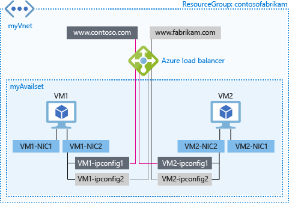

<properties
    pageTitle="Load balancing on multiple IP configurations in Azure| Azure"
    description="Load balancing across primary and secondary IP configurations."
    services="load-balancer"
    documentationcenter="na"
    author="anavinahar"
    manager="narayan"
    editor="na" />
<tags
    ms.assetid="244907cd-b275-4494-aaf7-dcfc4d93edfe"
    ms.service="load-balancer"
    ms.devlang="na"
    ms.topic="article"
    ms.tgt_pltfrm="na"
    ms.workload="infrastructure-services"
    ms.date="03/16/2017"s
    wacn.date=""
    ms.author="annahar" />

# Load balancing on multiple IP configurations using PowerShell
> [AZURE.SELECTOR]
- [Portal](/documentation/articles/load-balancer-multiple-ip/)
- [CLI](/documentation/articles/load-balancer-multiple-ip-cli/)
- [PowerShell](/documentation/articles/load-balancer-multiple-ip-powershell/)

This article describes how to use Azure Load Balancer with multiple IP addresses on a secondary network interface (NIC). The support for multiple IP addresses on a NIC is a feature that is in Preview release, at this time. For more information, see the [Limitations](#limitations) section of this article. The following scenario illustrates how this feature works with Load Balancer.

For this scenario, we have two VMs running Windows, each with a primary and a secondary NIC. Each of the secondary NICs have two IP configurations. Each VM hosts both websites contoso.com and fabrikam.com. Each website is bound to one of the IP configurations on the secondary NIC. We use Azure Load Balancer to expose two frontend IP addresses, one for each website, to distribute traffic to the respective IP configuration for the website. This scenario uses the same port number across both frontends, as well as both backend pool IP addresses.



##  <a name="limitations"></a> Limitations

At this time, configuration of load balancing on secondary IP configurations is only possible using Azure PowerShell and Azure CLI. This limitation is temporary, and may change at any time. Revisit this page to check for updates.

[AZURE.INCLUDE [virtual-network-preview](../../includes/virtual-network-preview.md)]

Register for the preview by running the following commands in PowerShell after you login and select the appropriate subscription:

    Register-AzureRmProviderFeature -FeatureName AllowMultipleIpConfigurationsPerNic -ProviderNamespace Microsoft.Network

    Register-AzureRmProviderFeature -FeatureName AllowLoadBalancingonSecondaryIpconfigs -ProviderNamespace Microsoft.Network

    Register-AzureRmResourceProvider -ProviderNamespace Microsoft.Network

Do not attempt to complete the remaining steps until you see the following output when you run the ```Get-AzureRmProviderFeature``` command:

    FeatureName                            ProviderName      RegistrationState
    -----------                            ------------      -----------------      
    AllowLoadBalancingOnSecondaryIpConfigs Microsoft.Network Registered       
    AllowMultipleIpConfigurationsPerNic    Microsoft.Network Registered       

>[AZURE.NOTE] 
>This may take a few minutes.

## Steps to load balance on multiple IP configurations

Follow the steps below to achieve the scenario outlined in this article:

1. Install Azure PowerShell. See [How to install and configure Azure PowerShell](https://docs.microsoft.com/powershell/azureps-cmdlets-docs) for information about installing the latest version of Azure PowerShell, selecting your subscription, and signing in to your account.
2. Create a resource group using the following settings:

        $location = "chinaeast".
        $myResourceGroup = "contosofabrikam"

    For more information, see Step 2 of [Create a Resource Group](/documentation/articles/virtual-machines-windows-ps-create/).

3. [Create an Availability Set](/documentation/articles/virtual-machines-windows-create-availability-set/) to contain your VMs. For this scenario, use the following command:

        New-AzureRmAvailabilitySet -ResourceGroupName "contosofabrikam" -Name "myAvailset" -Location "West China North"

4. Follow instructions steps 3 through 5 in [Create a Windows VM](/documentation/articles/virtual-machines-windows-ps-create/) article to prepare the creation of a VM with a single NIC. Execute step 6.1, and use the following instead of step 6.2:

        $availset = Get-AzureRmAvailabilitySet -ResourceGroupName "contosofabrikam" -Name "myAvailset"
        New-AzureRmVMConfig -VMName "VM1" -VMSize "Standard_DS1_v2" -AvailabilitySetId $availset.Id

    Then complete [Create a Windows VM](/documentation/articles/virtual-machines-windows-ps-create/) steps 6.3 through 6.8.

5. Add a second IP configuration to each of the VMs. Follow the instructions in [Assign multiple IP addresses to virtual machines](/documentation/articles/virtual-network-multiple-ip-addresses-powershell/#add) article. Use the following configuration settings:

        $NicName = "VM1-NIC2"
        $RgName = "contosofabrikam"
        $NicLocation = "West China North"
        $IPConfigName4 = "VM1-ipconfig2"
        $Subnet1 = Get-AzureRmVirtualNetworkSubnetConfig -Name "mySubnet" -VirtualNetwork $myVnet

    You do not need to associate the secondary IP configurations with public IPs for the purpose of this tutorial. Edit the command to remove the public IP association part.

6. Complete steps 4 through 6 of this article again for VM2. Be sure to replace the VM name to VM2 when doing this. Note that you do not need to create a virtual network for the second VM. You may or may not create a new subnet based on your use case.

7. Create two public IP addresses and store them in the appropriate variables as shown:

        $publicIP1 = New-AzureRmPublicIpAddress -Name PublicIp1 -ResourceGroupName contosofabrikam -Location 'West China North' -AllocationMethod Dynamic -DomainNameLabel contoso
        $publicIP2 = New-AzureRmPublicIpAddress -Name PublicIp2 -ResourceGroupName contosofabrikam -Location 'West China North' -AllocationMethod Dynamic -DomainNameLabel fabrikam

        $publicIP1 = Get-AzureRmPublicIpAddress -Name PublicIp1 -ResourceGroupName contosofabrikam
        $publicIP2 = Get-AzureRmPublicIpAddress -Name PublicIp2 -ResourceGroupName contosofabrikam

8. Create two frontend IP configurations:

        $frontendIP1 = New-AzureRmLoadBalancerFrontendIpConfig -Name contosofe -PublicIpAddress $publicIP1
        $frontendIP2 = New-AzureRmLoadBalancerFrontendIpConfig -Name fabrikamfe -PublicIpAddress $publicIP2

9. Create your backend address pools, a probe, and your load balancing rules:

        $beaddresspool1 = New-AzureRmLoadBalancerBackendAddressPoolConfig -Name contosopool
        $beaddresspool2 = New-AzureRmLoadBalancerBackendAddressPoolConfig -Name fabrikampool

        $healthProbe = New-AzureRmLoadBalancerProbeConfig -Name HTTP -RequestPath 'index.html' -Protocol http -Port 80 -IntervalInSeconds 15 -ProbeCount 2

        $lbrule1 = New-AzureRmLoadBalancerRuleConfig -Name HTTPc -FrontendIpConfiguration $frontendIP1 -BackendAddressPool $beaddresspool1 -Probe $healthprobe -Protocol Tcp -FrontendPort 80 -BackendPort 80
        $lbrule2 = New-AzureRmLoadBalancerRuleConfig -Name HTTPf -FrontendIpConfiguration $frontendIP2 -BackendAddressPool $beaddresspool2 -Probe $healthprobe -Protocol Tcp -FrontendPort 80 -BackendPort 80

10. Once you have these resources created, create your load balancer:

        $mylb = New-AzureRmLoadBalancer -ResourceGroupName contosofabrikam -Name mylb -Location 'West China North' -FrontendIpConfiguration $frontendIP1 -LoadBalancingRule $lbrule -BackendAddressPool $beAddressPool -Probe $healthProbe

11. Add the second backend address pool and frontend IP configuration to your newly created load balancer:

        $mylb = Get-AzureRmLoadBalancer -Name "mylb" -ResourceGroupName $myResourceGroup | Add-AzureRmLoadBalancerBackendAddressPoolConfig -Name fabrikampool | Set-AzureRmLoadBalancer

        $mylb | Add-AzureRmLoadBalancerFrontendIpConfig -Name fabrikamfe -PublicIpAddress $publicIP2 | Set-AzureRmLoadBalancer
    
        Add-AzureRmLoadBalancerRuleConfig -Name HTTP -LoadBalancer $mylb -FrontendIpConfiguration $frontendIP2 -BackendAddressPool $beaddresspool2 -Probe $healthProbe -Protocol Tcp -FrontendPort 80 -BackendPort 80 | Set-AzureRmLoadBalancer

12. The commands below get the NICs and then add both IP configurations of each secondary NIC to the backend address pool of the load balancer:

        $nic1 = Get-AzureRmNetworkInterface -Name "VM1-NIC2" -ResourceGroupName "MyResourcegroup";
        $nic2 = Get-AzureRmNetworkInterface -Name "VM2-NIC2" -ResourceGroupName "MyResourcegroup";

        $nic1.IpConfigurations[0].LoadBalancerBackendAddressPools.Add($mylb.BackendAddressPools[0]);
        $nic1.IpConfigurations[1].LoadBalancerBackendAddressPools.Add($mylb.BackendAddressPools[1]);
        $nic2.IpConfigurations[0].LoadBalancerBackendAddressPools.Add($mylb.BackendAddressPools[0]);
        $nic2.IpConfigurations[1].LoadBalancerBackendAddressPools.Add($mylb.BackendAddressPools[1]);

        $mylb = $mylb | Set-AzureRmLoadBalancer

        $nic1 | Set-AzureRmNetworkInterface
        $nic2 | Set-AzureRmNetworkInterface

13. Finally, you must configure DNS resource records to point to the respective frontend IP address of the Load Balancer. You may host your domains in Azure DNS. For more information about using Azure DNS with Load Balancer, see [Using Azure DNS with other Azure services](/documentation/articles/dns-for-azure-services/).

## Next steps
- Learn more about how to combine load balancing services in Azure in [Using load-balancing services in Azure](/documentation/articles/traffic-manager-load-balancing-azure/).
- Learn how you can use different types of logs in Azure to manage and troubleshoot load balancer in [Log analytics for Azure Load Balancer](/documentation/articles/load-balancer-monitor-log/).