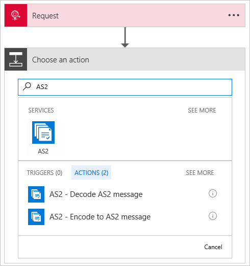
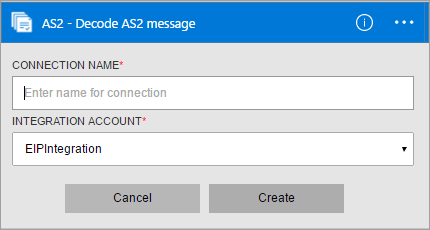
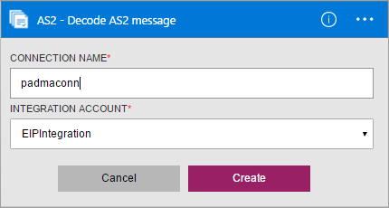
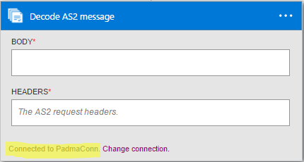
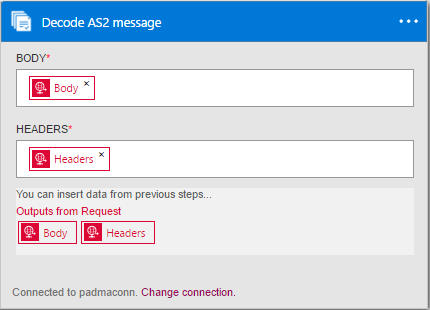

# Decode AS2 messages for Azure Logic Apps with the Enterprise Integration Pack 

To establish security and reliability while transmitting messages, use the Decode AS2 message connector. 
This connector provides digital signing, decryption, and acknowledgements through Message Disposition Notifications (MDN).

## Before you start

Here's the items you need:

* An Azure account; you can create an [account](https://www.azure.cn/pricing/1rmb-trial)
* An [integration account](logic-apps-enterprise-integration-create-integration-account.md) 
that's already defined and associated with your Azure subscription. 
You must have an integration account to use the Decode AS2 message connector.
* At least two [partners](logic-apps-enterprise-integration-partners.md) 
that are already defined in your integration account
* An [AS2 agreement](logic-apps-enterprise-integration-as2.md) 
that's already defined in your integration account

## Decode AS2 messages

1. [Create a logic app](../logic-apps/quickstart-create-first-logic-app-workflow.md).

2. The Decode AS2 message connector doesn't have triggers, 
so you must add a trigger for starting your logic app, like a Request trigger. 
In the Logic App Designer, add a trigger, and then add an action to your logic app.

3. In the search box, enter "AS2" for your filter. 
Select **AS2 - Decode AS2 message**.
   
    

4. If you didn't previously create any connections to your integration account, 
you're prompted to create that connection now. Name your connection, 
and select the integration account that you want to connect.
   
    

	Properties with an asterisk are required.

	| Property | Details |
	| --- | --- |
	| Connection Name * |Enter any name for your connection. |
	| Integration Account * |Enter a name for your integration account. Make sure that your integration account and logic app are in the same Azure location. |

5. When you're done, your connection details should look similar to this example. 
To finish creating your connection, choose **Create**.

	

6. After your connection is created, as shown in this example, 
select **Body** and **Headers** from the Request outputs.
   
     

	For example:

	 

## AS2 decoder details

The Decode AS2 connector performs these tasks: 

* Processes AS2/HTTP headers
* Verifies the signature (if configured)
* Decrypts the messages (if configured)
* Decompresses the message (if configured)
* Reconciles a received MDN with the original outbound message
* Updates and correlates records in the non-repudiation database
* Writes records for AS2 status reporting
* The output payload contents are base64 encoded
* Determines whether an MDN is required, and whether the MDN should be synchronous or asynchronous based on configuration in AS2 agreement
* Generates a synchronous or asynchronous MDN (based on agreement configurations)
* Sets the correlation tokens and properties on the MDN

## Try this sample

To try deploying a fully operational logic app and sample AS2 scenario, 
see the [AS2 logic app template and scenario](https://azure.microsoft.com/documentation/templates/201-logic-app-as2-send-receive/).

## View the swagger
See the [swagger details](/connectors/as2/). 

## Next steps
[Learn more about the Enterprise Integration Pack](logic-apps-enterprise-integration-overview.md) 

