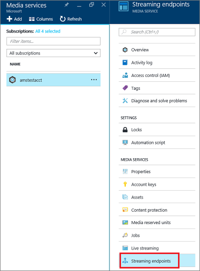
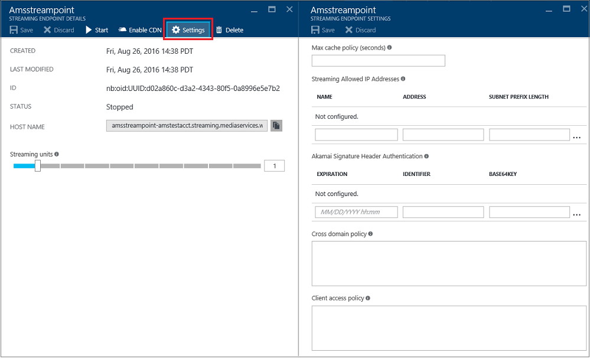

---

title: Manage streaming endpoints with the Azure portal | Azure
description: This topic shows how to manage streaming endpoints with the Azure portal.
services: media-services
documentationcenter: ''
author: forester123
writer: juliako
manager: digimobile
editor: ''

ms.assetid: bb1aca25-d23a-4520-8c45-44ef3ecd5371
ms.service: media-services
ms.workload: media
ms.tgt_pltfrm: na
ms.devlang: na
ms.topic: article
origin.date: 09/10/2017
ms.date: 1/22/2018
ms.author: v-johch

---

# Manage streaming endpoints with the Azure portal

This article shows  how to use the Azure portal to manage streaming endpoints. 

>[!NOTE]
>Make sure to review the [overview](media-services-streaming-endpoints-overview.md) article. 

For information about how to scale the streaming endpoint, see [this](media-services-portal-scale-streaming-endpoints.md) article.

## Start managing streaming endpoints 

To start managing streaming endpoints for your account, do the following.

1. In the [Azure portal](https://portal.azure.cn/), select your Azure Media Services account.
2. In the **Settings** blade, select **Streaming endpoints**.
   
    

> [!NOTE]
> You are only billed when your Streaming Endpoint is in running state.

## Add/delete a streaming endpoint

>[!NOTE]
>The default streaming endpoint cannot be deleted.

To add/delete streaming endpoint using the Azure portal, do the following:

1. To add a streaming endpoint, click the **+ Endpoint** at the top of the page. 

	You might want multiple Streaming Endpoints if you plan to have different CDNs or a CDN and direct access.

2. To delete a streaming endpoint, press **Delete** button.      
3. Click the **Start** button to start the streaming endpoint.
   
    

## Configuring the Streaming Endpoint

Streaming Endpoint enables you to configure the following properties:

* Access control
* Cache control
* Cross site access policies

For detailed information about these properties, see [StreamingEndpoint](https://docs.microsoft.com/rest/api/media/operations/streamingendpoint).

You can configure streaming endpoint by doing the following:

1. Select the streaming endpoint you want to configure.
2. Click **Settings**.

A brief description of the fields follows.

1. Maximum cache policy: used to configure cache lifetime for assets served through this streaming endpoint. If no value is set, the default is used. The default values can also be defined directly in Azure storage. If Azure CDN is enabled for the streaming endpoint, you should not set the cache policy value to less than 600 seconds.  
2. Allowed IP addresses: used to specify IP addresses that would be allowed to connect to the published streaming endpoint. If no IP addresses specified, any IP address would be able to connect. IP addresses can be specified as either a single IP address (for example, '10.0.0.1'), an IP range using an IP address and a CIDR subnet mask (for example, '10.0.0.1/22'), or an IP range using IP address and a dotted decimal subnet mask (for example, '10.0.0.1(255.255.255.0)').
3. Configuration for Akamai signature header authentication: used to specify how signature header authentication request from Akamai servers is configured. Expiration is in UTC.

## Scale your Premium streaming endpoint

For more information, see [this](media-services-portal-scale-streaming-endpoints.md) topic.
<!--Update_Description: wording update-->
