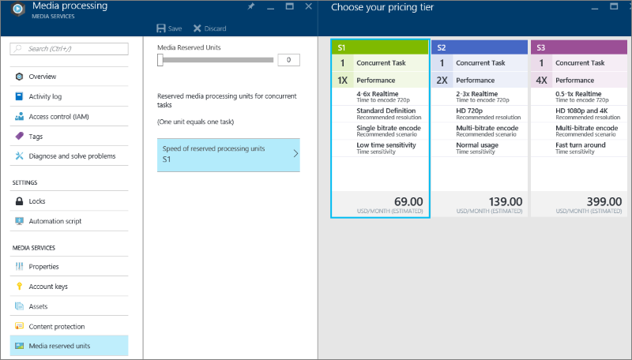

<properties
    pageTitle=" Scale Media Processing using the Azure portal | Azure"
    description="This tutorial walks you through the steps of scaling Media Processing using the Azure portal."
    services="media-services"
    documentationcenter=""
    author="Juliako"
    manager="erikre"
    editor="" />
<tags
    ms.assetid="e500f733-68aa-450c-b212-cf717c0d15da"
    ms.service="media-services"
    ms.workload="media"
    ms.tgt_pltfrm="na"
    ms.devlang="na"
    ms.topic="article"
    ms.date="01/10/2017"
    wacn.date=""
    ms.author="juliako" />

# Change the reserved unit type

> [AZURE.SELECTOR]
- [.NET](/documentation/articles/media-services-dotnet-encoding-units/)
- [Portal](/documentation/articles/media-services-portal-scale-media-processing/)
- [REST](https://docs.microsoft.com/rest/api/media/operations/encodingreservedunittype)
- [Java](https://github.com/southworkscom/azure-sdk-for-media-services-java-samples)
- [PHP](https://github.com/Azure/azure-sdk-for-php/tree/master/examples/MediaServices)

## Overview

>[AZURE.IMPORTANT] Make sure to review the [overview](/documentation/articles/media-services-scale-media-processing-overview/) topic to get more information about scaling media processing topic.

## Scale media processing
To change the reserved unit type and the number of reserved units, do the following:

1. In the [Azure portal](https://portal.azure.cn/), select your Azure Media Services account.
2. In the **Settings** window, select **Media reserved units**.
   
    To change the number of reserved units for the selected reserved unit type, use the **Media Served Units** slider.
   
    To change the **RESERVED UNIT TYPE**, press S1, S2, or S3.
   
    
3. Press the SAVE button to save your changes.
   
    The new reserved units are allocated when you press SAVE.

