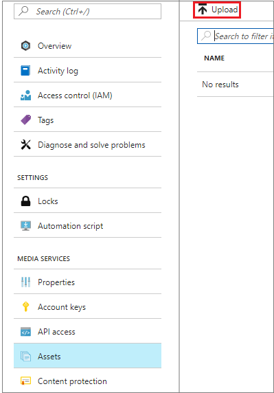

# Upload files to a Media Services account in the Azure portal
> [!div class="op_single_selector"]
> * [Portal](media-services-portal-upload-files.md)
> * [.NET](media-services-dotnet-upload-files.md)
> * [REST](media-services-rest-upload-files.md)
> 
> [!NOTE]
> To complete this tutorial, you need an Azure account. For details, see [Azure Trial](https://www.azure.cn/pricing/1rmb-trial/). 
> 

In Azure Media Services, you upload your digital files to an asset. The asset can contain video, audio, images, thumbnail collections, text tracks, and closed caption files (and the metadata for these files). After the files are uploaded, your content is stored securely in the cloud for further processing and streaming.

> [!NOTE]
> Media Services has a maximum file size for processing files. For details about file size limits, see [Media Services quotas and limitations](media-services-quotas-and-limitations.md).
>

## Upload files
1. In the [Azure portal](https://portal.azure.cn/), select your Azure Media Services account.
2. Select **Settings** > **Assets**. Then, select the **Upload** button.
   
    
   
    The **Upload a video asset** window appears.
   
   > [!NOTE]
   > Media Services doesn't limit the file size for uploading videos.
 
3. On your computer, go to the video that you want to upload. Select the video, and then select **OK**.  
   
    The upload begins. You can see the progress under the file name.  

When the upload is finished, the new asset is listed in the **Assets** pane. 

## Next steps
* Learn how to [encode your uploaded assets](media-services-portal-encode.md).

<!--Update_Description:wording update-->

