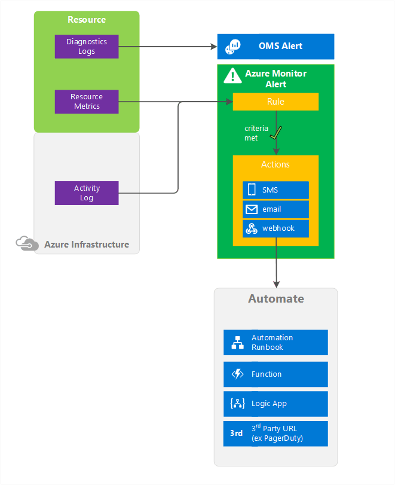

# What are classic alerts in Microsoft Azure?

> [!NOTE]
> This article describes how to create older classic metric alerts. Azure Monitor now supports [newer near-real time metric alerts](monitoring-overview-unified-alerts.md)
>

This article describes the various sources of alerts in Microsoft Azure, what are the purposes for those alerts, their benefits, and how to get started with using them. It specifically applies to Azure Monitor classic alerts. Alerts offer a method of monitoring in Azure that allows you to configure conditions over data and become notified when the conditions match the latest monitoring data.

## Taxonomy of Azure Monitor classic alerts
Azure uses the following terms to describe classic alerts and their functions:
* **Alert** - a definition of criteria (one or more rules or conditions) that becomes activated when met.
* **Active** - the state when the criteria defined by an classic alert is met.
* **Resolved** - the state when the criteria defined by an classic alert is no longer met after previously having been met.
* **Notification** - the action taken based off of an classic alert becoming active.
* **Action** - a specific call sent to a receiver of a notification (for example, emailing an address or posting to a webhook URL). Notifications can usually trigger multiple actions.

## Alerts on Azure Monitor data
There are three types of alerts off of data available from Azure Monitor -- metric alerts, near real-time metric alerts and Activity Log alerts.

* **Classic metric alerts** - This alert triggers when the value of a specified metric crosses a threshold that you assign. The alert generates a notification when the alert is "Activated" (when the threshold is crossed and the alert condition is met) as well as when it is "Resolved" (when the threshold is crossed again and the condition is no longer met). These are older metric alerts. For newer metric alerts, see below.

* **Near real-time metric alerts** (newer alert experience) - These are newer generation of metric alerts with improved features when compared to previous metric alerts. These alerts can be run at a frequency of 1 min. They also support monitoring multiple(currently two) metrics.  The alert generates a notification when the alert is "Activated" (when the thresholds for each metric are crossed at the same time and the alert condition is met) as well as when it is "Resolved" (when at least one metric crosses the threshold again and the condition is no longer met).

* **Classic activity log alerts** - A streaming log alert that triggers when an Activity Log event is generated that matches filter criteria that you have assigned. These alerts have only one state, "Activated," since the alert engine simply applies the filter criteria to any new event. These alerts can be used to become notified when a new Service Health incident occurs or when a user or application performs an operation in your subscription, for example, "Delete virtual machine."

For Diagnostic Log data available through Azure Monitor, we suggest routing the data into Log Analytics and using a Log Analytics alert. The following diagram summarizes sources of data in Azure Monitor and, conceptually, how you can alert off of that data.

## How do I receive a notification on an Azure Monitor classic alert?
Historically, Azure alerts from different services used their own built-in notification methods. Going forward, Azure Monitor offers a reusable notification grouping called Action Groups. Action Groups specify a set of receivers for a notification -- any number of email addresses, phone numbers (for SMS), or webhook URLs -- and any time an alert is activated that references the Action Group, all receivers receive that notification. This allows you to reuse a grouping of receivers (for example, your on call engineer list) across many alert objects. Currently, only Activity Log alerts make use of Action Groups, but several other Azure alert types are working on using Action Groups as well.

Action Groups support notification by posting to a webhook URL in addition to email addresses and SMS numbers. This enables automation and remediation, for example, using:
    - Azure Automation Runbook
    - a third-party service

Near real-time metric alerts, and Activity Log alerts use Action Groups.

Older Metric alerts available under Alerts (Classic) do not use Action Groups. On an individual metric alert you can configure notifications to:
* Send email notifications to the service administrator, to co-administrators, or to additional email addresses that you specify.
* Call a webhook, which enables you to launch additional automation actions.

## Next steps
Get information about alert rules and configuring them by using:

* Learn more about [Metrics](monitoring-overview-metrics.md)
* Configure [classic Metric Alerts via Azure portal](insights-alerts-portal.md)
* Configure [classic Metric Alerts PowerShell](insights-alerts-powershell.md)
* Configure [classic Metric Alerts Command-line interface (CLI)](insights-alerts-command-line-interface.md)
* Configure [classic Metric Alerts Azure Monitor REST API](https://msdn.microsoft.com/library/azure/dn931945.aspx)
* Learn more about [Activity Log](monitoring-overview-activity-logs.md)
* Configure [Activity Log Alerts via Azure portal](monitoring-activity-log-alerts.md)
* Configure [Activity Log Alerts via Resource Manager](monitoring-create-activity-log-alerts-with-resource-manager-template.md)
* Review the [activity log alert webhook schema](monitoring-activity-log-alerts-webhook.md)
* Learn more about [newer Metric Alerts](monitoring-near-real-time-metric-alerts.md)
* Learn more about [Service Notifications](monitoring-service-notifications.md)
* Learn more about [Action Groups](monitoring-action-groups.md)
* Configure [Alerts](monitor-alerts-unified-usage.md)
