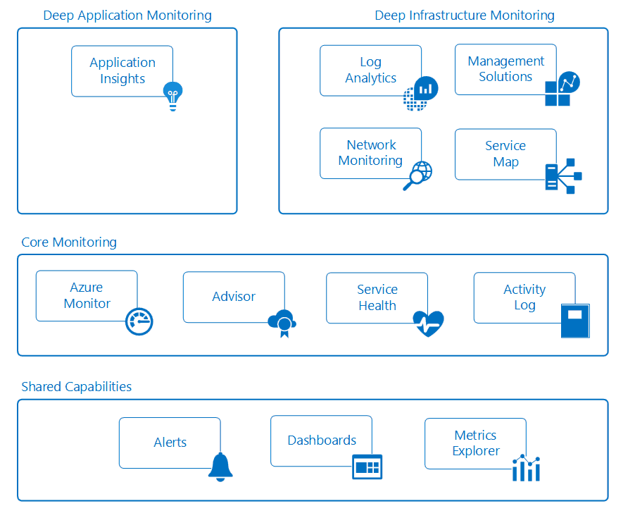

# Monitoring Azure applications and resources

Monitoring is the act of collecting and analyzing data to determine the performance, health, and availability of your business application and the resources that it depends on. An effective monitoring strategy helps you understand the detailed operation of the components of your application. It also helps you increase your uptime by proactively notifying you of critical issues so that you can resolve them before they become problems.

Azure includes multiple services that individually perform a specific role or task in the monitoring space. Together, these services deliver a comprehensive solution for collecting, analyzing, and acting on telemetry from your application and the Azure resources that support them. They can also work to monitor critical on-premises resources in order to provide a hybrid monitoring environment. Understanding the tools and data that are available is the first step in developing a complete monitoring strategy for your application. 

The following diagram shows a conceptual view of the components that work together to provide monitoring of Azure resources. The following sections describe these components and provide links to detailed technical information.

## Shared Capabilities
The core and deep monitoring service share functionality which provides the following capabilities. 

### Alerts
[Azure alerts](../monitoring-and-diagnostics/monitoring-overview-alerts.md) proactively notify you of critical conditions and potentially take corrective action. Alert rules can use data from multiple sources, including metrics and logs. They use [action groups](../monitoring-and-diagnostics/monitoring-action-groups.md), which contain unique sets of recipients and actions in response to an alert. Based on your requirements, you can have alerts start external actions by using webhooks and integrate with your ITSM tools.

### Dashboards
You can use [Azure dashboards](../azure-portal/azure-portal-dashboards.md) to combine different kinds of data into a single pane in the [Azure portal](https://portal.azure.cn). You can then share the dashboard with other Azure users. 

For example, you can create a dashboard that combines:
- Tiles that show a graph of metrics
- A table of activity logs
- A usage chart from Application Insights
- The output of a log search in Log Analytics

You can also export Log Analytics data to [Power BI](/power-bi/). There, you can take advantage of additional visualizations. You can also make the data available to others within and outside your organization.

### Metrics Explorer
[Metrics](../monitoring-and-diagnostics/monitoring-overview-metrics.md) are numerical values generated by an Azure resource to help you understand the operation and performance of the resource. By using Metrics Explorer, you can send metrics to Log Analytics for analysis with data from other sources.

## Core monitoring
Core monitoring provides fundamental, required monitoring across Azure resources. These services require minimal configuration and collect core telemetry that the premium monitoring services use.    

### Azure Monitor
[Azure Monitor](../monitoring-and-diagnostics/monitoring-overview-azure-monitor.md) enables core monitoring for Azure services by allowing the collection of [metrics](../monitoring-and-diagnostics/monitoring-overview-metrics.md), [activity logs](../monitoring-and-diagnostics/monitoring-overview-activity-logs.md), and [diagnostic logs](../monitoring-and-diagnostics/monitoring-overview-of-diagnostic-logs.md). For example, the activity log tells you when new resources are created or modified. 

Metrics are available that provide performance statistics for different resources and even the operating system inside a virtual machine. You can view this data with one of the explorers in the Azure portal and create alerts based on these metrics. Azure Monitor provides the fastest metrics pipeline (5 minute down to 1 minute), so you should use it for time critical alerts and notifications. 
### Azure Advisor
[Azure Advisor] constantly monitors your resource configuration and usage telemetry. It then gives you personalized recommendations based on best practices. Following these recommendations helps you improve the performance, security, and availability of the resources that support your applications.
### Service Health
The health of your application relies on the Azure services that it depends on. [Azure Service Health](../service-health/service-health-overview.md) identifies any issues with Azure services that might affect your application. Service Health also helps you plan for scheduled maintenance.

### Activity Log
[Activity Log](../monitoring-and-diagnostics/monitoring-overview-activity-logs.md) provides data about the operation of an Azure resource. This information includes:
- Configuration changes to the resource.
- Service health incidents.
- Recommendations on better utilizing the resource.
- Information related to autoscale operations. 

You can view logs for a particular resource on its page in the Azure portal. Or you can view logs from multiple resources in Activity Log Explorer. 
## Deep monitoring services
The following Azure services provide rich capabilities for collecting and analyzing monitoring data at a deeper level. These services build on core monitoring and take advantage of common functionality in Azure. They provide powerful analytics with collected data to give you unique insights into your applications and infrastructure. They present data in the context of scenarios that are targeted to different audiences.

## Deep infrastructure monitoring
### Network Monitoring
There are several tools that work together to monitor various aspects of your network, whether in Azure or on-premises.  

[Network Watcher](../network-watcher/network-watcher-monitoring-overview.md) provides scenario-based monitoring and diagnostics for different network scenarios in Azure. It stores data in Azure metrics and diagnostics for further analysis. It works with the following solutions for monitoring various aspects of your network.

[Network Performance Monitor (NPM)](https://blogs.msdn.microsoft.com/azuregov/2017/09/05/network-performance-monitor-general-availability/) is a cloud-based network monitoring solution that monitors connectivity across public clouds, datacenters, and on-premises environments.

[ExpressRoute Monitor](https://azure.microsoft.com/en-in/blog/monitoring-of-azure-expressroute-in-preview/) is an  NPM capability that monitors the end-to-end connectivity and performance over Azure ExpressRoute circuits.

## Example scenarios
Following are high-level examples that illustrate how you can use different monitoring tools in Azure for different scenarios.

### Monitoring a web application
Consider a web application deployed in Azure through Azure App Service, Azure Storage, and a SQL database. You start by accessing [metrics](../monitoring-and-diagnostics/monitoring-overview-metrics.md) and [activity logs](../monitoring-and-diagnostics/monitoring-overview-activity-logs.md) for these resources on their pages in the Azure portal. You look for critical information, such as the number of requests to the application and average response time. You also identify any configuration changes.

You then go to Monitor in the portal in order to view metrics and logs for the different resources together. As you determine standard parameters for the metrics, you [create alert rules](../monitoring-and-diagnostics/monitoring-overview-unified-alerts.md). These rules proactively notify you when, for example, average response time increases beyond a threshold. To get a quick view of your application's daily performance, you create an Azure dashboard to show graphs of metrics that represent critical KPIs.

### Monitoring virtual machines
You have a mix of Windows and Linux virtual machines running in Azure. You use Azure Monitor to view [activity logs](../monitoring-and-diagnostics/monitoring-overview-activity-logs.md) and [host-level metrics](../monitoring-and-diagnostics/monitoring-overview-metrics.md). You add the [Azure Diagnostics extension](../virtual-machines/linux/tutorial-monitoring.md#install-diagnostics-extension) to the virtual machines in order to collect metrics from the guest operating system. You then create [alert rules](../monitoring-and-diagnostics/monitoring-overview-unified-alerts.md) to proactively notify you when basic metrics like processor utilization and memory cross thresholds.

## Next steps
Learn more about

* [Azure Monitor](/monitoring-and-diagnostics/) to get started with core monitoring metrics and alerts.
