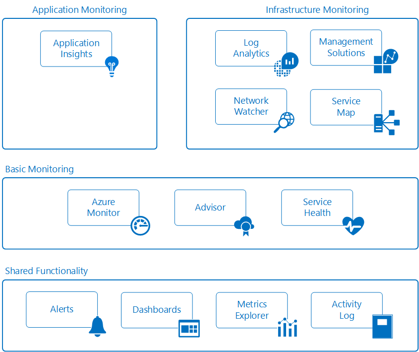

# Monitoring Azure applications and resources

Monitoring is the act of collecting and analyzing data to determine the performance, health, and availability of your business application and the resources it depends on. An effective monitoring strategy will help you understand the detailed operation of the different components of your application and to increase your uptime by proactively notifying you of critical issues so that you can resolve them before they become problems.

Azure includes multiple services that individually perform a specific role or task in the monitoring space and together deliver a comprehensive solution for collecting, analyzing and acting on telemetry from your application and the underlying Azure resources supporting them.  They can also work to monitor critical on-premises resources in order to provide a hybrid monitoring environment.   Understanding the tools and data that are available is the first step in developing a complete monitoring strategy for your application. 

The following diagram shows a conceptual view of the different components that work together to provide monitoring of Azure resources.  Each of these is described in the following sections with links to detailed technical information.

## Basic Monitoring
Basic monitoring provides fundamental required monitoring across Azure resources.  These services require minimal configuration and collect core telemetry that's leveraged by the premium monitoring services.    

### Azure Monitor
[Azure Monitor](../monitoring-and-diagnostics/monitoring-overview-azure-monitor.md) enables basic monitoring for Azure service by allowing collection of [Metrics](../monitoring-and-diagnostics/monitoring-overview-metrics.md), [Activity Logs](../monitoring-and-diagnostics/monitoring-overview-activity-logs.md), and [Diagnostic logs](../monitoring-and-diagnostics/monitoring-overview-of-diagnostic-logs.md).  For example, the Activity log will tell you when new resources are created or modified.  Metrics are available that provide performance statistics for different resources and even the operating system inside of a virtual machine.  You can view this data with one of the explorers in the Azure portal, send it to Log Analytics for trending and detailed analysis, or create alert rules to proactively notify you of critical issues.

### Service Health
The health of your application relies on the Azure services that it depends on.  [Azure Service Health](../service-health/service-health-overview.md) identifies any issues with Azure services that might impact your application and also helps you plan for any schedule maintenance.

## Premium monitoring services
The following Azure services provide rich capabilities for collecting and analyzing monitoring data.  They build on basic monitoring and leverage common functionality in Azure and provide powerful analytics with collected data to give you unique insights to your applications and infrastructure.  They present data within the context of particular scenarios targeted to different audiences.

### Network Watcher
[Network Watcher](../network-watcher/network-watcher-monitoring-overview.md) provides scenario-based monitoring and diagnostics for different network scenarios in Azure.  It stores data in Azure metrics and diagnostics for further analysis and works with the following network monitoring solutions for monitoring various aspects of your network:
* [Network Performance Monitor (NPM)](https://blogs.msdn.microsoft.com/azuregov/2017/09/05/network-performance-monitor-general-availability/) - A cloud based network monitoring solution that monitors connectivity across public clouds, data centers and on-premises environments
* [ExpressRoute Monitor](https://azure.microsoft.com/en-in/blog/monitoring-of-azure-expressroute-in-preview/) - An NPM capability that monitors the end-to-end connectivity and performance over ExpressRoute circuits.
* Traffic Analytics - A cloud based solution, that provides visibility into user and application activity on your cloud network.
## Shared functionality
The following Azure tools provide critical functionality to the premium monitoring services.  They are shared by multiple services allowing you to leverage common functionality and configurations across multiple services.

### Alerts
[Azure Alerts](../monitoring-and-diagnostics/monitoring-overview-alerts.md) proactively notify you of critical conditions and potentially take corrective action.  Alert rules can leverage data from multiple sources including metrics and logs. They use [Action Groups](../monitoring-and-diagnostics/monitoring-action-groups.md) which contain unique sets of recipients and actions in response to an alert.  Based on your requirements, you can have alerts launch external actions using webhooks and integrate with your ITSM tools.

### Dashboards
[Azure Dashboards](../azure-portal/azure-portal-dashboards.md) allow you to combine different kinds of data  into a single pane in the Azure portal and share with other Azure users.  For example, you could create a dashboard that combines tiles showing a graph of metrics, a table of activity logs, a usage chart from Application Insights, and the output of a log search in Log Analytics.

You can also export Log Analytics data to [Power BI](/power-bi/) to take advantage of additional visualizations and also to make the data available to others within and outside of your organization.

### Metrics Explorer
[Metrics](../monitoring-and-diagnostics/monitoring-overview-metrics.md) are numerical values generated by Azure resources that help you understand the operation and performance of the resource. You can send metrics to Log Analytics for analysis with data from other sources.

### Activity Logs
[Activity Logs](../monitoring-and-diagnostics/monitoring-overview-activity-logs.md) provide data about the operation of Azure resources.  This includes such information as configuration changes to the resource, service health incidents, recommendations on better utilizing the resource, and information related to autoscale operations.  You can view logs for a particular resource on its page in the Azure portal or view logs from multiple resources in Activity Log Explorer.  You can also send Activity logs to Log Analytics so they can be analyzed with data collected by management solutions, agents on virtual machines, and other sources.

## Example scenarios
Following are high level examples that illustrate how you would leverage different monitoring tools in Azure for different scenarios.

### Monitoring a web application
Consider a web application deployed in Azure using App Services, Azure Storage, and a SQL database.  You could start by accessing [metrics](../monitoring-and-diagnostics/monitoring-overview-metrics.md) and [activity logs](../monitoring-and-diagnostics/monitoring-overview-activity-logs.md) for each of these individual resources on their pages in Azure portal.  This would include critical information such as the number of requests to the application and average response time in addition to identifying any configuration changes.

You could then go to Monitor in the portal in order to view metrics and logs for the different resources together.  As you determine standard parameters for the metrics, you [create alert rules](../monitoring-and-diagnostics/monitoring-overview-unified-alerts.md) to proactively notify you when, for example, average response time increases beyond a threshold.  In order to get a quick view of your application's daily performance, you create an Azure dashboard to show graphs of metrics representing critical KPIs.

### Monitoring virtual machines
You have a mix of Windows and Linux virtual machines running in the Azure.  You use Azure Monitor to view [activity logs](../monitoring-and-diagnostics/monitoring-overview-activity-logs.md) and [host level metrics](../monitoring-and-diagnostics/monitoring-overview-metrics.md) and then add the [Azure Diagnostics extension](../virtual-machines/linux/tutorial-monitoring.md#install-diagnostics-extension) to the virtual machines in order to collect metrics from the guest operating system.  You then create [alert rules](../monitoring-and-diagnostics/monitoring-overview-unified-alerts.md) to proactively notify you when basic metrics such processor utilization and memory cross thresholds.

## Next steps
Learn more about

* [Getting Started with Azure Monitor](monitoring-get-started.md)
* [Azure Diagnostics](../azure-diagnostics.md) if you are attempting to diagnose problems in your Cloud Service, Virtual Machine, Virtual machine scale set, or Service Fabric application.
