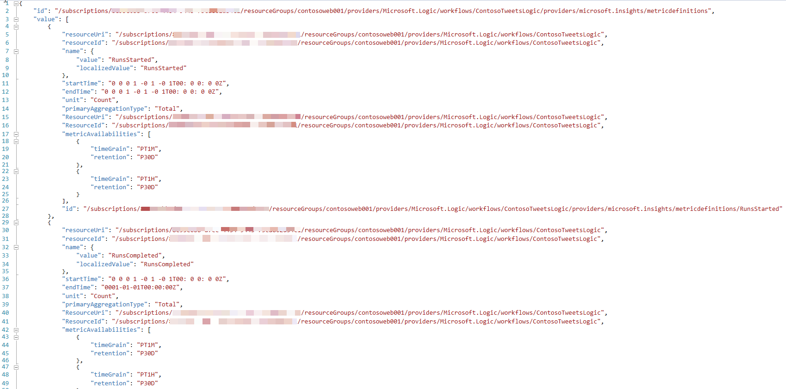
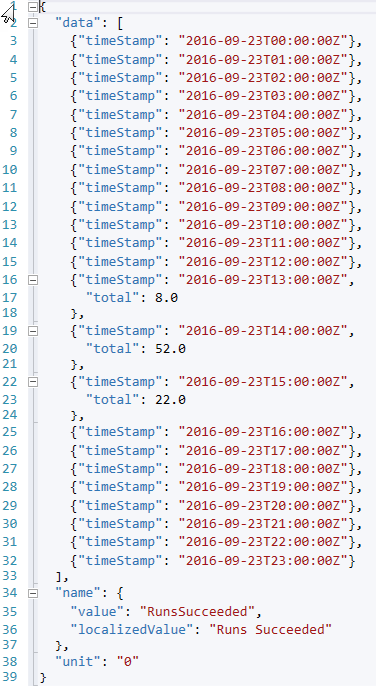
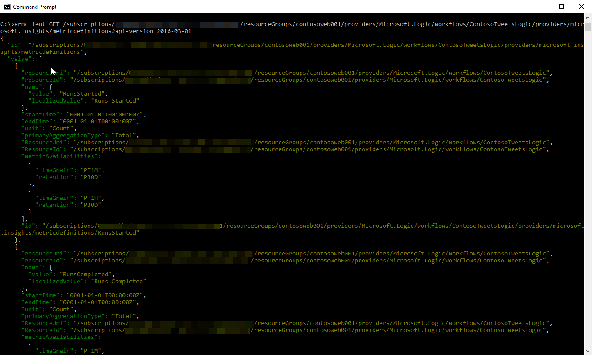
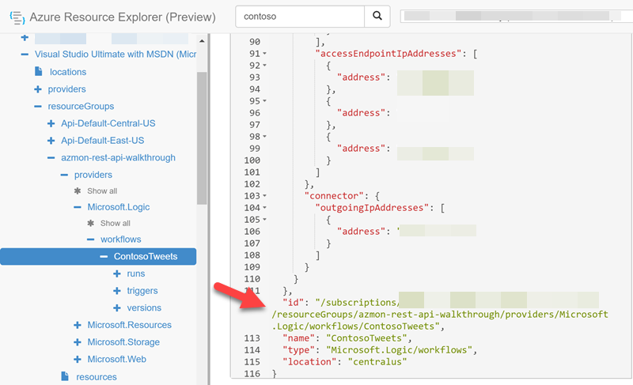
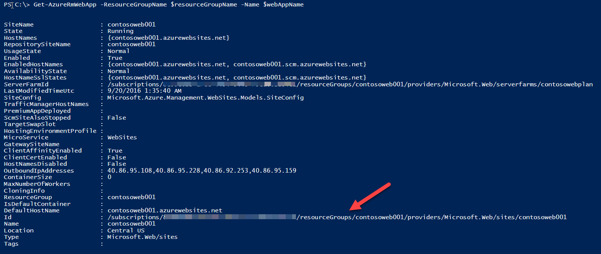

<properties
	pageTitle="Azure Monitoring REST API Walkthrough | Azure"
	description="How to authenticate requests to and use the Azure Monitoring REST API."
	authors="mcollier"
	manager="carolz"
	editor=""
	services="monitoring-and-diagnostics"
	documentationCenter="monitoring-and-diagnostics"/>

<tags
	ms.service="monitoring-and-diagnostics"
	ms.workload="na"
	ms.tgt_pltfrm="na"
	ms.devlang="na"
	ms.topic="article"
	ms.date="09/27/2016"
	ms.author="mcollier"/>

# Azure Monitoring REST API Walkthrough
This article shows you how to perform authentication so your code can use the [Microsoft Azure Monitor REST API Reference](https://msdn.microsoft.com/zh-cn/library/azure/dn931943.aspx).         

The Azure Monitor API makes it possible to programmatically retrieve the available default metric definitions (the type of metric such as CPU Time, Requests, etc.), granularity, and metric values. Once retrieved, the data can be saved in a separate data store such as Azure SQL Database, DocumentDB, or Azure Data Lake. From there additional analysis can be performed as needed.

Besides working with various metric data points, as this article demonstrates, the Monitor API makes it possible to list alert rules, view activity logs, and much more. For a full list of available operations, see the [Microsoft Azure Monitor REST API Reference](https://msdn.microsoft.com/zh-cn/library/azure/dn931943.aspx).

## Authenticating Azure Monitor Requests

The first step is to authenticate the request.

All the tasks executed against the Azure Monitor API use the Azure Resource Manager authentication model. Therefore, all requests must be authenticated with Azure Active Directory (Azure AD). One approach to authenticate the client application is to create an Azure AD service principal and retrieve the authentication (JWT) token. The following sample script demonstrates creating an Azure AD service principal via PowerShell. For a more detailed walk-through, refer to the documentation on [using Azure PowerShell to create a service principal to access resources](/documentation/articles/resource-group-authenticate-service-principal/#create-service-principal-with-password). It is also possible to [create a service principle via the Azure portal](/documentation/articles/resource-group-create-service-principal-portal/).

```PowerShell
$subscriptionId = "{azure-subscription-id}"
$resourceGroupName = "{resource-group-name}"
$location = "centralus"

# Authenticate to a specific Azure subscription.
Login-AzureRmAccount -SubscriptionId $subscriptionId

# Password for the service principal
$pwd = "{service-principal-password}"

# Create a new Azure AD application
$azureAdApplication = New-AzureRmADApplication `
                        -DisplayName "My Azure Monitor" `
                        -HomePage "https://localhost/azure-monitor" `
                        -IdentifierUris "https://localhost/azure-monitor" `
                        -Password $pwd

# Create a new service principal associated with the designated application
New-AzureRmADServicePrincipal -ApplicationId $azureAdApplication.ApplicationId

# Assign Reader role to the newly created service principal
New-AzureRmRoleAssignment -RoleDefinitionName Reader `
                          -ServicePrincipalName $azureAdApplication.ApplicationId.Guid

```

To query the Azure Monitor API, the client application should use the previously created service principal to authenticate. The following example PowerShell script shows one approach, using the [Active Directory Authentication Library](/documentation/articles//active-directory-authentication-libraries/) (ADAL) to help get the JWT authentication token. The JWT token is passed as part of an HTTP Authorization parameter in requests to the Azure Monitor REST API.

```PowerShell
$azureAdApplication = Get-AzureRmADApplication -IdentifierUri "https://localhost/azure-monitor"

$subscription = Get-AzureRmSubscription -SubscriptionId $subscriptionId

$clientId = $azureAdApplication.ApplicationId.Guid
$tenantId = $subscription.TenantId
$authUrl = "https://login.windows.net/${tenantId}"

$AuthContext = [Microsoft.IdentityModel.Clients.ActiveDirectory.AuthenticationContext]$authUrl
$cred = New-Object -TypeName Microsoft.IdentityModel.Clients.ActiveDirectory.ClientCredential -ArgumentList ($clientId, $pwd)
 
$result = $AuthContext.AcquireToken("https://management.core.chinacloudapi.cn/", $cred)

# Build an array of HTTP header values 
$authHeader = @{
'Content-Type'='application/json'
'Accept'='application/json'
'Authorization'=$result.CreateAuthorizationHeader()
}
```

Once the authentication setup step is complete, queries can then be executed against the Azure Monitor REST API. There are two helpful queries:

1. List the metric definitions for a resource

2. Retrieve the metric values


## Retrieve Metric Definitions
>[AZURE.NOTE] To retrieve metric definitions using the Azure Monitor REST API, use "2016-03-01" as the API version.

```PowerShell
$apiVersion = "2016-03-01"
$request = "https://management.azure.cn/subscriptions/${subscriptionId}/resourceGroups/${resourceGroupName}/providers/${resourceProviderNamespace}/${resourceType}/${resourceName}/providers/microsoft.insights/metricDefinitions?api-version=${apiVersion}"

Invoke-RestMethod -Uri $request `
                  -Headers $authHeader `
                  -Method Get `
                  -Verbose
```
For an Azure Logic App, the metric definitions would appear similar to the following screenshot:



For more information, see the [List the metric definitions for a resource in Azure Monitor REST API](https://msdn.microsoft.com/zh-cn/library/azure/mt743621.aspx) documentation.

## Retrieve Metric Values
Once the available metric definitions are known, it is then possible to retrieve the related metric values. Use the metric’s name ‘value’ (not the ‘localizedValue’) for any filtering requests (for example, retrieve the ‘CpuTime’ and ‘Requests’ metric data points). If no filters are specified, the default metric is returned.

>[AZURE.NOTE] To retrieve metric values using the Azure Monitor REST API, use "2016-06-01" as the API version.

**Method**: GET

**Request URI**: https://management.azure.cn/subscriptions/*{subscription-id}*/resourceGroups/*{resource-group-name}*/providers/*{resource-provider-namespace}*/*{resource-type}*/*{resource-name}*/providers/microsoft.insights/metrics?$filter=*{filter}*&api-version=*{apiVersion}*

For example, to retrieve the RunsSucceeded metric data points for the given time range and for a time grain of 1 hour, the request would be as follows:

```PowerShell
$apiVersion = "2016-06-01"
$filter = "(name.value eq 'RunsSucceeded') and aggregationType eq 'Total' and startTime eq 2016-09-23 and endTime eq 2016-09-24 and timeGrain eq duration'PT1H'"
$request = "https://management.azure.cn/subscriptions/${subscriptionId}/resourceGroups/${resourceGroupName}/providers/${resourceProviderNamespace}/${resourceType}/${resourceName}/providers/microsoft.insights/metrics?`$filter=${filter}&api-version=${apiVersion}"
(Invoke-RestMethod -Uri $request `
                   -Headers $authHeader `
                   -Method Get `
                   -Verbose).Value | ConvertTo-Json
```

The result would appear similar to the example following screenshot:



To retrieve multiple data or aggregation points, add the metric definition names and aggregation types to the filter, as seen in the following example:

```PowerShell
$apiVersion = "2016-06-01"
$filter = "(name.value eq 'ActionsCompleted' or name.value eq 'RunsSucceeded') and (aggregationType eq 'Total' or aggregationType eq 'Average') and startTime eq 2016-09-23T13:30:00Z and endTime eq 2016-09-23T14:30:00Z and timeGrain eq duration'PT1M'"
$request = "https://management.azure.cn/subscriptions/${subscriptionId}/resourceGroups/${resourceGroupName}/providers/${resourceProviderNamespace}/${resourceType}/${resourceName}/providers/microsoft.insights/metrics?`$filter=${filter}&api-version=${apiVersion}"
(Invoke-RestMethod -Uri $request `
                   -Headers $authHeader `
                   -Method Get `
                   -Verbose).Value | ConvertTo-Json
```

### Use ARMClient
An alternative to using PowerShell (as shown above), is to use [ARMClient](https://github.com/projectkudu/ARMClient) on your Windows machine. ARMClient handles the Azure AD authentication (and resulting JWT token) automatically. The following steps outline use of ARMClient for retrieving metric data:

1. Install [Chocolatey](https://chocolatey.org/) and [ARMClient](https://github.com/projectkudu/ARMClient).
2. In a terminal window, type *armclient.exe login*. This prompts you to log in to Azure.
3. Type *armclient GET [your_resource_id]/providers/microsoft.insights/metricdefinitions?api-version=2016-03-01*
4. Type *armclient GET [your_resource_id]/providers/microsoft.insights/metrics?api-version=2016-06-01*





## Retrieve the Resource ID
Using the REST API can really help to understand the available metric definitions, granularity, and related values. That information is helpful when using the [Azure Management Library](https://msdn.microsoft.com/zh-cn/library/azure/mt417623.aspx).

For the preceding code, the resource ID to use is the full path to the desired Azure resource. For example, to query against an Azure Web App, the resource ID would be:

*/subscriptions/{subscription-id}/resourceGroups/{resource-group-name}/providers/Microsoft.Web/sites/{site-name}/*

The following list contains a few examples of resource ID formats for various Azure resources:

* **IoT Hub** - /subscriptions/*{subscription-id}*/resourceGroups/*{resource-group-name}*/providers/Microsoft.Devices/IotHubs/*{iot-hub-name}*
* **Elastic SQL Pool** - /subscriptions/*{subscription-id}*/resourceGroups/*{resource-group-name}*/providers/Microsoft.Sql/servers/*{pool-db}*/elasticpools/*{sql-pool-name}*
* **SQL Database (v12)** - /subscriptions/*{subscription-id}*/resourceGroups/*{resource-group-name}*/providers/Microsoft.Sql/servers/*{server-name}*/databases/*{database-name}*
* **Service Bus** - /subscriptions/*{subscription-id}*/resourceGroups/*{resource-group-name}*/providers/Microsoft.ServiceBus/*{namespace}*/*{servicebus-name}*
* **VM Scale Sets** - /subscriptions/*{subscription-id}*/resourceGroups/*{resource-group-name}*/providers/Microsoft.Compute/virtualMachineScaleSets/*{vm-name}*
* **VMs** - /subscriptions/*{subscription-id}*/resourceGroups/*{resource-group-name}*/providers/Microsoft.Compute/virtualMachines/*{vm-name}*
* **Event Hubs** - /subscriptions/*{subscription-id}*/resourceGroups/*{resource-group-name}*/providers/Microsoft.EventHub/namespaces/*{eventhub-namespace}*


There are alternative approaches to retrieving the resource ID, including using Azure Resource Explorer, viewing the desired resource in the Azure portal, and via PowerShell or the Azure CLI.

### Azure Resource Explorer
To find the resource ID for a desired resource, one helpful approach is to use the [Azure Resource Explorer](https://resources.azure.cn) tool. Navigate to the desired resource and then look at the ID shown, as in the following screenshot:



### Azure portal
The resource ID can also be obtained from the Azure portal. To do so, navigate to the desired resource and then select Properties. The Resource ID is displayed in the Properties blade, as seen in the following screenshot:


### Azure PowerShell
The resource ID can be retrieved using Azure PowerShell cmdlets as well. For example, to obtain the resource ID for an Azure Web App, execute the Get-AzureRmWebApp cmdlet, as in the following screenshot:



### Azure CLI
To retrieve the resource ID using the Azure CLI, execute the 'azure webapp show' command, specifying the '--json' option, as shown in the following screenshot:


## Retrieve Activity Log Data
In addition to working with metric definitions and related values, it is also possible to retrieve additional interesting insights related to Azure resources. As an example, it is possible to query [activity log](https://msdn.microsoft.com/zh-cn/library/azure/dn931934.aspx) data. The following sample demonstrates using the Azure Monitor REST API to query activity log data within a specific date range for an Azure subscription: 

```PowerShell
$apiVersion = "2014-04-01"
$filter = "eventTimestamp ge '2016-09-23' and eventTimestamp le '2016-09-24'and eventChannels eq 'Admin, Operation'"
$request = "https://management.azure.cn/subscriptions/${subscriptionId}/providers/microsoft.insights/eventtypes/management/values?api-version=${apiVersion}&`$filter=${filter}"
(Invoke-RestMethod -Uri $request `
                   -Headers $authHeader `
                   -Method Get `
                   -Verbose).Value | ConvertTo-Json
```

## Next steps
* Review the [Overview of Monitoring](/documentation/articles/monitoring-overview/).
* View the [Supported metrics with Azure Monitor](/documentation/articles/monitoring-supported-metrics/).
* Review the [Microsoft Azure Monitor REST API Reference](https://msdn.microsoft.com/zh-cn/library/azure/dn931943.aspx).
* Review the [Azure Management Library](https://msdn.microsoft.com/zh-cn/library/azure/mt417623.aspx).
