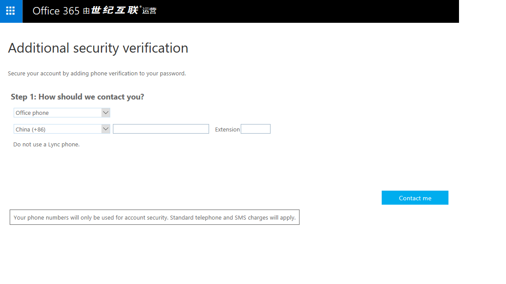

# Use office phone as your contact method with Azure Multi-Factor Authentication

If you want to use your office phone as your primary contact method you can use this article.  It will walk you through setting up multi-factor authentication to use your office phone for a call as your contact method.

## To use your office phone as your contact method

<ol>
<li>Select Office Phone from the drop-down</li>

<li>Specify your country from the drop-downn and enter your mobile phone number.</li>
<li>Select the mode you would prefer to use with your mobile phone - text or call.</li>
<li>Click Next.</li>
<li>Click the Verify Now button. This will initiate a call to your office phone.  Be sure you are near it. 
<li>Click Contact me</li>
<li>Click Done.</li>

