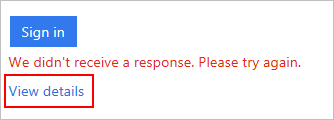

# Having trouble with two-step verification
This article discusses some issues that you may experience with two-step verification. If the issue you're having is not included here, please provide detailed feedback in the comments section so that we can improve.

## I lost my phone or it was stolen
There are two ways to get back in to your account. The first is to sign in using your alternate authentication phone number, if you have set one up. The second is to ask your administrator to clear your settings.

If your phone was lost or stolen, we also recommend that you have your administrator reset your app passwords and clear any remembered devices. If your admin isn't sure how to accomplish this, point them to this article: [Manage users and devices](../multi-factor-authentication-manage-users-and-devices.md).

### Use an alternate phone number
If you have set up multiple verification options, including a secondary phone number or an authenticator app on a different device, you can use one of these to sign in.

To sign in using the alternate phone number, follow these steps:

1. Sign in as you normally would.
2. When prompted to further verify your account, choose **Use a different verification option**.
   
    
3. Select the phone number that you have access to.
   
    
4. After you're back in your account, [manage your settings](./multi-factor-authentication-end-user-manage-settings.md) to change your authentication phone number.

> [!IMPORTANT]
> It is important to configure a secondary authentication phone number. If your primary phone number and your mobile app are on the same phone, you need a third option if your phone is lost or stolen.   

### Clear your settings
If you have not configured a secondary authentication phone number, then you will have to contact your administrator for help. Have them clear your settings so the next time you sign in, you will be prompted to [set up your account](./multi-factor-authentication-end-user-first-time.md) again.

## I am not receiving a text or call on my phone
There are several reasons why you may try to sign in, but not receive the text or phone call. If you've successfully received texts or phone calls to your phone in the past, then this is probably an issue with the phone provider, not your account. Make sure that you have good cell signal, and if you are trying to receive a text message make sure that your phone and service plan support text messages.

If you've waited several minutes for a text or call, the fastest way to get into your account is to try a different option.

1. Select **Use a different verification option** on the page that's waiting for your verification.
   
    
2. Select the phone number or delivery method you want to use.
   
    If you received multiple verification codes, only the newest one works.

If you don’t have another method configured, contact your admin and ask them to clear your settings. The next time you sign in, you will be prompted to [set up multi-factor authentication](./multi-factor-authentication-end-user-first-time.md) again.

If you often have delays due to bad cell signal, we recommend you use the [Microsoft Authenticator app](./microsoft-authenticator-app-how-to.md) on your smartphone. The app can generate random security codes that you use to sign in, and these codes don't require any cell signal or internet connection.

## I didn't find an answer to my problem.
If you've tried these troubleshooting steps but are still running into problems, contact your administrator or the person who set up multi-factor authentication for you. They should be able to assist you.

Also, you can post a question on the [Azure AD Forums](https://social.msdn.microsoft.com/Forums/zh-cn/home?forum=WindowsAzureAD) or [contact support](https://support.microsoft.com/zh-cn/contactus) and we'll respond to your problem as soon as we can.

If you contact support, include the following information:

- **User ID** - What's the email address you tried to sign in with?
- **General description of the error** - what exact error message did you see?  If there was no error message, describe the unexpected behavior you noticed, in detail.
- **Page** - what page were you on when you saw the error (include the URL)?
- **ErrorCode** - the specific error code you are receiving.
- **SessionId** - the specific session id you are receiving.
- **Correlation ID** - what was the correlation id code generated when the user saw the error.
- **Timestamp** - what was the precise date and time you saw the error (include the timezone)?

Much of this information can be found on your sign-in page. When you don't verify your sign-in in time, select **View details**.

Including this information helps us to solve your problem as quickly as possible.

## Related topics
- [Manage your settings for two-step verification](./multi-factor-authentication-end-user-manage-settings.md)  
- [Microsoft Authenticator application FAQ](./microsoft-authenticator-app-faq.md)

