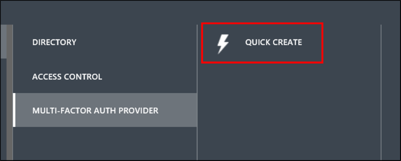
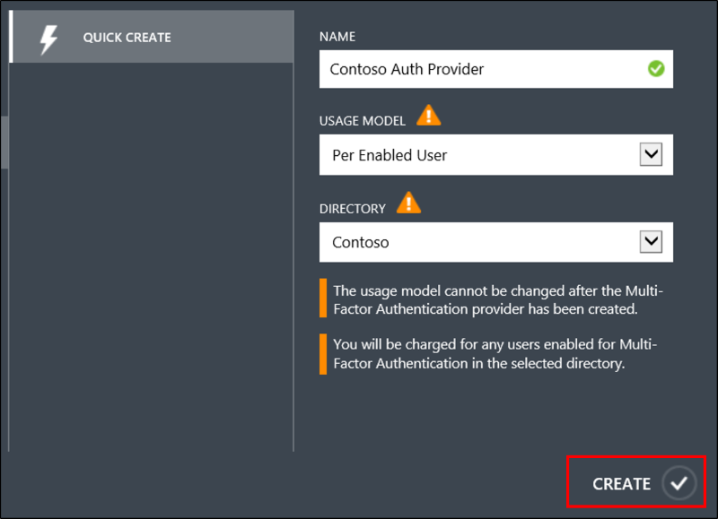

<properties
	pageTitle="Get started Azure Multi-Factor Auth Provider | Azure"
	description="Learn how to create an Azure Multi-Factor Auth Provider."
	services="multi-factor-authentication"
	documentationCenter=""
	authors="kgremban"
	manager="femila"
	editor="yossib"/>

<tags
	ms.service="multi-factor-authentication"
	ms.workload="identity"
	ms.tgt_pltfrm="na"
	ms.devlang="na"
	ms.topic="get-started-article"
	ms.date="10/14/2016"
	ms.author="kgremban"
	wacn.date=""/>

# Getting started with an Azure Multi-Factor Auth Provider
Two-step verification is available by default for global administrators who have Azure Active Directory, and Office 365 users. However, if you wish to take advantage of [advanced features](/documentation/articles/multi-factor-authentication-whats-next/) then you should purchase the full version of Azure Multi-Factor Authentication (MFA).

> [AZURE.NOTE]  An Azure Multi-Factor Auth Provider is used to take advantage of features provided by the full version of Azure MFA. It is for users who **do not have licenses through Azure MFA, Azure AD Premium, or EMS**.  Azure MFA, Azure AD Premium, and EMS include the full version of Azure MFA by default.  If you have licenses, then you do not need an Azure Multi-Factor Auth Provider.

An Azure Multi-Factor Auth provider is required to download the SDK.

> [AZURE.IMPORTANT]  To download the SDK, create an Azure Multi-Factor Auth Provider even if you have Azure MFA, AAD Premium, or EMS licenses.  If you create an Azure Multi-Factor Auth Provider for this purpose and already have licenses, be sure to create the Provider with the **Per Enabled User** model. Then, link the Provider to the directory that contains the Azure MFA, Azure AD Premium, or EMS licenses.  This ensures that you are only billed if you have more unique users using the SDK than the number of licenses you own.

## To create a Multi-Factor Auth Provider

Use the following steps to create an Azure Multi-Factor Auth Provider.

1. Sign in to the [Azure Classic Management Portal](https://manage.windowsazure.cn) as an administrator.
2. On the left, select **Active Directory**.
3. On the Active Directory page, at the top, select **Multi-Factor Authentication Providers**.

4. At the bottom, click **New**.

5. Under App Services, select **Multi-Factor Auth Provider**

6. Select **Quick Create**.

5. Fill in the following fields and select **Create**.
	1. **Name** - The name of the Multi-Factor Auth Provider.
	2. **Usage Model** - Whether you want to enable individual users, or pay per verification. Choose one of two options:
		- Per Authentication - purchasing model that charges per authentication. Typically used for scenarios that use Azure Multi-Factor Authentication in a consumer-facing application.
		- Per Enabled User - purchasing model that charges per enabled user. Typically used for employee access to applications such as Office 365. Choose this option if you have some users that are already licensed for Azure MFA.
	2. **Directory** - The Azure Active Directory tenant that the Multi-Factor Authentication Provider is associated with. Be aware of the following:
		- You do not need an Azure AD directory to create a Multi-Factor Auth Provider. Leave the box blank if you are only planning to use the Azure Multi-Factor Authentication Server or SDK.
		- The Multi-Factor Auth Provider must be associated with an Azure AD directory to take advantage of the advanced features.
		- Azure AD Connect, AAD Sync, or DirSync are only a requirement if you are synchronizing your on-premises Active Directory environment with an Azure AD directory.  If you only use an Azure AD directory that is not synchronized, then this is not required.

5. Once you click create, the Multi-Factor Authentication Provider is created and you should see a message stating: **Successfully created Multi-Factor Authentication Provider**. Click **Ok**.

