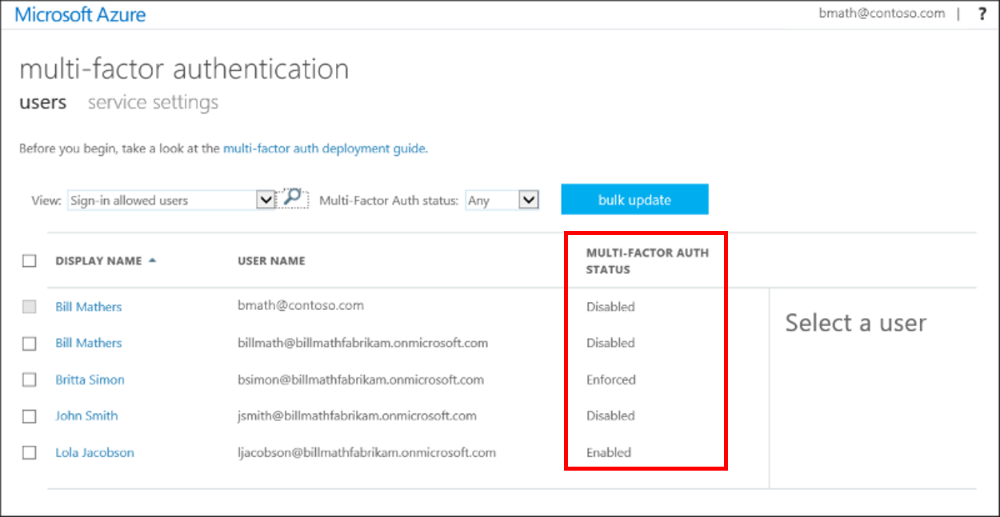
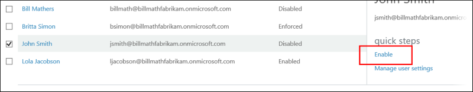

# How to require two-step verification for a user or group

**Enabling Azure Multi-Factor Authentication by changing user states** is the traditional approach for requiring two-step verification. All users that you enable perform two-step verification every time they sign in. Enabling a user overrides any conditional access policies that might affect that user. 

## Enable Azure MFA by changing user status

User accounts in Azure Multi-Factor Authentication have the following three distinct states:

| Status | Description | Non-browser apps affected | Browser apps affected | Modern authentication affected |
|:---:|:---:|:---:|:--:|:--:|
| Disabled |The default state for a new user not enrolled in Azure MFA. |No |No |No |
| Enabled |The user has been enrolled in Azure MFA, but has not registered. They receive a prompt to register the next time they sign in. |No.  They continue to work until the registration process is completed. | Yes. After the session expires, Azure MFA registration is required.| Yes. After the access token expires, Azure MFA registration is required. |
| Enforced |The user has been enrolled and has completed the registration process for Azure MFA. |Yes.  Apps require app passwords. |Yes. Azure MFA is required at login. | Yes. Azure MFA is required at login. |

A user's state reflects whether an admin has enrolled them in Azure MFA, and whether they completed the registration process.

All users start out *Disabled*. When you enroll users in Azure MFA, their state changes to *Enabled*. When enabled users sign in and complete the registration process, their state changes to *Enforced*.  

### View the status for a user

Use the following steps to access the page where you can view and manage user states:

1. Sign in to the [Azure portal](https://portal.azure.cn) as an administrator.
2. Go to **Azure Active Directory** > **Users and groups** > **All users**.
3. Select **Multi-Factor Authentication**.
   
4. A new page that displays the user states opens.
   

### Change the status for a user

1. Use the preceding steps to get to the Azure Multi-Factor Authentication **users** page.
2. Find the user you want to enable for Azure MFA. You might need to change the view at the top. 
   
3. Check the box next to their name.
4. On the right, under **quick steps**, choose **Enable** or **Disable**.
   

   >[!TIP]
   >*Enabled* users are automatically switched to *Enforced* when they register for Azure MFA. Do not manually change the user state to *Enforced*. 

5. Confirm your selection in the pop-up window that opens. 

After you enable users, notify them via email. Tell them that they'll be asked to register the next time they sign in. You can also include a link to the [Azure MFA end-user guide](./end-user/multi-factor-authentication-end-user.md) to help them get started.

### Use PowerShell
To change the user state by using [Azure AD PowerShell](https://docs.microsoft.com/powershell/azure/overview), change `$st.State`. There are three possible states:

- Enabled
- Enforced
- Disabled  

Don't move users directly to the *Enforced* state. If you do, non-browser-based apps stop working because the user has not gone through Azure MFA registration and obtained an app password.

Using PowerShell is a good option when you need to bulk enabling users. Create a PowerShell script that loops through a list of users and enables them:

        $st = New-Object -TypeName Microsoft.Online.Administration.StrongAuthenticationRequirement
        $st.RelyingParty = "*"
        $st.State = "Enabled"
        $sta = @($st)
        Set-MsolUser -UserPrincipalName bsimon@contoso.com -StrongAuthenticationRequirements $sta

The following script is an example:

    $users = "bsimon@contoso.com","jsmith@contoso.com","ljacobson@contoso.com"
    foreach ($user in $users)
    {
        $st = New-Object -TypeName Microsoft.Online.Administration.StrongAuthenticationRequirement
        $st.RelyingParty = "*"
        $st.State = "Enabled"
        $sta = @($st)
        Set-MsolUser -UserPrincipalName $user -StrongAuthenticationRequirements $sta
    }

## Next steps

- Manage Azure Multi-Factor Authentication settings for [your users and their devices](multi-factor-authentication-manage-users-and-devices.md).

<!-- Update_Description: wording update -->