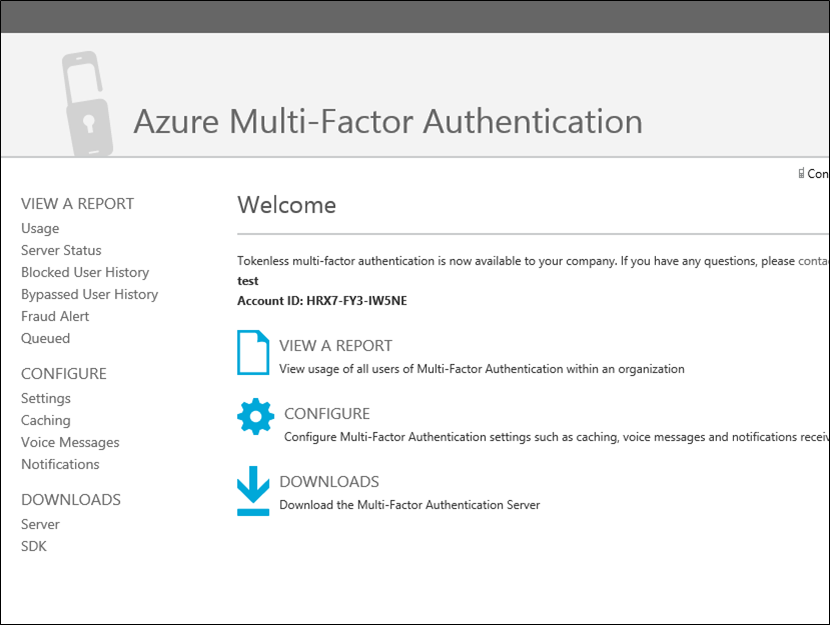
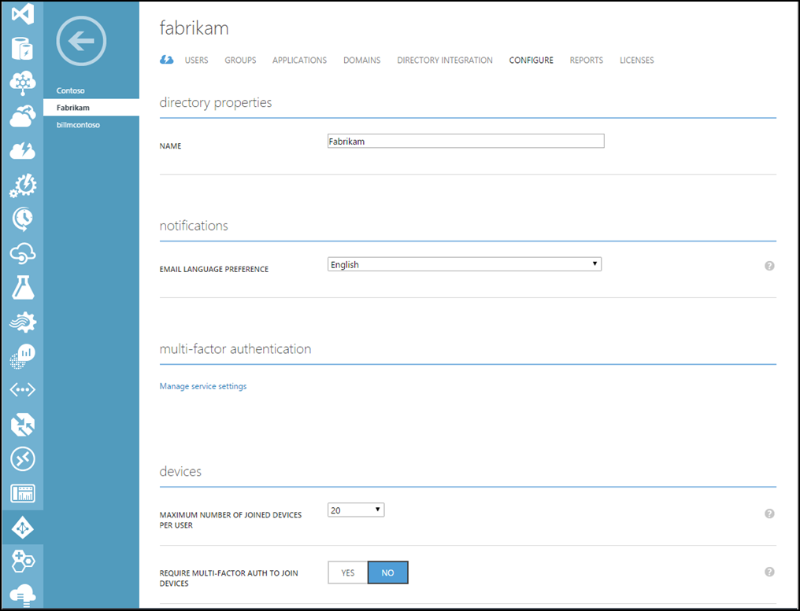

# Building Multi-Factor Authentication into Custom Apps (SDK)

> [!IMPORTANT]
>  If you wish to download the SDK, you will need to create an Azure Multi-Factor Auth Provider even if you have Azure MFA, AAD Premium, or EMS licenses.  If you create an Azure Multi-Factor Auth Provider for this purpose and already have licenses, it is required to create the Provider with the **Per Enabled User** model and link the Provider to the directory that contains the Azure MFA, Azure AD Premium, or EMS licenses.  This will ensure that you are not billed unless you have more unique users using the SDK than the number of licenses you own.

The Azure Multi-Factor Authentication Software Development Kit (SDK) lets you build telephone call and text message verification directly into the sign-in or transaction processes of applications in your Azure AD tenant.

The Multi-Factor Authentication SDK is available for C#, Visual Basic (.NET), Java, Perl, PHP and Ruby. The SDK provides a thin wrapper around multi-factor authentication. It includes everything you need to write your code, including commented source code files, example files, and a detailed ReadMe file. Each SDK also includes a certificate and private key for encrypting transactions that is unique to your Multi-Factor Authentication Provider. As long as you have a provider, you can download the SDK in as many languages and formats as you need.

The structure of the APIs in the Multi-Factor Authentication SDK is quite simple. You make a single function call to an API with the multi-factor option parameters, such as the verification mode, and user data, such as the telephone number to call or the PIN number to validate. The APIs translate the function call into web services requests to the cloud-based Azure Multi-Factor Authentication Service. All calls must include a reference to the private certificate that is included in every SDK.

Because the APIs do not have access to users registered in Azure Active Directory, you must provide user information, such as phone numbers and PIN codes, in a file or database. Also, the APIs do not provide enrollment or user management features, so you need to build these processes into your application.

## Download the Azure Multi-Factor Authentication SDK 

Downloading the Azure Multi-Factor SDK requires an [Azure Multi-Factor Auth Provider](./multi-factor-authentication-get-started-auth-provider.md).  This requires a full Azure subscription, even if Azure MFA, Azure AD Premium, or Enterprise Mobility Suite licenses are owned.  To download the SDK, you must navigate to the Multi-Factor Management Portal either by managing the Multi-Factor Auth Provider directly, or by clicking the **"Go to the portal"** link on the MFA service settings page.

### To download the Azure Multi-Factor Authentication SDK from the Azure portal

1. Sign in to the Azure Portal as an Administrator.
2. On the left, select Active Directory.
3. On the Active Directory page, at the top click **Multi-Factor Auth Providers**
4. At the bottom click **Manage**
5. This will open a new page.  On the left, at the bottom, click SDK.
<center></center>
6. Select the language you want and click on one the associated download links.
7. Save the download.

### To download the Azure Multi-Factor Authentication SDK via the service settings

1. Sign in to the Azure Portal as an Administrator.
2. On the left, select Active Directory.
3. Double click on your instance of Azure AD.
4. At the top click **Configure**
5. Under multi-factor authentication select **Manage service settings**

6. On the services settings page, at the bottom of the screen click **Go to the portal**.

7. This will open a new page.  On the left, at the bottom, click SDK.
8. Select the language you want and click on one the associated download links.
9. Save the download.

## Contents of the Azure Multi-Factor Authentication SDK
Inside the SDK you will find the following items:

- **README**. Explains how to use the Multi-Factor Authentication APIs in a new or existing application.
- **Source file(s)** for Multi-Factor Authentication
- **Client certificate** that you use to communicate with the Multi-Factor Authentication service
- **Private key** for the certificate
- **Call results.** A list of call result codes. To open this file, use an application with text formatting, such as WordPad. Use the call result codes to test and troubleshoot the implementation of Multi-Factor Authentication in your application. They are not authentication status codes.
- **Examples.** Sample code for a basic working implementation of Multi-Factor Authentication.

>[!WARNING]
>The client certificate is a unique private certificate that was generated especially for you. Do not share or lose this file. It’s your key to ensuring the security of your communications with the Multi-Factor Authentication service.

## Code Sample: Standard Mode Phone Verification

This code sample shows you how to use the APIs in the Azure Multi-Factor Authentication SDK to add standard mode voice call verification to your application. Standard mode is a telephone call that the user responds to by pressing the # key.

This example uses the C# .NET 2.0 Multi-Factor Authentication SDK in a basic ASP.NET application with C# server-side logic, but the process is very similar for simple implementations in other languages. Because the SDK includes source files, not executable files, you can build the files and reference them or include them directly in your application.

>[!NOTE]
>When implementing Multi-Factor Authentication, use the additional factors as secondary or tertiary verification to supplement your primary authentication method. These methods are not designed to be used as primary authentication methods.

### Code Sample Overview
This sample code for a very simple web demo application uses a telephone call with a # key response to complete the user's authentication. This telephone call factor is known in Multi-Factor Authentication as standard mode.

The client-side code does not include any Multi-Factor Authentication-specific elements. Because the additional authentication factors are independent of the primary authentication, you can add them without changing the existing sign-on interface. The APIs in the Multi-Factor SDK let you customize the user experience, but you might not need to change anything at all.

The server-side code adds standard-mode authentication in Step 2. It creates a PfAuthParams object with the parameters that are required for standard-mode verification: username, telephone number, and mode, and the path to the client certificate (CertFilePath), which is required in each call. For a demonstration of all parameters in PfAuthParams, see the Example file in the SDK.

Next, the code passes the PfAuthParams object to the pf_authenticate() function. The return value indicates the success or failure of the authentication. The out parameters, callStatus and errorID, contain additional call result information. The call result codes are documented in the call results file in the SDK.

This minimal implementation can be written in a just a few lines. However, in production code, you would include more sophisticated error handling, additional database code, and an enhanced user experience.

### Web Client Code

The following is web client code for a demo page.

```
<%@ Page Language="C#" AutoEventWireup="true" CodeFile="Default.aspx.cs" Inherits="_Default" %>

<!DOCTYPE html>

<html xmlns="http://www.w3.org/1999/xhtml">
<head runat="server">
<title>Multi-Factor Authentication Demo</title>
</head>
<body>
<h1>Azure Multi-Factor Authentication Demo</h1>
<form id="form1" runat="server">

<div style="width:auto; float:left">
Username:&nbsp;<br />
Password:&nbsp;<br />
</div>

<div">
<asp:TextBox id="username" runat="server" width="100px"/><br />
<asp:Textbox id="password" runat="server" width="100px" TextMode="password" /><br />
</div>

<asp:Button id="btnSubmit" runat="server" Text="Log in" onClick="btnSubmit_Click"/>

<p><asp:Label ID="lblResult" runat="server"></asp:Label></p>

</form>
</body>
</html>
```

### Server-Side Code

In the following server-side code, Multi-Factor Authentication is configured and run in Step 2. Standard mode (MODE_STANDARD) is a telephone call to which the user responds by pressing the # key. 

```
using System;
using System.Collections.Generic;
using System.Linq;
using System.Web;
using System.Web.UI;
using System.Web.UI.WebControls;

public partial class _Default : System.Web.UI.Page
{
    protected void Page_Load(object sender, EventArgs e)
    {
    }

    protected void btnSubmit_Click(object sender, EventArgs e)
    {
        // Step 1: Validate the username and password
        if (username.Text != "Contoso" || password.Text != "password")
        {
            lblResult.ForeColor = System.Drawing.Color.Red;
            lblResult.Text = "Username or password incorrect.";
        }
        else
        {
            // Step 2: Perform multi-factor authentication

            // Add call details from the user database.
            PfAuthParams pfAuthParams = new PfAuthParams();
            pfAuthParams.Username = username.Text;
            pfAuthParams.Phone = "9134884271";
            pfAuthParams.Mode = pf_auth.MODE_STANDARD;

            // Specify a client certificate 
            // NOTE: This file contains the private key for the client
            // certificate. It must be stored with appropriate file 
            // permissions.
            pfAuthParams.CertFilePath = "c:\\cert_key.p12";

            // Perform phone-based authentication
            int callStatus;
            int errorId;

            if(pf_auth.pf_authenticate(pfAuthParams, out callStatus, out errorId))
            {
                lblResult.ForeColor = System.Drawing.Color.Green;
                lblResult.Text = "Multi-Factor Authentication succeeded.";
            }
            else
            {
                lblResult.ForeColor = System.Drawing.Color.Red;
                lblResult.Text = " Multi-Factor Authentication failed.";
            }
        }

    }
}
```