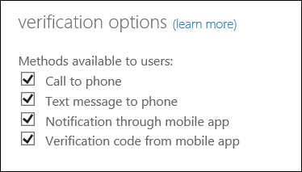

# Configure Azure Multi-Factor Authentication settings

This article helps you to manage Azure Multi-Factor Authentication now that you're up and running. It covers various topics that help you to get the most out of Azure Multi-Factor Authentication. Not all of the features are available in every version of Azure Multi-Factor Authentication.

| Feature | Description | 
|:--- |:--- |
| [Selectable verification methods](#selectable-verification-methods) |Use this feature to select the list of authentication methods that users are able to use. |

## Selectable verification methods
You can choose the verification methods that are available for your users by using the _selectable verification methods_ feature. The following table provides a brief overview of the methods.

When your users enroll their accounts for Azure Multi-Factor Authentication, they choose their preferred verification method from the options that you have enabled. Guidance for the user enrollment process is provided in [Set up my account for two-step verification](./end-user/multi-factor-authentication-end-user-first-time.md).

| Method | Description |
|:--- |:--- |
| Call to phone |Places an automated voice call. The user answers the call and presses # in the phone keypad to authenticate. The phone number is not synchronized to on-premises Active Directory. |
| Text message to phone |Sends a text message that contains a verification code. The user is prompted to enter the verification code into the sign-in interface. This process is called one-way SMS. Two-way SMS means that the user must text back a particular code. Two-way SMS is deprecated and not supported after November 14, 2018. Users who are configured for two-way SMS are automatically switched to _call to phone_ verification at that time.|
| Notification through mobile app |Sends a push notification to your phone or registered device. The user views the notification and selects **Verify** to complete verification. The Microsoft Authenticator app is available for [Windows Phone](http://go.microsoft.com/fwlink/?Linkid=825071), [Android](http://go.microsoft.com/fwlink/?Linkid=825072), and [iOS](http://go.microsoft.com/fwlink/?Linkid=825073). |
| Verification code from mobile app |The Microsoft Authenticator app generates a new OATH verification code every 30 seconds. The user enters the verification code into the sign-in interface. The Microsoft Authenticator app is available for [Windows Phone](http://go.microsoft.com/fwlink/?Linkid=825071), [Android](http://go.microsoft.com/fwlink/?Linkid=825072), and [iOS](http://go.microsoft.com/fwlink/?Linkid=825073). |

### Enable and disable verification methods
1. Sign in to the [Azure portal](https://portal.azure.cn).

2. On the left, select **Azure Active Directory** > **Users and groups** > **All users**.

3. Select **Multi-Factor Authentication**.

4. Under Multi-Factor Authentication, select **service settings**.

5. On the **Service Settings** page, under **verification options**, select/unselect the methods to provide to your users.

   

6. Click **Save**.

<!--Update_Description: update metedata properties -->
