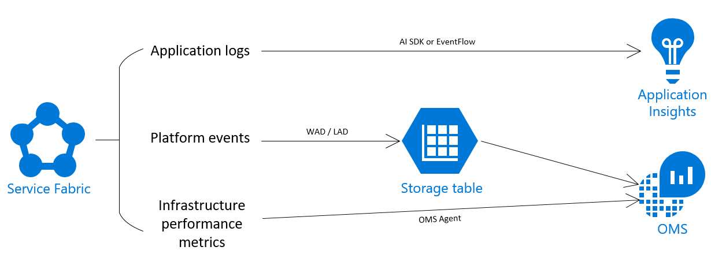
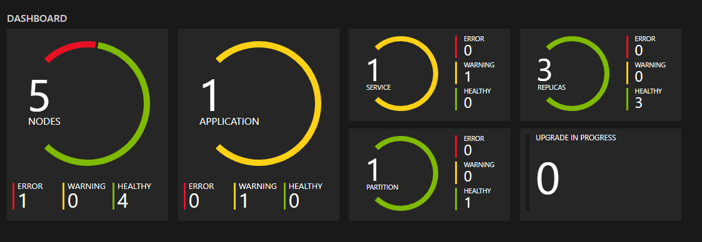

# Monitoring and diagnostics for Azure Service Fabric

This article provides an overview of monitoring and diagnostics for Azure Service Fabric. Monitoring and diagnostics are critical to developing, testing, and deploying workloads in any cloud environment. Monitoring enables you to track how your applications are used, your resource utilization, and the overall health of your cluster. You can use this information to diagnose and correct any issues, and prevent issues from occurring in the future. 

The main goals of monitoring and diagnostics are to:
* Detect and diagnose infrastructure issues
* Detect issues with your application
* Understand resource consumption
* Track application, service, and infrastructure performance

In a Service Fabric cluster, monitoring and diagnostics data comes from three levels: application, platform (cluster), and infrastructure. 
* The [application level](service-fabric-diagnostics-event-generation-app.md) includes data about the performance of your applications and any additional custom logging that you have added. Application monitoring data should end up in Application Insights (AI) from the application itself. It can come via the AI SDK, EventFlow, or another pipeline of your choice.
* The [platform level](service-fabric-diagnostics-event-generation-infra.md) includes events from actions being taken on your cluster, related to the management of the cluster and the applications running on it. Platform monitoring data should be sent to OMS Log Analytics, with the Service Fabric Analytics solution to help visualize the incoming events. This data is typically sent to a storage account via the Windows or Linux Azure Diagnostics extension, from where it is accessed by OMS Log Analytics. 
* The infrastructure level focuses on [performance monitoring](service-fabric-diagnostics-event-generation-perf.md), looking at key metrics and performance counters to determine resource utilization and load. Performance monitoring can be achieved by using an agent - we recommend using the OMS (Microsoft Monitoring) Agent, so that your performance data ends up in the same place as your platform events, which allows for a better diagnostics experience as you correlate changes across a cluster. 

## Monitoring scenarios

This section discusses key scenarios for monitoring a Service Fabric cluster - application, cluster, performance, and health monitoring. For each scenario, the intent and overall approach for monitoring is discussed. More details on these and other general monitoring recommendations for Azure resources can be found at [Best Practices - Monitoring and diagnostics](https://docs.microsoft.com/azure/architecture/best-practices/monitoring). 

These scenarios are also loosely mapped to the three levels of monitoring and diagnostics data as discussed above, i.e. for each scenario to be appropriately handled in the cluster, you should have monitoring and diagnostics data coming in at the corresponding level. The health monitoring scenario is an exception, since it spans the cluster and everything running in it.

## Application monitoring
Application monitoring tracks how features and components of your application are being used. You want to monitor your applications to make sure issues that impact users are caught. Monitoring your applications can be useful in the following scenarios:
* Determining application load and user traffic - do you need to scale your services to meet user demands or address a potential bottleneck in your application?
* Identifying issues with service communication and remoting across your cluster
* Figuring out what your users are doing with your application - collecting telemetry in your applications can help guide future feature development and better diagnostics for app errors
* Monitoring what is happening inside your running containers
<!-- Not Avaiable on Application Insight(AI) -->

## Platform (Cluster) monitoring
Monitoring your Service Fabric cluster is critical in ensuring that the platform and all workloads are running as intended. One of Service Fabric's goals is to keep applications resilient to hardware failures. This goal is achieved through the platform's system services' ability to detect infrastructure issues and rapidly failover workloads to other nodes in the cluster. But in this particular case, what if the system services themselves have issues? Or if in attempting to move a workload, rules for the placement of services are violated? Monitoring the cluster allows you to stay informed about activity taking place in your cluster, which helps in diagnosing issues and fixing them effectively. Some key things you want to be looking out for are:
* Is Service Fabric behaving the way you expect, in terms of placing your applications and balancing work around the cluster? 
* Are user actions taken on your cluster acknowledged and executed on as expected? This is especially relevant when scaling a cluster.
* Is Service Fabric handling your data and your service-service communication inside the cluster correctly?

Service Fabric provides a comprehensive set of events out of the box, through the Operational and the Data & Messaging channels. In Windows, these are in the form of a single ETW provider with a set of relevant `logLevelKeywordFilters` used to pick between different channels. On Linux, all of the platform events come through LTTng and are put into one table, from where they can be filtered as needed. 

These channels contain curated, structured events that can be used to better understand the state of your cluster. Diagnostics are enabled by default at the cluster creation time, which create an Azure Storage table where the events from these channels are sent for you to query in the future. You can read more about monitoring your cluster at [Platform level event and log generation](service-fabric-diagnostics-event-generation-infra.md).

For collecting the logs and events being generated by your cluster, we generally recommend using the [Azure Diagnostics extension](service-fabric-diagnostics-event-aggregation-wad.md). This integrates well with
 Service Fabric Analytics, that provides a custom dashboard for monitoring Service Fabric clusters, and allows you to query your cluster's events and set up alerts.
<!-- Not Available on [Event analysis with OMS](service-fabric-diagnostics-event-analysis-oms.md) -->
<!-- Not Available on  OMS Log Analytics Service Fabric specific solution -->

## Performance monitoring
Monitoring your underlying infrastructure is a key part of understanding the state of your cluster and your resource utilization. Measuring system performance depends on several factors, each of which is typically measured through a Key Performance Indicators (KPIs). Service Fabric relevant KPIs can be mapped to metrics that can be collected from the nodes in your cluster, as performance counters.
These KPIs can help with:
* Understanding resource utilization and load - for the purpose of scaling your cluster, or optimizing your service processes.
* Predicting infrastructure issues - many issues are preceded by sudden changes (drops) in performance, so you can use KPIs such as network I/O and CPU utilization to predict and diagnose infrastructural issues.

A list of performance counters that should be collected at the infrastructure level can be found at [Performance metrics](service-fabric-diagnostics-event-generation-perf.md). 

Service Fabric provides a set of performance counters for the Reliable Services and Actors programming models. If you are using either of these models, these performance counters can provide KPIs that help ensure that your actors are spinning up and down correctly, or that your reliable service requests are being handled fast enough. For more information, see [Monitoring for Reliable Service Remoting](service-fabric-reliable-serviceremoting-diagnostics.md#performance-counters) and [Performance monitoring for Reliable Actors](service-fabric-reliable-actors-diagnostics.md#performance-counters). In addition to this, Application Insights also has a set of performance metrics it will collect, if configured with your application.

<!-- Not Available on [OMS agent](service-fabric-diagnostics-oms-agent.md)-->

## Health monitoring
The Service Fabric platform includes a health model, which provides extensible health reporting for the status of entities in a cluster. Each node, application, service, partition, replica, or instance, has a continuously updatable health status. The health status can either be "OK", "Warning", or "Error". The health status is changed through health reports that are emitted for each entity, based on issues in the cluster. The health status of your entities can be checked at any time in Service Fabric Explorer (SFX) as shown below, or can be queried via the platforms's Health API. You can also customize health reports and modify the health status of an entity by adding your own health reports or using the Health API. More details on the health model can be found at [Introduction to Service Fabric health monitoring](service-fabric-health-introduction.md).

## Other logging solutions

Many events are written out through etw providers and are extensible with other logging solutions. You should also look into the [Elastic Stack](https://www.elastic.co/products) (especially if you are considering running a cluster in an offline environment), [Splunk](https://www.splunk.com/), [Dynatrace](https://www.dynatrace.com/), or any other platform of your preference. 
<!-- Not Available on [OMS](service-fabric-diagnostics-event-analysis-oms.md)-->
<!-- Not Available on [Application Insights](service-fabric-diagnostics-event-analysis-appinsights.md)-->

The key points for any platform you choose should include how comfortable you are with the user interface and querying options, the ability to visualize data and create easily readable dashboards, and the additional tools they provide to enhance your monitoring, such as automated alerting.

## Next steps

* For getting started with instrumenting your applications, see [Application level event and log generation](service-fabric-diagnostics-event-generation-app.md).
* Learn more about monitoring the platform and the events Service Fabric provides for you at [Platform level event and log generation](service-fabric-diagnostics-event-generation-infra.md).
<!-- Not Avaiable on * Go through the steps to set up AI for your application with [Monitor and diagnose an ASP.NET Core application on Service Fabric](service-fabric-tutorial-monitoring-aspnet.md) -->
<!-- Not Avaiable on * Learn how to set up OMS Log Analytics for monitoring containers - [Monitoring and Diagnostics for Windows Containers in Azure Service Fabric](service-fabric-tutorial-monitoring-wincontainers.md) -->
* Learn about general monitoring recommendations for Azure resources - [Best Practices - Monitoring and diagnostics](https://docs.microsoft.com/azure/architecture/best-practices/monitoring).
<!--Update_Description: update meta properties, wording update, update link  -->