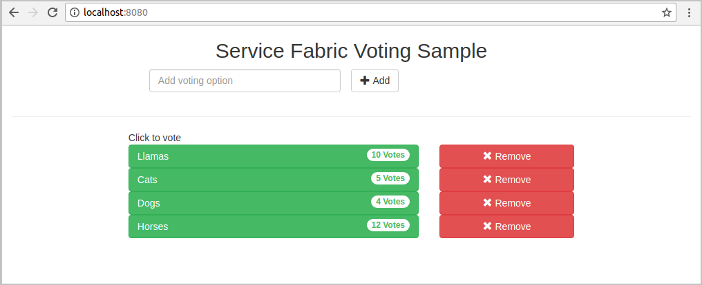
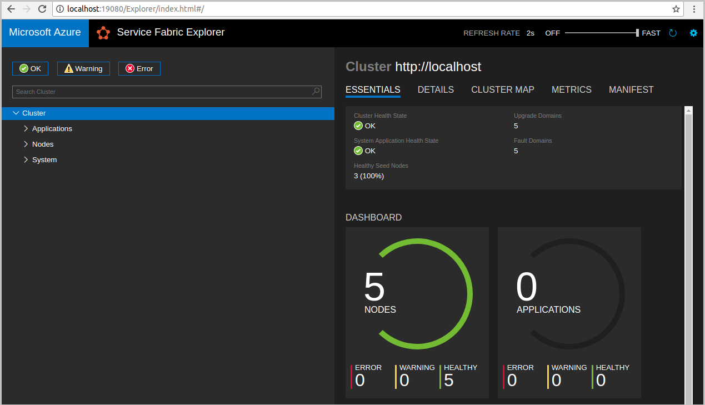
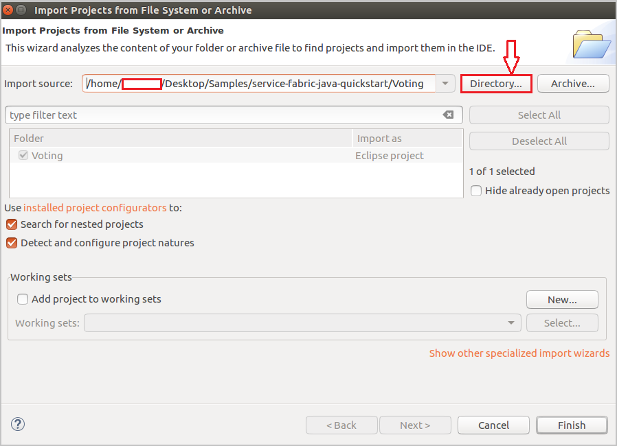
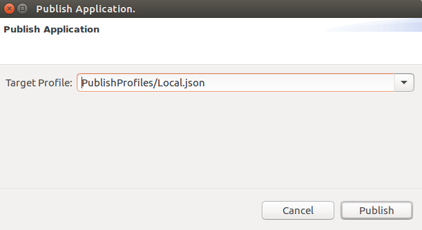
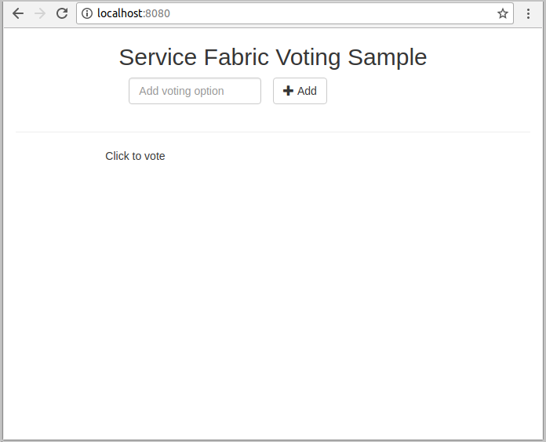
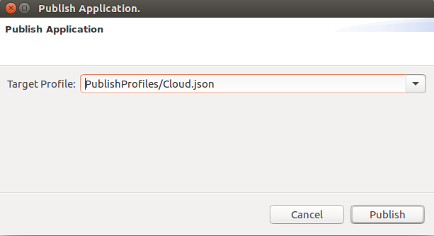
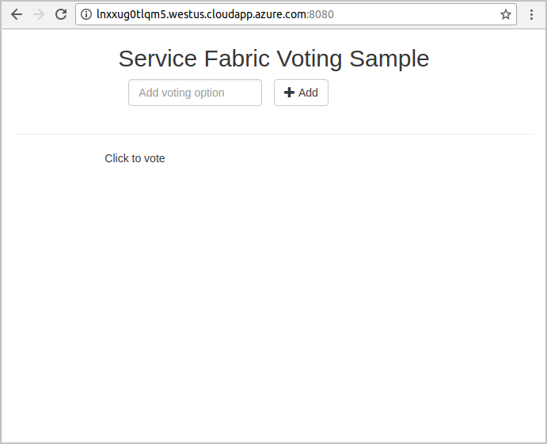
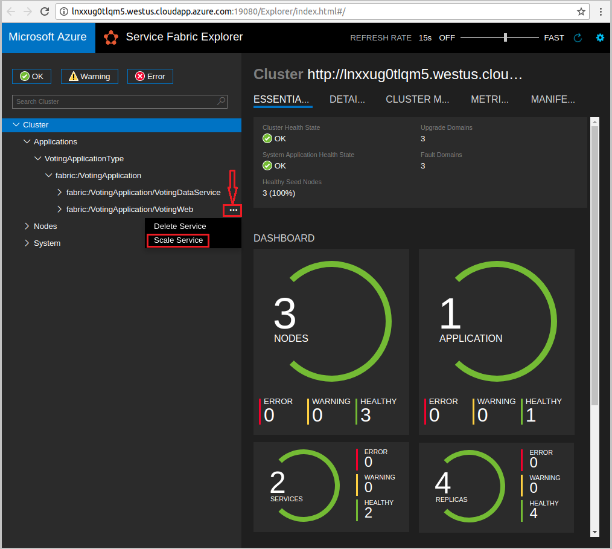
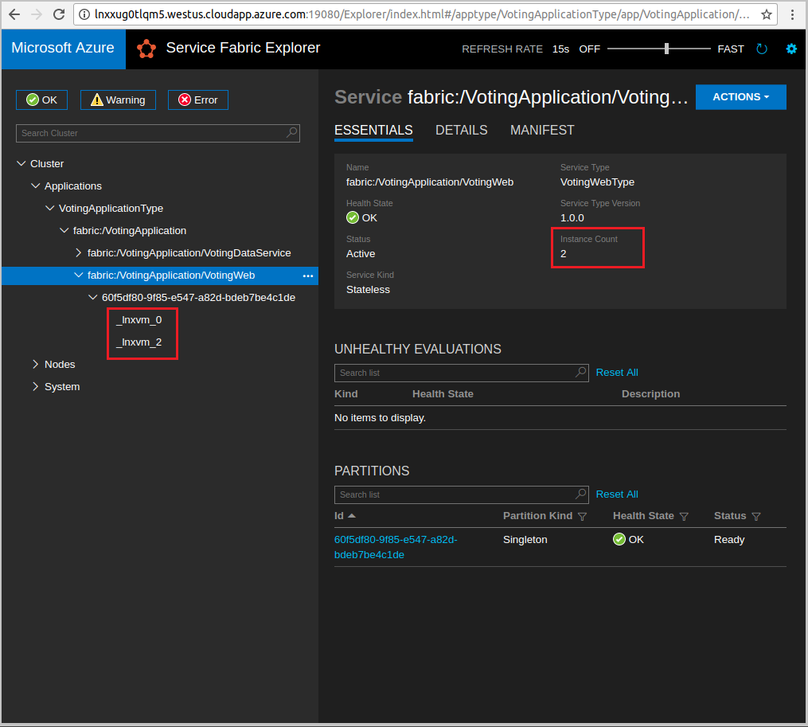

# Quickstart: deploy a Java Service Fabric reliable services application to Azure
Azure Service Fabric is a distributed systems platform for deploying and managing microservices and containers. 

This quickstart shows how to deploy your first Java application to Service Fabric using the Eclipse IDE on a Linux developer machine. When you're finished, you have a voting application with a Java web front end that saves voting results in a stateful back-end service in the cluster.



In this quickstart, you learn how to:

* Use Eclipse as a tool for your Service Fabric Java applications
* Deploy the application to your local cluster 
* Deploy the application to a cluster in Azure
* Scale-out the application across multiple nodes

## Prerequisites
To complete this quickstart:
1. [Install Service Fabric SDK & Service Fabric Command Line Interface (CLI)](/service-fabric/service-fabric-get-started-linux#installation-methods)
2. [Install Git](https://git-scm.com/)
3. [Install Eclipse](https://www.eclipse.org/downloads/)
4. [Set up Java Environment](/service-fabric/service-fabric-get-started-linux#set-up-java-development), making sure to follow the optional steps to install the Eclipse plug-in 

## Download the sample
In a command window, run the following command to clone the sample app repository to your local machine.
```
git clone https://github.com/Azure-Samples/service-fabric-java-quickstart.git
```

## Run the application locally
1. Start your local cluster by running the following command:

    ```bash
    sudo /opt/microsoft/sdk/servicefabric/common/clustersetup/devclustersetup.sh
    ```
    The startup of the local cluster takes some time. To confirm that the cluster is fully up, access the Service Fabric Explorer at **http://localhost:19080**. The five healthy nodes indicate the local cluster is up and running. 

    

2. Open Eclipse.
3. Click File -> Open Projects from File System... 
4. Click Directory and choose the `Voting` directory from the `service-fabric-java-quickstart` folder you cloned from Github. Click Finish. 

    

5. You now have the `Voting` project in the Package Explorer for Eclipse. 
6. Right click on the project and select **Publish Application...** under the **Service Fabric** dropdown. Choose **PublishProfiles/Local.json** as the Target Profile and click Publish. 

    

7. Open your favorite web browser and access the application by accessing **http://localhost:8080**. 

    

You can now add a set of voting options, and start taking votes. The application runs and stores all data in your Service Fabric cluster, without the need for a separate database.

## Deploy the application to Azure

### Set up your Azure Service Fabric Cluster
To deploy the application to a cluster in Azure, create your own cluster.

<!-- Not Avaiable on Party clusters [follow the instructions](http://aka.ms/tryservicefabric) -->

For information about creating your own cluster, see [Create a Service Fabric cluster on Azure](service-fabric-tutorial-create-vnet-and-linux-cluster.md).

> [!Note]
> The Spring Boot service is configured to listen on port 8080 for incoming traffic. Make sure that port is open in your cluster. 
>
<!-- Not Avaiable on Party Cluster -->

### Deploy the application using Eclipse
Now that the application and your cluster are ready, you can deploy it to the cluster directly from Eclipse.

1. Open the **Cloud.json** file under the **PublishProfiles** directory and fill in the `ConnectionIPOrURL` and `ConnectionPort` fields appropriately. An example is provided: 

    ```bash
    {
         "ClusterConnectionParameters": 
         {
            "ConnectionIPOrURL": "lnxxug0tlqm5.chinanorth.cloudapp.chinacloudapi.cn",
            "ConnectionPort": "19080",
            "ClientKey": "[path_to_your_pem_file_on_local_machine]",
            "ClientCert": "[path_to_your_pem_file_on_local_machine]"
         }
    }
    ```

2. Right click on the project and select **Publish Application...** under the **Service Fabric** dropdown. Choose **PublishProfiles/Cloud.json** as the Target Profile and click Publish. 

    

3. Open your web browser and access the application by accessing **http://\<ConnectionIPOrURL>:8080**. 

    

## Scale applications and services in a cluster
Services can be scaled across a cluster to accommodate for a change in the load on the services. You scale a service by changing the number of instances running in the cluster. There are many ways of scaling your services; for example, you can use scripts or commands from Service Fabric CLI (sfctl). The following steps, use Service Fabric Explorer.

Service Fabric Explorer runs in all Service Fabric clusters and can be accessed from a browser by browsing to the cluster's HTTP management port (19080); for example, `http://lnxxug0tlqm5.chinanorth.cloudapp.chinacloudapi.cn:19080`.

To scale the web front-end service, do the following:

1. Open Service Fabric Explorer in your cluster - for example, `https://lnxxug0tlqm5.chinanorth.cloudapp.chinacloudapi.cn:19080`.
2. Click on the ellipsis (three dots) next to the **fabric:/Voting/VotingWeb** node in the treeview and choose **Scale Service**.

    

    You can now choose to scale the number of instances of the web front-end service.

3. Change the number to **2** and click **Scale Service**.
4. Click on the **fabric:/Voting/VotingWeb** node in the tree-view and expand the partition node (represented by a GUID).

    

    You can now see that the service has two instances, and in the tree view you see which nodes the instances run on.

Through this simple management task, you've doubled the resources available for the front-end service to process user load. It's important to understand that you don't need multiple instances of a service for it to run reliably. If a service fails, Service Fabric makes sure that a new service instance runs in the cluster.

## Next steps
In this quickstart, you learned how to:

* Use Eclipse as a tool for your Service Fabric Java applications
* Deploy Java applications to your local cluster 
* Deploy Java applications to a cluster in Azure
* Scale-out the application across multiple nodes

To learn more about working with Java apps in Service Fabric, continue to the tutorial for Java apps.

> [!div class="nextstepaction"]
> [Deploy a Java app](./service-fabric-tutorial-create-java-app.md)
<!-- Update_Description: update meta properties, wording udpate -->