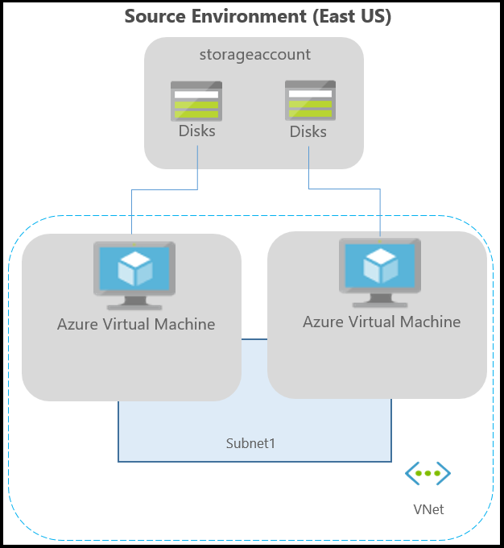
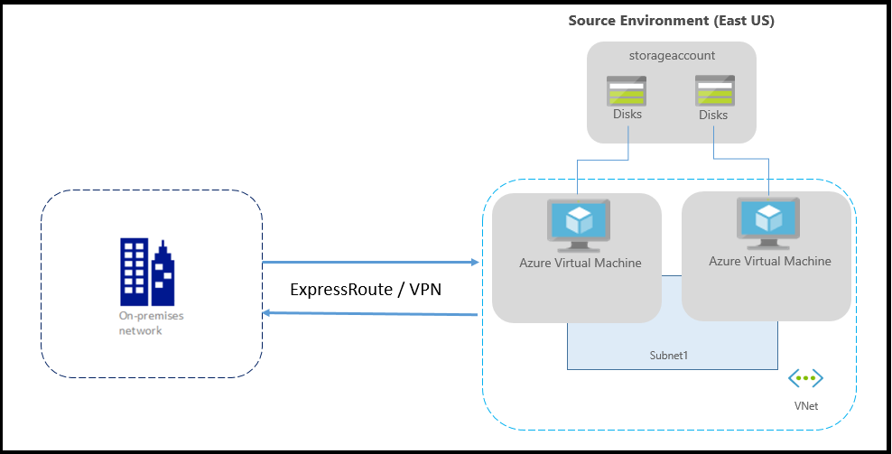

# About networking in Azure to Azure replication

> [!NOTE]
> Site Recovery replication for Azure virtual machines is currently in preview.

This article provides networking guidance when you're replicating and recovering Azure VMs from one region to another, using [Azure Site Recovery](site-recovery-overview.md). 

## Before you start

Learn how Site Recovery provides disaster recovery for [this scenario](azure-to-azure-architecture.md).

## Typical network infrastructure

The following diagram depicts a typical Azure environment, for applications running on Azure VMs:

If you're using Azure ExpressRoute or a VPN connection from your on-premises network to Azure, the environment looks like this:

Typically, networks are protected using firewalls and network security groups (NSGs). Firewalls use URL or IP-based whitelisting to control network connectivity. NSGs provide rules that use IP address ranges to control network connectivity.

> [!IMPORTANT]
> Using an authenticated proxy to control network connectivity isn't supported by Site Recovery, and replication can't be enabled.

## Outbound connectivity for URLs

If you are using a URL-based firewall proxy to control outbound connectivity, allow these Site Recovery URLs:

**URL** | **Details**  
--- | ---
*.blob.core.chinacloudapi.cn | Required so that data can be written to the cache storage account in the source region from the VM.
login.chinacloudapi.cn | Required for authorization and authentication to the Site Recovery service URLs.
*.hypervrecoverymanager.windowsazure.cn | Required so that the Site Recovery service communication can occur from the VM.
*.servicebus.chinacloudapi.cn | Required so that the Site Recovery monitoring and diagnostics data can be written from the VM.

## Outbound connectivity for IP address ranges

If you are using an IP-based firewall proxy, or NSG rules to control outbound connectivity, these IP ranges need to be allowed.

- All IP address ranges that correspond to the source location.
    - You can download the [IP address ranges](https://www.microsoft.com/download/details.aspx?id=42064).
    - You need to allow these addresses so that data can be written to the cache storage account, from the VM.
- All IP address ranges that correspond to Office 365 [authentication and identity IP V4 endpoints](https://support.office.com/article/Office-365-URLs-and-IP-address-ranges-8548a211-3fe7-47cb-abb1-355ea5aa88a2#bkmk_identity).
    - If new address are added to the Office 365 ranges in the future, you need to create new NSG rules.
- Site Recovery service endpoint IP addresses. These are available in an [XML file](https://aka.ms/site-recovery-public-ips),and depend on your target location.
-  You can [download and use this script](https://gallery.technet.microsoft.com/Azure-Recovery-script-to-0c950702), to automatically create the required rules on the NSG. 
- We recommend that you create the required NSG rules on a test NSG, and verify that there are no problems before you create the rules on a production NSG.
- To create the required number of NSG rules, ensure that your subscription is whitelisted. Contact Azure support to increase the NSG rule limit in your subscription.
<!-- Not Available
Waiting for the PM reply
## Example NSG configuration

This example shows how to configure NSG rules for a VM to replicate. 

- If you're using NSG rules to control outbound connectivity, use "Allow HTTPS outbound" rules for all the required IP address ranges.
- The example presumes that the VM source location is "China East" and the target location is "China North.

* Create rules that correspond to [China East IP ranges](https://www.microsoft.com/download/details.aspx?id=42064). This is required so that data can be written to the cache storage account from the VM.

* Create rules for all IP ranges that correspond to Office 365 [authentication and identity IP V4 endpoints](https://support.office.com/article/Office-365-URLs-and-IP-address-ranges-8548a211-3fe7-47cb-abb1-355ea5aa88a2#bkmk_identity).

* Create rules that correspond to the target location:

   **Location** | **Site Recovery service IPs** |  **Site Recovery monitoring IP**
    --- | --- | ---
   China North | 40.69.144.231 | 52.165.34.144

### NSG rules on the China North network security group

These rules are required so that replication can be enabled from the target region to the source region post-failover:

* Rules that correspond to [China North IP ranges](https://www.microsoft.com/download/details.aspx?id=42064). These are required so that data can be written to the cache storage account from the VM.

* Rules for all IP ranges that correspond to Office 365 [authentication and identity IP V4 endpoints](https://support.office.com/article/Office-365-URLs-and-IP-address-ranges-8548a211-3fe7-47cb-abb1-355ea5aa88a2#bkmk_identity).

* Rules that correspond to the source location:

   **Location** | **Site Recovery service IPs** |  **Site Recovery monitoring IP**
    --- | --- | ---
   China East | 13.82.88.226 | 104.45.147.24

-->

## ExpressRoute/VPN 

If you have an ExpressRoute or VPN connection between on-premises and Azure location, follow the guidelines in this section.

### Forced tunneling

Typically, you define a default route (0.0.0.0/0) that forces outbound Internet traffic to flow through the on-premises location. We do not recommend this. The replication traffic and Site Recovery service communication should not leave the Azure boundary. The solution is to add user-defined routes (UDRs) for [these IP ranges](#outbound-connectivity-for-azure-site-recovery-ip-ranges) so that the replication traffic doesn't go on-premises.

### Connectivity 

Follow these guidelines for connections between the target location and the on-premises location:
- If your application needs to connect to the on-premises machines or if there are clients that connect to the application from on-premises over VPN/ExpressRoute, ensure that you have at least a [site-to-site connection](../vpn-gateway/vpn-gateway-howto-site-to-site-resource-manager-portal.md) between your target Azure region and the on-premises datacenter.

- If you expect a lot of traffic to flow between your target Azure region and the on-premises datacenter, you should create another [ExpressRoute connection](../expressroute/expressroute-introduction.md) between the target Azure region and the on-premises datacenter.

- If you want to retain IPs for the virtual machines after they fail over, keep the target region's site-to-site/ExpressRoute connection in a disconnected state. This is to make sure there is no range clash between the source region's IP ranges and target region's IP ranges.

### ExpressRoute configuration
Follow these best practices for ExpressRoute configuration:

- You need to create an ExpressRoute circuit in both the source and target regions. Then you need to create a connection between:
  - The source virtual network and the ExpressRoute circuit.
  - The target virtual network and the ExpressRoute circuit.

- As part of ExpressRoute standard, you can create circuits in the same geopolitical region. To create ExpressRoute circuits in different geopolitical regions, Azure ExpressRoute Premium is required, which involves an incremental cost. (If you are already using ExpressRoute Premium, there is no extra cost.) For more details, see the [ExpressRoute locations document](../expressroute/expressroute-locations.md) and [ExpressRoute pricing](https://www.azure.cn/pricing/details/expressroute/).
<!-- Archor is not Exist on #azure-regions-to-expressroute-locations-within-a-geopolitical-region -->

- We recommend that you use different IP ranges in source and target regions. The ExpressRoute circuit won't be able to connect with two Azure virtual networks of the same IP ranges at the same time.

- You can create virtual networks with the same IP ranges in both regions and then create ExpressRoute circuits in both regions. In the case of a failover event, disconnect the circuit from the source virtual network, and connect the circuit in the target virtual network.

 >[!IMPORTANT]
 > If the primary region is completely down, the disconnect operation can fail. That will prevent the target virtual network from getting ExpressRoute connectivity.

## Next steps
Start protecting your workloads by [replicating Azure virtual machines](site-recovery-azure-to-azure.md).

<!--Update_Description: wording update, update link -->
