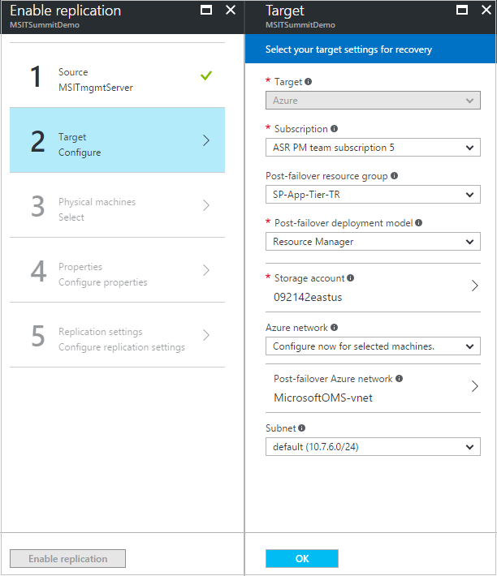
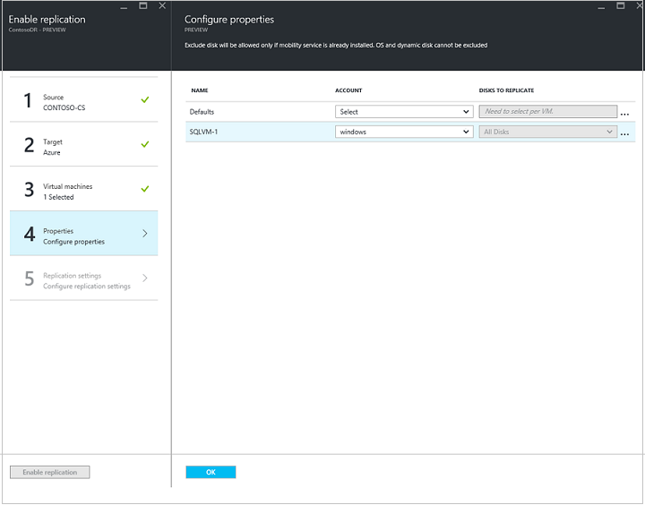

# Step 10: Enable replication for physical servers to Azure

This article describes how to enable replication for on-premises Windows/Linux physical servers to Azure, using the [Azure Site Recovery](site-recovery-overview.md) service in the Azure portal.

Post comments and questions at the bottom of this article, or on the [Azure Recovery Services Forum](https://social.msdn.microsoft.com/Forums/en-US/home?forum=hypervrecovmgr).

## Before you start

- Servers must have the [Mobility service component installed](physical-walkthrough-install-mobility.md).
- If a VM is prepared for push installation, the process server automatically installs the Mobility service when you enable replication.
- When you enable a machine for replication, your Azure user account needs specific [permissions](site-recovery-role-based-linked-access-control.md#permissions-required-to-enable-replication-for-new-virtual-machines) to ensure you're able to use Azure storage, and create Azure VMs.
- When you add or modify IP addresses for servers, it can take up to 15 minutes or longer for changes to take effect, and for them to appear in the portal.

## Exclude disks from replication

By default all disks on a machine are replicated. You can exclude disks from replication. For example you might not want to replicate disks with temporary data, or data that's refreshed each time a machine or application restarts (for example pagefile.sys or SQL Server tempdb). [Learn more](site-recovery-exclude-disk.md)

## Replicate servers

1. Click **Step 2: Replicate application** > **Source**.
2. In **Source**, select the configuration server.
3. In **Machine type**, select **Physical Machines**.
4. Select the process server. If you haven't created any additional process servers this will be the configuration server. Then click **OK**.
5. In **Target**, select the subscription and the resource group in which you want to create the failed over VMs. Choose the deployment model that you want to use in Azure (classic or resource management), for the failed over VMs.
6. Select the Azure storage account you want to use for replicating data. If you don't want to use an account you've already set up, you can create a new one.
7. Select the **Azure network** and **Subnet** to which Azure VMs connect after failover. Select **Configure now for selected machines** to apply the network setting to all machines you select for protection. Select **Configure later** to select the Azure network per machine. If you don't want to use an existing network, you can create one.

    

8. In **Physical machines**, click **+Physical machine** and enter the **Name** and **IP address**. Choose the operating system of the machine you want to replicate. It takes a few minutes until machines are discovered and shown in the list.
9. In **Properties** > **Configure properties**, select the account that will be used by the process server to automatically install the Mobility service on the machine.
10. By default all disks are replicated. Click **All Disks** and clear any disks you don't want to replicate. Then click **OK**. You can set additional VM properties later.

    
11. In **Replication settings** > **Configure replication settings**, verify that the correct replication policy is selected. If you modify a policy, changes will be applied to replicating machine, and to new machines.
12. Enable **Multi-VM consistency** if you want to gather machines into a replication group, and specify a name for the group. Then click **OK**. Note that:

    * Machines in replication groups replicate together, and have shared crash-consistent and app-consistent recovery points when they fail over.
    * We recommend that you gather physical servers together so that they mirror your workloads. Enabling multi-VM consistency can impact workload performance, and should only be used if machines are running the same workload and you need consistency.

13. Click **Enable Replication**. You can track progress of the **Enable Protection** job in **Settings** > **Jobs** > **Site Recovery Jobs**. After the **Finalize Protection** job runs the machine is ready for failover.

## Next steps

Go to [Step 11: Run a test failover](physical-walkthrough-test-failover.md)

<!--Update_Description: new article about walkthrought enable replication from physical to azure -->