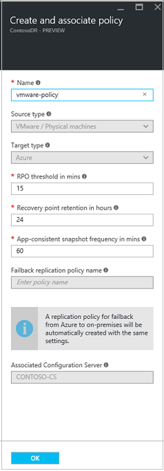

# Step 8: Set up a replication policy for physical server replication to Azure

This article describes how to set up a replication policy when you're replicating Windows/Linux physical servers to Azure using the [Azure Site Recovery](site-recovery-overview.md) service in the Azure portal.

Post comments and questions at the bottom of this article, or on the [Azure Recovery Services Forum](https://social.msdn.microsoft.com/Forums/en-US/home?forum=hypervrecovmgr).

## Configure a policy

1. Click **Site Recovery infrastructure** > **Replication Policies** > **+Replication Policy**.
2. In **Create replication policy**, specify a policy name.
3. In **RPO threshold**, specify the RPO limit. This value indicates how often data recovery points are created. An alert is generated if continuous replication exceeds this limit.
4. In **Recovery point retention**, specify (in hours) how long the retention window is for each recovery point. Replicated VMs can be recovered to any point in a window. Up to 24 hours retention is supported for machines replicated to premium storage, and 72 hours for standard storage.
5. In **App-consistent snapshot frequency**, specify how often (in minutes) recovery points containing application-consistent snapshots will be created. Click **OK** to create the policy.

    
8. When you create a new policy it's automatically associated with the configuration server. By default, a matching policy is automatically created for failback. For example, if the replication policy is **rep-policy** then the failback policy will be **rep-policy-failback**. This policy isn't used until you initiate a failback from Azure.

## Next steps

Go to [Step 9: Install the Mobility service](physical-walkthrough-install-mobility.md)

<!--Update_Description: new article about walkthrought replication from physical to azure -->