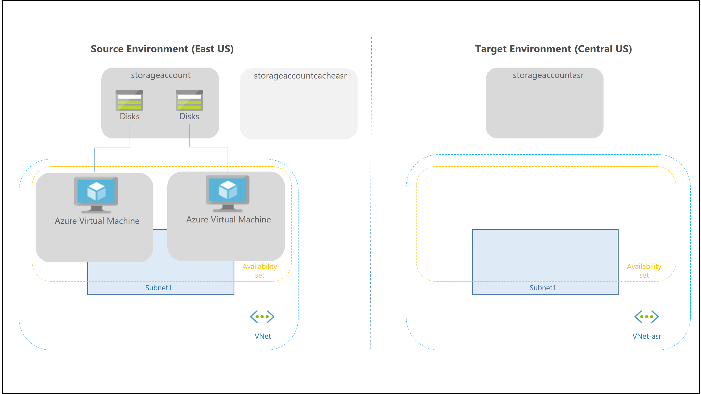
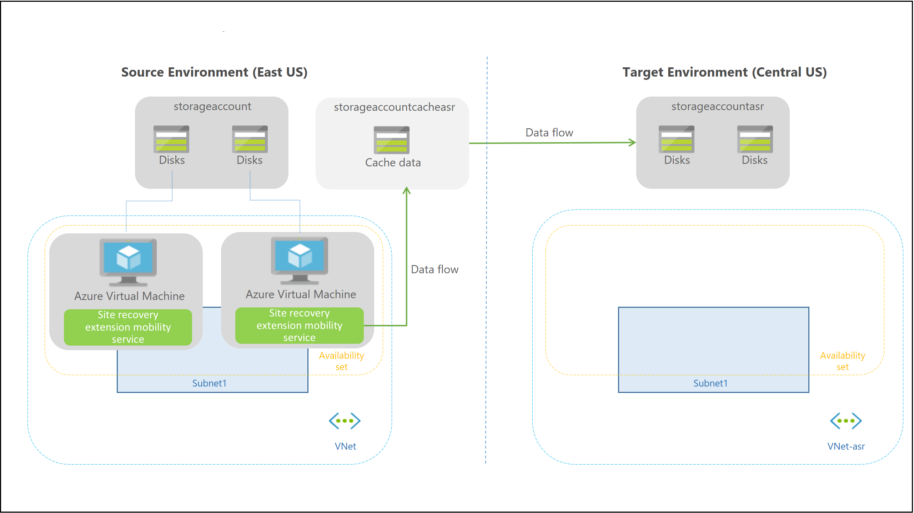

# How does Azure VM replication work in Site Recovery?

This article describes the components and processes involved in replicating and recovering Azure virtual machines (VMs) from one region to another by using the [Azure Site Recovery](site-recovery-overview.md) service.

>[!NOTE]
>Azure VM replication with the Site Recovery service is currently in preview.

## Architectural components

The following diagram provides a high-level view of an Azure VM environment in a specific region (in this example, the China East location). In an Azure VM environment:
- Apps can be running on VMs with disks spread across storage accounts.
- The VMs can be included in one or more subnets within a virtual network.

Learn about the deployment prerequisites and requirements in the [support matrix](site-recovery-support-matrix-azure-to-azure.md).

## Replication process

### Step 1

When you enable Azure VM replication in the Azure portal, the resources shown in the following diagram and table are automatically created in the target region. By default, resources are created based on source region settings. You can customize the target settings as required.
<!-- Not Available site-recovery-replicate-azure-to-azure.md -->

**Resource** | **Details**
--- | ---
**Target resource group** | The resource group to which replicated VMs belong after failover.
**Target virtual network** | The virtual network in which replicated VMs are located after failover. A network mapping is created between source and target virtual networks, and vice versa.
**Cache storage accounts** | Before changes on source VMs are replicated to the target storage account, they are tracked and sent to the cache storage account in the target location. This ensures minimal impact on production apps running on the VM.
**Target storage accounts**  | Storage accounts in the target location to which the data is replicated.
**Target availability sets**  | Availability sets in which the replicated VMs are located after failover.

### Step 2

As replication is enabled, the Site Recovery extension Mobility service is automatically installed on the VM. The following occurs:

1. The VM is registered with Site Recovery.

2. Continuous replication is configured for the VM. Data writes on the VM disks are continuously transferred to the cache storage account in the source location.

    

    > [!IMPORTANT]
    > Site Recovery never needs inbound connectivity to the VM. The VM needs only outbound connectivity to Site Recovery service URLs/IP addresses, Office 365 authentication URLs/IP addresses, and cache storage account IP addresses. For more information, see the [Networking guidance for replicating Azure virtual machines](site-recovery-azure-to-azure-networking-guidance.md) article.

## Continuous replication process

After continuous replication is working, disk writes are immediately transferred to the cache storage account. Site Recovery processes the data and sends it to the target storage account. After the data is processed, recovery points are generated in the target storage account every few minutes.

## Failover process

When you initiate a failover, the VMs are created in the target resource group, target virtual network, target subnet, and the target availability set. During a failover, you can use any recovery point.

## Next steps

- Learn about [networking](site-recovery-azure-to-azure-networking-guidance.md) for Azure VM replication.
<!-- Not Available [replicate Azure VMs.](site-recovery-azure-to-azure.md) -->