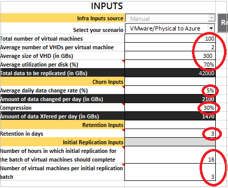
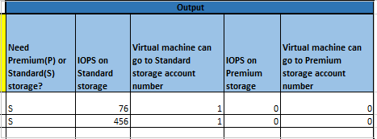

# Plan capacity for protecting Hyper-V VMs with Site Recovery

The Azure Site Recovery Capacity Planner tool helps you to figure out your capacity requirements when replicating Hyper-V VMs with Azure Site Recovery.

Use the Site Recovery Capacity Planner to analyze your source environment and workloads, estimate bandwidth needs and server resources you'll need for the source location, and the resources (virtual machines and storage etc), that you need in the target location.

You can run the tool in a couple of modes:

* **Quick planning**: Run the tool in this mode to get network and server projections based on an average number of VMs, disks, storage, and change rate.
* **Detailed planning**: Run the tool in this mode, and provide details of each workload at VM level. Analyze VM compatibility and get network and server projections.

## Before you start

1. Gather information about your environment, including VMs, disks per VM, storage per disk.
2. Identify your daily change (churn) rate for replicated data. To do this, download the [Hyper-V capacity planning tool](https://www.microsoft.com/download/details.aspx?id=39057) to get the change rate. [Learn more](site-recovery-capacity-planning-for-hyper-v-replication.md) about this tool. We recommend you run this tool over a week to capture averages.

## Run the Quick Planner
1. Download and open the [Azure Site Recovery Capacity Planner](http://aka.ms/asr-capacity-planner-excel) tool. You need to run macros, so select to enable editing and enable content when prompted.
2. In **Select a planner type** select **Quick Planner** from the list box.

   
3. In the **Capacity Planner** worksheet, enter the required information. You must fill in all the fields circled in red in the screenshot below.

    * In **Select your scenario**, choose **Hyper-V to Azure** or **VMware/Physical to Azure**.
    * In **Average daily data change rate (%)**, put in the information you gather using the [Hyper-V capacity planning tool](site-recovery-capacity-planning-for-hyper-v-replication.md) or the [Azure Site Recovery Deployment Planner](./site-recovery-deployment-planner.md).  
    * **Compression** only applies to compression offered when replicating VMware VMs or physical servers to Azure. We estimate 30% or more, but you can modify the setting as required. For replicating Hyper-V VMs to Azure compression, you can use a third-party appliance such as Riverbed.
    * The **Compression**  setting isn't used when replicating Hyper-V VMs to Azure. For compression, use a third-party appliance such as Riverbed.
    * In **Retention Inputs**, specify how long replicas should be retained, in hours.
    * In **Number of hours in which initial replication for the batch of virtual machines should complete** and **Number of virtual machines per initial replication batch**, you input settings that are used to compute initial replication requirements.  When Site Recovery is deployed, the entire initial data set should be uploaded.

    

4. After you've put in the values for the source environment, displayed output includes:

   * **Bandwidth required for delta replication** (MB/sec). Network bandwidth for delta replication is calculated on the average daily data change rate.
   * **Bandwidth required for initial replication** (MB/sec). Network bandwidth for initial replication is calculated on the initial replication values you put in.
   * **Storage required (in GBs)** is the total Azure storage required.
   * **Total IOPS on standard storage accounts** is calculated based on 8K IOPS unit size on the total standard storage accounts.  For the Quick Planner, the number is calculated based on all the source VMs disks and daily data change rate. For the Detailed Planner, the number is calculated based on total number of VMs that are mapped to standard Azure VMs, and data change rate on those VMs.
   * **Number of standard storage accounts** provides the total number of standard storage accounts needed to protect the VMs. A standard storage account can hold up to 20000 IOPS across all the VMs in a standard storage, and a maximum of 500 IOPS is supported per disk.
   * **Number of blob disks required** gives the number of disks that will be created on Azure storage.
   * **Number of premium storage accounts required** provides the total number of premium storage accounts needed to protect the VMs. A source VM with high IOPS (greater than 20000) needs  a premium storage account. A premium storage account can hold up to 80000 IOPS.
   * **Total IOPS on premium storage** is calculated based on 256K IOPS unit size on the total premium storage accounts.  For the Quick Planner, the number is calculated based on all the source VMs disks and daily data change rate. For the Detailed Planner, the number is calculated based on the total number of VMs that are mapped to premium Azure VM (DS and GS series), and the data change rate on those VMs.
   * **Number of configuration servers required** shows how many configuration servers are required for the deployment.
   * **Number of additional process servers required** shows whether additional process servers are required, in addition to the process server that's running on the configuration server by default.
   * **100% additional storage on the source** shows whether additional storage is required in the source location.

   

## Run the Detailed Planner

1. Download and open the [Azure Site Recovery Capacity Planner](http://aka.ms/asr-capacity-planner-excel) tool. You need to run macros, so select to enable editing and enable content when prompted.
2. In **Select a planner type**, select **Detailed Planner** from the list box.

   
3. In the **Workload Qualification** worksheet, enter the required information. You must fill in all the marked fields.

   * In **Processor cores**, specify the total number of cores on a source server.
   * In **Memory allocation in MB**, specify the RAM size of a source server.
   * The **Number of NICs**, specify the number of network adapters on a source server.
   * In **Total storage (in GB)**, specify the total size of the VM storage. For example, if the source server has 3 disks with 500 GB each, then total storage size is 1500 GB.
   * In **Number of disks attached**, specify the total number of disks of a source server.
   * In **Disk capacity utilization**, specify the average utilization.
   * In **Daily change rate (%)**, specify the daily data change rate of a source server.
   * In **Mapping Azure size**, enter the Azure VM size that you want to map. If you don't want to do this manually, click **Compute IaaS VMs**.If you input a manual setting, and then click Compute IaaS VMs, the manual setting might be overwritten because the compute process automatically identifies the best match on Azure VM size.

   
4. If you click **Compute IaaS VMs** here's what it does:

   * Validates the mandatory inputs.
   * Calculates IOPS and suggests the best Azure VM aize match for each VMs that's eligible for replication to Azure. If an appropriate size of Azure VM can't be detected an error is issued. For example, if the number of disks attached in 65, an error is issued because the highest size Azure VM is 64.
   * Suggests a storage account that can be used for an Azure VM.
   * Calculates the total number of standard storage accounts and premium storage accounts required for the workload. Scroll down to view the Azure storage type, and the storage account that can be used for a source server.
   * Completes and sorts the rest of the table based on required storage type (standard or premium) assigned for a VM, and the number of disks attached. For all VMs that meet the requirements for Azure, the column **Is VM qualified?** shows **Yes**. If a VM can't be backed up to Azure, an error is shown.

Columns AA to AE are output, and provide information for each VM.

### Example
As an example, for six VMs with the values shown in the table, the tool calculates and assigns the best Azure VM match, and the Azure storage requirements.

* In the example output, note the following:

  * The first column is a validation column for the VMs, disks and churn.
  * Two standard storage accounts and one premium storage account are needed for five VMs.
  * VM3 doesn't qualify for protection, because one or more disks are more than 1 TB.
  * VM1 and VM2 can use the first standard storage account
  * VM4 can use the second standard storage account.
  * VM5 and VM6 need a premium storage account, and can both use a single account.

    >[!NOTE]
    > IOPS on standard and premium storage are calculated at the VM level, and not at disk level. A standard virtual machine can handle up to 500 IOPS per disk. If IOPS for a disk are greater than 500, you need premium storage. However, if IOPS for a disk are more than 500, but IOPS for the total VM disks are within the support standard Azure VM limits (VM size, number of disks, number of adapters, CPU, memory), then the planner picks a standard VM and not the DS or GS series. You need to manually update the mapping Azure size cell with appropriate DS or GS series VM.

After all the details are in place, click **Submit data to the planner tool** to open the **Capacity Planner** Workloads are highlighted, to show whether they're eligible for protection or not.

### Submit data in the Capacity Planner
1. When you open the **Capacity Planner** worksheet it's populated based on the settings you've specified. The word 'Workload' appears in the **Infra inputs source** cell, to show that the input is the **Workload Qualification** worksheet.
2. If you want to make changes, you need to modify the **Workload Qualification** worksheet, and click **Submit data to the planner tool** again.  

   

## Next steps

[Learn how to run](site-recovery-capacity-planning-for-hyper-v-replication.md) the Capacity Planner Tool.

<!-- Update_Description: update meta properties, wording update, update link -->