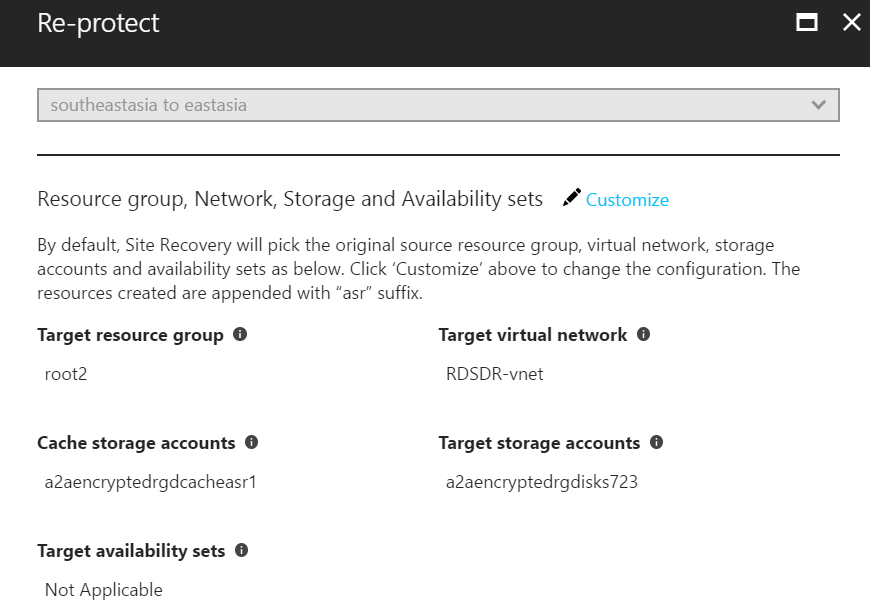
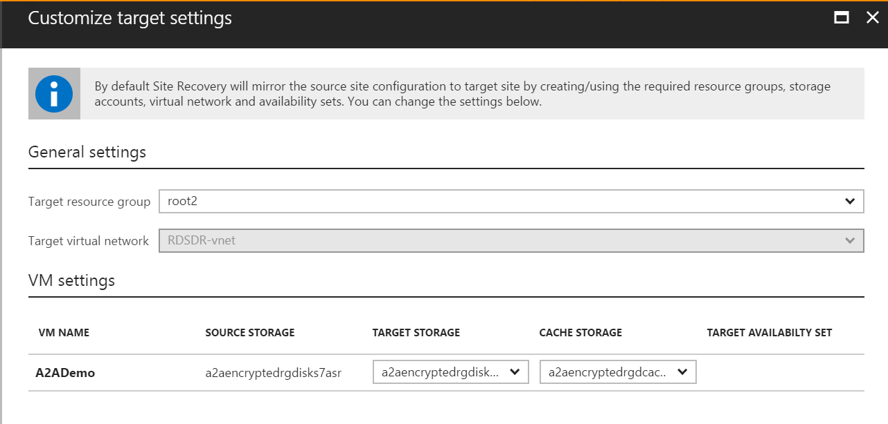

# Reprotect from failed over Azure region back to primary region

>[!NOTE]
>
> Site Recovery replication for Azure virtual machines is currently in preview.

## Overview
When you [failover](site-recovery-failover.md) the virtual machines from one Azure region to another, the virtual machines are in an unprotected state. If you want to bring them back to the primary region, you need to first protect the virtual machines and then failover again. There is no difference between how you failover in one direction or other. Similarly, post enable protection of the virtual machines, there is no difference between the reprotect post failover, or post failback.
To explain the workflows of reprotect, and to avoid confusion, we will use the primary site of the protected machines as China East region, and the recovery site of the machines as South China East region. During failover, you will failover the virtual machines to the South China East region. Before you failback, you need to reprotect the virtual machines from South China East back to China East. This article describes the steps on how to reprotect.

> [!WARNING]
> If you have [completed migration](site-recovery-migrate-to-azure.md#what-do-we-mean-by-migration), moved the virtual machine to another resource group, or deleted the Azure virtual machine, you cannot failback after that.

After reprotect finishes and the protected virtual machines are replicating, you can initiate a failover on the virtual machines to bring them back to China East region.

Post comments or questions at the end of this article or on the [Azure Recovery Services Forum](https://social.msdn.microsoft.com/Forums/en-US/home?forum=hypervrecovmgr).

## Prerequisites
1. The virtual machines should have been committed.
2. The target site - in this case the China East Azure region should be available and should be able to access/create new resources in that region.

## Steps to reprotect

Following are the steps to reprotect a virtual machine using the defaults.

1. In **Vault** > **Replicated items**, right-click the virtual machine that's been failed over, and then select **Re-Protect**. You can also click the machine and select **Re-Protect** from the command buttons.

2. In the blade, notice that the direction of protection, **China East to East asia**, is already selected.

3. Review the **Resource group, Network, Storage and Availability sets** information and click OK. If there are any resources marked (new), they will be created as part of the reprotect.

This will trigger a job reprotect job that will first seed the target site (SEA in this case) with the latest data, and once that completes, will replicate the deltas before you failover back to China East.

### Reprotect customization
If you want to choose the extract storage account or the network during reprotect, you can do so using the customize option provided on the reprotect blade.

You can customize the following properties of he target virtual machine during reprotect.

|Property |Notes  |
|---------|---------|
|Target resource group     | You can choose to change the target resource group in which th virtual machine will be created. As the part of reprotect, the target virtual machine will be deleted, hence you can choose a new resource group under which you can create the VM post failover         |
|Target Virtual Network     | Network cannot be changed during the reprotect. To change the network, redo the network mapping.         |
|Target Storage     | You can change the storage account to which the virtual machine will be created post failover.         |
|Cache Storage     | You can specify a cache storage account which will be used during replication. If you go with the defaults, a new cache storage account will be created, if it does not already exist.         |
|Availability Set     |If the virtual machine in China East is part of an availability set, you can choose an availability set for the target virtual machine in China East. Defaults will find the existing SEA availability set and try to use it. During customization, you can specify a completely new AV set.         |

### What happens during reprotect?

Just like after the first enable protection, following are the artefacts that get created if you use the defaults.
1. A cache storage account gets created in the China East region.
2. If the target storage account (the original storage account of the China East VM) does not exist, a new one is created. The name is the China East virtual machine's storage account suffixed with "asr".
3. If the target AV set does not exist, and the defaults detect that it needs to create a new AV set, then it will be created as part of the reprotect job. If you have customized the reprotect, then the selected AV set will be used.
4.

The following are the list of steps that happen when you trigger a reprotect job. This is in the case the target side virtual machine exists.

1. The required artefacts are created as part of reprotect. If they already exist, then they are reused.
2. The target side (China East) virtual machine is first turned off, if it is running.
3. The target side virtual machine's disk is copied by Azure Site Recovery into a container as a seed blob.
4. The target side virtual machine is then deleted.
5. The seed blob is used by the current source side (China East) virtual machine to replicate. This ensures that only deltas are replicated.
6. The major changes between the source disk and the seed blob are synchronized. This can take some time to complete.
7. Once the reprotect job completes, the delta replication begins that creates a recovery point as per the policy.

> [!NOTE]
> You cannot protect at a recovery plan level. You can only reprotect at a per VM level.

After the reprotect succeed, the virtual machine will enter a protected state.

## Next steps

After the virtual machine has entered a protected state, you can initiate a failover. The failover will shut down the virtual machine in China East Azure region and then create and boot the China East region virtual machine. Hence there is a small downtime for the application. So, choose the time for failover when your application can tolerate a downtime. It is recommended that you first test failover the virtual machine to make sure it is coming up correctly, before initiating a failover.

-	[Steps to initiate test failover of the virtual machine](site-recovery-test-failover-to-azure.md)

-	[Steps to initiate failover of the virtual machine](site-recovery-failover.md)

<!--Update_Description: new articles on how to reprotect from azure to azure in site recovery -->