# Monitor and troubleshoot protection for virtual machines and physical servers
This monitoring and troubleshooting guide helps you learn how to track replication health and troubleshoot techniques for Azure Site Recovery.

## Understand the components
### VMware virtual machine or physical server site deployment for replication between on-premises and Azure
To set up database recovery between an on-premises VMware virtual machine or physical server and Azure, you need to set up the configuration server, master target server, and process server components on your virtual machine or server. When you enable protection for the source server, Azure Site Recovery installs the Mobile Apps feature of Microsoft Azure App Service. After an on-premises outage and after the source server fails over to Azure, customers need to set up a process server in Azure and a master target server on premises to rebuild the source server on premises.

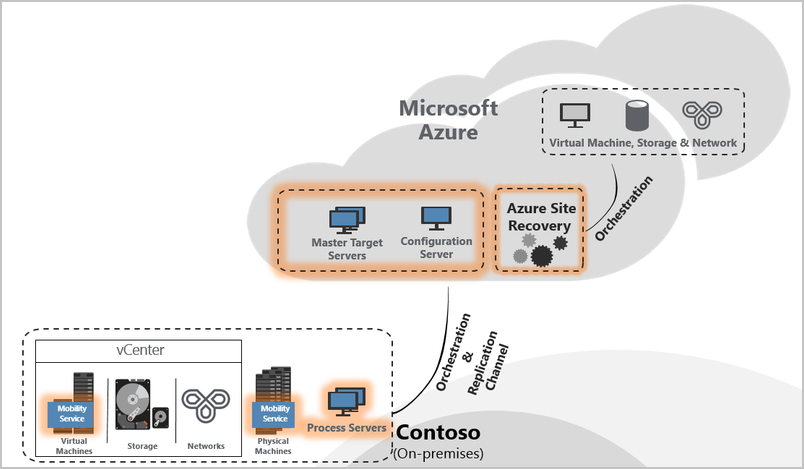

### Virtual Machine Manager site deployment for replication between on-premises sites
To set up database recovery between two on-premises locations, you need to download the Azure Site Recovery provider and install it on the Virtual Machine Manager server. The provider needs Internet connectivity to ensure that all the operations that are triggered from the Azure portal get translated to on-premises operations.

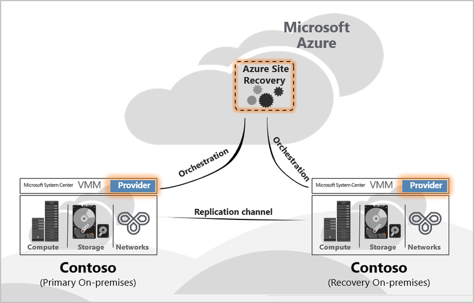

### Virtual Machine Manager site deployment for replication between on-premises locations and Azure
When you set up database recovery between on-premises locations and Azure, you need to download the Azure Site Recovery provider and install it on the Virtual Machine Manager server. You also need to install the Azure Recovery Services Agent, which needs to be installed on each Hyper-V host. 

### Hyper-V site deployment for replication between on-premises locations and Azure
This process is similar to Virtual Machine Manager deployment. The only difference is that the Azure Site Recovery provider and Azure Recovery Services Agent get installed on the Hyper-V host itself.

## Monitor configuration, protection, and recovery operations
Every operation in Azure Site Recovery is audited and tracked under the **JOBS** tab. For any configuration, protection, or recovery error, go to the **JOBS** tab and look for failures.

If you find failures under the **JOBS** tab, click the job, and click **ERROR DETAILS** for that job.

The error details will help you identify a possible cause and recommendation for the issue.

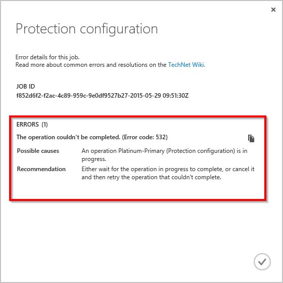

In the previous example, another operation that is in progress seems to be causing the protection configuration to fail. Resolve the issue based on the recommendation, and then click **RESART** to initiate the operation again.

The **RESTART** option is not available for all operations. If an operation doesn’t have the **RESTART** option, go back to the object and redo the operation again. You can cancel any job that's in-progress by using the **CANCEL** button.

## Monitor replication health for virtual machines
You can use the Azure portal to remotely monitor Azure Site Recovery providers for each of the protected entities. Click **PROTECTED ITEMS**, and then click **VMM CLOUDS** or **PROTECTION GROUPS**. The **VMM CLOUDS** tab is only available for deployments that are based on Virtual Machine Manager. For other scenarios, the protected entities are under the **PROTECTION GROUPS** tab.

Click a protected entity under the respective cloud or protection group to see all available operations are shown in the bottom pane.

As shown in the previous screenshot, the virtual machine health is **Critical**. You can click the **ERROR DETAILS** button on the bottom to see the error. Based on the **Possible causes** and **Recommendation**, resolve the issue.

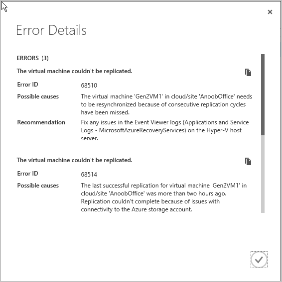

> [!NOTE]
> If any active operations are in progress or failed, go to the **JOBS** view as mentioned earlier to view the error for a specific job.
> 
> 

## Troubleshoot on-premises Hyper-V issues
Connect to the on-premises Hyper-V manager console, select the virtual
machine, and see the replication health.

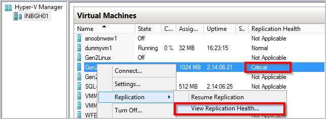

In this case, **Replication Health** is **Critical**. Right-click the virtual machine, and then click **Replication** > **View Replication Health** to see the details.

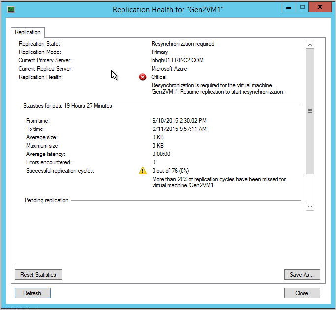

If replication is paused for the virtual machine, right-click the virtual machine, and then click **Replication** > **Resume replication**.

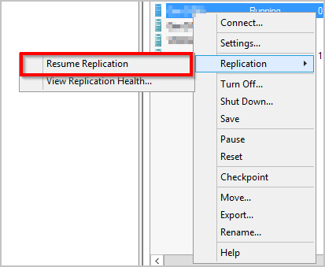

If a virtual machine migrates a new Hyper-V host that's within the cluster or a standalone machine and the Hyper-V host has been configured through Azure Site Recovery, replication for the virtual machine wouldn't be impacted. Ensure that the new Hyper-V host meets all the prerequisites and is configured by using Azure Site Recovery.

### Event Log
| Event sources | Details |
| --- |:--- |
| **Applications and Service Logs/Microsoft/VirtualMachineManager/Server/Admin** (Virtual Machine Manager server) |Provides useful logging to troubleshoot many different Virtual Machine Manager issues. |
| **Applications and Service Logs/MicrosoftAzureRecoveryServices/Replication** (Hyper-V host) |Provides useful logging to troubleshoot many Microsoft Azure Recovery Services Agent issues.   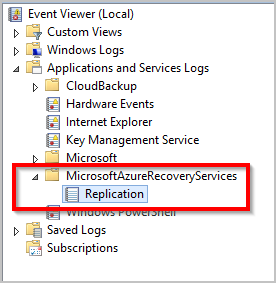 |
| **Applications and Service Logs/Microsoft/Azure Site Recovery/Provider/Operational** (Hyper-V host) |Provides useful logging to troubleshoot many Microsoft Azure Site Recovery Service issues.   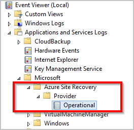 |
| **Applications and Service Logs/Microsoft/Windows/Hyper-V-VMMS/Admin** (Hyper-V host) |Provides useful logging to troubleshoot many Hyper-V virtual machine management issues.   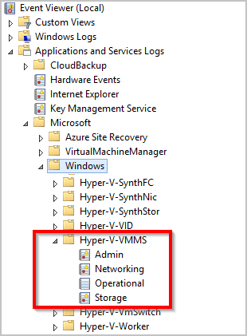 |

### Hyper-V replication logging options
All events that pertain to Hyper-V replication are logged in the Hyper-V-VMMS\\Admin log located under Applications and Services Logs\\Microsoft\\Windows. In addition, you can enable an Analytic log for the Hyper-V Virtual Machine Management Service. To enable this log, first make the Analytic and Debug logs viewable in the Event Viewer. Open Event Viewer, and then click **View** > **Show Analytic and Debug Logs**.

An Analytic log is visible under **Hyper-V-VMMS**.

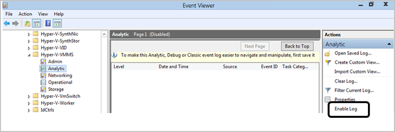

In the **Actions** pane, click **Enable Log**. After it's enabled, it
appears in **Performance Monitor** as an **Event Trace Session** located
under **Data Collector Sets.**

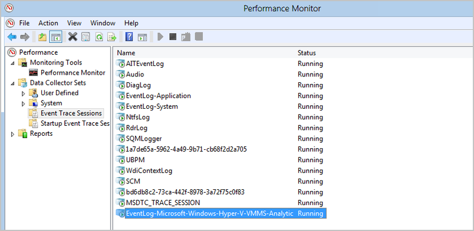

To view the collected information, first stop the tracing session by disabling the log. Save the log, and open it again in Event Viewer or use other tools to convert it as desired.

## Reach out for Microsoft Support
### Log collection
For Virtual Machine Manager site protection, refer to [Azure Site Recovery log collection using Support
Diagnostics Platform (SDP)
Tool](http://social.technet.microsoft.com/wiki/contents/articles/28198.asr-data-collection-and-analysis-using-the-vmm-support-diagnostics-platform-sdp-tool.aspx)
to collect the required logs.

For Hyper-V site protection, download the
[tool](https://dcupload.microsoft.com/tools/win7files/DIAG_ASRHyperV_global.DiagCab) and execute it on the Hyper-V host to collect the logs.

For VMware/physical server scenarios, refer to [Azure Site Recovery log collection
for VMware and physical site protection](http://social.technet.microsoft.com/wiki/contents/articles/30677.azure-site-recovery-log-collection-for-vmware-and-physical-site-protection.aspx) to collect the required logs.

The tool collects the logs locally in a randomly named subfolder under %LocalAppData%\ElevatedDiagnostics.

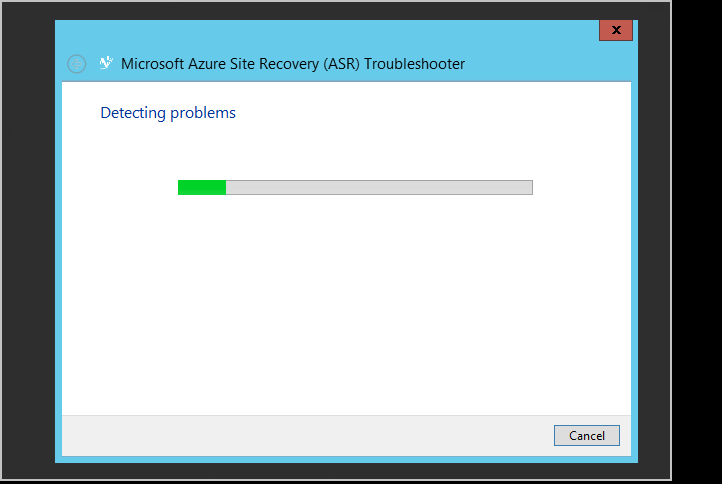

### Open a support ticket
To raise a support ticket for Azure Site Recovery, reach out to Azure Support by using the
URL at <http://aka.ms/getazuresupport>.

## KB articles
* [How to preserve the drive letter for protected virtual machines that are failed over or migrated to Azure](http://support.microsoft.com/zh-cn/kb/3031135)
* [How to manage on-premises to Azure protection network bandwidth usage](https://support.microsoft.com/zh-cn/kb/3056159)
* [Azure Site Recovery: "The cluster resource could not be found" error when you try to enable protection for a virtual  machine](http://support.microsoft.com/zh-cn/kb/3010979)
* [Understand and Troubleshoot Hyper-V replication guide](http://social.technet.microsoft.com/wiki/contents/articles/21948.hyper-v-replica-troubleshooting-guide.aspx)

## Common Azure Site Recovery errors and their resolutions
Following are common errors and their resolutions. Each error is documented in a separate wiki page.

### General
-   NEW [Jobs failing with error "An operation is in progress." Error 505, 514, 532](http://social.technet.microsoft.com/wiki/contents/articles/32190.azure-site-recovery-jobs-failing-with-error-an-operation-is-in-progress-error-505-514-532.aspx)
-   NEW [Jobs failing with error "Server isn't connected to the Internet". Error 25018](http://social.technet.microsoft.com/wiki/contents/articles/32192.azure-site-recovery-jobs-failing-with-error-server-isn-t-connected-to-the-internet-error-25018.aspx)

### Setup
-   [The VMM server cannot be registered due to an internal error. Please refer to the jobs view in the Site Recovery Portal for more details on the error. Run Setup again to register the server.](http://social.technet.microsoft.com/wiki/contents/articles/25570.the-vmm-server-cannot-be-registered-due-to-an-internal-error-please-refer-to-the-jobs-view-in-the-site-recovery-portal-for-more-details-on-the-error-run-setup-again-to-register-the-server.aspx)
-   [A connection can’t be established to the Hyper-V Recovery Manager vault. Verify the proxy settings or try again later.](http://social.technet.microsoft.com/wiki/contents/articles/25571.a-connection-cant-be-established-to-the-hyper-v-recovery-manager-vault-verify-the-proxy-settings-or-try-again-later.aspx)

### Configuration
-   [Unable to create Protection Group: An error occurred while retrieving the list of servers.](http://blogs.technet.com/b/somaning/archive/2015/08/12/unable-to-create-the-protection-group-in-azure-site-recovery-portal.aspx)
-   [Hyper-V host cluster contains at least one static network adapter, or no connected adapters are configured to use DHCP.](http://social.technet.microsoft.com/wiki/contents/articles/25498.hyper-v-host-cluster-contains-at-least-one-static-network-adapter-or-no-connected-adapters-are-configured-to-use-dhcp.aspx)
-   [VMM does not have permissions to complete an action](http://social.technet.microsoft.com/wiki/contents/articles/31110.vmm-does-not-have-permissions-to-complete-an-action.aspx)
-   [Can't select the storage account within the subscription while configuring protection](http://social.technet.microsoft.com/wiki/contents/articles/32027.can-t-select-the-storage-account-within-the-subscription-while-configuring-protection.aspx)

### Protection
- NEW [Enable Protection failing with error "Protection couldn't be configured for the virtual machine". Error 60007, 40003](http://social.technet.microsoft.com/wiki/contents/articles/32194.azure-site-recovery-enable-protection-failing-with-error-protection-couldn-t-be-configured-for-the-virtual-machine-error-60007-40003.aspx)
- NEW [Enable Protection failing with error "Protection couldn't be enabled for the virtual machine." Error 70094](http://social.technet.microsoft.com/wiki/contents/articles/32195.azure-site-recovery-enable-protection-failing-with-error-protection-couldn-t-be-enabled-for-the-virtual-machine-error-70094.aspx)
- NEW [Live migration error 23848 - The virtual machine is going to be moved using type Live. This could break the recovery protection status of the virtual machine.](http://social.technet.microsoft.com/wiki/contents/articles/32021.live-migration-error-23848-the-virtual-machine-is-going-to-be-moved-using-type-live-this-could-break-the-recovery-protection-status-of-the-virtual-machine.aspx) 
- [Enable protection failed since Agent not installed on host machine](http://social.technet.microsoft.com/wiki/contents/articles/31105.enable-protection-failed-since-agent-not-installed-on-host-machine.aspx)
- [A suitable host for the replica virtual machine can't be found - Due to low compute resources](http://social.technet.microsoft.com/wiki/contents/articles/25501.a-suitable-host-for-the-replica-virtual-machine-can-t-be-found-due-to-low-compute-resources.aspx)
- [A suitable host for the replica virtual machine can't be found - Due to no logical network attached](http://social.technet.microsoft.com/wiki/contents/articles/25502.a-suitable-host-for-the-replica-virtual-machine-can-t-be-found-due-to-no-logical-network-attached.aspx)
- [Cannot connect to the replica host machine - connection could not be established](http://social.technet.microsoft.com/wiki/contents/articles/31106.cannot-connect-to-the-replica-host-machine-connection-could-not-be-established.aspx)

### Recovery
- Virtual Machine Manager cannot complete the host operation -
    -   [Fail over to the selected recovery point for virtual machine: General access denied error.](http://social.technet.microsoft.com/wiki/contents/articles/25504.fail-over-to-the-selected-recovery-point-for-virtual-machine-general-access-denied-error.aspx)
    -   [Hyper-V failed to fail over to the selected recovery point for virtual machine: Operation aborted Try a more recent recovery point. (0x80004004)](http://social.technet.microsoft.com/wiki/contents/articles/25503.hyper-v-failed-to-fail-over-to-the-selected-recovery-point-for-virtual-machine-operation-aborted-try-a-more-recent-recovery-point-0x80004004.aspx)
    -   A connection with the server could not be established (0x00002EFD)
        -   [Hyper-V failed to enable reverse replication for virtual machine](http://social.technet.microsoft.com/wiki/contents/articles/25505.a-connection-with-the-server-could-not-be-established-0x00002efd-hyper-v-failed-to-enable-reverse-replication-for-virtual-machine.aspx)
        -   [Hyper-V failed to enable replication for virtual machine virtual machine](http://social.technet.microsoft.com/wiki/contents/articles/25506.a-connection-with-the-server-could-not-be-established-0x00002efd-hyper-v-failed-to-enable-replication-for-virtual-machine-virtual-machine.aspx)
    -   [Could not commit failover for virtual machine](http://social.technet.microsoft.com/wiki/contents/articles/25508.could-not-commit-failover-for-virtual-machine.aspx)
-   [The recovery plan contains virtual machines which are not ready for planned failover](http://social.technet.microsoft.com/wiki/contents/articles/25509.the-recovery-plan-contains-virtual-machines-which-are-not-ready-for-planned-failover.aspx)
-   [The virtual machine isn't ready for planned failover](http://social.technet.microsoft.com/wiki/contents/articles/25507.the-virtual-machine-isn-t-ready-for-planned-failover.aspx)
-   [Virtual machine is not running and is not powered off](http://social.technet.microsoft.com/wiki/contents/articles/25510.virtual-machine-is-not-running-and-is-not-powered-off.aspx)
-   [Out of band operation happened on a virtual machine and commit failover failed](http://social.technet.microsoft.com/wiki/contents/articles/25507.the-virtual-machine-isn-t-ready-for-planned-failover.aspx)
-   Test Failover
    -   [Failover could not be initiated since test failover is in progress](http://social.technet.microsoft.com/wiki/contents/articles/31111.failover-could-not-be-initiated-since-test-failover-is-in-progress.aspx)
-   NEW  Failover times out with 'PreFailoverWorkflow task WaitForScriptExecutionTask timed out' due to the configuration settings on the Network Security Group associated with the Virtual Machine or the subnet to which the machine belongs to. Refer to ['PreFailoverWorkflow task WaitForScriptExecutionTask timed out'](http://social.technet.microsoft.com/wiki/contents/articles/34503.failover-operation-timed-out-due-to-prefailoverworkflow-task-waitforscriptexecutiontask-timed-out.aspx) for details.

### Configuration server, process server, master target
* [The ESXi host on which the PS/CS is hosted as a VM fails with a purple screen of death.](http://social.technet.microsoft.com/wiki/contents/articles/31107.vmware-esxi-host-experiences-a-purple-screen-of-death.aspx)

### Remote desktop troubleshooting after failover
* Many customers have faced issues to connect to the failed over virtual machine in Azure. [Use the troubleshooting document to RDP into the virtual machine](http://social.technet.microsoft.com/wiki/contents/articles/31666.troubleshooting-remote-desktop-connection-after-failover-using-asr.aspx).

#### Adding a public IP on a resource manager virtual machine
If the **Connect** button in the portal is dimmed, and you are not connected to Azure via an Express Route or Site-to-Site VPN connection, you need to create and assign your virtual machine a public IP address before you can use Remote Desktop/Shared Shell. You can then add a Public IP on the network interface of the virtual machine.  

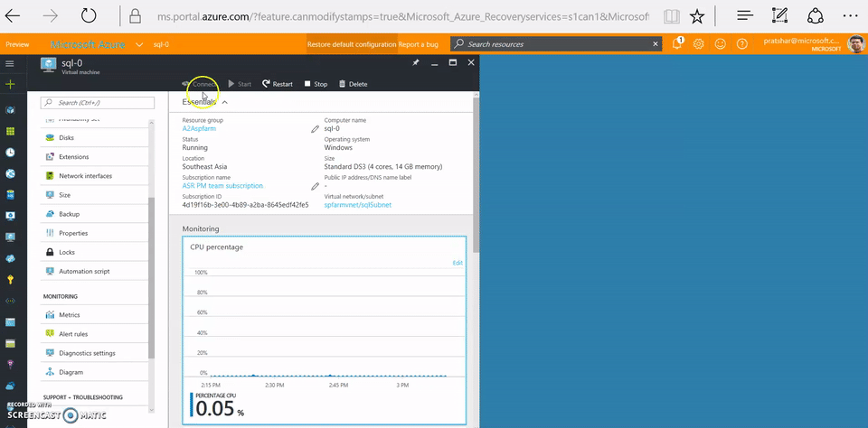