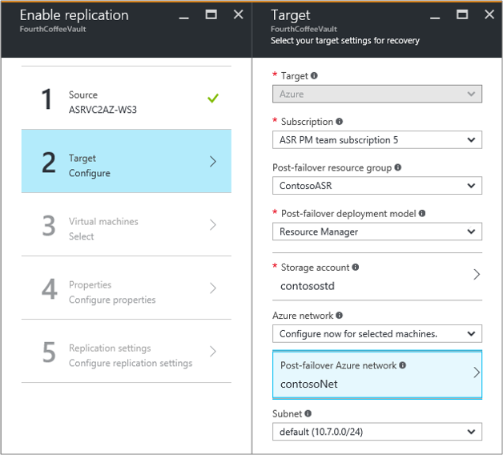
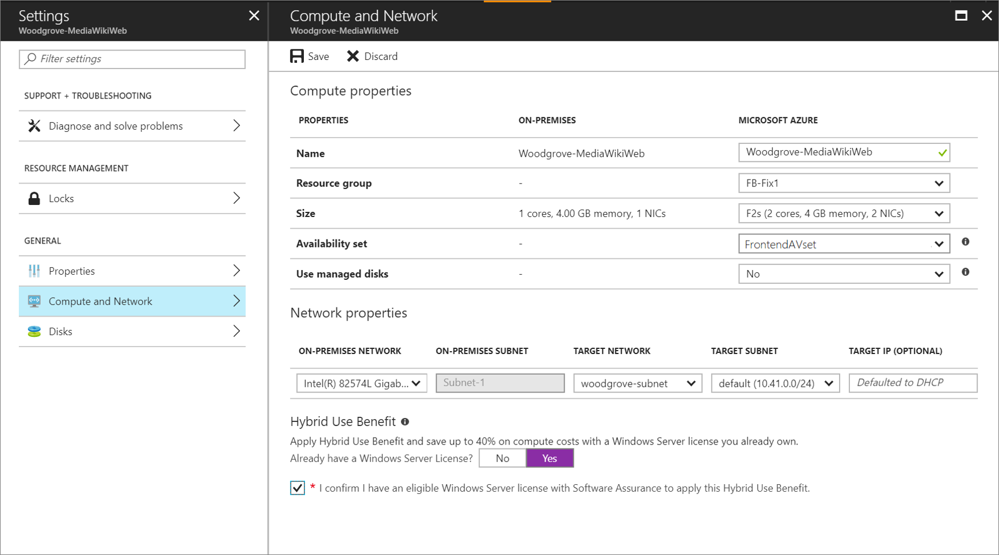

# Replicate applications running on VMware virtual machines to Azure

This article describes how to set up replication of virtual machines (VMs) running on VMware to Azure.
## Prerequisites

This article assumes that you have:

1.  [Set up on-premises source environment](site-recovery-set-up-vmware-to-azure.md).
2.  [Set up target environment in Azure](site-recovery-prepare-target-vmware-to-azure.md).

## Enable replication
### Before you start
When replicating VMware virtual machines:

* Your Azure user account needs to have certain [permissions](site-recovery-role-based-linked-access-control.md#permissions-required-to-enable-replication-for-new-virtual-machines) to enable replication of a new virtual machine to Azure.
* VMware VMs are discovered every 15 minutes. It might take 15 minutes or longer for them to appear in the Azure portal after discovery. Likewise, discovery can take 15 minutes or more when you add a new vCenter server or vSphere host.
* Environment changes on the virtual machine (such as VMware tools installation) can take 15 minutes or more to be updated in the portal.
* You can check the last discovered time for VMware VMs in the **Last Contact At** field for the vCenter server/vSphere host, on the **Configuration Servers** page.
* To add machines for replication without waiting for the scheduled discovery, highlight the configuration server (don't click it), and click the **Refresh** button.
* When you enable replication, if the machine is prepared, the process server automatically installs the Mobility Service on it.

### Enable replication as follows

1. Click **Step 2: Replicate application** > **Source**. After you've enabled replication for the first time, click **+Replicate** in the vault to enable replication for additional machines.
2. In the **Source** page > **Source**, select the configuration server.
3. In **Machine type**, select **Virtual Machines** or **Physical Machines**.
4. In **vCenter/vSphere Hypervisor**, select the vCenter server that manages the vSphere host, or select the host. This setting isn't relevant if you're replicating physical machines.
5. Select the process server, which will be the name of the configuration server if you haven't created any additional process servers. Then click **OK**.

    

6. In **Target**, select the subscription and the resource group where you want to create the failed-over virtual machines. Choose the deployment model that you want to use in Azure (classic or Azure Resource Manager) for the failed-over virtual machines.

7. Select the Azure Storage account you want to use for replicating data. 

    > [!NOTE]
    >   * You can select a premium or standard storage account. If you select a premium account, you need to specify an additional standard storage account for ongoing replication logs. Accounts must be in the same region as the Recovery Services vault.
    >   * If you want to use a different storage account, you can [create one](../storage/common/storage-create-storage-account.md). To create a storage account by using Resource Manager, click **Create new**. If you want to create a storage account by using the classic model, do that in the Azure portal.

8. Select the Azure network and subnet to which Azure VMs will connect when they're spun up after failover. The network must be in the same region as the Recovery Services vault. Select **Configure now for selected machines** to apply the network setting to all machines you select for protection. Select **Configure later** to select the Azure network per machine. If you don't have a network, you need to create one . To create a network by using Resource Manager, click **Create new**. If you want to create a network by using the classic model, do that [in the Azure portal](../virtual-network/virtual-networks-create-vnet-classic-pportal.md). Select a subnet if applicable, and then click **OK**.
<!-- Anchor not Exist on [创建一个](#set-up-an-azure-network) -->

    
9. In **Virtual Machines** > **Select virtual machines**, select each machine you want to replicate. You can only select machines for which replication can be enabled. Then click **OK**.

    
10. In **Properties** > **Configure properties**, select the account used by the process server to automatically install the Mobility Service on the machine.  
11. By default, all disks are replicated. To exclude disks from replication, click **All Disks** and clear any disks you don't want to replicate.  Then click **OK**. You can set additional properties later. [Learn more](site-recovery-exclude-disk.md) about excluding disks.

    

12. In **Replication settings** > **Configure replication settings**, verify that the correct replication policy is selected. You can modify replication policy settings in **Settings** > **Replication policies** > (policy name) > **Edit Settings**. Changes you apply to a policy also apply to replicating and new machines.
13. Enable **Multi-VM consistency** if you want to gather machines into a replication group. Specify a name for the group, and then click **OK**. 

    > [!NOTE]
    >    * Machines in a replication group replicate together and have shared crash-consistent and app-consistent recovery points when they fail over.
    >    * Gather VMs and physical servers together so that they mirror your workloads. Enabling multi-VM consistency can impact workload performance. Use only if machines are running the same workload and you need consistency.

    
14. Click **Enable Replication**. You can track progress of the **Enable Protection** job in **Settings** > **Jobs** > **Site Recovery Jobs**. After the **Finalize Protection** job runs, the machine is ready for failover.

> [!NOTE]
> If the machine is prepared for push installation, the Mobility Service component is installed when protection is enabled. After the component is installed on the machine, a protection job starts and fails. After the failure, you need to manually restart each machine. After the restart, the protection job begins again and initial replication occurs.
>
>

## View and manage VM properties

Next, you verify the properties of the source machine. Remember that the Azure VM name needs to conform with [Azure virtual machine requirements](site-recovery-support-matrix-to-azure.md#failed-over-azure-vm-requirements).

1. Click **Settings** > **Replicated items** >, and then select the machine. The **Essentials** page shows information about machine settings and status.
2. In **Properties**, you can view replication and failover information for the VM.
3. In **Compute and Network** > **Compute properties**, you can specify the Azure VM name and target size. Modify the name to comply with Azure requirements if necessary.

    

4.  You can select a [resource group](/virtual-machines/windows/infrastructure-resource-groups-guidelines) from which a machine becomes part of a post failover. You can change this setting any time before failover. Post failover, if you migrate the machine to a different resource group, the protection settings for that machine break.
5. You can select an [availability set](/virtual-machines/windows/infrastructure-availability-sets-guidelines) if your machine needs to be part of a post failover. While you're selecting an availability set, keep in mind that:

    * Only availability sets belonging to the specified resource group are listed.  
    * Machines with different virtual networks cannot be a part of the same availability set.
    * Only virtual machines of the same size can be a part of an availability set.
5. You can also view and add information about the target network, subnet, and IP address assigned to the Azure VM.
6. In **Disks**, you can see the operating system and data disks on the VM to be replicated.

### Network adapters and IP addressing

- You can set the target IP address. If you don't provide an address, the failed-over machine uses DHCP. If you set an address that isn't available at failover, the failover doesn't work. If the address is available in the test failover network, the same target IP address can be used for test failover.
- The number of network adapters is dictated by the size you specify for the target virtual machine, as follows:
    - If the number of network adapters on the source machine is less than or equal to the number of adapters allowed for the target machine size, then the target has the same number of adapters as the source.
    - If the number of adapters for the source virtual machine exceeds the number allowed for the target size, then the target size maximum is used.
    For example, if a source machine has two network adapters and the target machine size supports four, the target machine has two adapters. If the source machine has two adapters but the supported target size only supports one, then the target machine has only one adapter.
    - If the virtual machine has multiple network adapters, they all connect to the same network. Also, the first one shown in the list becomes the *Default* network adapter in the Azure virtual machine.

### Azure Hybrid Use Benefit

Microsoft Software Assurance customers can use Azure Hybrid Use Benefit to save on licensing costs for Windows Server machines that are migrated to Azure, or to use Azure for disaster recovery. If you're eligible to use the Azure Hybrid Use Benefit, you can specify that the virtual machine assigned this benefit is the one Azure Site Recovery creates if there's a failover. To do this:
- Go to the Compute and Network properties section of the replicated virtual machine.
- Answer the question that asks if you have a Windows Server License that makes you eligible for Azure Hybrid Use Benefit.
- Select the check box to confirm that you have an eligible Windows Server license with Software Assurance, which you can use to apply the Hybrid Use Benefit on the machine that will be created on failover.
- Save settings for the replicated machine.

<!-- Not Available on [Azure Hybrid Use Benefit](https://aka.ms/azure-hybrid-use-benefit-pricing). -->
<!-- Redirect https://aka.ms/azure-hybrid-use-benefit-pricing TO https://azure.microsoft.com/en-us/pricing/hybrid-benefit/ -->

## Common issues

* Each disk should be less than 1 TB in size.
* The OS disk should be a basic disk and not a dynamic disk.
* For generation 2/UEFI-enabled virtual machines, the operating system family should be Windows and the boot disk should be less than 300 GB.

## Next steps

After protection is complete and the machine has reached a protected state, you can try a [failover](site-recovery-failover.md) to check whether your application comes up in Azure or not.

If you want to disable protection, learn how to [clean registration and protection settings](site-recovery-manage-registration-and-protection.md).

<!--Update_Description: update meta properties, wording update, update link -->