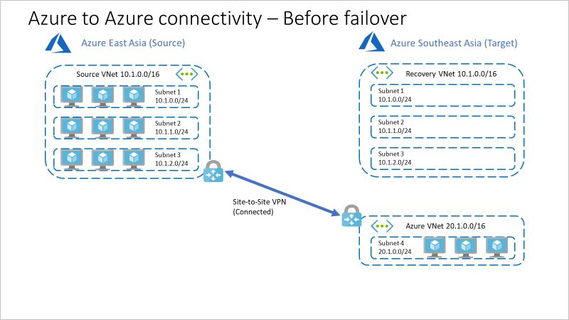
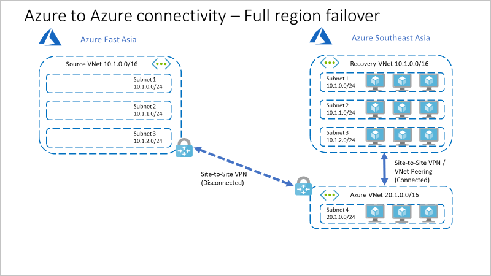
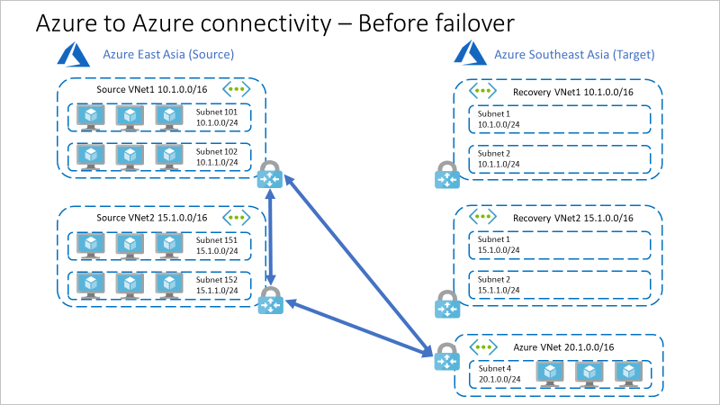
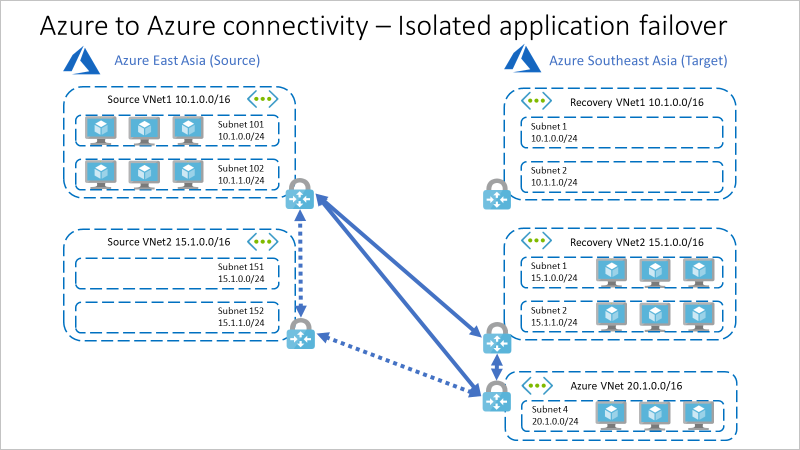
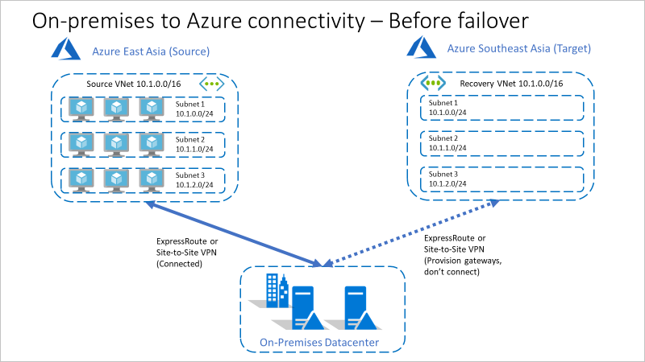
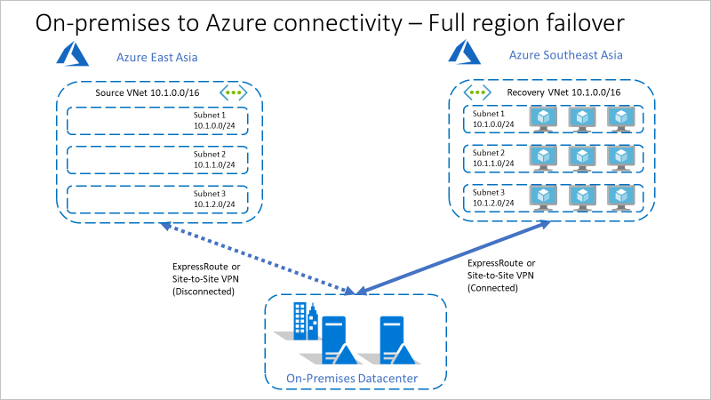

# IP address retention for Azure virtual machine failover

Azure Site Recovery enables disaster recovery for Azure VMs. When failing over from one Azure region to another, customers often require retention of their IP configurations. Site Recovery, by default, mimics source virtual network and subnet structure when creating these resources on the target region. For Azure VMs configured with static private IP addresses, Site Recovery also makes a best effort attempt to provision the same private IP on the target VM, if that IP is not already blocked by an Azure resource or a replicated VM.

For simple applications, the above default configuration is all that is needed. For more complex enterprise applications, customers may need to provision additional networking resources to ensure post-failover connectivity with other components of their infrastructure. This article explains the networking requirements for failing over Azure VMs from one region to another while retaining VM IP addresses.

## Azure-to-Azure connectivity

For the first scenario, we consider **Company A** that has all its application infrastructure running in Azure. For business continuity and compliance reasons, **Company A** decides to use Azure Site Recovery to protect its applications.

Given the requirement of IP retention (such as for application bindings), Company A has the same virtual network and subnet structure on the target region. To further reduce recovery time objective (RTO), **Company A** utilizes replica nodes for SQL Always ON, domain controllers, etc. and these replica nodes are placed in a different virtual network on the target region. Using a different address space for the replica nodes enables **Company A** to establish VPN site-to-site connectivity between source and target regions, which would otherwise not be possible if the same address space is used at both ends.

Here's what the network architecture looks like before failover:
- Application VMs are hosted in Azure China East, utilizing an Azure virtual network with address space 10.1.0.0/16. This virtual network is named **Source VNet**.
- Application workloads are split across three subnets - 10.1.0.0/24, 10.1.1.0/24, 10.1.2.0/24, respectively named **Subnet 1**, **Subnet 2**, **Subnet 3**.
- Azure China East is the target region and has a recovery virtual network that mimics the address space and subnet configuration on source. This virtual network is named **Recovery VNet**.
- Replica nodes such as those needed for Always On, domain controller, etc. are placed in a virtual network with address space 20.1.0.0/16 inside Subnet 4 with address 20.1.0.0/24. The virtual network is named **Azure VNet** and is on Azure China East.
- **Source VNet** and **Azure VNet** are connected through VPN site-to-site connectivity.
- **Recovery VNet** is not connected with any other virtual network.
- **Company A** assigns/verifies target IP address for replicated items. For this example, target IP is the same as source IP for each VM.

### Full region failover

In the event of a regional outage, **Company A** can recover its entire deployment quickly and easily using Azure Site Recovery's powerful [recovery plans](site-recovery-create-recovery-plans.md). Having already set the target IP address for each VM prior to failover, **Company A** can orchestrate failover and automate connection establishment between Recovery VNet and Azure Vnet as shown in the below diagram.

Depending on application requirements, connections between the two VNets on the target region can be established before, during (as an intermediate step) or after failover. Use [recovery plans](site-recovery-create-recovery-plans.md) to add scripts and define the failover order.

Company A also has the choice of using VNet peering or Site-to-Site VPN to establish connectivity between Recovery VNet and Azure VNet. VNet peering does not use a VPN gateway and has different constraints. Additionally, [VNet peering pricing](https://www.azure.cn/pricing/details/networking/) is calculated differently than [VNet-to-VNet VPN Gateway pricing](https://www.azure.cn/pricing/details/vpn-gateway/). For failovers, it is generally advisable to mimic source connectivity, including connection type, to minimize unpredictable incidents arising out of network changes.

### Isolated application failover

Under certain conditions users might need to failover parts of their application infrastructure. One such example is failing over a specific application or tier that is housed within a dedicated subnet. While a subnet failover with IP retention is possible, it is not advisable for most situations, as it substantially increases connectivity inconsistencies. You will also lose subnet connectivity to other subnets within the same Azure virtual network.

A better way to account for subnet-level application failover requirements is to use different target IP addresses for failover (if connectivity is required to other subnets on source virtual network) or isolate each application in its own dedicated virtual network on source. With the latter approach you can establish inter-network connectivity on the source and emulate the same when failing over to the target region.

To architect individual applications for resiliency, it is advised to house an application in its own dedicated virtual network and establish connectivity between these virtual networks as required. This allows for isolated application failover while retaining original private IP addresses.

The pre-failover configuration then looks as follows:
- Application VMs are hosted in Azure China East, utilizing an Azure virtual network with address space 10.1.0.0/16 for the first application and 15.1.0.0/16 for the second application. The virtual networks are named **Source VNet1** and **Source VNet2** for the first and second application, respectively.
- Each VNet is further split into two subnets each.
- Azure China East is the target region and has recovery virtual networks Recovery VNet1 and Recovery VNet2.
- Replica nodes such as those needed for Always On, domain controller, etc. are placed in a virtual network with address space 20.1.0.0/16 inside **Subnet 4** with address 20.1.0.0/24. The virtual network is called Azure VNet and is on Azure China East.
- **Source VNet1** and **Azure VNet** are connected through VPN site-to-site connectivity. Similarly, **Source VNet2** and **Azure VNet** are also connected through VPN site-to-site connectivity.
- **Source VNet1** and **Source VNet2** are also connected through S2S VPN in this example. Since the two VNets are in the same region, VNet peering can also be used instead of S2S VPN.
- **Recovery VNet1** and **Recovery VNet2** are not connected with any other virtual network.
- To reduce recovery time objective (RTO), VPN gateways are configured on **Recovery VNet1** and **Recovery VNet2** prior to failover.

In the event of a disaster situation that affects only one application (in this example housed in Source VNet2), Company A can recover the affected application as follows:
- VPN connections between **Source VNet1** and **Source VNet2**, and between **Source VNet2** and **Azure VNet** are disconnected.
- VPN connections are established between **Source VNet1** and **Recovery VNet2**, and between **Recovery VNet2** and **Azure VNet**.
- VMs from **Source VNet2** are failed over to **Recovery VNet2**.

The above isolated failover example can be expanded to include more applications and network connections. The recommendation is to follow a like-like connection model, as far as possible, when failing over from source to target.

### Further considerations

VPN Gateways utilize public IP addresses and gateway hops to establish connections. If you do not want to use public IP, and/or want to avoid extra hops, you can use Azure [Virtual Network peering](../virtual-network/virtual-network-peering-overview.md) to peer virtual networks across [supported Azure regions](../virtual-network/virtual-network-manage-peering.md#cross-region).

## On-premises-to-Azure connectivity

For the second scenario, we consider **Company B** that has a part of its application infrastructure running on Azure and the remainder running on-premises. For business continuity and compliance reasons, **Company B** decides to use Azure Site Recovery to protect its applications running in Azure.

Here's what the network architecture looks like before failover:
- Application VMs are hosted in Azure China East, utilizing an Azure virtual network with address space 10.1.0.0/16. This virtual network is named **Source VNet**.
- Application workloads are split across three subnets - 10.1.0.0/24, 10.1.1.0/24, 10.1.2.0/24, respectively named **Subnet 1**, **Subnet 2**, **Subnet 3**.
- Azure China East is the target region and has a recovery virtual network that mimics the address space and subnet configuration on source. This virtual network is named **Recovery VNet**.
- VMs in Azure China East are connected to on-premises datacenter through ExpressRoute or Site-to-Site VPN.
- To reduce recovery time objective (RTO), Company B provisions gateways on Recovery VNet in Azure China East prior to failover.
- **Company B** assigns/verifies target IP address for replicated items. For this example, target IP is the same as source IP for each VM

### Full region failover

In the event of a regional outage, **Company B** can recover its entire deployment quickly and easily using Azure Site Recovery's powerful [recovery plans](site-recovery-create-recovery-plans.md). Having already set the target IP address for each VM prior to failover, **Company B** can orchestrate failover and automate connection establishment between Recovery VNet and on-premises datacenter as shown in the below diagram.

The original connection between Azure China East and the on-premises datacenter should be disconnected before establishing the connection between Azure China East and on-premises datacenter. The on-premises routing is also reconfigured to point to the target region and gateways post failover.

### Subnet failover

Unlike the Azure-to-Azure scenario described for **Company A**, a subnet-level failover is not possible in this case for **Company B**. This is because the address space on source and recovery virtual networks is the same and the original source to on-premises connection is active.

To achieve application resiliency, it is recommended that each application is housed in its own dedicated Azure virtual network. Applications can then be failed over in isolation and the required on-premises to source connections can be routed to the target region as described above.

## Next steps
- Learn more about [recovery plans](site-recovery-create-recovery-plans.md).

<!-- Update_Description: wording update, update link -->