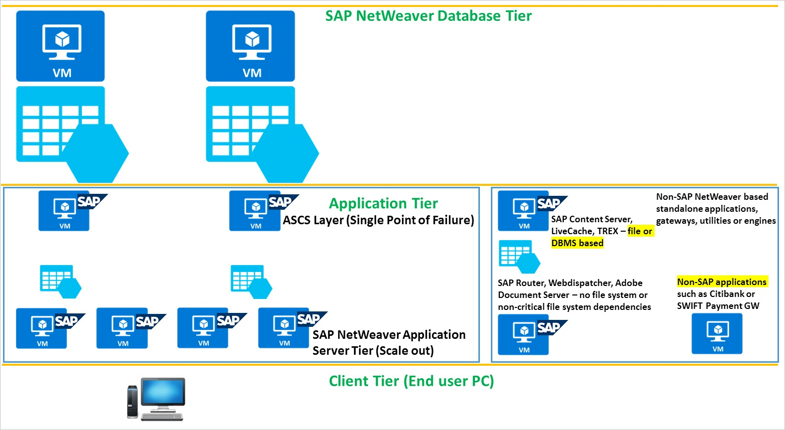
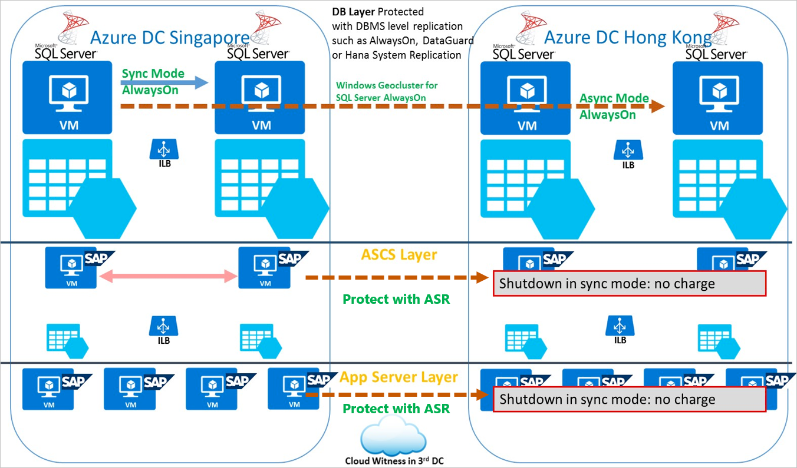

# Protect a multi-tier SAP NetWeaver application deployment by using Site Recovery

Most large-size and medium-size SAP deployments use some form of disaster recovery solution. The importance of robust and testable disaster recovery solutions has increased as more core business processes are moved to applications like SAP. Azure Site Recovery has been tested and integrated with SAP applications. Site Recovery exceeds the capabilities of most on-premises disaster recovery solutions, and at a lower total cost of ownership (TCO) than competing solutions.

With Site Recovery, you can:
* **Enable protection of SAP NetWeaver and non-NetWeaver production applications that run on-premises** by replicating components to Azure.
* **Enable protection of SAP NetWeaver and non-NetWeaver production applications that run on Azure** by replicating components to another Azure datacenter.
* **Simplify cloud migration** by using Site Recovery to migrate your SAP deployment to Azure.
* **Simplify SAP project upgrades, testing, and prototyping** by creating a production clone on-demand for testing SAP applications.

This article describes how to protect SAP NetWeaver application deployments by using [Azure Site Recovery](site-recovery-overview.md). The article covers best practices for protecting a three-tier SAP NetWeaver deployment on Azure by replicating to another Azure datacenter by using Site Recovery. It describes supported scenarios and configurations, and how to perform test failovers (disaster recovery drills) and actual failovers.

## Prerequisites
Before you begin, ensure that you know how to do the following tasks:

* [Replicate a virtual machine to Azure](azure-to-azure-walkthrough-enable-replication.md)
* [Design a recovery network](site-recovery-azure-to-azure-networking-guidance.md)
* [Do a test failover to Azure](azure-to-azure-walkthrough-test-failover.md)
* [Do a failover to Azure](site-recovery-failover.md)
* [Replicate a domain controller](site-recovery-active-directory.md)
* [Replicate SQL Server](site-recovery-sql.md)

## Supported scenarios
You can use Site Recovery to implement a disaster recovery solution in the following scenarios:
* SAP systems running in one Azure datacenter that replicate to another Azure datacenter (Azure-to-Azure disaster recovery). For more information, see [Azure-to-Azure replication architecture](https://aka.ms/asr-a2a-architecture).
* SAP systems running on VMware (or physical) servers on-premises that replicate to a disaster recovery site in an Azure datacenter (VMware-to-Azure disaster recovery). This scenario requires some additional components. For more information, see [VMware-to-Azure replication architecture](https://aka.ms/asr-v2a-architecture).
* SAP systems running on Hyper-V on-premises that replicate to a disaster recovery site in an Azure datacenter (Hyper-V-to-Azure disaster recovery). This scenario requires some additional components. For more information, see [Hyper-V-to-Azure replication architecture](https://aka.ms/asr-h2a-architecture).

In this article, we use an Azure-to-Azure disaster recovery scenario to demonstrate the SAP disaster recovery capabilities of Site Recovery. Because Site Recovery replication isn't application-specific, the process that's described is expected to also apply to other scenarios.

### Required foundation services
In the scenario we discuss in this article, the following foundation services are deployed:
* Azure ExpressRoute or Azure VPN Gateway
* At least one Active Directory domain controller and DNS server, running in Azure

We recommend that you establish this infrastructure before you deploy Site Recovery.

## Typical SAP application deployment
Large SAP customers usually deploy between 6 and 20 individual SAP applications. Most of these applications are based on SAP NetWeaver ABAP or Java engines. Many smaller, specific non-NetWeaver SAP standalone engines, and typically some non-SAP applications, support these core NetWeaver applications.  

It's critical to inventory all the SAP applications that are running in your environment. Then, determine the deployment mode (either two-tier or three-tier), versions, patches, sizes, churn rates, and disk persistence requirements.

Protect the SAP database persistence layer by using native DBMS tools such as SQL Server AlwaysOn, Oracle Data Guard, or SAP HANA system replication. Like the SAP database layer, the client layer isn't protected by Site Recovery. It's important to consider factors that affect this layer. Factors include DNS propagation delay, security, and remote access to the disaster recovery datacenter.

Site Recovery is the recommended solution for the application layer, including for SAP SCS and ASCS. Other applications, such as non-NetWeaver SAP applications and non-SAP applications, form part of the overall SAP deployment environment. You should protect them with Site Recovery.

## Replicate virtual machines
To start replicating all the SAP application virtual machines to the Azure disaster recovery datacenter, follow the guidance in [Replicate a virtual machine to Azure](azure-to-azure-walkthrough-enable-replication.md).

If you use a static IP address, you can specify the IP address that you want the virtual machine to take. To set the IP address, go to  **Compute and Network settings** > **Network interface card**.

## Create a recovery plan
A recovery plan supports the sequencing of various tiers in a multi-tier application during a failover. Sequencing helps maintain application consistency. When you create a recovery plan for a multi-tier web application, complete the steps described in [Create a recovery plan by using Site Recovery](site-recovery-create-recovery-plans.md).

### Add scripts to the recovery plan
For your applications to function correctly, you might need to do some operations on the Azure virtual machines after the failover or during a test failover. You can automate some post-failover operations. For example, you can update the DNS entry and change bindings and connections by adding corresponding scripts to the recovery plan.

### DNS update
If DNS is configured for dynamic DNS update, virtual machines usually update the DNS with the new IP address when they start. If you want to add an explicit step to update DNS with the new IP addresses of the virtual machines, add a [script to update the IP address in DNS](https://aka.ms/asr-dns-update) as a post-failover action on recovery plan groups.  

## Example Azure-to-Azure deployment
The following diagram shows the Site Recovery Azure-to-Azure disaster recovery scenario:

* The primary datacenter is in Singapore (Azure South-China East). The disaster recovery datacenter is in Hong Kong (Azure China East). In this scenario, local high availability is provided by two VMs that run SQL Server AlwaysOn in synchronous mode in Singapore.
* The file share SAP ASCS provides high availability for the SAP single points of failure. The file share ASCS doesn't require a cluster shared disk. Applications like SIOS aren't required.
* Disaster recovery protection for the DBMS layer is achieved by using asynchronous replication.
* This scenario shows "symmetrical disaster recovery." This term describes a disaster recovery solution that is an exact replica of production. The disaster recovery SQL Server solution has local high availability. Symmetrical disaster recovery isn't mandatory for the database layer. Many customers take advantage of the flexibility of cloud deployments to quickly build a local high availability node after a disaster recovery event.
* The diagram depicts the SAP NetWeaver ASCS and application server layer replicated by Site Recovery.

## Run a test failover

1.	In the Azure portal, select your Recovery Services vault.
2.	Select the recovery plan that you created for SAP applications.
3.	Select **Test Failover**.
4.  To start the test failover process, select the recovery point and the Azure virtual network.
5.	When the secondary environment is up, perform validations.
6.	When validations are complete, to clean the failover environment, select **Cleanup test failover**.

For more information, see [Test failover to Azure in Site Recovery](site-recovery-test-failover-to-azure.md).

## Run a failover

1.	In the Azure portal, select your Recovery Services vault.
2.	Select the recovery plan that you created for SAP applications.
3.	Select **Failover**.
4.	To start the failover process, select the recovery point.

For more information, see [Failover in Site Recovery](site-recovery-failover.md).

## Next steps
* To learn more about building a disaster recovery solution for SAP NetWeaver deployments by using Site Recovery, see the downloadable white paper [SAP NetWeaver: Building a Disaster Recovery Solution with Azure Site Recovery](http://aka.ms/asr-sap). The white paper discusses recommendations for various SAP architectures, lists supported applications and VM types for SAP on Azure, and describes testing plan options for your disaster recovery solution.
* Learn more about [replicating other workloads](site-recovery-workload.md) by using Site Recovery.

<!-- Update_Description: new articles on site recovery SAP -->
<!--ms.date: 03/05/2018-->
