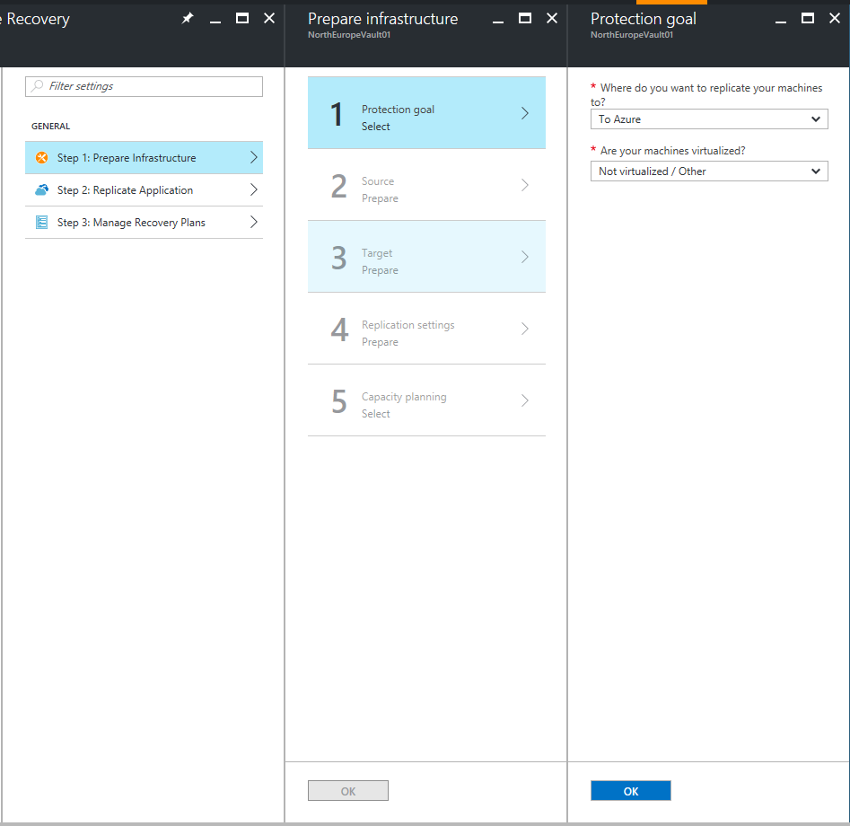
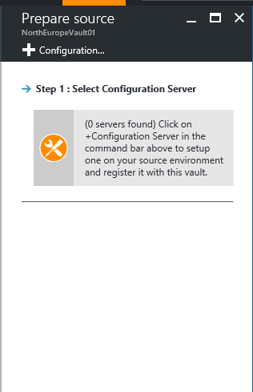

# Set up the source environment (physical server to Azure)
> [!div class="op_single_selector"]
> * [VMware to Azure](./site-recovery-set-up-vmware-to-azure.md)
> * [Physical to Azure](./site-recovery-set-up-physical-to-azure.md)

This article describes how to set up your on-premises environment to start replicating physical servers running Windows or Linux into Azure.

## Prerequisites

The article assumes that you already have:
1. A Recovery Services vault in the [Azure portal](http://portal.azure.cn).
3. A physical computer on which to install the configuration server.

### Configuration server minimum requirements
The following table lists the minimum hardware, software, and network requirements for a configuration server.
[!INCLUDE [site-recovery-configuration-server-requirements](../../includes/site-recovery-configuration-and-scaleout-process-server-requirements.md)]

> [!NOTE]
> HTTPS-based proxy servers are not supported by the configuration server.

## Choose your protection goals

1. In the Azure portal, go to the **Recovery Services** vaults blade and select your vault.
2. In the **Resource** menu of the vault, click **Getting Started** > **Site Recovery** > **Step 1: Prepare Infrastructure** > **Protection goal**.

    
3. In **Protection goal**, select **To Azure** and **Not virtualized/Other**, and then click **OK**.

    

## Set up the source environment

1. In **Prepare source**, if you don't have a configuration server, click **+Configuration server** to add one.

  
2. In the **Add Server** blade, check that **Configuration Server** appears in **Server type**.
4. Download the Site Recovery Unified Setup installation file.
5. Download the vault registration key. You need the registration key when you run Unified Setup. The key is valid for five days after you generate it.

    
6. On the machine you're using as the configuration server, run **Azure Site Recovery Unified Setup** to install the configuration server, the process server, and the master target server.

#### Run Azure Site Recovery Unified Setup

> [!TIP]
> Configuration server registration fails if the time on your computer's system clock is more than five minutes off of local time. Synchronize your system clock with a [time server](https://technet.microsoft.com/windows-server-docs/identity/ad-ds/get-started/windows-time-service/windows-time-service) before starting the installation.

[!INCLUDE [site-recovery-add-configuration-server](../../includes/site-recovery-add-configuration-server.md)]

> [!NOTE]
> The configuration server can be installed via a command line. For more information, see [Installing configuration server using command-line tools](http://aka.ms/installconfigsrv).

## Common issues

[!INCLUDE [site-recovery-vmware-to-azure-install-register-issues](../../includes/site-recovery-vmware-to-azure-install-register-issues.md)]

## Next steps

Next step involves [setting up your target environment](./site-recovery-prepare-target-physical-to-azure.md) in Azure.

<!--Not Available the parent file of includes file of site-recovery-configuration-and-scaleout-process-server-requirements.md-->
<!--ms.date:01/01/2018-->