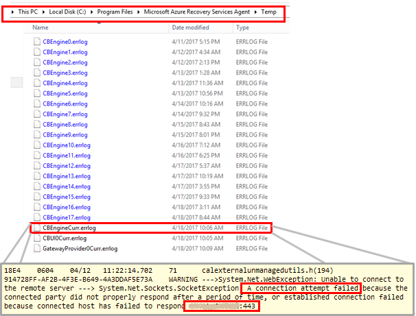
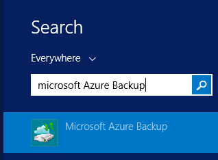
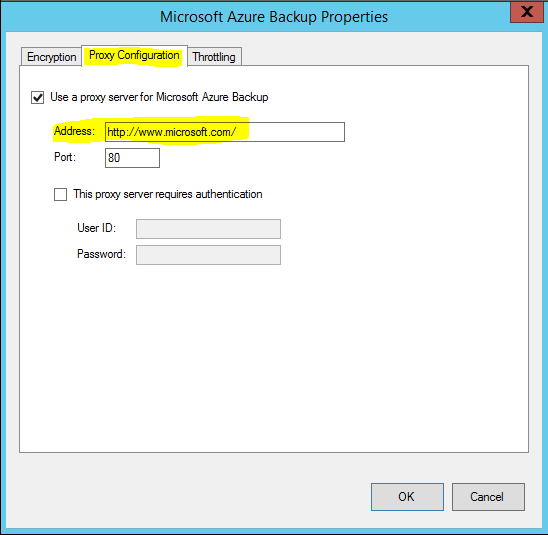

# Troubleshoot on-premises VMware/Physical server replication issues
You may receive a specific error message when protecting your VMware virtual machines or physical servers using Azure Site Recovery. This article details some of the more common error messages encountered, along with troubleshooting steps to resolve them.

## Initial replication is stuck at 0%
Most of the initial replication failures that we encounter at support are due to connectivity issues between source server-to-process server or process server-to-Azure.
For most cases, you can troubleshoot these issues by following the steps listed below.

###Check the following on SOURCE MACHINE
* From Source Server machine command line, use Telnet to ping the Process Server with https port (default 9443) as shown below to see if there are any network connectivity issues or firewall port blocking issues.

    `telnet <PS IP address> <port>`
> [!NOTE]
	> Use Telnet, don't use PING to test connectivity.  If Telnet is not installed, follow the steps list [here](https://technet.microsoft.com/library/cc771275(v=WS.10).aspx)

If unable to connect, allow inbound port 9443 on the Process Server and check if the problem still exits. There has been some cases where process server was behind DMZ, which was causing this problem.

* Check the status of service `InMage Scout VX Agent - Sentinel/OutpostStart` if it is not running and check if the problem still exists.   

###Check the following on PROCESS SERVER

* **Check if process server is actively pushing data to Azure**

From Process Server machine, open the Task Manager (press Ctrl-Shift-Esc). Go to the Performance tab and click 'Open Resource Monitor' link. From Resource Manager, go to Network tab. Check if cbengine.exe in 'Processes with Network Activity' is actively sending large volume (in Mbs) of data.

If not, follow the steps listed below:

* **Check if Process server is able to connect Azure Blob**: Select and check cbengine.exe to view the 'TCP Connections' to see if there is connectivity from Process server to Azure Storage blob URL.

If not then go to Control Panel > Services, check if the following services are up and running:

     * cxprocessserver
     * InMage Scout VX Agent - Sentinel/Outpost
     * Azure Recovery Services Agent
     * Azure Site Recovery Service
     * tmansvc
     *
(Re)Start any service, which is not running and check if the problem still exists.

* **Check if Process server is able to connect to Azure Public IP address using port 443**

Open the latest CBEngineCurr.errlog from `%programfiles%\Azure Recovery Services Agent\Temp` and search for: 443 and connection attempt failed.

If there are issues, then from Process Server command line, use telnet to ping your Azure Public IP address (masked in above image) found in the CBEngineCurr.currLog using port 443.

      telnet <your Azure Public IP address as seen in CBEngineCurr.errlog>  443
If you are unable to connect, then check if the access issue is due to firewall or Proxy as described in next step.

* **Check if IP address-based firewall on Process server is not blocking access**: If you are using an IP address-based firewall rules on the server, then download the complete list of Azure Datacenter IP Ranges from [here](https://www.microsoft.com/download/details.aspx?id=42064) and add them to your firewall configuration to ensure they allow communication to Azure (and the HTTPS (443) port).  Allow IP address ranges for the Azure region of your subscription, and for China North (used for Access Control and Identity Management).

* **Check if URL-based firewall on Process server is not blocking access**:  If you are using a URL-based firewall rules on the server, ensure the following URLs are added to firewall configuration.

  `*.accesscontrol.chinacloudapi.cn:` Used for access control and identity management

  `*.backup.windowsazure.cn:` Used for replication data transfer and orchestration

  `*.blob.core.chinacloudapi.cn:` Used for access to the storage account that stores replicated data

  `*.hypervrecoverymanager.windowsazure.cn:` Used for replication management operations and orchestration

  `time.nist.gov` and `time.windows.com`: Used to check time synchronization between system and global time.

URLs for **Azure Government Cloud**:

`* .ugv.hypervrecoverymanager.windowsazure.us`

`* .ugv.backup.windowsazure.us`

`* .ugi.hypervrecoverymanager.windowsazure.us`

`* .ugi.backup.windowsazure.us`

* **Check if Proxy Settings on Process server are not blocking access**.  If you are using a Proxy Server, ensure the proxy server name is resolving by the DNS server.
To check what you have provided at the time of Configuration Server setup. Go to registry key

	`HKEY_LOCAL_MACHINE\SOFTWARE\Microsoft\Azure Site Recovery\ProxySettings`

Now ensure that the same settings are being used by Azure Site Recovery agent to send data.
Search Azure  Backup

Open it and click on Action > Change Properties. Under Proxy Configuration tab, you should see the proxy address, which should be same as shown by the registry settings. If not, please change it to the same address.

* **Check if Throttle bandwidth is not constrained on Process server**:  Increase the bandwidth  and check if the problem still exists.

##Next steps
If you need more help, then post your query to [Azure Site Recovery forum](https://www.azure.cn/support/forums/) We have an active community and one of our engineers will be able to assist you.
<!--Update_Description: update meta properties, wording update -->