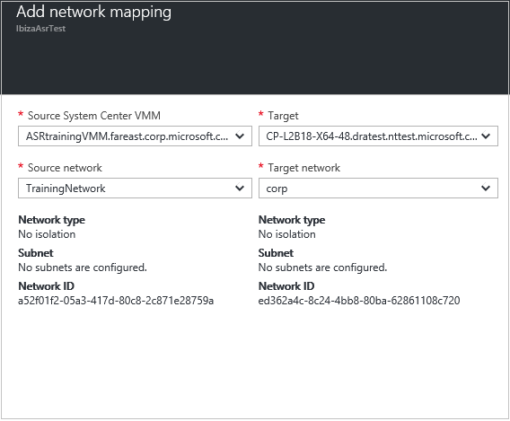

# Step 7: Map networks for Hyper-V VM replication to a secondary site

After setting up [source and target settings](vmm-to-vmm-walkthrough-source-target.md) for replicating Hyper-V virtual machines (VMs) to a secondary System Center Virtual Machine Manager (VMM) site, use this article to configure network mapping for Hyper-V virtual machine (VM) replication to a secondary site, using  [Azure Site Recovery](site-recovery-overview.md).

After reading this article, post any comments at the bottom, or on the [Azure Recovery Services Forum](https://social.msdn.microsoft.com/Forums/en-US/home?forum=hypervrecovmgr).

## Before you start

- Learn about [network mapping](vmm-to-vmm-walkthrough-network.md#network-mapping-overview) before you start.
- Verify that virtual machines on VMM servers are connected to a VM network.

## Configure network mapping

1. In **Network Mapping** > **Network mappings**, click **+Network Mapping**.
2. In **Add network mapping** tab, select the source and target VMM servers. The VM networks associated with the VMM servers are retrieved.
3. In **Source network**, select the network you want to use from the list of VM networks associated with the primary VMM server.
4. In **Target network**, select the network you want to use on the secondary VMM server. Then click **OK**.

    

Here's what happens when network mapping begins:

* Any existing replica virtual machines that correspond to the source VM network will be connected to the target VM network.
* New virtual machines that are connected to the source VM network will be connected to the target mapped network after replication.
* If you modify an existing mapping with a new network, replica virtual machines will be connected using the new settings.
* If the target network has multiple subnets and one of those subnets has the same name as subnet on which the source virtual machine is located, then the replica virtual machine will be connected to that target subnet after failover. If there's no target subnet with a matching name, the virtual machine will be connected to the first subnet in the network.

## Next steps

Go to [Step 8: Configure a replication policy](vmm-to-vmm-walkthrough-replication.md).

<!--Update_Description: new articles on site recovery network mapping from vmm to vmm-->