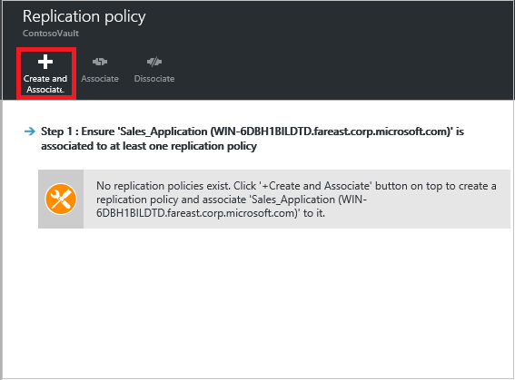
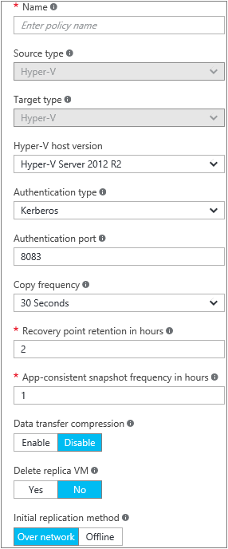

# Step 8: Set up a replication policy

After configuring [network mapping](vmm-to-vmm-walkthrough-network-mapping.md), use this article to set up a replication policy for Hyper-V virtual machine (VM) replication to a secondary site, using [Azure Site Recovery](site-recovery-overview.md).

After reading this article, post any comments at the bottom, or on the [Azure Recovery Services Forum](https://social.msdn.microsoft.com/Forums/en-US/home?forum=hypervrecovmgr).

## Before you start

- When you create a replication policy, all hosts using the policy must have the same operating system. The VMM cloud can contain Hyper-V hosts running different versions of Windows Server, but in this case, you need multiple replication policies.
- You can perform the initial replication offline.

## Configure replication settings

1. To create a new replication policy, click **Prepare infrastructure** > **Replication Settings** > **+Create and associate**.

    
2. In **Create and associate policy**, specify a policy name. The source and target type should be **Hyper-V**.
3. In **Hyper-V host version**, select which operating system is running on the host.
4. In **Authentication type** and **Authentication port**, specify how traffic is authenticated between the primary and recovery Hyper-V host servers. Select **Certificate** unless you have a working Kerberos environment. Azure Site Recovery will automatically configure certificates for HTTPS authentication. You don't need to do anything manually. By default, port 8083 and 8084 (for certificates) will be opened in the Windows Firewall on the Hyper-V host servers. If you do select **Kerberos**, a Kerberos ticket will be used for mutual authentication of the host servers. Note that this setting is only relevant for Hyper-V host servers running on Windows Server 2012 R2.
5. In **Copy frequency**, specify how often you want to replicate delta data after the initial replication (every 30 seconds, 5 or 15 minutes).
6. In **Recovery point retention**, specify in hours how long the retention window will be for each recovery point. Protected machines can be recovered to any point within a window.
7. In **App-consistent snapshot frequency**, specify how frequently (1-12 hours) recovery points containing application-consistent snapshots are created. Hyper-V uses two types of snapshots — a standard snapshot that provides an incremental snapshot of the entire virtual machine, and an application-consistent snapshot that takes a point-in-time snapshot of the application data inside the virtual machine. Application-consistent snapshots use Volume Shadow Copy Service (VSS) to ensure that applications are in a consistent state when the snapshot is taken. If you enable application-consistent snapshots, it will affect the performance of applications running on source virtual machines. Ensure that the value you set is less than the number of additional recovery points you configure.
8. In **Data transfer compression**, specify whether replicated data that is transferred should be compressed.
9. Select **Delete replica VM**, to specify that the replica virtual machine should be deleted if you disable protection for the source VM. If you enable this setting, when you disable protection for the source VM it's removed from the Site Recovery console, Site Recovery settings for the VMM are removed from the VMM console, and the replica is deleted.
10. In **Initial replication method**, if you're replicating over the network, specify whether to start the initial replication or schedule it. To save network bandwidth, you might want to schedule it outside your busy hours. Then click **OK**.

     
11. When you create a new policy it's automatically associated with the VMM cloud. In **Replication policy**, click **OK**. You can associate additional VMM Clouds (and the VMs in them) with this replication policy in **Replication** > policy name > **Associate VMM Cloud**.

     

## Prepare for offline initial replication

You can do offline replication for the initial data copy. You can prepare this as follows:

* On the source server, you specify a path location from which the data export will take place. Assign Full Control for NTFS and, Share permissions to the VMM service on the export path. On the target server, you specify a path location from which the data import will occur. Assign the same permissions on this import path.
* If the import or export path is shared, assign Administrator, Power User, Print Operator, or Server Operator group membership for the VMM service account on the remote computer on which the shared is located.
* If you're using any Run As accounts to add hosts, on the import and export paths, assign read and write permissions to the Run As accounts in VMM.
* The import and export shares should not be located on any computer used as a Hyper-V host server, because loopback configuration is not supported by Hyper-V.
* In Active Directory, on each Hyper-V host server that contains virtual machines you want to protect, enable and configure constrained delegation to trust the remote computers on which the import and export paths are located, as follows:
  1. On the domain controller, open **Active Directory Users and Computers**.
  2. In the console tree, click **DomainName** > **Computers**.
  3. Right-click the Hyper-V host server name > **Properties**.
  4. On the **Delegation** tab, click **Trust this computer for delegation to specified services only**.
  5. Click **Use any authentication protocol**.
  6. Click **Add** > **Users and Computers**.
  7. Type the name of the computer that hosts the export path > **OK**. From the list of available services, hold down the CTRL key and click **cifs** > **OK**. Repeat for the name of the computer that hosts the import path. Repeat as necessary for additional Hyper-V host servers.

## Next steps

Go to [Step 9: Enable replication](vmm-to-vmm-walkthrough-enable-replication.md).

<!--Update_Description: new articles on site recovery replication from vmm to vmm-->