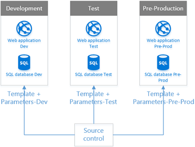
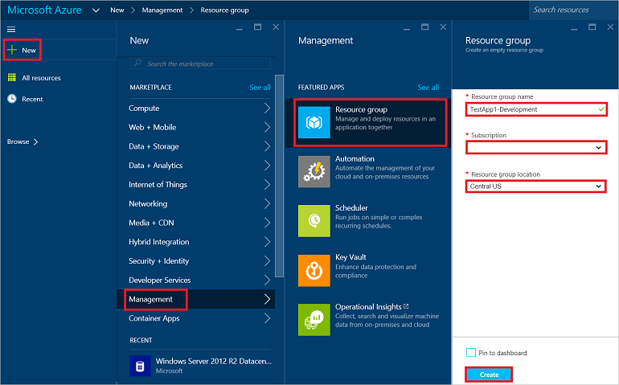
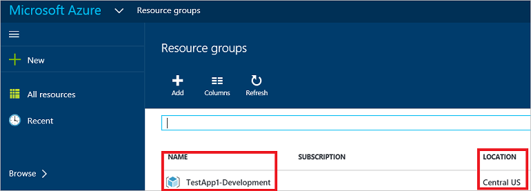
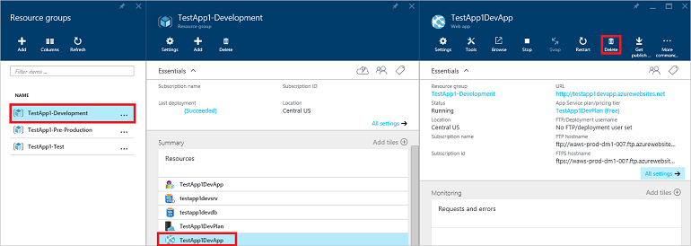

<properties
   pageTitle="Development and test environments | Azure"
   description="Learn how to use Azure Resource Manager templates to quickly and consistently create and delete development and test environments."
   services="azure-resource-manager"
   documentationCenter="na"
   authors="tfitzmac"
   manager="timlt"
   editor="tysonn"/>

<tags
   ms.service="azure-resource-manager"
   ms.devlang="na"
   ms.topic="article"
   ms.tgt_pltfrm="na"
   ms.workload="na"
   ms.date="01/22/2016"
   ms.author="tomfitz"/>

# Development and test environments in Azure

Custom applications are typically deployed to multiple development and testing environments before deployment to production. When environments are created on premises, computing resources are either procured or allocated for each environment for each application. The environments often include several physical or virtual machines with specific configurations that are deployed manually or with complex automation scripts. Deployments often take hours and  result in inconsistent configurations across environments.

## Scenario ##

When you provision development and test environments in Azure, you only pay for the resources you use.  This article explains how quickly and consistently you can create, maintain, and delete development and test environments using Azure Resource Manager templates and parameter files, as illustrated below.

Three development and testing environments are shown above.  Each has web application and SQL database resources, which are specified in a template file.  The names of the application and database in each environment are different, and are specified in unique parameter files for each environment.  

If you're not familiar with Azure Resource Manager concepts, it's recommended that you read the [Azure Resource Manager Overview](resource-group-overview.md) article before reading this article.

You may want to first go through the steps in this article as listed without reading any of the referenced articles to quickly gain some experience using Azure Resource Manager templates. After you've been through the steps once, you'll be able to get answers to most of the questions that arose your first time through by experimenting further with the steps and by reading the referenced articles.

## Plan Azure resource use
Once you have a high level design for your application, you can define:

- Which Azure resources your application will include. You might build your application and deploy it as an Azure Web App with an Azure SQL Database.  You might build your application in virtual machines using PHP and MySQL or IIS and SQL Server, or other components. The [Azure App Service, Cloud Services, and Virtual Machines comparison]( app-service-web/choose-web-site-cloud-service-vm.md) article helps you decide which Azure resources you might want to utilize for your application.
- What service level requirements such as availability, security, and scale that your application will meet.

## Download an existing template
An Azure Resource Manager template defines all of the Azure resources that your application utilizes. Several templates already exist that you can deploy directly in the Azure portal, or download, modify, and save in a source control system with your application code.  Complete the steps below to download an existing template.

1. Browse existing templates in the [Azure Quickstart Templates](https://github.com/Azure/azure-quickstart-templates/) GitHub repository. In the list you'll see a "[201-web-app-sql-database](https://github.com/Azure/azure-quickstart-templates/tree/master/201-web-app-sql-database)" folder. Since many custom applications include a web application and SQL database, this template is used as an example in the remainder of this article to help you understand how to use templates. It's beyond the scope of this article to fully explain everything this template creates and configures, but if you plan to use it to create actual environments in your organization, you'll want to fully understand it by reading the [Provision a web app with a SQL Database](app-service-web/app-service-web-arm-with-sql-database-provision.md) article.
Note: this article was written for the December 2015 version of the [201-web-app-sql-database](https://github.com/Azure/azure-quickstart-templates/tree/3f24f7b7e1e377538d1d548eaa6eab2851a21810/201-web-app-sql-database) template. The links below that point to template and parameter files are to that version of the template.
2. Click on the [azuredeploy.json](https://github.com/Azure/azure-quickstart-templates/tree/3f24f7b7e1e377538d1d548eaa6eab2851a21810/201-web-app-sql-database/azuredeploy.json) file in the 201-web-app-sql-database folder to view its contents. This is the Azure Resource Manager template file. 
3. In the view mode, click the "[Raw](https://raw.githubusercontent.com/Azure/azure-quickstart-templates/3f24f7b7e1e377538d1d548eaa6eab2851a21810/201-web-app-sql-database/azuredeploy.json)" button. 
4. With your mouse, select the contents of this file and save them to your computer as a file named "TestApp1-Template.json." 
5. Examine the template contents and notice the following:
 - **Resources** section:  This section defines the types of Azure resources created by this template. Among other resource types, this template creates [Azure Web App](app-service-web/app-service-web-overview.md) and [Azure SQL Database](sql-database/sql-database-technical-overview.md) resources. If you prefer to run and manage web and SQL servers in virtual machines, you can use the "[iis-2vm-sql-1vm](https://github.com/Azure/azure-quickstart-templates/tree/master/iis-2vm-sql-1vm)" or "[lamp-app](https://github.com/Azure/azure-quickstart-templates/tree/master/lamp-app)" templates, but the instructions in this article are based on the [201-web-app-sql-database](https://github.com/Azure/azure-quickstart-templates/tree/3f24f7b7e1e377538d1d548eaa6eab2851a21810/201-web-app-sql-database) template.
 - **Parameters** section: This section defines the parameters that each resource can be configured with. Some of the parameters specified in the template have "defaultValue" properties, while others do not. When deploying Azure resources with a template, you must provide values for all parameters that do not have defaultValue properties specified in the template.  If you do not provide values for parameters with defaultValue properties, then the value specified for the defaultValue parameter in the template is used.

A template defines which Azure resources are created and the parameters each resource can be configured with. You can learn more about templates and how to design your own by reading the [Best practices for designing Azure Resource Manager templates](best-practices-resource-manager-design-templates.md) article.

## Download and customize an existing parameter file

Though you'll probably want the *same* Azure resources created in each environment, you'll likely want the configuration of the resources to be *different* in each environment.  This is where parameter files come in. Create parameter files that contain unique values in each environment by completing the steps below.   

1. View the contents of the [azuredeploy.parameters.json](https://github.com/Azure/azure-quickstart-templates/tree/3f24f7b7e1e377538d1d548eaa6eab2851a21810/201-web-app-sql-database/azuredeploy.parameters.json) file in the 201-web-app-sql-database folder. This is the parameter file for the template file you saved in the previous section. 
2. In the view mode, click the "[Raw](https://raw.githubusercontent.com/Azure/azure-quickstart-templates/3f24f7b7e1e377538d1d548eaa6eab2851a21810/201-web-app-sql-database/azuredeploy.parameters.json)" button. 
3. With your mouse, select the contents of this file and save them to three separate files on your computer with the following names:
 - TestApp1-Parameters-Development.json
 - TestApp1-Parameters-Test.json
 - TestApp1-Parameters-Pre-Production.json

3. Using any text or JSON editor, edit the Development environment parameter file you created in Step 3, replacing the values listed to the right of the parameter values in the file with the *values* listed to the right of the **parameters** below: 
 - **siteName**: *TestApp1DevApp*
 - **hostingPlanName**: *TestApp1DevPlan*
 - **siteLocation**: *Central US*
 - **serverName**: *testapp1devsrv*
 - **serverLocation**: *Central US*
 - **administratorLogin**: *testapp1Admin*
 - **administratorLoginPassword**: *replace with your password*
 - **databaseName**: *testapp1devdb*

4. Using any text or JSON editor, edit the Test environment parameter file you created in Step 3, replacing the the values listed to the right of the parameter values in the file with the *values* listed to the right of the **parameters** below:
 - **siteName**: *TestApp1TestApp*
 - **hostingPlanName**: *TestApp1TestPla*n
 - **siteLocation**: *Central US*
 - **serverName**: *testapp1testsrv*
 - **serverLocation**: *Central US*
 - **administratorLogin**: *testapp1Admin*
 - **administratorLoginPassword**: *replace with your password*
 - **databaseName**: *testapp1testdb*

5. Using any text or JSON editor, edit the Pre-Production parameter file you created in Step 3.  Replace the entire contents of the file with what's below:

	    {
    	  "$schema" : "http://schema.management.azure.com/schemas/2015-01-01/deploymentParameters.json#",
    	  "contentVersion" : "1.0.0.0",
    	  "parameters" : {
    	"administratorLogin" : {
    	  "value" : "testApp1Admin"
    	},
    	"administratorLoginPassword" : {
    	  "value" : "replace with your password"
    	},
    	"databaseName" : {
    	  "value" : "testapp1preproddb"
    	},
    	"hostingPlanName" : {
    	  "value" : "TestApp1PreProdPlan"
    	},
    	"serverLocation" : {
    	  "value" : "Central US"
    	},
    	"serverName" : {
    	  "value" : "testapp1preprodsrv"
    	},
    	"siteLocation" : {
    	  "value" : "Central US"
    	},
    	"siteName" : {
    	  "value" : "TestApp1PreProdApp"
    	},
    	"sku" : {
    	  "value" : "Standard"
    	},
    		"requestedServiceObjectiveName" : {
    		  "value" : "S1"
    	}
    	  }
    	}

In the Pre-Production parameters file above, the **sku** and **requestedServiceObjectiveName** parameters were *added*, whereas they weren't added in the Development and Test parameters files. This is because there are default values specified for these parameters in the template, and in the Development and Test environments, the default values are used, but in the Pre-Production environment non-default values for these parameters are used.

The reason non-default values are used for these parameters in the Pre-Production environment is to test values for these parameters that you might prefer for your Production environment so they can also be tested.  These parameters all relate to the Azure [Web App hosting plans](https://azure.microsoft.com/pricing/details/app-service/), or **sku** and Azure [SQL Database](https://azure.microsoft.com/pricing/details/sql-database/), or **requestedServiceObjectiveName** that are used by the application.  Different skus and service objective names have different costs and features and support different service level metrics.

The table below lists the default values for these parameters specified in the template and the values that are used instead of the default values in the Pre-Production parameters file.

| Parameter | Default value | Parameter file value |
|---|---|---|
| **sku** | Free | Standard |
| **requestedServiceObjectiveName** | S0 | S1 |

## Create environments
All Azure resources must be created within an [Azure Resource Group](azure-portal/resource-group-portal#create-resource-group-and-resources.md). Resource groups enable you to group Azure resources so they can be managed collectively.  [Permissions](./active-directory/role-based-access-built-in-roles.md) can be assigned to resource groups such that specific people within your organization can create, modify, delete, or view them and the resources within them.  Alerts and billing information for resources in the Resource Group can be viewed in the [Azure Portal](https://portal.azure.com). Resource groups are created in an Azure [region](https://azure.microsoft.com/regions/).  In this article, all resources are created in the Central US region. When you start creating actual environments, you'll choose the region that best meets your requirements. 

Create resource groups for each environment using any of the methods below.  All methods will achieve the same outcome.

###Azure Command Line Interface (CLI)

Ensure that you have the CLI [installed](xplat-cli-install.md) on either a Windows, OS X, or Linux computer, and that you've [connected](xplat-cli-connect.md) your [Azure AD account](./active-directory/active-directory-how-subscriptions-associated-directory.md) (also called a work or school account) to your Azure subscription. From the CLI command line, type the command below to create the resource group for the Development environment.

	azure group create "TestApp1-Development" "Central US"

The command will return the following if it succeeds:

	info:    Executing command group create
	+ Getting resource group TestApp1-Development
	+ Creating resource group TestApp1-Development
	info:    Created resource group TestApp1-Development
	data:    Id:                  /subscriptions/uuuuuuuu-vvvv-wwww-xxxx-yyyy-zzzzzzzzzzzz/resourceGroups/TestApp1-Development
	data:    Name:                TestApp1-Development
	data:    Location:            chinaeast
	data:    Provisioning State:  Succeeded
	data:    Tags: null
	data:
	info:    group create command OK

To create the resource group for the Test environment, type the command below:

	azure group create "TestApp1-Test" "Central US"

To create the resource group for the Pre-Production environment, type the command below:

	azure group create "TestApp1-Pre-Production" "Central US"

###PowerShell

Ensure that you have Azure PowerShell 1.01 or higher installed on a Windows computer and have connected your [Azure AD account](./active-directory/active-directory-how-subscriptions-associated-directory.md) (also called a work or school account) to your subscription as detailed in the [How to install and configure Azure PowerShell](powershell-install-configure.md) article. From a PowerShell command prompt, type the command below to create the resource group for the Development environment.

	New-AzureRmResourceGroup -Name TestApp1-Development -Location "Central US"

The command will return the following if it succeeds:

	ResourceGroupName : TestApp1-Development
	Location          : chinaeast
	ProvisioningState : Succeeded
	Tags              :
	ResourceId        : /subscriptions/uuuuuuuu-vvvv-wwww-xxxx-yyyy-zzzzzzzzzzzz/resourceGroups/TestApp1-Development

To create the resource group for the Test environment, type the command below:

	New-AzureRmResourceGroup -Name TestApp1-Test -Location "Central US"

To create the resource group for the Pre-Production environment, type the command below:

	New-AzureRmResourceGroup -Name TestApp1-Pre-Production -Location "Central US"

###Azure portal

1. Sign in to the [Azure portal](https://portal.azure.com) with an [Azure AD](./active-directory/active-directory-how-subscriptions-associated-directory.md) (also called a work or school) account. Click New-->Management-->Resource group and enter "TestApp1-Development" in the Resource group name box, select your subscription, and select "Central US" in the Resource group location box as shown in the picture below.
   
2. Click the Create button to create the resource group.
3. Click Browse, scroll down the list to Resource groups and click on Resource groups as shown below.
    
4. After clicking on Resource groups you'll see the Resource groups blade with your new resource group.
   
5. Create the TestApp1-Test and TestApp1-Pre-Production resource groups the same way you created the TestApp1-Development resource group above.

##Deploy resources to environments

Deploy Azure resources to the resource groups for each environment using the template file for the solution and the parameter files for each environment using either of the methods below.  Both methods will achieve the same outcome.

###Azure Command Line Interface (CLI)

From the CLI command line, type the command below to deploy resources to the resource group you created for the Development environment, replacing [path] with the path to the files you saved in previous steps.

	azure group deployment create -g TestApp1-Development -n Deployment1 -f [path]TestApp1-Template.json -e [path]TestApp1-Parameters-Development.json 

After seeing a "Waiting for deployment to complete" message for a few minutes, the command will return the following if it succeeds:

	info:    Executing command group deployment create
	+ Initializing template configurations and parameters
	+ Creating a deployment
	info:    Created template deployment "Deployment1"
	+ Waiting for deployment to complete
	data:    DeploymentName     : Deployment1
	data:    ResourceGroupName  : TestApp1-Development
	data:    ProvisioningState  : Succeeded
	data:    Timestamp          : XXXX-XX-XXT20:20:23.5202316Z
	data:    Mode               : Incremental
	data:    Name                           Type          Value
	data:    -----------------------------  ------------  ----------------------------
	data:    siteName                       String        TestApp1DevApp
	data:    hostingPlanName                String        TestApp1DevPlan
	data:    siteLocation                   String        Central US
	data:    sku                            String        Free
	data:    workerSize                     String        0
	data:    serverName                     String        testapp1devsrv
	data:    serverLocation                 String        Central US
	data:    administratorLogin             String        testapp1Admin
	data:    administratorLoginPassword     SecureString  undefined
	data:    databaseName                   String        testapp1devdb
	data:    collation                      String        SQL_Latin1_General_CP1_CI_AS
	data:    edition                        String        Standard
	data:    maxSizeBytes                   String        1073741824
	data:    requestedServiceObjectiveName  String        S0
	info:    group deployment create command OKx

If the command does not succeed, resolve any error messages and try it again.  Common problems are using parameter values that do not adhere to Azure resource naming constraints. Other troubleshooting tips can be found in the [Troubleshooting resource group deployments in Azure](virtual-machines/resource-group-deploy-debug.md) article.

From the CLI command line, type the command below to deploy resources to the resource group you created for the Test environment, replacing [path] with the path to the files you saved in previous steps.

	azure group deployment create -g TestApp1-Test -n Deployment1 -f [path]TestApp1-Template.json -e [path]TestApp1-Parameters-Test.json

From the CLI command line, type the command below to deploy resources to the resource group you created for the Pre-Production environment, replacing [path] with the path to the files you saved in previous steps.

	azure group deployment create -g TestApp1-Pre-Production -n Deployment1 -f [path]TestApp1-Template.json -e [path]TestApp1-Parameters-Pre-Production.json
  
###PowerShell

From an Azure PowerShell (version 1.01 or higher) command prompt, type the command below to deploy resources to the resource group you created for the Development environment, replacing [path] with the path to the files you saved in previous steps.

	New-AzureRmResourceGroupDeployment -ResourceGroupName TestApp1-Development -TemplateFile [path]TestApp1-Template.json -TemplateParameterFile [path]TestApp1-Parameters-Development.json -Name Deployment1 

After seeing a blinking cursor for a few minutes, the command will return the following if it succeeds:

	DeploymentName    : Deployment1
	ResourceGroupName : TestApp1-Development
	ProvisioningState : Succeeded
	Timestamp         : XX/XX/XXXX 2:44:48 PM
	Mode              : Incremental
	TemplateLink      : 
	Parameters        : 
	                    Name             Type                       Value     
	                    ===============  =========================  ==========
	                    siteName         String                     TestApp1DevApp
	                    hostingPlanName  String                     TestApp1DevPlan
	                    siteLocation     String                     Central US
	                    sku              String                     Free      
	                    workerSize       String                     0         
	                    serverName       String                     testapp1devsrv
	                    serverLocation   String                     Central US
	                    administratorLogin  String                     testapp1Admin
	                    administratorLoginPassword  SecureString                         
	                    databaseName     String                     testapp1devdb
	                    collation        String                     SQL_Latin1_General_CP1_CI_AS
	                    edition          String                     Standard  
	                    maxSizeBytes     String                     1073741824
	                    requestedServiceObjectiveName  String                     S0        
	                    
	Outputs           :

  If the command does not succeed, resolve any error messages and try it again.  Common problems are using parameter values that do not adhere to Azure resource naming constraints. Other troubleshooting tips can be found in the [Troubleshooting resource group deployments in Azure](virtual-machines/resource-group-deploy-debug.md) article.

  From a PowerShell command prompt, type the command below to deploy resources to the resource group you created for the Test environment, replacing [path] with the path to the files you saved in previous steps.

	New-AzureRmResourceGroupDeployment -ResourceGroupName TestApp1-Test -TemplateFile [path]TestApp1-Template.json -TemplateParameterFile [path]TestApp1-Parameters-Test.json -Name Deployment1

  From a PowerShell command prompt, type the command below to deploy resources to the resource group you created for the Pre-Production environment, replacing [path] with the path to the files you saved in previous steps.

	New-AzureRmResourceGroupDeployment -ResourceGroupName TestApp1-Pre-Production -TemplateFile [path]TestApp1-Template.json -TemplateParameterFile [path]TestApp1-Parameters-Pre-Production.json -Name Deployment1

The template and parameter files can be versioned and maintained with your application code in a source control system.  You could also save the commands above to script files and save them with your code as well.

> [AZURE.NOTE] You can deploy the template to Azure directly by clicking the "Deploy to Azure" button on the [Provision a Web App with a SQL Database](https://azure.microsoft.com/documentation/templates/201-web-app-sql-database/) article.  You might find this helpful to learn about templates, but doing so does not enable you to edit, version, and save your template and parameter values with your application code, so further detail about this method is not covered in this article.

## Maintain environments
Throughout development, configuration of the Azure resources in the different environments may be inconsistently changed intentionally or accidentally.  This can cause unnecessary troubleshooting and problem resolution during the application development cycle.

1. Change the environments by opening the [Azure portal](https://portal.azure.com). 
2. Sign into it with the same account you used to complete the steps above. 
3. As shown in the picture below, click Browse-->Resource groups (you may need to scroll down to see Resource groups).
   
4. After clicking on Resource groups in the picture above, you'll see the Resource groups blade and the three resource groups you created in a previous step as shown in the picture below. Click on the TestApp1-Development resource group and you'll see the blade that lists the resources created by the template in the TestApp1-Development resource group deployment you completed in a previous step.  Delete the TestApp1DevApp Web App resource by clicking TestApp1DevApp in the TestApp1-Development Resource group blade, and then clicking Delete in the TestApp1DevApp Web app blade.
   
5. Click "Yes" when the portal prompts you as to whether you're sure you want to delete the resource. Closing the TestApp1-Development Resource group blade and re-opening it will now show it without the Web app you just deleted.  The contents of the resource group are now different than they should be. You can further experiment by deleting multiple resources from multiple resource groups or even changing configuration settings for some of the resources. Instead of using the Azure portal to delete a resource from a resource group, you could use the PowerShell [Remove-AzureResource](https://msdn.microsoft.com/library/azure/dn757676.aspx) command or the or "azure resource delete" command from the CLI to accomplish the same task.
6. To get all of the resources and configuration that are supposed to be in the resource groups back to the state they should be in, re-deploy the environments to the resource groups using the same commands you used in the [Deploy resources to environments](#deploy-resources-to-environments) section, but replace "Deployment1" with "Deployment2."
7.  As shown in the Summary section of the TestApp1-Development blade in the picture shown in step 4, you'll see that the Web app you deleted in the portal in the previous step exists again, as do any other resources you may have chosen to delete. If you changed the configuration of any of the resources, you can also verify that they've been set back to the values in the parameter files too. One of the advantages of deploying your environments with Azure Resource Manager templates is that you can easily re-deploy the environments back to a known state at any time.
8. If you click on the text under "Last deployment" in the picture below, you'll see a blade that shows the deployment history for the resource group.  Since you used the name "Deployment1" for the first deployment and "Deployment2" for the second deployment, you'll have two entries.  Clicking on a deployment will display a blade that shows the results for each deployment.
  

## Delete environments
Once you're finished using an environment, you'll want to delete it so you don't incur usage charges for Azure resources you're no longer using.  Deleting environments is even easier than creating them.  In previous steps, individual Azure Resource Groups were created for each environment and then resources were deployed into the resource groups. 

Delete the environments using any of the methods below.  All methods will achieve the same outcome.

### Azure CLI

From a CLI prompt, type the following:

	azure group delete "TestApp1-Development"

When prompted, enter y and then press enter to remove the Development environment and all of its resources. After a few minutes, the command will return the following:

	info:    group delete command OK

From a CLI prompt, type the following to delete the remaining environments:

	azure group delete "TestApp1-Test"
	azure group delete "TestApp1-Pre-Production"
  
### PowerShell

From an Azure PowerShell (version 1.01 or higher) command prompt, type the command below to delete the resource group and all its contents.    

	Remove-AzureRmResourceGroup -Name TestApp1-Development

When prompted if you're sure you want to remove the resource group, enter y, followed by the enter key.

Type the following to delete the remaining environments:

	Remove-AzureRmResourceGroup -Name TestApp1-Test
	Remove-AzureRmResourceGroup -Name TestApp1-Pre-Production

### Azure portal

1. In the Azure portal, browse to Resource groups as you did in previous steps. 
2. Select the TestApp1-Development resource group and then click Delete in the TestApp1-Development Resource group blade. A new blade will appear. Enter the resource group name and click the Delete button.

3. Delete the TestApp1-Test and TestApp1-Pre-Production resource groups the same way you deleted the TestApp1-Development resource group.

Regardless of the method you use, the resource groups and all of the resources they contained will no longer exist, and you'll no longer incur billing expenses for the resources.  

To minimize the Azure resource utilization expenses you incur during application development you can use [Azure Automation](automation/automation-intro.md) to schedule jobs that:

- Stop virtual machines at the end of each day and restart them at the start of each day.
- Delete whole environments at the end of each day and re-create them at the start of each day.
 
Now that you've experienced how easy it is to create, maintain, and delete development and test environments, you can learn more about what you just did by further experimenting with the steps above and reading the references contained in this article.

## Next steps

- [Delegate administrative control](/documentation/articles/role-based-access-control-configure/) to different resources in each environment by assigning Azure AD groups or users to specific roles that have the ability to perform a subset of operations on Azure resources.
- [Assign tags](resource-group-using-tags.md) to the resource groups for each environment and/or the individual resources. You might add an "Environment" tag to your resource groups and set its value to correspond to your environment names. Tags can be particularly helpful when you need to organize resources for billing or management.
- Monitor alerts and billing for resource group resources in the [Azure portal](https://azure.cn).