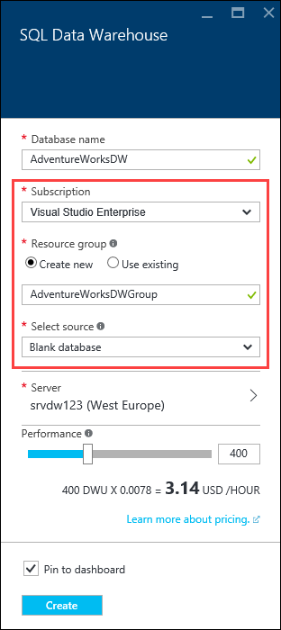

<properties
    pageTitle="Create a SQL Data Warehouse in the Azure portal | Azure"
    description="Learn how to create an Azure SQL Data Warehouse in the Azure portal"
    services="sql-data-warehouse"
    documentationcenter="NA"
    author="barbkess"
    manager="jhubbard"
    editor=""
    tags="azure-sql-data-warehouse" />
<tags
    ms.assetid="552e496e-d560-419c-9996-6bbc80c521cb"
    ms.service="sql-data-warehouse"
    ms.devlang="NA"
    ms.topic="hero-article"
    ms.tgt_pltfrm="NA"
    ms.workload="data-services"
    ms.date="10/31/2016"
    wacn.date=""
    ms.author="barbkess" />

# Create an Azure SQL Data Warehouse

> [AZURE.SELECTOR]
- [Azure portal](/documentation/articles/sql-data-warehouse-get-started-provision/)
- [TSQL](/documentation/articles/sql-data-warehouse-get-started-create-database-tsql/)
- [PowerShell](/documentation/articles/sql-data-warehouse-get-started-provision-powershell/)

This tutorial uses the Azure portal to create a SQL Data Warehouse that contains an AdventureWorksDW sample database.

## Prerequisites
To get started, you need:

* **Azure account**: Visit [Azure Free Trial][Azure Free Trial]  to create an account.
* **Azure SQL server**:  See [Create an Azure SQL Database logical server with the Azure portal][] for more details.

> [AZURE.NOTE]
> Creating a SQL Data Warehouse might result in a new billable service.  See [SQL Data Warehouse pricing][SQL Data Warehouse pricing] for more details.
>
>

## Create a SQL Data Warehouse

1. Sign in to the [Azure portal](https://portal.azure.cn).

2. Click **+ New** > **Databases** > **SQL Data Warehouse**.

    

3. In the **SQL Data Warehouse** blade, fill in the information needed, then press 'Create' to create.

    

    * **Server**: We recommend you select your server first.  
    
    * **Database name**: The name that is used to reference the SQL Data Warehouse.  It must be unique to the server.
    
    * **Performance**: We recommend starting with 400 [DWUs][DWU]. You can move the slider to the left or right to adjust the performance of your data warehouse, or scale up or down after creation.  To learn more about DWUs, see our documentation on [scaling](/documentation/articles/sql-data-warehouse-manage-compute-overview/) or our [pricing page][SQL Data Warehouse pricing].
    
    * **Subscription**: Select the [subscription] that this SQL Data Warehouse will bill to.
    
    * **Resource group**: [Resource groups][Resource group] are containers designed to help you manage a collection of Azure resources. Learn more about [resource groups](/documentation/articles/resource-group-overview/).
    
    * **Select source**: Click **Select source** > **Sample**. Azure automatically populates the **Select sample** option with AdventureWorksDW.

    > [AZURE.NOTE]
    > The default collation for a SQL Data Warehouse is SQL_Latin1_General_CP1_CI_AS. If a different collation is needed, [T-SQL][T-SQL] can be used to create the database with a different collation.
    >
    >

4. Click **Create** to create your SQL Data Warehouse.

5. Wait for a few minutes. When your data warehouse is ready, you should be returned to the [Azure portal](https://portal.azure.cn). You can find your SQL Data Warehouse on your dashboard, listed under your SQL Databases, or in the resource group that you used to create it. 

    

[AZURE.INCLUDE [SQL Database create server](../../includes/sql-database-create-new-server-firewall-portal.md)]

## Next steps

Now that you have created a SQL Data Warehouse, you are ready to [Connect](/documentation/articles/sql-data-warehouse-connect-overview/) and begin querying.

To load data into SQL Data Warehouse, see the [loading overview](/documentation/articles/sql-data-warehouse-overview-load/).

If you are trying to migrate an existing database to SQL Data Warehouse, see the [Migration overview](/documentation/articles/sql-data-warehouse-overview-migrate/) or use [Migration Utility](/documentation/articles/sql-data-warehouse-migrate-migration-utility/).

Firewall rules can also be configured using Transact-SQL. For more information, see [sp_set_firewall_rule][sp_set_firewall_rule] and [sp_set_database_firewall_rule][sp_set_database_firewall_rule].

It's also a great idea to look at the [Best practices][Best practices].

<!--Article references-->
[Create an Azure SQL Database logical server with the Azure portal]: /documentation/articles/sql-database-get-started/#create-logical-server-bk
[Create an Azure SQL Database logical server with PowerShell]: /documentation/articles/sql-database-get-started-powershell/#database-setup-create-a-resource-group-server-and-firewall-rule
[resource groups]: /documentation/articles/resource-group-template-deploy-portal/
[Best practices]: /documentation/articles/sql-data-warehouse-best-practices/
[DWU]: /documentation/articles/sql-data-warehouse-overview-what-is/#data-warehouse-units
[subscription]: /documentation/articles/azure-glossary-cloud-terminology/#subscription
[resource group]: /documentation/articles/azure-glossary-cloud-terminology/#resource-group
[T-SQL]: /documentation/articles/sql-data-warehouse-get-started-create-database-tsql/
 
<!--MSDN references-->
[sp_set_firewall_rule]: https://msdn.microsoft.com/zh-cn/library/dn270017.aspx
[sp_set_database_firewall_rule]: https://msdn.microsoft.com/zh-cn/library/dn270010.aspx

<!--Other Web references-->
[SQL Data Warehouse pricing]: /pricing/details/sql-data-warehouse/
[Azure Free Trial]: /pricing/1rmb-trial/?WT.mc_id=A261C142F

