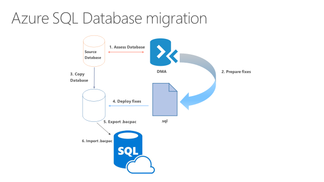
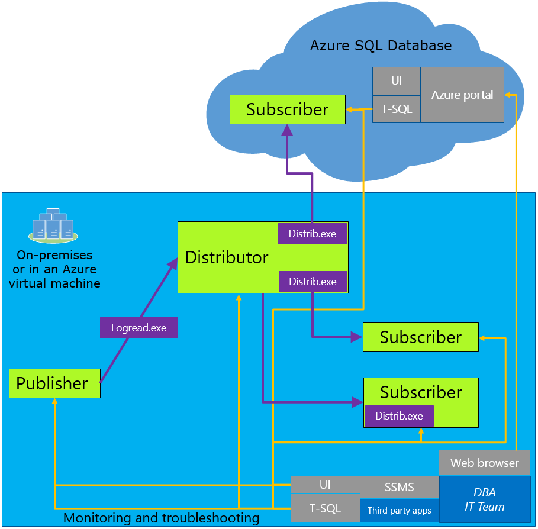

# SQL Server database migration to Azure SQL Database
In this article, you learn about the primary methods for migrating a SQL Server 2005 or later database to a single or pooled database in Azure SQL Database. 

## Migrate to a single database or a pooled database
There are two primary methods for migrating a SQL Server 2005 or later database to a single or pooled database in Azure SQL Database. The first method is simpler but requires some, possibly substantial, downtime during the migration. The second method is more complex, but substantially eliminates downtime during the migration.

In both cases, you need to ensure that the source database is compatible with Azure SQL Database using the [Data Migration Assistant (DMA)](https://www.microsoft.com/download/details.aspx?id=53595). SQL Database V12 is approaching [feature parity](sql-database-features.md) with SQL Server, other than issues related to server-level and cross-database operations. Databases and applications that rely on [partially supported or unsupported functions](sql-database-transact-sql-information.md) need some [re-engineering to fix these incompatibilities](sql-database-cloud-migrate.md#resolving-database-migration-compatibility-issues) before the SQL Server database can be migrated.

> [!NOTE]
> To migrate a non-SQL Server database, including Microsoft Access, Sybase, MySQL Oracle, and DB2 to Azure SQL Database, see [SQL Server Migration Assistant](https://blogs.msdn.microsoft.com/datamigration/2017/09/29/release-sql-server-migration-assistant-ssma-v7-6/).
> 

### Method 1: Migration with downtime during the migration

 Use this method to migrate to a single or a pooled database if you can afford some downtime or you are performing a test migration of a production database for later migration. For a tutorial, see [Migrate a SQL Server database](sql-database-migrate-your-sql-server-database.md).

The following list contains the general workflow for a SQL Server database migration of a single or a pooled database using this method.

  

1. [Assess](https://docs.microsoft.com/sql/dma/dma-assesssqlonprem) the database for compatibility by using the latest version of the [Data Migration Assistant (DMA)](https://www.microsoft.com/download/details.aspx?id=53595).
2. Prepare any necessary fixes as Transact-SQL scripts.
3. Make a transactionally consistent copy of the source database being migrated or halt new transactions from occurring in the source database while migration is occurring. Methods to accomplish this latter option include disabling client connectivity or creating a [database snapshot](https://msdn.microsoft.com/library/ms175876.aspx). After migration, you may be able to use transactional replication to update the migrated databases with changes that occur after the cutoff point for the migration. See [Migrate using Transactional Migration](sql-database-cloud-migrate.md#method-2-use-transactional-replication).  
4. Deploy the Transact-SQL scripts to apply the fixes to the database copy.
5. [Migrate](https://docs.microsoft.com/sql/dma/dma-migrateonpremsql) the database copy to a new Azure SQL Database by using the Data Migration Assistant.

> [!NOTE]
> Rather than using DMA, you can also use a BACPAC file. See [Import a BACPAC file to a new Azure SQL Database](sql-database-import.md).

### Optimizing data transfer performance during migration 

The following list contains recommendations for best performance during the import process.

* Choose the highest service level and performance tier that your budget allows to maximize the transfer performance. You can scale down after the migration completes to save money. 
* Minimize the distance between your BACPAC file and the destination data center.
* Disable auto-statistics during migration
* Partition tables and indexes
* Drop indexed views, and recreate them once finished
* Remove rarely queried historical data to another database and migrate this historical data to a separate Azure SQL database. You can then query this historical data using [elastic queries](sql-database-elastic-query-overview.md).

### Optimize performance after the migration completes

[Update statistics](https://msdn.microsoft.com/library/ms187348.aspx) with full scan after the migration is completed.

### Method 2: Use Transactional Replication

When you cannot afford to remove your SQL Server database from production while the migration is occurring, you can use SQL Server transactional replication as your migration solution. To use this method, the source database must meet the [requirements for transactional replication](https://msdn.microsoft.com/library/mt589530.aspx) and be compatible for Azure SQL Database. For information about SQL replication with AlwaysOn, see [Configure Replication for Always On Availability Groups (SQL Server)](https://docs.microsoft.com/sql/database-engine/availability-groups/windows/configure-replication-for-always-on-availability-groups-sql-server).

To use this solution, you configure your Azure SQL Database as a subscriber to the SQL Server instance that you wish to migrate. The transactional replication distributor synchronizes data from the database to be synchronized (the publisher) while new transactions continue occur. 

With transactional replication, all changes to your data or schema show up in your Azure SQL Database. Once the synchronization is complete and you are ready to migrate, change the connection string of your applications to point them to your Azure SQL Database. Once transactional replication drains any changes left on your source database and all your applications point to Azure DB, you can uninstall transactional replication. Your Azure SQL Database is now your production system.

 

> [!TIP]
> You can also use transactional replication to migrate a subset of your source database. The publication that you replicate to Azure SQL Database can be limited to a subset of the tables in the database being replicated. For each table being replicated, you can limit the data to a subset of the rows and/or a subset of the columns.
>

### Migration to SQL Database using Transaction Replication workflow

> [!IMPORTANT]
> Use the latest version of SQL Server Management Studio to remain synchronized with updates to Azure and SQL Database. Older versions of SQL Server Management Studio cannot set up SQL Database as a subscriber. [Update SQL Server Management Studio](https://msdn.microsoft.com/library/mt238290.aspx).
> 

1. Set up Distribution
   -  [Using SQL Server Management Studio (SSMS)](https://msdn.microsoft.com/library/ms151192.aspx#Anchor_1)
   -  [Using Transact-SQL](https://msdn.microsoft.com/library/ms151192.aspx#Anchor_2)
2. Create Publication
   -  [Using SQL Server Management Studio (SSMS)](https://msdn.microsoft.com/library/ms151160.aspx#Anchor_1)
   -  [Using Transact-SQL](https://msdn.microsoft.com/library/ms151160.aspx#Anchor_2)
3. Create Subscription
   -  [Using SQL Server Management Studio (SSMS)](https://msdn.microsoft.com/library/ms152566.aspx#Anchor_0)
   -  [Using Transact-SQL](https://msdn.microsoft.com/library/ms152566.aspx#Anchor_1)

Some tips and differences for migrating to SQL Database

- Use a local distributor 
   - Doing so causes a performance impact on the server. 
   - If the performance impact is unacceptable, you can use another server but it adds complexity in management and administration.
- When selecting a snapshot folder, make sure the folder you select is large enough to hold a BCP of every table you want to replicate. 
- Snapshot creation locks the associated tables until it is complete, so schedule your snapshot appropriately. 
- Only push subscriptions are supported in Azure SQL Database. You can only add subscribers from the source database.

### Resolving database migration compatibility issues
There are a wide variety of compatibility issues that you might encounter, depending both on the version of SQL Server in the source database and the complexity of the database you are migrating. Older versions of SQL Server have more compatibility issues. Use the following resources, in addition to a targeted Internet search using your search engine of choices:

* [SQL Server database features not supported in Azure SQL Database](sql-database-transact-sql-information.md)
* [Discontinued Database Engine Functionality in SQL Server 2016](https://msdn.microsoft.com/library/ms144262%28v=sql.130%29)
* [Discontinued Database Engine Functionality in SQL Server 2014](https://msdn.microsoft.com/library/ms144262%28v=sql.120%29)
* [Discontinued Database Engine Functionality in SQL Server 2012](https://msdn.microsoft.com/library/ms144262%28v=sql.110%29)
* [Discontinued Database Engine Functionality in SQL Server 2008 R2](https://msdn.microsoft.com/library/ms144262%28v=sql.105%29)
* [Discontinued Database Engine Functionality in SQL Server 2005](https://msdn.microsoft.com/library/ms144262%28v=sql.90%29)

In addition to searching the Internet and using these resources, use the [MSDN SQL Server community forums](https://social.msdn.microsoft.com/Forums/sqlserver/home?category=sqlserver) or [StackOverflow](http://stackoverflow.com/).

## Next steps
* Use the script on the Azure SQL EMEA Engineers blog to [Monitor tempdb usage during migration](https://blogs.msdn.microsoft.com/azuresqlemea/2016/12/28/lesson-learned-10-monitoring-tempdb-usage/).
* Use the script on the Azure SQL EMEA Engineers blog to [Monitor the transaction log space of your database while migration is occurring](https://blogs.msdn.microsoft.com/azuresqlemea/2016/10/31/lesson-learned-7-monitoring-the-transaction-log-space-of-my-database/0).
* For a SQL Server Customer Advisory Team blog about migrating using BACPAC files, see [Migrating from SQL Server to Azure SQL Database using BACPAC Files](https://blogs.msdn.microsoft.com/sqlcat/2016/10/20/migrating-from-sql-server-to-azure-sql-database-using-bacpac-files/).
* For information about working with UTC time after migration, see [Modifying the default time zone for your local time zone](https://blogs.msdn.microsoft.com/azuresqlemea/2016/07/27/lesson-learned-4-modifying-the-default-time-zone-for-your-local-time-zone/).
* For information about changing the default language of a database after migration, see [How to change the default language of Azure SQL Database](https://blogs.msdn.microsoft.com/azuresqlemea/2017/01/13/lesson-learned-16-how-to-change-the-default-language-of-azure-sql-database/).