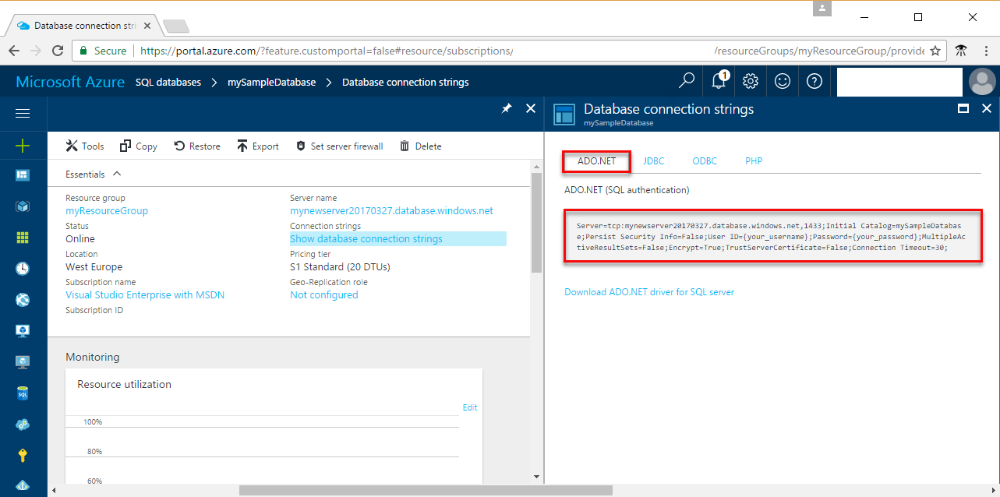

# Use .NET Core (C#) to query an Azure SQL database

This quickstart tutorial demonstrates how to use [.NET Core](https://www.microsoft.com/net/) on Windows/Linux/macOS to create a C# program to connect to an Azure SQL database and use Transact-SQL statements to query data.

## Prerequisites

To complete this quickstart tutorial, make sure you have the following:

[!INCLUDE [prerequisites-create-db](../../includes/sql-database-connect-query-prerequisites-create-db-includes.md)]

- A [server-level firewall rule](sql-database-get-started-portal.md#create-a-server-level-firewall-rule) for the public IP address of the computer you use for this quickstart tutorial.

- You have installed [.NET Core for your operating system](https://www.microsoft.com/net/core). 

## SQL server connection information

[!INCLUDE [prerequisites-server-connection-info](../../includes/sql-database-connect-query-prerequisites-server-connection-info-includes.md)]

#### For ADO.NET

1. Continue by clicking **Show database connection strings**.

2. Review the complete **ADO.NET** connection string.

    

> [!IMPORTANT]
> You must have a firewall rule in place for the public IP address of the computer on which you perform this tutorial. If you are on a different computer or have a different public IP address, create a [server-level firewall rule using the Azure portal](sql-database-get-started-portal.md#create-a-server-level-firewall-rule). 
>
  
## Create a new .NET project

1. Open a command prompt and create a folder named *sqltest*. Navigate to the folder you created and run the following command:

    ```
    dotnet new console
    ```

2. Open ***sqltest.csproj*** with your favorite text editor and add System.Data.SqlClient as a dependency using the following code:

    ```xml
    <ItemGroup>
        <PackageReference Include="System.Data.SqlClient" Version="4.4.0" />
    </ItemGroup>
    ```

## Insert code to query SQL database

1. In your development environment or favorite text editor open **Program.cs**

2. Replace the contents with the following code and add the appropriate values for your server, database, user, and password.

```csharp
using System;
using System.Data.SqlClient;
using System.Text;

namespace sqltest
{
    class Program
    {
        static void Main(string[] args)
        {
            try 
            { 
                SqlConnectionStringBuilder builder = new SqlConnectionStringBuilder();
                builder.DataSource = "your_server.database.chinacloudapi.cn"; 
                builder.UserID = "your_user";            
                builder.Password = "your_password";     
                builder.InitialCatalog = "your_database";

                using (SqlConnection connection = new SqlConnection(builder.ConnectionString))
                {
                    Console.WriteLine("\nQuery data example:");
                    Console.WriteLine("=========================================\n");
                    
                    connection.Open();       
                    StringBuilder sb = new StringBuilder();
                    sb.Append("SELECT TOP 20 pc.Name as CategoryName, p.name as ProductName ");
                    sb.Append("FROM [SalesLT].[ProductCategory] pc ");
                    sb.Append("JOIN [SalesLT].[Product] p ");
                    sb.Append("ON pc.productcategoryid = p.productcategoryid;");
                    String sql = sb.ToString();

                    using (SqlCommand command = new SqlCommand(sql, connection))
                    {
                        using (SqlDataReader reader = command.ExecuteReader())
                        {
                            while (reader.Read())
                            {
                                Console.WriteLine("{0} {1}", reader.GetString(0), reader.GetString(1));
                            }
                        }
                    }                    
                }
            }
            catch (SqlException e)
            {
                Console.WriteLine(e.ToString());
            }
            Console.ReadLine();
        }
    }
}
```

## Run the code

1. At the command prompt, run the following commands:

   ```csharp
   dotnet restore
   dotnet run
   ```

2. Verify that the top 20 rows are returned and then close the application window.

## Next steps

- [Getting started with .NET Core on Windows/Linux/macOS using the command line](https://docs.microsoft.com/dotnet/core/tutorials/using-with-xplat-cli).
- Learn how to [connect and query an Azure SQL database using the .NET framework and Visual Studio](sql-database-connect-query-dotnet-visual-studio.md).  
- Learn how to [Design your first Azure SQL database using SSMS](sql-database-design-first-database.md) or [Design your first Azure SQL database using .NET](sql-database-design-first-database-csharp.md).
- For more information about .NET, see [.NET documentation](https://docs.azure.cn/zh-cn/dotnet/).
<!--Update_Description:update System.Data.SqlClient from 4.3.0 to 4.4.0-->